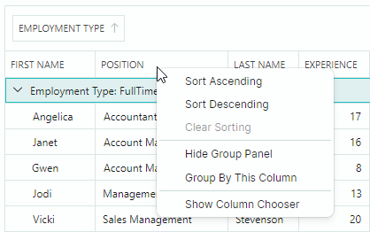
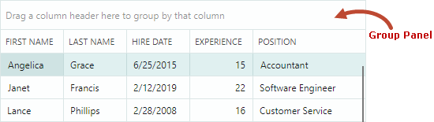
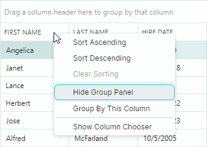

# Группировка

Data Grid может группировать данные по одному или нескольким колонкам. Группировка данных объединяет строки с одинаковыми значениями колонок в одни и те же группы данных.


Пользователь может группировать данные следующими способами:

- Перетащить заголовок колонки на панель группировки.
- Щёлкнуть правой кнопкой мыши по заголовку колонки и выбрать команду "Group By This Column".

    

Чтобы отменить группировку данных, пользователь может выполнить одно из следующих действий:

- Перетащить заголовок группирующей колонки с панели группировки.
- Щёлкнуть правой кнопкой мыши по заголовку группирующей колонки и выбрать команду "Ungroup".

    

Когда вы применяете группировку по колонке, данные этой колонки [сортируются](sorting.md). Пользователь может щёлкнуть по заголовку группирующей колонки, чтобы переключить порядок сортировки.


## Панель группировки

Панель группировки контрола отображает заголовки группирующих колонок. Пользователь может перетащить заголовок колонки на панель группировки, чтобы сгруппировать данные по этой колонке.



Используйте свойство `ShowGroupPanel` контрола DataGrid, чтобы задать видимость панели группировки. Пользователь может скрыть, а затем восстановить панель группировки с помощью контекстного меню заголовков колонок:



## Группирующие колонки

Когда вы группируете по колонке, эта колонка перемещается из грида на панель группировки. Установите свойство `ShowGroupedColumns` в значение `true`, чтобы одновременно отображать группирующие колонки на панели группировки и в гриде. На следующем изображении показан параметр `ShowGroupedColumns`:


## Запрет группировки

Вы можете отключить свойство `AllowSorting` колонки, чтобы запретить пользователю выполнять операции сортировки и группировки для этой колонки.

Свойство `DataGridControl.AllowSorting` позволяет запретить пользователям выполнять операции [сортировки](sorting.md) и группировки для любой колонки.

Если колонка не поддерживает сортировку (например, когда колонка отображает данные изображений или привязана к объекту, не реализующему интерфейс `IComparable`), группировка по этой колонке невозможна. Вы можете изменить это поведение по умолчанию, как описано в следующем разделе: [Настройка логики группировки](#настройка-логики-группировки).

## Настройка логики группировки

Группирующие колонки всегда [отсортированы](sorting.md) в порядке возрастания или убывания, как указано свойством `ColumnBase.SortDirection`.

Во время операции группировки строки грида объединяются в группы в соответствии со значениями редактирования или отображаемыми значениями группирующих колонок. Логика группировки и сортировки по умолчанию зависит от встроенного редактора колонки и типа данных привязанного свойства:

- Группировка/сортировка по значениям редактирования — Все колонки, кроме тех, в которые встроен ComboBoxEditor.
- Группировка/сортировка по отображаемому тексту — Колонки со встроенным ComboBoxEditor.
- Без группировки/сортировки — Колонки, привязанные к объектам, не реализующим интерфейс `IComparable`. Например, типы данных изображений не реализуют этот интерфейс, поэтому соответствующие колонки по умолчанию не поддерживают операции сортировки и группировки. Чтобы принудительно включить сортировку и группировку для таких колонок, реализуйте [пользовательскую сортировку](sorting.md#custom-sorting) и [пользовательскую группировку](#пользовательская-группировка) для этих колонок.


Свойство `ColumnBase.SortMode` позволяет изменить режим сортировки/группировки колонки. Доступны следующие варианты:

- `SortMode.Value` — Сортировка/группировка по значениям редактирования ячеек.
- `SortMode.DisplayText` — Сортировка/группировка по отображаемому тексту ячеек.
- `SortMode.Custom` — Включает пользовательскую сортировку и группировку. Установите свойство `SortMode` в значение `Custom`, а затем обработайте событие `DataGridControl.CustomColumnGroup` и/или `DataGridControl.CustomColumnSort`, чтобы реализовать пользовательскую логику группировки и/или сортировки. Дополнительную информацию смотрите по следующим ссылкам:

    - [Пользовательская сортировка](sorting.md#custom-sorting)
    - [Пользовательская группировка](#пользовательская-группировка)

### Пользовательская группировка

Чтобы реализовать пользовательские правила группировки для определённой колонки (колонок), установите свойство `ColumnBase.SortMode` колонки в значение `Custom` и обработайте событие `DataGridControl.CustomColumnGroup`.

Событие `CustomColumnGroup` возникает для каждой группирующей колонки, чтобы сравнивать пары соседних строк грида. При обработке этого события вы должны указать, следует ли объединять строки в одну группу.

Следующие параметры события позволяют идентифицировать группируемые строки, значения и задать результат сравнения:

- `Column` — Обрабатываемая в данный момент группирующая колонка.
- `SourceItemIndex1` и `SourceItemIndex2` — Индексы в привязанном источнике объектов (`DataGridControl.ItemsSource`) элементов (бизнес-объектов), соответствующих обрабатываемым в данный момент строкам грида.
- `Value1` и `Value2` — Значения группирующей колонки в обрабатываемых в данный момент строках грида.
- `Result` — Результат пользовательского сравнения. Установите `Result` в значение `true`, чтобы поместить строки в одну группу. Установите `Result` в значение `false`, если строки нужно поместить в разные группы. Установите `Result` в значение `null`, чтобы применить логику группировки по умолчанию.


<!-- TODO
Result can be set to null. What's this for?
 -->

Для повышения производительности контрола событие `CustomColumnGroup` возникает для сравнения строки с небольшим набором соседних строк грида (в соответствии с текущим порядком сортировки). Это событие не возникает для всех возможных комбинаций двух строк грида. Если вам нужно изменить логику сортировки строк по умолчанию и расположить определённые строки рядом друг с другом, обработайте событие `ColumnView.CustomColumnSort`.

#### Пример - Группировка по годам при группировке по колонке с датой и временем

Предположим, что контрол Data Grid содержит колонку _HireDate_, отображающую значения DateTime. При группировке по этой колонке поведение группировки по умолчанию объединяет строки с уникальными значениями DateTime.

В этом примере применяются пользовательские правила группировки: строки группируются по году значений _HireDate_. Для решения этой задачи свойство `SortOrder` колонки _HireDate_ устанавливается в значение `Custom`, и обрабатываются следующие события:

- `DataGridControl.CustomColumnGroup` — Реализует пользовательскую логику группировки.
- `DataGridControl.CustomGroupValueDisplayText` — Отображает год из значения даты-времени в групповых строках. См. [Текст групповой строки](#текст-групповой-строки).

В демонстрационных целях свойство `ShowGroupedColumns` включено, чтобы одновременно отображать сгруппированную колонку _HireDate_ на панели группировки и в гриде.


``` cs
dataGrid.Columns["HireDate"].SortMode = Eremex.AvaloniaUI.Controls.DataControl.SortMode.Custom;
dataGrid.CustomColumnGroup += DataGrid_CustomColumnGroup;
dataGrid.CustomGroupValueDisplayText += DataGrid_CustomGroupValueDisplayText;        
dataGrid.ShowGroupedColumns = true;

private void DataGrid_CustomColumnGroup(object sender, DataGridCustomColumnGroupEventArgs e)
{
    if (e.Column.FieldName != "HireDate")
        return;
    DateTime employeeHireDate1 = (DateTime)e.Value1;
    DateTime employeeHireDate2 = (DateTime)e.Value2;
    e.Result = employeeHireDate1.Year == employeeHireDate2.Year;
}

private void DataGrid_CustomGroupValueDisplayText(object sender, DataGridCustomGroupValueDisplayTextEventArgs e)
{
    if (e.Column.FieldName != "HireDate")
        return;
    DateTime hireDate = (DateTime)e.Value;
    e.DisplayText = hireDate.Year.ToString();
}
```


## Группировка в коде

Чтобы сгруппировать данные по колонке (колонкам) в коде, выполните следующее:

1. Отсортируйте эту колонку (колонки) и расположите её (их) в начале коллекции отсортированных колонок. Вы можете отсортировать колонку с помощью свойств `SortIndex` и `SortDirection`. Дополнительную информацию смотрите в разделе [Сортировка](sorting.md).
2. Установите свойство `DataGridControl.GroupCount` в значение, равное количеству группирующих колонок.

Следующий код группирует данные по двум колонкам.

``` csharp
GridColumn column1 = dataGrid.Columns["EmploymentType"];
GridColumn column2 = dataGrid.Columns["Position"];

if(column1 != null && column2 != null)
{
    dataGrid.BeginDataUpdate();
    column1.SortIndex = 0;
    column2.SortIndex = 1;
    column2.SortDirection = System.ComponentModel.ListSortDirection.Descending;
    dataGrid.GroupCount = 2;
    dataGrid.EndDataUpdate();
}
```

<!--TODO
Add the ClearGrouping method after BeginDataUpdate in the example above
the ClearGrouping member need to be published
-->

В этом примере используются методы `BeginDataUpdate` и `EndDataUpdate`, чтобы избежать лишних обновлений при изменении нескольких параметров группировки/сортировки. Data Grid обновляется только после вызова метода `EndDataUpdate`.

Без использования методов `BeginDataUpdate` и `EndDataUpdate` Data Grid обновляется после каждого изменения любого параметра группировки/сортировки.

За каждым вызовом метода `BeginDataUpdate` должен следовать вызов метода `EndDataUpdate`.


## Групповые строки

Групповые строки используются для формирования иерархии строк при группировке данных. Они отображают значения соответствующих группирующих колонок. Групповые строки не существуют в привязанном источнике объектов.

### Идентификация групповых строк

[Индексы строк](rows.md#идентификация-и-получение-строк) позволяют идентифицировать строки грида в коде. Групповые строки имеют отрицательные индексы строк, тогда как индексы строк данных неотрицательны.

Свойство `FocusedRowIndex` позволяет получить текущую сфокусированную групповую или строку данных, либо переместить фокус на определённую групповую строку или строку данных. Следующий код перемещает фокус на первую групповую строку:

``` cs
// If data is grouped, focus the first group row.
if (dataGrid.GroupCount > 0)
    dataGrid.FocusedRowIndex = -1;
```

См. также: [Обход групповых строк](#обход-групповых-строк).

### Разворачивание и сворачивание групповых строк

Пользователь может разворачивать и сворачивать групповые строки следующими способами:

- Щёлкнуть по кнопке разворачивания групповой строки

- Нажать клавиши "+"/"-" и "&rarr;"/"&larr;" на клавиатуре


В коде вы можете управлять разворачиванием групповых строк с помощью следующих членов API:

- `AutoExpandAllGroups` — Указывает, следует ли автоматически разворачивать групповые строки после каждой операции группировки данных.
- `CollapseAllGroups` — Сворачивает все групповые строки.
- `CollapseGroupRow` — Сворачивает групповую строку.
- `ExpandAllGroups` — Разворачивает все групповые строки.
- `ExpandGroupRow` — Разворачивает групповую строку.
- `IsGroupRow` — Указывает, является ли определённая строка групповой строкой.
- `IsGroupRowExpanded` — Указывает, развёрнута ли групповая строка.


### Обход групповых строк

Групповые строки владеют дочерними строками данных, а также могут владеть другими групповыми строками, если данные сгруппированы по двум и более колонкам.

Используйте следующие методы для перебора групповых строк и их дочерних элементов:

- `GetGroupChildRowCount` — Возвращает количество непосредственных дочерних строк указанной групповой строки. Этот метод возвращает `-1`, если указанная строка является строкой данных, поскольку строки данных не имеют дочерних элементов.

    Метод `GetGroupChildRowCount` без параметров возвращает количество групповых строк на корневом уровне. Если данные не сгруппированы, эта перегрузка возвращает `-1`.

- `GetGroupChildRowIndex` — Возвращает [индекс строки](rows.md#получение-и-установка-значений-строк) указанной дочерней строки. Метод `GetGroupChildRowIndex` имеет две перегрузки:

    - `GetGroupChildRowIndex(int rowIndex, int childIndex)` — Возвращает индекс строки дочерней строки, принадлежащей указанной групповой строке. Дочерняя строка должна быть непосредственным потомком указанной групповой строки. Параметр `rowIndex` задаёт родительскую групповую строку. Параметр `childIndex` задаёт визуальную позицию целевой дочерней строки среди её соседей.

    - `GetGroupChildRowIndex(int childIndex)` — Возвращает индекс строки корневой групповой строки, отображаемой в позиции `childIndex`. Параметр `childIndex` определяет визуальную позицию целевой корневой групповой строки среди других корневых групповых строк.

- `GetParentRowIndex` — Возвращает [индекс строки](rows.md#получение-и-установка-значений-строк) родительской групповой строки данной строки. Этот метод возвращает константу `DataGridControl.InvalidRowIndex` для строк, у которых нет родителей.

### Значения групповых строк

Используйте метод `GetGroupRowValue`, чтобы получить групповое значение конкретной групповой строки.

<!--TODO
there is no GetGroupRowValue(Int32, GridColumn) overload with the GridColumn parameter

Add example
-->

### Текст групповой строки

Текст по умолчанию, отображаемый в групповых строках, определяется значениями соответствующих группирующих колонок. Событие `CustomGroupValueDisplayText` позволяет задать пользовательский отображаемый текст для групповых строк.
Это событие возникает многократно для каждой групповой строки. Используйте параметры события, чтобы идентифицировать обрабатываемую в данный момент групповую строку и её значение. Чтобы задать пользовательское отображаемое значение, установите параметр события `DisplayText`.

<br>
<br>

<sup>*</sup> Эта страница переведена с использованием технологий машинного перевода.
