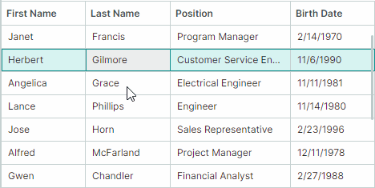

# Перетаскивание строк (Drag-and-Drop)

DataGrid поддерживает функцию перетаскивания строк как в пределах контрола, так и во внешние контролы.



При перетаскивании строк отображается их предварительный вид (preview). Однако, если вы включите платформенное перетаскивание строк (требуется для [перетаскивания строк между приложениями](#включение-перетаскивания-строк-между-приложениями)), предварительный вид строк недоступен.

## Включение перетаскивания строк

Установите свойство `DataGridControl.AllowDragDrop` в значение `true`, чтобы включить перетаскивание строк. В этом режиме пользователь может перетаскивать строку в пределах контрола DataGrid и за его пределы.
Операция перетаскивания перемещает строку на другую позицию, а также изменяет позицию соответствующего бизнес-объекта в источнике данных.

Если строка перетаскивается во внешний контрол, поведение DataGrid по умолчанию заключается в удалении строки из текущего контрола и удалении соответствующего бизнес-объекта из источника данных контрола. См. [Перетаскивание строк между контролами](#перетаскивание-строк-между-контролами) для информации о том, как предотвратить удаление строк и бизнес-объектов.

Перетаскивание нескольких строк поддерживается, если включить режим множественного выделения строк с помощью свойства `DataControlBase.SelectionMode` (см. [Rows — Multiple Row Selection (Highlight)](rows.md#множественное-выделение-строк-подсветка)).

DataGrid не поддерживает автоматические операции копирования во время перетаскивания. Нажатие клавиши CTRL не действует.


### Включение перетаскивания строк между приложениями

Чтобы разрешить перетаскивание строк между приложениями, включите свойство `UsePlatformRowDragDrop` для контрола, являющегося источником операций перетаскивания.

!!! Tip

    Свойство `UsePlatformRowDragDrop` включает режим перетаскивания, в котором операции обрабатываются платформой Avalonia. Во время платформенных операций перетаскивания строк предварительный вид строк не отображается.

## Режим перетаскивания строк — начало перетаскивания в ячейках или с помощью специальных маркеров

DataGrid поддерживает два режима перетаскивания строк, различающихся способом инициации операций перетаскивания. Вы можете выбрать нужный режим с помощью свойства контрола `RowDragMode`.

- Режим `RowDragMode.Row` (по умолчанию) — пользователи могут инициировать операцию перетаскивания в любой ячейке строки.

    


    В этом режиме поведение активации редактора ячейки по умолчанию следующее:
    
    1. Пользователю сначала нужно установить фокус на ячейке.
    
    2. Щелчок в сфокусированной ячейке затем активирует редактор ячейки.
    
    Чтобы активировать редактор ячейки одним щелчком, включите активацию редактора ячейки при отпускании кнопки мыши. Установите свойство контрола `DataControlBase.EditorShowMode` в значение `EditorShowMode.PointerReleased`.

- Режим `RowDragMode.DragHandle` (новое начиная с v1.4) — пользователи могут инициировать операцию перетаскивания, перетаскивая специальный маркер перетаскивания. Маркеры перетаскивания отображаются в области индикатора строки, которая автоматически появляется слева от строк при активации режима `RowDragMode.DragHandle`.

    

    В режиме `DragHandle` редакторы ячеек по умолчанию активируются одним нажатием в ячейке. Вы можете использовать свойство контрола `DataControlBase.EditorShowMode`, чтобы изменить это поведение.

    Когда включено множественное выделение строк, маркеры перетаскивания отображаются для каждой выделенной строки.


**Связанный API:**

- `RowIndicatorWidth` — задаёт ширину области индикатора строки, в которой отображаются маркеры перетаскивания.


## Перетаскивание отсортированных и сгруппированных данных

Когда данные контрола [отсортированы](sorting.md) или [сгруппированы](grouping.md), перетаскивание строк по умолчанию отключено. Установите свойство `DataGridControl.AllowDragDropSortedRows` в значение `true`, чтобы включить перетаскивание в отсортированных/сгруппированных контролах.

Если данные отсортированы и строка перетаскивается на позицию до или после другой строки, контрол автоматически обновляет значение(-я) перетаскиваемой строки в отсортированном(-ых) колонке(-ах), чтобы сохранить текущий порядок сортировки. Значения перетаскиваемой строки в отсортированных колонках устанавливаются равными соответствующим значениям целевой строки.

## Обработка операций перетаскивания с помощью событий

Контрол DataGrid содержит события для управления операциями перетаскивания строк и реагирования на них.

### Начало перетаскивания

Событие `DataGridControl.StartDrag` возникает, когда операция перетаскивания вот-вот начнётся. Используйте следующие параметры события, чтобы получить информацию о текущей операции перетаскивания.

- `e.Data` — задаёт объект `DragDropData`, содержащий данные текущей операции перетаскивания.
- `e.DragElement` — внутренний визуальный элемент контрола, который перетаскивается.
- `e.Effects` — задаёт эффект перетаскивания. Установите этот параметр в значение `DragDropEffects.None`, чтобы отменить текущую операцию перетаскивания. Эффект перетаскивания также определяет значок курсора мыши.
- `e.Items` — массив элементов источника данных (бизнес-объектов), соответствующих перетаскиваемым строкам. Если перетаскивается строка группы, массив `e.Items` содержит бизнес-объекты, соответствующие строкам данных, отображаемым внутри этой строки группы. Чтобы определить, перетаскивается ли строка группы, см. `e.DragRowIndexes`.
- `e.DragRowIndexes` — массив индексов перетаскиваемых строк. Строки данных имеют неотрицательные индексы, тогда как индексы строк группы отрицательны. Дополнительную информацию см. в следующем разделе: [Идентификация и получение строк](rows.md#идентификация-и-получение-строк)


### Пример — предотвращение начала перетаскивания для определённых строк данных

Следующий обработчик события `StartDrag` отключает перетаскивание для строк, содержащих строку «Manager» в колонке _Position_.

``` cs
private void DataGrid_StartDrag(object sender, DataGridStartDragEventArgs e)
{
    // It is assumed that items in the grid's data source are EmployeeInfo objects. 
    // The EmployeeInfo class contains the Position property of the string type.
    foreach(EmployeeInfo item in e.Items)
    {
        if(item.Position.Contains("Manager"))
        {
            e.Effects = Avalonia.Input.DragDropEffects.None;
            return;
        }
    }
}
```

### Пример — предотвращение перетаскивания для строк группы

Следующий пример обрабатывает событие `StartDrag`, чтобы отключить перетаскивание для строк группы. Строки группы имеют отрицательные индексы, поэтому обработчик события `StartDrag` проверяет, содержит ли массив `e.DragRowIndexes` отрицательные индексы.

``` cs
private void DataGrid_StartDrag(object sender, DataGridStartDragEventArgs e)
{
    foreach(int rowIndex in e.DragRowIndexes)
        if(rowIndex < 0) e.Effects = Avalonia.Input.DragDropEffects.None;
}
```

## Обработка этапа перетаскивания

Событие `DataGridControl.DragOver` возникает многократно, пока пользователь перетаскивает строку(и) над другой строкой. Аргументы события позволяют определить информацию, связанную с текущей операцией перетаскивания:

- `e.Items` — массив элементов источника данных (бизнес-объектов), соответствующих перетаскиваемым строкам. Если перетаскивается строка группы, массив `e.Items` содержит бизнес-объекты, соответствующие строкам данных, отображаемым внутри этой строки группы.
- `e.TargetRowIndex` — [индекс](rows.md#идентификация-и-получение-строк) строки, над которой перетаскивается строка(и).
- `e.DropPosition` — задаёт потенциальную позицию сброса относительно целевой строки. Доступны следующие варианты:
    - `DropPosition.Before` — перетаскиваемая строка(и), в случае сброса, будет добавлена на том же уровне иерархии перед целевой строкой.
    - `DropPosition.After` — перетаскиваемая строка(и), в случае сброса, будет добавлена на том же уровне иерархии после целевой строки.
    - `DropPosition.Inside` — перетаскиваемая строка(и), в случае сброса, будет добавлена как дочерний элемент целевой строки группы. Этот вариант действует при перетаскивании над строками группы.

- `e.KeyModifiers` — указывает, нажата ли клавиша ALT, SHIFT и/или CTRL во время события `DragOver`.
- `e.Data` — задаёт объект `DragDropData`, содержащий данные текущей операции перетаскивания.
- `e.Effects` — задаёт эффект перетаскивания. Установите этот параметр в значение `DragDropEffects.None`, чтобы отменить текущую операцию перетаскивания. Эффект перетаскивания также определяет значок курсора мыши.


### Пример — предотвращение сброса строк над строками группы

Следующий обработчик события `DragOver` предотвращает сброс строк над строками группы.

``` cs
private void DataGrid_DragOver(object sender, DataGridDragEventArgs e)
{
    if(e.TargetRowIndex < 0) 
        e.Effects = Avalonia.Input.DragDropEffects.None;
}
```


## Завершение перетаскивания

Вы можете обработать два события для выполнения действий, когда строка сбрасывается в результате операции перетаскивания:

- `DataGridControl.Drop` — возникает, когда строка вот-вот будет сброшена над другой строкой сетки. Аргументы этого события совпадают с аргументами события `DataGridControl.DragOver`.

    Чтобы отменить операцию сброса в определённых случаях, обработайте событие `Drop` и установите его параметр `e.Handled` в значение `true`.

    Если строка сбрасывается за пределами текущего контрола DataGrid, событие `Drop` не возникает для этого контрола. Дополнительную информацию см. в описании события `DataGridControl.CompleteDragDrop` ниже.

    ### Пример — изменение значений сброшенной строки

    Следующий обработчик события `Drop` изменяет значение перетаскиваемой строки (строк) при её сбросе. Предполагается, что источник данных содержит поле _"EmploymentType"_. Приведённый ниже код устанавливает поле _"EmploymentType"_ сброшенной строки равным значению поля _"EmploymentType"_ целевой строки.

    ``` cs
    private void DataGrid_Drop(object sender, DataGridDragEventArgs e)
    {
        DataGridControl grid = sender as DataGridControl;
        GridColumn colEmploymentType = grid.Columns["EmploymentType"];
        EmploymentType newEmploymentType = (EmploymentType)grid.GetCellValue(e.TargetRowIndex, colEmploymentType);
        foreach (EmployeeInfo item in e.Items)
        {
            item.EmploymentType = newEmploymentType;
        }
    }
    ```

<!-- TODO
Почему передаются айтемы, а не row indexы?
В ивент надо добавить e.DragRowIndexes (по аналогии с StartDrag) ?
 -->


- `DataGridControl.CompleteDragDrop` — возникает после завершения операции перетаскивания в пределах текущего контрола или за его пределами.

    Событие `DataGridControl.CompleteDragDrop` возникает после события `DataGridControl.Drop`.

    Для события `DataGridControl.CompleteDragDrop` доступны следующие аргументы:

    - `e.Items` — массив элементов (бизнес-объектов), соответствующих сброшенным строкам.
    - `e.Effects` — возвращает эффект перетаскивания, установленный в обработчике события `Drop` контрола, на который была сброшена строка.

    Смотрите также: [Перетаскивание строк между контролами](#перетаскивание-строк-между-контролами)

    
## Параметры перетаскивания

DataGrid содержит следующие параметры для настройки операций перетаскивания строк:

- `DataGridControl.AutoExpandOnDrag` — получает или задаёт, разворачиваются ли автоматически свёрнутые строки группы при наведении на них во время операции перетаскивания.
- `DataGridControl.AutoExpandDelayOnDrag` — получает или задаёт задержку перед автоматическим разворачиванием свёрнутых строк группы, когда курсор мыши находится над ними во время операции перетаскивания.
- `DataGridControl.AllowScrollingOnDrag` — получает или задаёт, прокручивает ли DataGrid автоматически строки при перетаскивании строки к верхнему или нижнему краю контрола.


## Перетаскивание строк между контролами

Перетаскивание строк автоматически поддерживается между контролами `DataGridControl`, `TreeListControl` и `TreeViewControl`. Используйте параметр `AllowDragDrop`, предоставляемый этими контролами, чтобы включить для них функцию перетаскивания.

### Визуальная индикация перетаскивания

При перетаскивании строки контролы `DataGridControl`, `TreeListControl` и `TreeViewControl` визуально показывают потенциальную позицию сброса.


### Автоматическое перемещение строки и её элемента из исходного контрола в целевой

`DataGridControl`, `TreeListControl` и `TreeViewControl` поддерживают автоматическое перемещение перетаскиваемой строки между этими контролами во время операции перетаскивания: новая строка, содержащая перетаскиваемые данные, добавляется в целевой контрол, а перетаскиваемая строка затем удаляется из исходного контрола. Соответствующий элемент (бизнес-объект) также переносится между источниками элементов исходного и целевого контролов.

Автоматическое перемещение строки и соответствующего элемента происходит, если тип данных элементов в исходном контроле совпадает или совместим с типом данных элементов в целевом контроле. См. метод `Type.IsAssignableFrom`, используемый для проверки совместимости типов данных.

Чтобы предотвратить удаление строки и элемента в исходном контроле во время операции перетаскивания во внешние контролы, вы можете выполнить одно из следующих действий:

- Обработать событие `Drop` целевого контрола и установить его параметр события `e.Effects` в значение `Avalonia.Input.DragDropEffects.None`.

- Обработать событие `DataGridControl.CompleteDragDrop` исходного контрола и установить параметр события `e.Handled` в значение `true`.

    ``` cs
    private void DataGrid_CompleteDragDrop(object sender, DataGridCompleteDragDropEventArgs e)
    {
        e.Handled = true;
    }
    ```

### Перетаскивание в другие контролы

Контролы `DataGridControl`, `TreeListControl` и `TreeViewControl` не поддерживают автоматическое перетаскивание строк в другие контролы (например, в стандартный `DataGrid` Avalonia). Чтобы разрешить перетаскивание строк в такие контролы, включите для них функцию перетаскивания с помощью присоединённого свойства `Avalonia.Input.DragDrop.AllowDrop`. Обработайте присоединённое событие `Avalonia.Input.DragDrop.Drop` целевого контрола, чтобы принимать перетаскиваемые строки. При обработке события `DragDrop.Drop` вы можете получить доступ к перетаскиваемым строкам через параметр события `Data`.

<br>
<br>

<sup>*</sup> Эта страница переведена с использованием технологий машинного перевода.
</content>
