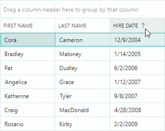

# Сортировка

Data Grid позволяет сортировать данные по неограниченному количеству колонок. Пользователь может отсортировать данные колонки, кликнув по заголовку колонки или используя контекстное меню заголовка колонки.

## Действия конечного пользователя

Во время выполнения пользователь может один раз кликнуть по заголовку колонки, чтобы отсортировать данные по возрастанию. Последующий клик меняет порядок сортировки на обратный. Чтобы очистить сортировку, удерживайте клавишу CTRL и кликните по заголовку колонки.



Если данные отсортированы и требуется дополнительная сортировка по другой колонке, кликните по заголовку этой колонки, удерживая клавишу SHIFT. Контрол отсортирует данные сначала по первой колонке, затем по второй, и так далее.

Чтобы отсортировать данные по конкретной колонке, пользователи также могут использовать контекстное меню заголовка колонки. Меню содержит команды "Sort Ascending" и "Sort Descending". Если колонка отсортирована, меню содержит команду "Clear Sorting".


Вы можете запретить пользователям сортировку определённых колонок. Используйте для этого следующие свойства:

- `DataGridControl.AllowSorting` — определяет, может ли пользователь сортировать/группировать данные по любой колонке.
- `ColumnBase.AllowSorting` — определяет, может ли пользователь сортировать и группировать данные по конкретной колонке.

Эти свойства не мешают вам сортировать данные в коде.

## Буквенно-цифровая сортировка

Для колонок, отображающих текст, вы можете использовать свойство `DataGridControl.TextSortMode`, чтобы выбрать между алфавитной и буквенно-цифровой сортировкой.

- Сортировка `Alphabetical` (по умолчанию): в этом режиме строки сравниваются посимвольно. Если текст содержит числа, алгоритм сортировки рассматривает их как отдельные символы, а не как числа. Например:

    


- Сортировка `Alphanumeric` (естественный порядок): этот режим подходит для строк, содержащих смесь текста и чисел. Алгоритм сортировки упорядочивает строки в понятном человеку, логическом порядке, рассматривая числа как числовые значения, а не просто как символы. Например:

    

    Следующий код применяет буквенно-цифровой порядок сортировки:

    ``` xml
    <mxdg:DataGridControl Name="dataGrid1" AutoGenerateColumns="True" ItemsSource="{Binding MyData}"
                        TextSortMode="Alphanumeric"
                        />
    ```

Свойство `DataGridControl.TextSortMode` влияет на сортировку всех колонок, отображающих текстовые значения.

Следующее изображение демонстрирует дополнительные примеры, сравнивающие алфавитный и буквенно-цифровой режимы сортировки:


## Сортировка в коде

Вы можете использовать следующие свойства, чтобы задать параметры сортировки для колонок:

- `ColumnBase.SortDirection` — задаёт порядок сортировки. Вы можете установить это свойство в значение `Ascending` или `Descending`, чтобы отсортировать колонку. При инициализации этого свойства колонка добавляется во внутреннюю коллекцию отсортированных колонок Data Grid. Установите свойство `SortDirection` в значение `null`, чтобы очистить сортировку для этой колонки и удалить её из коллекции отсортированных колонок.

- `ColumnBase.SortIndex` — задаёт отсчитываемый от нуля индекс колонки в коллекции отсортированных колонок. Контрол Data Grid сортирует данные сначала по первой отсортированной колонке, затем по второй, и так далее. Вы можете установить свойство `SortIndex` в неотрицательное значение, чтобы отсортировать эту колонку по возрастанию. Установите `SortIndex` в значение `-1`, чтобы очистить сортировку по этой колонке.

Вызовите унаследованный метод контрола `DataControlBase.ClearSorting`, чтобы удалить сортировку, применённую ко всем колонкам.

Следующий код очищает сортировку, а затем сортирует данные по двум колонкам:

``` csharp
dataGrid1.ClearSorting();
gridColumn1.SortDirection = ListSortDirection.Ascending;
gridColumn3.SortDirection = ListSortDirection.Descending;
```

Вы можете обернуть свой код методами `BeginDataUpdate` и `EndDataUpdate`, чтобы предотвратить лишние обновления при изменении нескольких настроек контрола (включая настройки сортировки).

``` csharp
dataGrid1.BeginDataUpdate();
dataGrid1.ClearSorting();
gridColumn1.SortIndex = 0;
gridColumn3.SortIndex = 1;
gridColumn2.SortDirection = ListSortDirection.Descending;
dataGrid1.EndDataUpdate();
```

## Настройка логики сортировки

Data Grid может сортировать (и [группировать](grouping.md)) колонки по значениям редактирования, отображаемым значениям или по пользовательскому алгоритму сортировки. Режим сортировки (и группировки) по умолчанию зависит от встроенного редактора колонки и типа данных привязанного свойства:

- Сортировка/группировка по значениям редактирования — все колонки, кроме тех, что содержат встроенный ComboBoxEditor.
- Сортировка/группировка по отображаемому тексту — колонки со встроенным ComboBoxEditor.
- Без сортировки/группировки — колонки, привязанные к объектам, не реализующим интерфейс `IComparable`. Например, типы данных изображений не реализуют этот интерфейс, поэтому для соответствующих колонок сортировка по умолчанию недоступна. Информацию о том, как принудительно отсортировать такие колонки, смотрите в разделе [Custom Sorting](#custom-sorting) ниже.

Используйте свойство `ColumnBase.SortMode`, чтобы изменить режим сортировки/группировки для колонки. Доступны следующие варианты:

- `SortMode.Value` — сортировка/группировка по значениям редактирования ячеек.
- `SortMode.DisplayText` — сортировка/группировка по отображаемому тексту ячеек.
- `SortMode.Custom` — включает пользовательскую сортировку и группировку. Установите свойство `SortMode` в значение `Custom`, а затем обработайте событие `DataGridControl.CustomColumnSort` и/или `DataGridControl.CustomColumnGroup`, чтобы реализовать пользовательскую логику сортировки и/или группировки. Дополнительную информацию смотрите по следующим ссылкам:

    - [Custom Sorting](#custom-sorting)
    - [Custom Grouping](grouping.md#пользовательская-группировка)

### Custom Sorting

Событие `CustomColumnSort` позволяет реализовать пользовательскую логику сортировки для конкретной колонки. Установите свойство `ColumnBase.SortMode` в значение `Custom`, чтобы включить это событие.

Если привязанный тип данных колонки не реализует интерфейс `IComparable` (например, тип данных изображения), Data Grid по умолчанию запрещает сортировку для этой колонки. Однако вы можете включить сортировку для этой колонки следующим образом:

- Установите свойство колонки `AllowSorting` в значение `true` (значение по умолчанию для этого свойства — `null`).
- Установите свойство колонки `SortMode` в значение `Custom`.
- Обработайте событие `CustomColumnSort`, чтобы реализовать пользовательскую сортировку.

При обработке события `CustomColumnSort` вам следует сравнить две строки, указанные в аргументах события. Присвойте результат сравнения параметру события `Result` следующим образом:

- Установите `Result` в значение `-1`, если первая строка должна отображаться выше второй строки при сортировке данных по возрастанию.

- Установите `Result` в значение `1`, если первая строка должна отображаться ниже второй строки при сортировке данных по возрастанию.

 - Установите `Result` в значение `0`, если обе строки равны.


Следующий пример обрабатывает событие `DataGridControl.CustomColumnSort`, чтобы отсортировать данные колонки "_FileName_" особым образом. Колонка "_FileName_" хранит имена файлов в стандартном формате "_filename.ext_". Пользовательская процедура сортировки сортирует имена файлов по их расширениям.

``` csharp
<mxdg:DataGridControl Name="dataGrid1" CustomColumnSort="DataGrid_CustomColumnSort">
    <mxdg:DataGridControl.Columns>
        <mxdg:GridColumn  Width="*" FieldName="FileName"  SortMode="Custom" />
    </mxdg:DataGridControl.Columns>
</mxdg:DataGridControl>

private void DataGrid_CustomColumnSort(object? sender, DataGridCustomColumnSortEventArgs e)
{
    if (e.Column.FieldName == "FileName")
    {
        string fileName1 = Convert.ToString(e.Value1);
        string fileName2 = Convert.ToString(e.Value2);

        string newfileName1 = extractFileExtension(fileName1) + "." + fileName1;
        string newfileName2 = extractFileExtension(fileName2) + "." + fileName2;
        e.Result = String.Compare(newfileName1, newfileName2);
    }
}

string extractFileExtension(string fileName)
{
    string res = "";
    int dotIndex = fileName.LastIndexOf('.');
    if (dotIndex > 0)
        res = fileName.Substring(dotIndex + 1);
    return res;
}
```

## Реагирование на сортировку данных

Обработайте следующие события, чтобы выполнить пользовательские действия при сортировке данных:

- `DataControlBase.StartSorting` — возникает, когда данные вот-вот будут отсортированы.
- `DataControlBase.EndSorting` — возникает по завершении сортировки данных.

<br>
<br>

<sup>*</sup> Эта страница переведена с использованием технологий машинного перевода.
