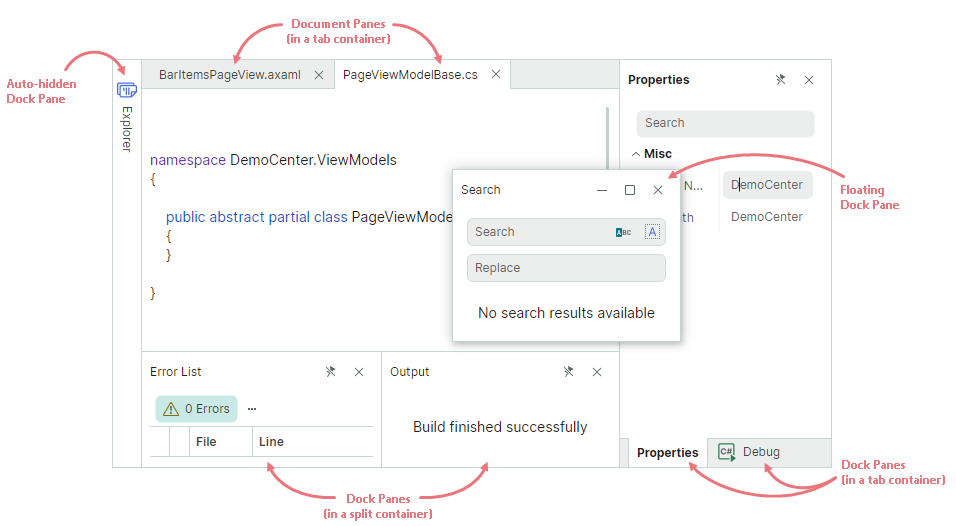
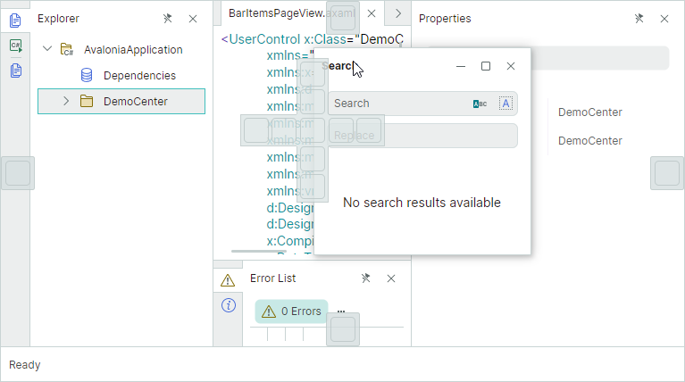
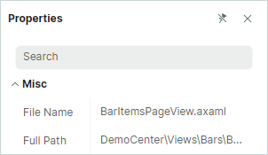

# Dock Manager и элементы докинга

Компонент `DockManager` позволяет создавать интерфейс докинга, вдохновлённый Visual Studio. Dock-панели и Document-панели — это базовые элементы интерфейса докинга. Dock-панели используются для реализации инструментальных панелей. Document-панели предназначены для отображения основного содержимого окна. Вы можете объединять несколько Document-панелей в специальном контейнере, чтобы реализовать MDI с вкладками (Multiple Document Interface).

Библиотека докинга поддерживает операции над элементами докинга (панелями и документами) пользователями и в коде. Пользователи могут переупорядочивать размещение элементов докинга и делать их плавающими с помощью перетаскивания и контекстных меню. Разделители между соседними элементами позволяют выполнять операции изменения размера во время работы. Кнопки «Pin» в заголовках панелей поддерживают функцию автоскрытия, которая позволяет пользователю сворачивать и восстанавливать панели. 

С помощью библиотеки докинга вы можете использовать паттерн проектирования MVVM, чтобы заполнять интерфейс докинга Dock-панелями и Document-панелями, а также предоставлять содержимое для панелей.

## Начало работы с интерфейсом докинга

Следующие разделы демонстрируют, как создавать образцовые интерфейсы докинга с нуля:

- [Начало работы с интерфейсом докинга](get-started-with-docking.md) 
- [Как создать сложный макет для докинга в коде](examples/how-to-create-a-complex-docking-layout-in-code-behind.md)

## Dock-панели

Dock-панели (объекты `DockPane`) позволяют создавать закрепляемые и плавающие инструментальные панели. Панели можно отображать рядом друг с другом или как вкладки. Они также поддерживают функцию автоскрытия.

Чтобы создать интерфейс докинга в XAML или code-behind, Dock-панели нужно объединить в контейнеры (группы). Например, вы можете объединить элементы в контейнер `DockGroup`, чтобы отобразить их рядом друг с другом, горизонтально или вертикально. Если вы объедините панели в контейнер `TabbedGroup`, они будут отображаться как вкладки. Контейнеры также могут включать другие контейнеры в качестве дочерних элементов.

Чтобы узнать больше, смотрите следующий раздел: [Dock-панели и контейнеры](dock-panes-and-containers.md)

## Document-панели

Используйте Document-панели (объекты `DocumentPane`), чтобы отображать основное содержимое вашего окна. Если вы создаёте несколько Document-панелей, вы можете объединить их в контейнер `DocumentGroup`. `DocumentGroup` — это специальный контейнер, представляющий Document-панели как вкладки (аналогично контейнеру `TabbedGroup`, используемому для представления Dock-панелей как вкладок).

Document-панели можно делать плавающими. В отличие от Dock-панелей, Document-панели не поддерживают функцию автоскрытия.

Вы можете создать два или более контейнера `DocumentGroup`, каждый из которых отображает свой набор Document-панелей.

<animated gif>

Чтобы узнать больше, смотрите следующий раздел: [Document-панели](document-panes.md)

## Подсказки докинга

Когда пользователь перетаскивает Dock-панель или Document-панель над другой панелью или контейнером, DockManager показывает подсказки докинга, которые помогают выполнять операции закрепления. Сброс элемента над определённой подсказкой закрепляет элемент в соответствующей позиции.

Если пользователь сбрасывает элемент вне подсказки докинга, элемент становится плавающим.

## Контекстные меню

Библиотека докинга предоставляет встроенные контекстные меню для Dock-панелей и Document-панелей. Эти меню содержат команды для выполнения распространённых операций докинга над панелями.

Обработайте событие `DockManager.DockItemContextMenuOpening`, чтобы настроить контекстные меню или предотвратить их отображение.

<!-- TODO
example for the `DockManager.DockItemContextMenuOpening` event 
 -->

## Предотвращение определённых операций над элементами докинга

Dock-панели и Document-панели отображают в своих заголовках предопределённые кнопки, используемые для выполнения распространённых операций над панелями.

DockManager предоставляет опции и события для управления операциями докинга над панелями. Подробнее смотрите в следующем разделе: [Dock-панели и контейнеры - Опции для dock-панелей во время работы](dock-panes-and-containers.md#опции-для-dock-панелей-во-время-работы)

## Сохранение и восстановление размещения панелей

Вы можете сохранить текущее размещение докинга в поток, а затем восстановить его при необходимости. Эта функция позволяет сохранять размещение, когда пользователь закрывает приложение, и перезагружать сохранённое размещение при следующем запуске приложения. Дополнительную информацию смотрите в следующем разделе: [Сохранение и восстановление размещения панелей](save-and-restore-layout.md)

## Смотрите также

- [Как создать сложный макет для докинга в коде](examples/how-to-create-a-complex-docking-layout-in-code-behind.md)

 
 

* Эта страница переведена с использованием технологий машинного перевода.
