# Dock-панели и контейнеры

Dock-панель (`Eremex.AvaloniaUI.Controls.Docking.DockPane`) — это панель, которую можно закреплять, делать плавающей, автоскрывать и объединять в группу вкладок (контейнер).

Dock-панели и [Document-панели](document-panes.md) — это базовые элементы интерфейса докинга. Dock-панели позволяют создавать инструментальные панели, тогда как Document-панели позволяют создавать MDI с вкладками (Multiple Document Interface).


Во время работы пользователи могут переупорядочивать размещение панелей с помощью перетаскивания и контекстных меню: панели можно закреплять рядом друг с другом, автоскрывать, отображать как вкладки или в плавающих окнах. Все эти действия во время работы реорганизуют внутреннюю структуру элементов докинга.

Когда вы определяете размещение панелей в XAML или code-behind, вам обычно нужно использовать специальные контейнеры докинга, чтобы объединять панели и представлять их определённым образом.


Поддерживаются следующие контейнеры докинга:

- `DockGroup` (сплит-контейнер) — отображает элементы докинга (Dock-панели и контейнеры) рядом друг с другом, горизонтально или вертикально. Дочерние элементы разделяются разделителями, которые позволяют изменять размер панелей.
- `TabbedGroup` (контейнер вкладок) — отображает элементы докинга как вкладки.
- `AutoHideGroup` — дочерние Dock-панели этого контейнера обладают функцией автоматического скрытия. Автоскрытая панель появляется, когда пользователь щёлкает по заголовку панели. 
- `FloatGroup` — отображает элементы докинга в плавающем окне.

Контейнеры докинга автоматически создаются и уничтожаются, когда пользователь переупорядочивает панели во время работы.


Следующий XAML-файл демонстрирует, как создать структуру элементов докинга, показанную на изображении выше:

``` xml
xmlns:mxd="https://schemas.eremexcontrols.net/avalonia/docking"

<mxd:DockManager>
    <mxd:DockGroup Orientation="Horizontal">
        <mxd:DockGroup Orientation="Vertical" DockWidth="3*">
            <mxd:DocumentGroup DockHeight="2*">
                <mxd:DocumentPane Header="BarItemsPageView.axaml"/>
                <mxd:DocumentPane Header="PageViewModelBase.cs"/>
            </mxd:DocumentGroup>
            <mxd:DockGroup Orientation="Horizontal" DockHeight="*">
                <mxd:DockPane Header="Error List"/>
                <mxd:DockPane Header="Output"/>
            </mxd:DockGroup>
        </mxd:DockGroup>
        <mxd:TabbedGroup DockWidth="*">
            <mxd:DockPane Header="Properties"/>
            <mxd:DockPane Header="Debug"/>
        </mxd:TabbedGroup>
    </mxd:DockGroup>
    <mxd:DockManager.AutoHideGroups>
        <mxd:AutoHideGroup Dock="Left">
            <mxd:DockPane Header="Explorer"/>
        </mxd:AutoHideGroup>
    </mxd:DockManager.AutoHideGroups>
    <mxd:DockManager.FloatGroups>
        <mxd:FloatGroup FloatLocation="300,300">
            <mxd:DockPane Header="Search"/>
        </mxd:FloatGroup>
    </mxd:DockManager.FloatGroups>
</mxd:DockManager>
```

## Использование MVVM для создания интерфейса докинга

Вы можете использовать паттерн проектирования MVVM, чтобы заполнять интерфейс докинга элементами (Dock-панелями и Document-панелями). Используйте для этого следующие члены API:

- `DockManager.ItemsSource` — задаёт список объектов, которые нужно отрисовать как элементы докинга.
- `DockManager.ItemTemplate` — задаёт шаблон, используемый для отрисовки объектов из списка `DockManager.ItemsSource` как элементов докинга.

Дополнительную информацию смотрите в разделе [Использование паттерна MVVM для заполнения элементами закрепления](use-mvvm-pattern-to-populate-dock-items.md).


## Содержимое и размер Dock-панели

### Задание содержимого

Вы можете использовать свойство `DockPane.Content`, чтобы определить содержимое панели. В XAML вы можете определить содержимое панели между открывающим и закрывающим тегами __&lt;DockPane&gt;__.

Свойство `DockPane.ContentTemplate` позволяет задать шаблон, используемый для отрисовки объекта `Content`.


### Задание размера

Для элементов докинга (панелей и контейнеров), отображаемых внутри [сплит-контейнеров](#разделённые-панели) (`DockGroup`), следующие свойства позволяют задать размер элемента:

- `DockWidth` (для панелей, расположенных горизонтально в родительских контейнерах)
- `DockHeight` (для панелей, расположенных вертикально в родительских контейнерах)

Эти свойства не влияют на размер панелей в плавающем и автоскрытом режимах. 
Чтобы узнать больше, смотрите следующие ссылки:

- [Задание плавающих границ](#задание-плавающих-границ)
- [Задание размера для развёрнутых автоскрытых панелей](#задание-размера-для-развёрнутых-автоскрытых-панелей)


### Задание текста заголовка и глифов

Используйте свойства `DockPane.Header` и `DockPane.HeaderTemplate`, чтобы задать заголовки для dock-панелей. Чтобы отображать изображения, используйте свойства `DockPane.Glyph` и `DockPane.GlyphSize`.

Вы можете задать разные параметры заголовка для панели, когда она размещена в контейнере вкладок. Используйте для этого свойства `DockPane.TabHeader`, `DockPane.TabHeaderTemplate`, `DockPane.TabGlyph` и `DockPane.TabGlyphSize`.

#### Связанный API

- `DockPane.ShowGlyphMode` — задаёт видимость и положение глифа в заголовке панели.
- `DockPane.ShowTabGlyphMode` — задаёт видимость и положение глифа во вкладке, когда панель размещена в группе вкладок.

## Активация панелей

Свойство `DockPane.IsActive` позволяет переместить фокус на конкретную панель. Например, если панель автоскрыта, она разворачивается и фокусируется, когда вы устанавливаете свойство `DockPane.IsActive` в `true`.

Используйте свойство `DockManager.ActiveDockItem`, чтобы получить активный элемент докинга.

Когда панели объединены в контейнер вкладок (`TabbedGroup`), вы можете использовать свойство `TabbedGroup.SelectedIndex`, чтобы выбрать конкретную панель.

## Закрытие панелей

Каждая dock-панель отображает кнопку «Close», позволяющую пользователю закрыть панель. В коде вы можете закрыть панель методом `DockManager.Close`.

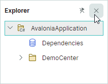

Используйте свойство `DockPane.AllowClose`, чтобы скрыть кнопку «Close» для панели и тем самым предотвратить закрытие панели этой кнопкой.

Когда панель закрывается, активируется команда `DockPane.CloseCommand`. Закрытые панели доступны из коллекции `DockManager.ClosedPanes`. 

Когда панели объединены в контейнер вкладок, свойство контейнера `CloseButtonShowMode` позволяет отображать дополнительные кнопки «Close» в области полосы вкладок. Вы можете отображать кнопки «Close» во всех вкладках, в активной вкладке или в области полосы вкладок. 


Для плавающих контейнеров вкладок кнопка «Close» в заголовке контейнера вкладок может закрывать либо активную панель, либо все панели. Используйте свойство `DockManager.CloseOnlyActivePane`, чтобы выбрать нужное поведение.

Событие `DockManager.DockOperationStarting` позволяет предотвратить закрытие определённых панелей или выполнить пользовательские действия при закрытии панелей.


## Опции для dock-панелей во время работы

Объекты `DockPane` содержат настройки, позволяющие отключать определённые пользовательские операции во время работы:

- `DockPane.AllowAutoHide` — возвращает или задаёт, доступны ли кнопка «Pin» и пункт контекстного меню «Auto Hide» для панели. Установите это свойство в `false`, чтобы запретить пользователю включать [режим автоскрытия](#автоскрытые-панели) для конкретной панели.
- `DockPane.AllowClose` — возвращает или задаёт, может ли пользователь закрыть панель. Установите это свойство в `false`, чтобы скрыть кнопку `x` (закрытия) панели. См. [Закрытие панелей](#закрытие-панелей).
- `DockPane.AllowFloat` — возвращает или задаёт, может ли пользователь сделать панель плавающей. См. [Плавающие панели](#плавающие-панели).
- `DockPane.AllowMaximize` — задаёт видимость кнопки «Maximize» для панели в плавающем состоянии.
- `DockPane.AllowMinimize` — задаёт видимость кнопки «Minimize» для панели в плавающем состоянии.

Эти опции не мешают вам выполнять соответствующие операции над панелями в коде.

Вы также можете обработать событие `DockManager.DockOperationStarting`, чтобы динамически предотвращать определённые операции докинга или выполнять пользовательскую логику при их возникновении.

## Разделённые панели

Элементы докинга (панели и группы) можно располагать рядом друг с другом, горизонтально или вертикально. Чтобы создать это размещение, элементы докинга объединяются в контейнер `DockGroup` (сплит-контейнер). 


Пользователь может перетащить панель над левой, правой, верхней или нижней подсказкой докинга другой панели, чтобы закрепить панель в соответствующей позиции. Разделитель между элементами докинга позволяет изменять их размер.

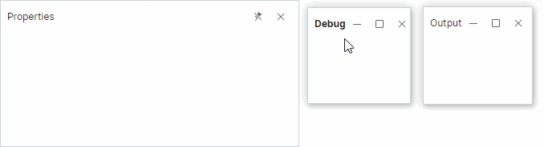

Дочерними элементами контейнера `DockGroup` могут быть панели (`DockPane` и `DocumentPane`) и другие контейнеры (`DockGroup` и `DocumentGroup`).

Расположение элементов в `DockGroup` по умолчанию горизонтальное. Установите свойство `DockGroup.Orientation` в `Vertical`, чтобы расположить элементы вертикально.


### Пример - создание простого размещения dock-панелей

XAML-код ниже создаёт размещение dock-панелей, показанное ниже.


``` xml
<mxd:DockManager Grid.Column="0" Grid.Row="1">
    <mxd:DockGroup Name="rootDockGroup">
        <mxd:DockGroup Name="dockGroup1" DockWidth="3*" Orientation="Vertical">
            <mxd:DockGroup Name="dockGroup2" DockHeight="4*">
                <mxd:DockPane DockWidth="*" Header="Explorer"/>
                <mxd:DocumentGroup DockWidth="3*">
                    <mxd:DocumentPane Header="File1.cs"/>
                    <mxd:DocumentPane Header="File2.cs"/>
                </mxd:DocumentGroup>
            </mxd:DockGroup>
            <mxd:DockPane Header="Error List" DockHeight="*"/>
        </mxd:DockGroup>
        <mxd:DockPane Header="Properties" DockWidth="*"/>
    </mxd:DockGroup>
</mxd:DockManager>
```

### Разделённые панели в code-behind

Чтобы закрепить панель рядом с другой панелью (или группой) в code-behind, используйте метод `DockManager.Dock` с параметром _dockType_, установленным в `DockType.Left`, `DockType.Right`, `DockType.Top` или `DockType.Bottom`.

Метод `DockManager.Dock` не обязательно создаёт новый `DockGroup`. Если нужная ориентация совпадает с ориентацией целевой группы, исходная панель добавляется в родительскую группу целевой панели. Новый `DockGroup` создаётся, если ориентация новой группы не совпадает с ориентацией целевой группы.

Предположим, что целевая панель находится внутри `DockGroup` с горизонтальным расположением дочерних элементов. Когда вы закрепляете другую (исходную) панель слева или справа от целевой панели, новый `DockGroup` не создаётся. Вместо этого исходная панель добавляется в родительскую группу целевой панели. Когда вы закрепляете исходную панель у верхнего или нижнего края целевой панели, создаётся новый вертикальный `DockGroup`. 

### Пример - отображение панелей рядом друг с другом в code-behind

Следующий код закрепляет панели _Explorer_ и _Error List_ рядом с панелью _Properties_.

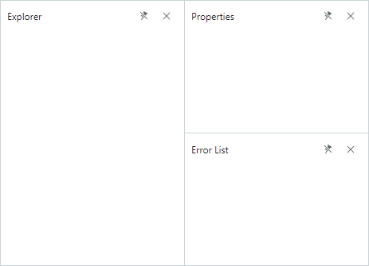

``` csharp
using Eremex.AvaloniaUI.Controls.Docking;

dockManager1.Dock(dockPaneExplorer, dockPaneProperties, DockType.Left);
dockManager1.Dock(dockPaneErrorList, dockPaneProperties, DockType.Bottom);
```

### Связанный API

- `DockManager.Dock` — позволяет закрепить элемент докинга (например, панель) рядом с другим элементом докинга. Установите параметр _dockType_ в `DockType.Left`, `DockType.Right`, `DockType.Top` или `DockType.Bottom`, чтобы создать сплит-контейнер.
- `DockItemBase.DockParent` — позволяет получить непосредственного родителя объекта `DockPane` или другого элемента докинга.


## Плавающие панели 

Библиотека докинга поддерживает плавающие панели, которые можно свободно перемещать в пределах доступного пространства экрана. Плавающие панели размещаются в плавающих окнах.

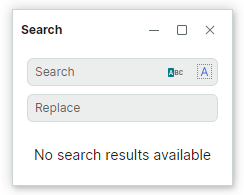

Пользователь может перетащить панель мышью из её закреплённого состояния, чтобы сделать панель плавающей. 

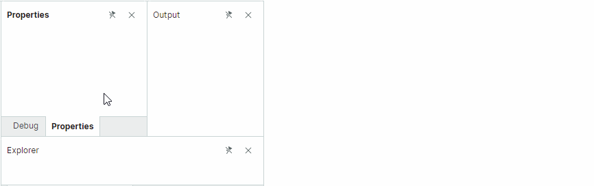

### Доступ к плавающему окну 

Когда панель делается плавающей, создаётся плавающее окно (контейнер), в котором размещается эта панель. Плавающие окна инкапсулируются объектами `FloatGroup`. Вы можете обратиться к родительскому плавающему окну панели с помощью свойства панели `DockItemBase.FloatGroup`. Это свойство возвращает **null**, если панель не в плавающем состоянии.

Вы можете использовать следующие члены API, чтобы задать местоположение, размер, заголовок и глиф плавающего окна:

- `FloatGroup.FloatHeight`
- `FloatGroup.FloatLocation`
- `FloatGroup.FloatWidth`
- `FloatGroup.Glyph`
- `FloatGroup.Header`
- `FloatGroup.HeaderTemplate`


### Как делать панели плавающими

Чтобы определить плавающую панель в XAML, добавьте контейнер `FloatGroup` в коллекцию `DockManager.FloatGroups`, а затем добавьте панель `DockPane` в контейнер `FloatGroup`.

Используйте метод `DockManager.Float`, чтобы создать плавающий элемент докинга в коде.

#### Пример - определение плавающей панели в XAML

Следующий пример создаёт плавающую панель в XAML и задаёт положение и размер созданного плавающего окна.

``` xml
<mxd:DockManager.FloatGroups>
    <mxd:FloatGroup FloatLocation="600,600">
        <mxd:DockPane Name="dockPaneExplorer1" Header="Explorer-float">
            ...
        </mxd:DockPane>
    </mxd:FloatGroup>
</mxd:DockManager.FloatGroups>
```

#### Пример - создание плавающих панелей и настройка плавающего окна в code-behind

Код ниже делает панель плавающей, а затем закрепляет другую панель рядом с плавающей панелью. Это создаёт плавающее окно (`FloatGroup`), в котором размещаются две панели. Созданный `FloatGroup` позиционируется в правом нижнем углу DockManager. 

``` csharp
dockManager1.Float(dockPaneExplorer);
dockManager1.Dock(dockPaneSearch, dockPaneExplorer, DockType.Right);
FloatGroup floatingWindow = dockPaneExplorer.FloatGroup;
floatingWindow.Header = "My App";
floatingWindow.FloatWidth = 300;
floatingWindow.FloatHeight = 200;
floatingWindow.FloatLocation = dockManager1.PointToScreen(
    new Point(dockManager1.Bounds.Right - floatingWindow.FloatWidth, 
    dockManager1.Bounds.Bottom - floatingWindow.FloatHeight));
```


### Задание заголовка и изображения плавающего окна

Когда две или более панели закреплены рядом в плавающем состоянии, плавающее окно (`FloatGroup`) изначально отображает пустой заголовок. 


Вы можете использовать следующие свойства, чтобы задать содержимое заголовка плавающего окна:

- `FloatGroup.Glyph` — изображение для отображения в заголовке.
- `FloatGroup.GlyphSize` — размер изображения.
- `FloatGroup.Header` — объект для отрисовки в заголовке. Используйте `FloatGroup.WindowTitle`, чтобы задать строку для отображения в заголовке вместо объекта.
- `FloatGroup.HeaderTemplate` — шаблон для отрисовки объекта `FloatGroup.Header`.
- `FloatGroup.ShowGlyphMode` — возвращает или задаёт положение и видимость изображения `FloatGroup.Glyph` в заголовке.
- `FloatGroup.WindowIcon` — объект `WindowIcon`, представляющий значок для отрисовки в заголовке. Если `WindowIcon` не задан, заголовок отображает изображение, заданное свойством `Glyph`.
- `FloatGroup.WindowTitle` — текст для отрисовки в заголовке. Если `WindowTitle` не задан, заголовок отображает текстовое представление объекта `Header`.


Плавающие окна создаются динамически, когда панели делаются плавающими. Чтобы инициализировать свойства динамически создаваемых плавающих окон, обработайте событие `DockManager.RegisterDockItem`.


``` cs
private void DockManager1_RegisterDockItem(object sender, Eremex.AvaloniaUI.Controls.Docking.DockItemEventArgs e)
{
    if (e.Item is FloatGroup floatGroup)
    {
        floatGroup.Header = "Demo App";
    }
}
```

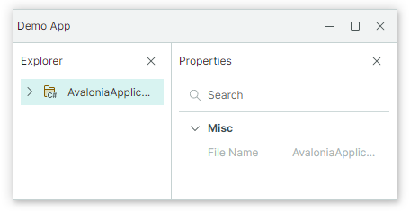


### Задание плавающих границ 

Когда панель делается плавающей, её предыдущий размер определяет начальный плавающий размер плавающего окна. Вы можете установить присоединённые свойства `FloatGroup.FloatWidth`, `FloatGroup.FloatHeight` и `FloatGroup.FloatLocation`, чтобы задать пользовательские плавающие границы.

``` xml
<mxd:DockPane DockWidth="*" Header="Properties"
              mxd:FloatGroup.FloatWidth="300"
              mxd:FloatGroup.FloatHeight="150"
              />
```

После того как элемент докинга становится плавающим, вы можете обратиться к его родительскому плавающему окну (`FloatGroup`) и задать его границы.

Следующий пример делает Dock-панель плавающей, обращается к созданному плавающему окну и задаёт его размер.

``` csharp
using Eremex.AvaloniaUI.Controls.Docking;

dockManager1.Float(dockPane1);
FloatGroup floatingWindow = dockPane1.FloatGroup;
floatingWindow.FloatWidth = 400;
floatingWindow.FloatHeight = 300;
floatingWindow.FloatLocation = dockManager1.PointToScreen(new Point(100, 100));
```

Другой способ задать настройки для созданных объектов FloatGroup — обработать событие `DockOperationCompleted`, чтобы обратиться к вновь созданным объектам `FloatGroup` и настроить их параметры.


<!-- TODO
DockOperationCompleted does not work
 -->


<!-- TODO

#### Example - Customize Floating Window Dynamically

-->


### Связанный API

- `DockPane.FloatGroup` — возвращает плавающее окно (объект `FloatGroup`), содержащее текущую панель, когда панель плавающая. Возвращает **null**, если панель не плавающая.
- `FloatGroup.FloatLocation` — задаёт положение float-группы относительно левого верхнего угла экрана.
- `FloatGroup.FloatHeight` — задаёт высоту `FloatGroup`.
- `FloatGroup.FloatWeight` — задаёт ширину `FloatGroup`.
- `FloatGroup.Header` — задаёт текст заголовка `FloatGroup`.
- `FloatGroup.HeaderTemplate` — задаёт шаблон заголовка `FloatGroup`.
- `FloatGroup.Glyph` — задаёт глиф `FloatGroup`.
- `DockManager.Float` — делает элемент докинга (например, объект `DockPane`) плавающим.
- `DockManager.FloatGroups` — коллекция плавающих групп (плавающих окон).


## Вкладки

Пользователь может перетащить панель в центр другой панели, чтобы объединить панели в контейнер вкладок.

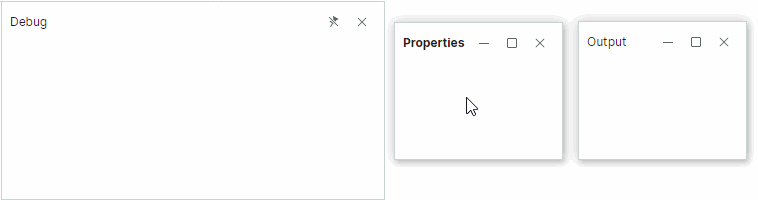

Чтобы расположить панели как вкладки в коде, объедините их в контейнер `TabbedGroup`.


### Пример - отображение dock-панелей как вкладок в XAML 

XAML-код ниже создаёт размещение dock-панелей, показанное ниже.

``` xml
<mxd:DockManager Grid.Column="0" Grid.Row="1">
    <mxd:DockGroup Name="rootDockGroup">
        <mxd:DockGroup Name="dockGroup1" DockWidth="3*" Orientation="Vertical">
            <mxd:DockGroup Name="dockGroup2" DockHeight="4*">
                <mxd:DockPane DockWidth="*" Header="Explorer"/>
                <mxd:DocumentGroup DockWidth="3*">
                    <mxd:DocumentPane Header="File1.cs"/>
                    <mxd:DocumentPane Header="File2.cs"/>
                </mxd:DocumentGroup>
            </mxd:DockGroup>
            <mxd:DockPane Header="Error List" DockHeight="*"/>
        </mxd:DockGroup>
        <mxd:DockPane Header="Properties" DockWidth="*"/>
    </mxd:DockGroup>
</mxd:DockManager>
```

Чтобы объединить панели в контейнер вкладок в code-behind, используйте метод `DockManager.Dock` с параметром _dockType_, установленным в `DockType.Fill`. Если вы закрепляете исходную панель в другой панели, которая уже размещена в контейнере вкладок, исходная панель отображается как дополнительная вкладка внутри контейнера вкладок.

### Пример - отображение dock-панелей как вкладок в code-behind

Следующий код создаёт контейнер вкладок, владеющий тремя dock-панелями.


``` csharp
using Eremex.AvaloniaUI.Controls.Docking;

dockManager1.Dock(dockPaneExplorer, dockPaneProperties, DockType.Fill);
dockManager1.Dock(dockPaneErrorList, dockPaneProperties, DockType.Fill);
```

### Доступ к контейнеру вкладок

Для панелей, находящихся в контейнере вкладок, используйте свойство `DockPane.DockParent`, чтобы вернуть родительский контейнер вкладок (объект `TabbedGroup`).


### Связанный API

- `DockManager.Dock` — позволяет закрепить элемент (например, панель) в другом элементе. Установите параметр _dockType_ метода в `DockType.Fill`, чтобы создать контейнер вкладок.
- `DockItemBase.DockParent` — позволяет получить непосредственного родителя объекта `DockPane` или другого элемента докинга. Для панелей, объединённых в контейнер вкладок, свойство `DockParent` возвращает родительский объект `TabbedGroup`.
- `DockPane.CloseCommand` — команда, вызываемая при закрытии панели. Панель можно закрыть щелчком по кнопке «Close» (см. `DockPane.AllowClose` и `TabbedGroup.CloseButtonShowMode`). 
Закрытые панели доступны из коллекции `DockManager.ClosedPanes`.
- `DockPane.ShowTabGlyphMode` — задаёт видимость и положение глифа в заголовке панели (вкладке), когда панель размещена в контейнере вкладок.
- `DockPane.TabGlyphSize` — задаёт размер глифа вкладки (`DockPane.TabGlyph`). Это свойство действует, когда панель размещена в контейнере вкладок.
- `DockPane.TabGlyph` — задаёт глиф, отображаемый во вкладке. Это свойство действует, когда панель размещена в контейнере вкладок.
- `DockPane.TabHeaderTemplate` — задаёт шаблон для отрисовки вкладки. Это свойство действует, когда панель размещена в контейнере вкладок.
- `DockPane.TabHeader` — задаёт текст для отображения во вкладке. Это свойство действует, когда панель размещена в контейнере вкладок.

- `TabbedGroup.AllowFloat` — задаёт, может ли пользователь сделать контейнер вкладок плавающим.
- `TabbedGroup.CloseButtonShowMode` — задаёт, отображать ли кнопки «Close» для дочерних панелей в области вкладок и где именно: нигде в области вкладок, в каждой панели, в активной панели или в области полосы вкладок. Свойство `TabbedGroup.CloseButtonShowMode` не влияет на отображение кнопки «Close» в заголовке панели. См. [Закрытие панелей](#закрытие-панелей).
- `TabbedGroup.SelectTabOnClose` — задаёт, какая вкладка выбирается при закрытии вкладки: недавно открытая вкладка, следующая или предыдущая вкладка.
- `TabbedGroup.SelectedIndex` — задаёт индекс (начиная с нуля) выбранной вкладки в текущем контейнере вкладок. Вы можете использовать свойство `SelectedIndex`, чтобы выбрать конкретную вкладку.
- `TabbedGroup.ShowTabStripForSingleChild` — задаёт, отображать ли полосу вкладок, когда контейнер вкладок содержит один дочерний элемент. Если это свойство установлено в `true`, полоса вкладок отображается только если контейнер владеет двумя или более дочерними элементами.
- `TabbedGroup.TabHeaderOrientation` — задаёт, располагать ли вкладки горизонтально или вертикально. В режиме `TabHeaderOrientation.Auto` вкладки располагаются горизонтально, если свойство `TabbedGroup.TabStripPlacement` установлено в `Top` или `Bottom`. Вкладки располагаются вертикально, если свойство `TabbedGroup.TabStripPlacement` установлено в `Left` или `Right`.
- `TabbedGroup.TabStripLayoutType` — задаёт, как отображаются вкладки. `TabStripLayoutType.Scroll` — заголовки вкладок достаточно широки, чтобы отобразить их содержимое. Кнопки прокрутки появляются в области заголовков вкладок, если недостаточно места для отображения всех заголовков вкладок целиком. `TabStripLayoutType.Stretch` — все заголовки вкладок располагаются в одну линию, растягиваясь, чтобы заполнить ширину контрола. Они имеют одинаковую ширину или высоту в зависимости от положения полосы вкладок (см. `TabbedGroup.TabStripPlacement`). `TabStripLayoutType.MultiLine` — заголовки вкладок располагаются в несколько строк, если недостаточно места для их отображения в одну строку.
- `TabbedGroup.TabStripPlacement` — задаёт край, вдоль которого отображаются вкладки.

## Автоскрытые панели

Во время работы пользователь может щёлкнуть по кнопке «Pin» панели () или выбрать команду «Auto Hide» из контекстного меню, чтобы включить режим автоскрытия для панели.

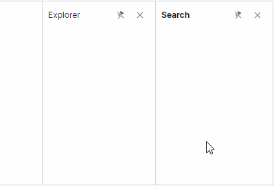

В режиме по умолчанию автоскрытые панели автоматически сворачиваются, когда фокус перемещается на другую панель. Видимыми остаются только заголовки свёрнутых автоскрытых панелей. Щелчок по заголовку свёрнутой панели разворачивает её. Смотрите также: [Встроенные автоскрытые панели](#встроенные-автоскрытые-панели).

Чтобы создать автоскрытые панели в коде, используйте контейнеры `AutoHideGroup`. См. [Создание автоскрытых панелей](#создание-автоскрытых-панелей).

### Скрытие кнопок «Pin»
Установите опцию `DockPane.AllowAutoHide` в `false`, чтобы запретить пользователю включать режим автоскрытия для конкретной панели. Эта опция скрывает кнопку «Pin» и пункт контекстного меню «Auto Hide» для панели. 

Кнопки «Pin» недоступны для плавающих панелей.


### Автоскрытие панелей с вкладками

Когда панели отображаются как вкладки у определённого края DockManager, щелчок по кнопке «Pin» любой панели по умолчанию включает функцию автоскрытия для всех панелей текущего контейнера вкладок. Это действие создаёт контейнер `AutoHideGroup` у заданного края DockManager и перемещает все панели из контейнера вкладок в контейнер `AutoHideGroup`. И наоборот, когда вы откручиваете любую панель в этом `AutoHideGroup`, `AutoHideGroup` преобразуется в контейнер вкладок (`TabGroup`). 


Установите свойство `DockManager.AutoHideOnlyActivePane` в `true`, чтобы переключать функцию автоскрытия только для активной панели, оставляя остальные панели контейнера вкладок/контейнера автоскрытия нетронутыми.

### Создание автоскрытых панелей

Чтобы создать автоскрытые панели в XAML, добавьте контейнеры `AutoHideGroup` с панелями в коллекцию `DockManager.AutoHideGroups`. Свойство `AutoHideGroup.Dock` позволяет задать край DockManager, у которого будет отображаться контейнер автоскрытия.

Чтобы включить функцию автоскрытия для панели в code-behind, используйте метод `DockManager.AutoHide`. 


#### Пример - создание автоскрытых панелей в XAML

Следующий код создаёт два контейнера автоскрытия у левого и правого краёв DockManager.

<!--TODO
 AutoHideGroup.AutoHideWidth should be defined as a simple, but not attached property -->

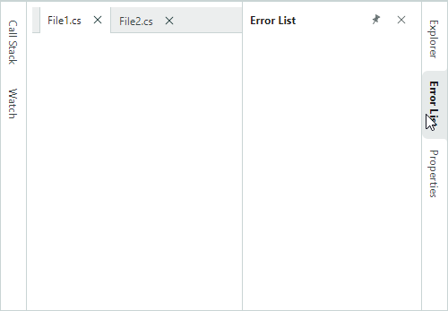

``` xml
<mxd:DockManager Name="dockManager1" Grid.Column="0" Grid.Row="1">
    <mxd:DockManager.AutoHideGroups>
        <mxd:AutoHideGroup Dock="Right">
            <mxd:DockPane Name="dockPaneExplorer1" Header="Explorer" mxd:AutoHideGroup.AutoHideWidth="200" />
            <mxd:DockPane Name="dockPaneErrors1" Header="Error List" mxd:AutoHideGroup.AutoHideWidth="200"/>
            <mxd:DockPane Name="dockPaneProperties1" Header="Properties" mxd:AutoHideGroup.AutoHideWidth="200"/>
        </mxd:AutoHideGroup>
        <mxd:AutoHideGroup Dock="Left">
            <mxd:DockPane Name="dockPaneCallStack1" Header="Call Stack" mxd:AutoHideGroup.AutoHideWidth="200"/>
            <mxd:DockPane Name="dockPaneWatch1" Header="Watch" mxd:AutoHideGroup.AutoHideWidth="200"/>
        </mxd:AutoHideGroup>
    </mxd:DockManager.AutoHideGroups>

    <mxd:DockGroup Margin="6" Name="rootDockGroup">
        <mxd:DocumentGroup DockWidth="*">
            <mxd:DocumentPane Header="File1.cs"/>
            <mxd:DocumentPane Header="File2.cs"/>
        </mxd:DocumentGroup>
    </mxd:DockGroup>
</mxd:DockManager>
```

### Пример - включение функции автоскрытия для панелей в code-behind

Следующий код применяет функцию автоскрытия к панели, а затем разворачивает её.

``` csharp
dockManager1.AutoHide(dockPaneExplorer1);
dockManager1.ExpandAutoHidePanel(dockPaneExplorer1);
```

### Доступ к контейнеру автоскрытия

Чтобы обратиться к контейнеру `AutoHideGroup`, в котором размещена автоскрытая панель, используйте свойство `DockItemBase.AutoHideGroup`.

### Разворачивание и сворачивание автоскрытой панели

Методы `DockManager.ExpandAutoHidePanel` и `DockManager.CollapseAutoHidePanel` позволяют отображать и сворачивать автоскрытую панель. Свойство `DockPane.IsActive` позволяет сфокусировать любую панель. Для автоскрытой панели это свойство разворачивает панель (если она свёрнута), а затем фокусирует её.

### Задание размера для развёрнутых автоскрытых панелей 

Когда панель становится автоскрытой, её предыдущая ширина/высота используется как размер по умолчанию для автоскрытой панели в развёрнутом состоянии.
Вы можете использовать присоединённые свойства `AutoHideGroup.AutoHideWidth` и `AutoHideGroup.AutoHideHeight`, чтобы задать пользовательскую развёрнутую ширину/высоту для автоскрытых панелей.

``` xml
<mxd:DockPane Name="dockPane1" DockWidth="*" Header="Properties"
             mxd:AutoHideGroup.AutoHideWidth="200" />
```

Если пользователь изменяет размер панели в развёрнутом состоянии, новый размер сохраняется в свойстве `AutoHideGroup.AutoHideWidth` или `AutoHideGroup.AutoHideHeight` и повторно применяется при следующем разворачивании панели.


### Встроенные автоскрытые панели

Свойство `DockManager.AutoHideMode` позволяет задать, как отображается автоскрытая панель при разворачивании. Поддерживаются следующие режимы отображения:

- `AutoHideMode.Default` (режим по умолчанию) — при разворачивании автоскрытая панель перекрывает другие элементы докинга.
  
  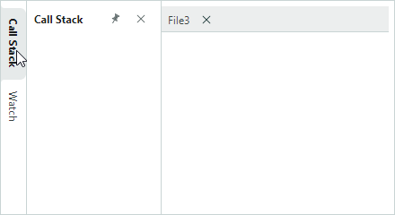

- `AutoHideMode.Inline` — при разворачивании автоскрытая панель сдвигает соседние элементы докинга.

  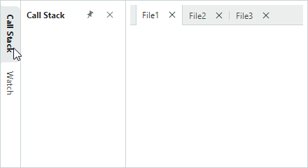

### Связанный API

- `DockManager.AutoHideGroups` — коллекция объектов `AutoHideGroup`, в которых размещаются автоскрытые панели. Используйте эту коллекцию, чтобы добавлять автоскрытые панели и обращаться к ним.
- `DockManager.AutoHideMode` — задаёт, перекрывает ли развёрнутая автоскрытая панель соседние элементы докинга или сдвигает их.
- `DockManager.AutoHideOnlyActivePane` — задаёт, переключает ли щелчок по кнопке «Pin» панели функцию автоскрытия только для этой панели. Если это свойство установлено в `false` (значение по умолчанию), а текущая панель принадлежит группе вкладок, функция автоскрытия включается для всех панелей этой группы вкладок.
- `DockPane.AutoHideGroup` — возвращает контейнер `AutoHideGroup`, содержащий панель. Возвращает **null**, если панель не в группе автоскрытия.
- `DockPane.AllowAutoHide` — возвращает или задаёт, доступны ли кнопка «Pin» и пункт контекстного меню «Auto Hide» для панели. Установите это свойство в `false`, чтобы запретить пользователю включать режим автоскрытия для конкретной панели.
- `AutoHideGroup.Dock` — задаёт край DockManager, вдоль которого отображается контейнер `AutoHideGroup`. 
- `AutoHideGroup.AutoHideHeight` — присоединённое свойство. При применении к панели задаёт высоту панели, когда функция автоскрытия включена, а родительский `AutoHideGroup` закреплён у верхнего или нижнего края DockManager.
- `AutoHideGroup.AutoHideWidth` — присоединённое свойство. При применении к панели задаёт ширину панели, когда функция автоскрытия включена, а родительский `AutoHideGroup` закреплён у левого или правого края DockManager.

<!--TODO
 AutoHideGroup.AutoHideWidth should be defined as a simple, but not attached property -->

<!-- TODO
To be implemented:

- DockManager.ShowAutoHideExpandButton
- DockManager.AutoHideSelectionMode 
-->

## Смотрите также

- [Как создать сложный макет для докинга в коде](examples/how-to-create-a-complex-docking-layout-in-code-behind.md)


<br>
<br>

<sup>*</sup> Эта страница переведена с использованием технологий машинного перевода.
