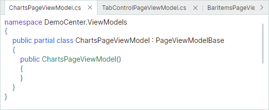
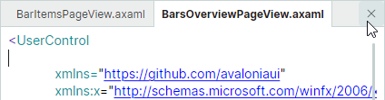
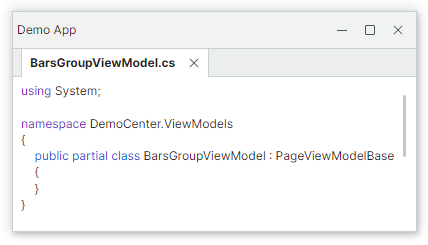

# Document-панели

Объекты Document-панелей (`DocumentPane`) позволяют создавать MDI с вкладками (Multiple Document Interface) в вашем приложении. Document-панели предназначены для отображения основного содержимого вашего окна. 
Когда вы объединяете их в контейнер `DocumentGroup`, они отображаются как вкладки.


Перетаскивание и контекстные меню позволяют изменять порядок Document-панелей, перемещать Document-панели в другой контейнер или делать их плавающими.


Вы также можете добавлять обычные [Dock-панели](dock-panes-and-containers.md) в контейнер `DocumentGroup`. Все элементы, добавленные в контейнер `DocumentGroup`, отображаются как вкладки.

`DocumentPane` и `DockPane` имеют много общих функций, поскольку `DocumentPane` является потомком класса `DockPane`. `DocumentGroup` является потомком [TabbedGroup](dock-panes-and-containers.md#вкладки). Таким образом, эти объекты имеют много общих функций.

Как и dock-панели, объекты `DocumentPane` и `DocumentGroup` можно объединять с другими элементами докинга в [сплит-контейнере](dock-panes-and-containers.md#разделённые-панели) (контейнере `DockGroup`), который располагает дочерние элементы рядом друг с другом, горизонтально или вертикально.


Следующий XAML-код создаёт размещение элементов докинга, показанное на изображении выше.

``` xml
xmlns:mxd="https://schemas.eremexcontrols.net/avalonia/docking"

<mxd:DockManager>
    <mxd:DockGroup Orientation="Horizontal">
        <mxd:DocumentGroup>
            <mxd:DocumentPane Header="BarsGroupView.axaml"/>
            <mxd:DocumentPane Header="BarItemsPageView.axaml"/>
        </mxd:DocumentGroup>
        <mxd:DockPane Header="Properties"/>
    </mxd:DockGroup>
</mxd:DockManager>
```

Функция автоскрытия не поддерживается для объектов `DocumentPane` и `DocumentGroup`.

## Использование MVVM для создания интерфейса докинга

Вы можете использовать паттерн проектирования MVVM, чтобы заполнять интерфейс докинга элементами (Dock-панелями и Document-панелями). Используйте для этого следующие члены API:

- `DockManager.ItemsSource` — задаёт список объектов, которые нужно отрисовать как элементы докинга.
- `DockManager.ItemTemplate` — задаёт шаблон, используемый для отрисовки объектов из списка `DockManager.ItemsSource` как элементов докинга.

Дополнительную информацию смотрите в разделе [Использование паттерна MVVM для заполнения элементами закрепления](use-mvvm-pattern-to-populate-dock-items.md).


## Содержимое и размер Document-панели


### Задание содержимого

Вы можете использовать унаследованное свойство `DockPane.Content`, чтобы определить содержимое Document-панели в коде. В XAML вы можете определить содержимое панели между открывающим и закрывающим тегами __&lt;DocumentPane&gt;__.

Унаследованное свойство `DockPane.ContentTemplate` позволяет задать шаблон, используемый для отрисовки объекта `Content`.


### Задание размера

Для элементов докинга (панелей и контейнеров), отображаемых внутри [сплит-контейнеров](dock-panes-and-containers.md#разделённые-панели) (объектов `DockGroup`), следующие свойства позволяют задать размер элемента:

- `DockWidth` (для панелей, расположенных горизонтально в родительских контейнерах)
- `DockHeight` (для панелей, расположенных вертикально в родительских контейнерах)

!!! note

    Document-панели отображаются как вкладки, когда находятся внутри контейнера Document Group. Вы можете изменить только размер контейнера Document Group, но не размер его дочерних Document-панелей. Вы можете задать размер отдельных Document-панелей, если они не отображаются как вкладки.

Следующий пример располагает `DocumentGroup` и `DockPane` горизонтально в сплит-контейнере и задаёт ширину `DocumentGroup` равной 4-кратной ширине `DockPane`.


``` xml
xmlns:mxd="https://schemas.eremexcontrols.net/avalonia/docking"

<mxd:DockManager Grid.Row="1" Name="dockManager1">
    <mxd:DockGroup Orientation="Horizontal">
        <mxd:DocumentGroup DockWidth="4*">
            <mxd:DocumentPane Name="documentPane1" Header="Document 1"/>
            <mxd:DocumentPane Name="documentPane2" Header="Document 2"/>
        </mxd:DocumentGroup>
        <mxd:DockPane DockWidth="*" Header="Properties"/>
    </mxd:DockGroup>
</mxd:DockManager>
```

Свойства `DockWidth` и `DockHeight` не влияют на размер Document-панелей в плавающем состоянии. Чтобы узнать больше, смотрите следующую ссылку:

- [Задание плавающих границ](#задание-плавающих-границ)


### Задание параметров заголовка

Используйте унаследованные свойства `DockPane.Header` и `DockPane.HeaderTemplate`, чтобы задать заголовки для Document-панелей. Чтобы отображать изображения, используйте унаследованные свойства `DockPane.Glyph` и `DockPane.GlyphSize`.

Как правило, Document-панели размещаются внутри контейнера `DocumentGroup`, в котором они отображаются как вкладки. В этом случае вы также можете использовать унаследованные свойства `DockPane.TabHeader`, `DockPane.TabHeaderTemplate`, `DockPane.TabGlyph` и `DockPane.TabGlyphSize`, чтобы задать текст заголовка и изображения. Если эти свойства не заданы, свойства `DockPane.Header`, `DockPane.HeaderTemplate`, `DockPane.Glyph` и `DockPane.GlyphSize` определяют текст и изображения, отображаемые во вкладках.


#### Связанный API

- `DockPane.ShowGlyphMode` — задаёт видимость и положение глифа в заголовке панели.
- `DockPane.ShowTabGlyphMode` — задаёт видимость и положение глифа во вкладке, когда панель размещена в контейнере вкладок (например, `DocumentGroup`).


## Создание интерфейса с вкладками

Вы можете объединять Document-панели в контейнер `DocumentGroup`, чтобы создать MDI с вкладками (Multiple Document Interface). `DocumentGroup`, как и его предок (`TabbedGroup`), — это контейнер, который представляет свои дочерние элементы как вкладки. 



Следующий пример создаёт контейнер `DocumentGroup` с тремя объектами `DocumentPane`.

``` xml
xmlns:mxd="https://schemas.eremexcontrols.net/avalonia/docking"

<mxd:DocumentGroup Name="documentGroup1" DockWidth="5*" >
    <mxd:DocumentPane Name="document1" Header="Document 1"></mxd:DocumentPane>
    <mxd:DocumentPane Name="document2" Header="Document 2"></mxd:DocumentPane>
    <mxd:DocumentPane Name="document3" Header="Document 3"></mxd:DocumentPane>
</mxd:DocumentGroup>
```

Чтобы объединить Document-панели в контейнер вкладок в code-behind, используйте метод `DockManager.Dock` с параметром _dockType_, установленным в `DockType.Fill`. Если вы закрепляете документ в другом документе, который уже размещён в контейнере вкладок, исходная панель отображается как дополнительная вкладка внутри контейнера вкладок.

``` csharp
// Закрепить документ в другом документе
dockManager1.Dock(document4, document1, DockType.Fill);
// или закрепить документ в группе:
dockManager1.Dock(document5, documentGroup1, DockType.Fill);
```

### Доступ к контейнеру вкладок

Для Document-панелей, находящихся в контейнере `DocumentGroup`, используйте унаследованное свойство `DockPane.DockParent`, чтобы вернуть родительский контейнер вкладок.


### Связанный API

Следующий список показывает часто используемые члены API, позволяющие настраивать объекты `DocumentPane` и `DocumentGroup`. Большинство этих настроек унаследованы от базовых классов объектов.

- `DockManager.Dock` — позволяет закрепить элемент (например, объект `DocumentPane`) в другом элементе. Установите параметр _dockType_ метода в `DockType.Fill`, чтобы создать контейнер вкладок.
- `DockItemBase.DockParent` — позволяет получить непосредственного родителя объекта докинга. Для объектов `DocumentPane`, объединённых в контейнер `DocumentGroup`, свойство `DockParent` возвращает этот контейнер.
- `DockPane.CloseCommand` — команда, вызываемая при закрытии панели. Панель можно закрыть щелчком по кнопке «Close» (см. `DockPane.AllowClose` и `TabbedGroup.CloseButtonShowMode`). 
Закрытые панели доступны из коллекции `DockManager.ClosedPanes`.
- `DockPane.ShowTabGlyphMode` — задаёт видимость и положение глифа в заголовке панели (вкладке), когда панель размещена в контейнере вкладок.
- `DockPane.TabGlyphSize` — задаёт размер глифа вкладки (`DockPane.TabGlyph`). Это свойство действует, когда панель размещена в контейнере вкладок.
- `DockPane.TabGlyph` — задаёт глиф, отображаемый во вкладке. Это свойство действует, когда панель размещена в контейнере вкладок.
- `DockPane.TabHeaderTemplate` — задаёт шаблон для отрисовки вкладки. Это свойство действует, когда панель размещена в контейнере вкладок.
- `DockPane.TabHeader` — задаёт текст для отображения во вкладке. Это свойство действует, когда панель размещена в контейнере вкладок.

- `TabbedGroup.AllowFloat` — задаёт, может ли пользователь сделать контейнер вкладок плавающим.
- `TabbedGroup.CloseButtonShowMode` — задаёт, отображать ли кнопки «Close» для дочерних панелей в области вкладок и где именно: нигде в области вкладок, в каждой панели, в активной панели или в области полосы вкладок. Свойство `TabbedGroup.CloseButtonShowMode` не влияет на отображение кнопки «Close» в заголовке панели. См. [Закрытие панелей](#закрытие-document-панелей).
- `TabbedGroup.SelectTabOnClose` — задаёт, какая вкладка выбирается при закрытии вкладки: недавно открытая вкладка, следующая или предыдущая вкладка.
- `TabbedGroup.SelectedIndex` — задаёт индекс (начиная с нуля) выбранной вкладки в текущем контейнере вкладок. Вы можете использовать свойство `SelectedIndex`, чтобы выбрать конкретную вкладку.
- `TabbedGroup.ShowTabStripForSingleChild` — задаёт, отображать ли полосу вкладок, когда контейнер вкладок содержит один дочерний элемент. Если это свойство установлено в `true`, полоса вкладок отображается только если контейнер владеет двумя или более дочерними элементами.
- `TabbedGroup.TabHeaderOrientation` — задаёт, располагать ли вкладки горизонтально или вертикально. В режиме `TabHeaderOrientation.Auto` вкладки располагаются горизонтально, если свойство `TabbedGroup.TabStripPlacement` установлено в `Top` или `Bottom`. Вкладки располагаются вертикально, если свойство `TabbedGroup.TabStripPlacement` установлено в `Left` или `Right`.
- `TabbedGroup.TabStripLayoutType` — задаёт, как отображаются вкладки. `TabStripLayoutType.Scroll` — заголовки вкладок достаточно широки, чтобы отобразить их содержимое. Кнопки прокрутки появляются в области заголовков вкладок, если недостаточно места для отображения всех заголовков вкладок целиком. `TabStripLayoutType.Stretch` — все заголовки вкладок располагаются в одну линию, растягиваясь, чтобы заполнить ширину контрола. Они имеют одинаковую ширину или высоту в зависимости от положения полосы вкладок (см. `TabbedGroup.TabStripPlacement`). `TabStripLayoutType.MultiLine` — заголовки вкладок располагаются в несколько строк, если недостаточно места для их отображения в одну строку.
- `TabbedGroup.TabStripPlacement` — задаёт край, вдоль которого отображаются вкладки.


## Активация Document-панелей

Унаследованное свойство `DockPane.IsActive` Document-панели позволяет переместить фокус на конкретную Document-панель. Используйте свойство `DockManager.ActiveDockItem`, чтобы получить активный элемент докинга.

Когда Document-панели объединены в контейнер `DocumentGroup`, вы можете использовать свойство `DocumentGroup.SelectedIndex`, чтобы выбрать конкретную Document-панель.

## Закрытие Document-панелей

Когда Document-панели размещены внутри контейнера `DocumentGroup`, они отображают кнопки «Close» во вкладках. Кнопки «Close» позволяют пользователю закрывать панели. В коде вы можете закрыть панель методом `DockManager.Close`.


Используйте свойство `DockPane.AllowClose`, чтобы скрыть кнопку «Close» для панели и тем самым предотвратить закрытие панели этой кнопкой.

Когда панель закрывается, активируется унаследованная команда `DockPane.CloseCommand`. 

Все закрытые панели доступны из коллекции `DockManager.ClosedPanes`. 

Паттерн проектирования MVVM позволяет предоставлять Document-панели из коллекции `DockManager.ItemsSource`. При закрытии Document-панели вы можете удалить панель из коллекции `DockManager.ItemsSource`. В этом случае панель также удаляется из коллекции `DockManager.ClosedPanes`.

Следующий код из демонстрационного примера «IDE Layout» показывает, как задать команду `CloseCommand` для вновь открытого документа. Эта команда удаляет панель из коллекции _Documents_ (`DockManager.ItemsSource`). Полный пример смотрите в демонстрационном примере «IDE Layout».

``` csharp
public void Open(SolutionFile solutionFile)
{
    var document = Documents.FirstOrDefault(x => x.Uri == solutionFile.Uri);
    if (document == null)
    {
        document = new IdeLayoutDocumentViewModel
        {
            Header = solutionFile.Filename,
            Uri = solutionFile.Uri
        };
        document.CloseCommand = new RelayCommand(() => Documents.Remove(document));
        Documents.Add(document);
    }
    document.IsActive = true;
}
```

Свойство `CloseButtonShowMode` контейнера `DocumentGroup` позволяет отображать дополнительные кнопки «Close» в области полосы вкладок. Вы можете отображать кнопки «Close» во всех вкладках, в активной вкладке или в области полосы вкладок.  Изображение ниже показывает кнопку «Close» в области полосы вкладок (свойство `CloseButtonShowMode` установлено в `TabControlCloseButtonShowMode.InHeaderPanel`).



Событие `DockManager.DockOperationStarting` позволяет предотвратить закрытие определённых панелей или выполнить пользовательские действия при закрытии панелей. Это событие не возникает, если панель удаляется из коллекции `DockManager.ItemsSource` при закрытии панели.


## Опции для Document-панелей во время работы

Объекты `DocumentPane` содержат настройки, позволяющие отключать определённые пользовательские операции во время работы. Эти настройки унаследованы от базового класса `DockPane`.

- `DockPane.AllowClose` — возвращает или задаёт, может ли пользователь закрыть панель. Установите это свойство в `false`, чтобы скрыть кнопку `x` (закрытия) панели. См. [Закрытие Document-панелей](#закрытие-document-панелей).
- `DockPane.AllowFloat` — возвращает или задаёт, может ли пользователь сделать панель плавающей. См. [Плавающие Document-панели](#плавающие-document-панели).
- `DockPane.AllowMaximize` — задаёт видимость кнопки «Maximize» для панели в плавающем состоянии.
- `DockPane.AllowMinimize` — задаёт видимость кнопки «Minimize» для панели в плавающем состоянии.

Эти опции не мешают вам выполнять соответствующие операции над панелями в коде.

Вы также можете обработать событие `DockManager.DockOperationStarting`, чтобы динамически предотвращать определённые операции докинга или выполнять пользовательскую логику при их возникновении.


### Пример - предотвращение перехода Document-панелей в плавающее состояние

Этот пример показывает, как отключить плавающее состояние для document-панелей. Код ниже обрабатывает событие `DockManager.RegisterDockItem`, чтобы отключить опцию `AllowFloat` для вновь создаваемых документов.

``` cs
private void DockManager_RegisterDockItem(object sender, Eremex.AvaloniaUI.Controls.Docking.DockItemEventArgs e)
{
    if(e.Item is DocumentPane document)
    {
        document.AllowFloat = false;
    }
}
```


## Плавающие Document-панели


Как и Dock-панели, Document-панели можно делать плавающими. В плавающем состоянии пользователь может перемещать Document-панель в пределах доступного пространства экрана. Плавающие документы размещаются в плавающих окнах.


Следующий пример показывает, как предотвратить переход документов в плавающее состояние:

- [Пример - предотвращение перехода Document-панелей в плавающее состояние](#пример---предотвращение-перехода-document-панелей-в-плавающее-состояние)

### Доступ к плавающему окну 

Когда панель делается плавающей, создаётся плавающее окно (контейнер), в котором размещается эта панель. Плавающие окна инкапсулируются объектами `FloatGroup`. Вы можете обратиться к родительскому плавающему окну панели с помощью свойства панели `DockItemBase.FloatGroup`. Это свойство возвращает **null**, если панель не в плавающем состоянии.

Вы можете использовать следующие члены API, чтобы задать местоположение, размер, заголовок и глиф плавающего окна:

- `FloatGroup.FloatHeight`
- `FloatGroup.FloatLocation`
- `FloatGroup.FloatWidth`
- `FloatGroup.Glyph`
- `FloatGroup.Header`
- `FloatGroup.HeaderTemplate`
- `DockManager.DefaultFloatGroupHeader`
- `DockManager.DefaultFloatGroupGlyph`

### Как делать Document-панели плавающими

Чтобы определить плавающую Document-панель в XAML, добавьте объект `FloatGroup` в коллекцию `DockManager.FloatGroups`, а затем добавьте панель `DocumentPane` в объект `FloatGroup`. Вы также можете обернуть объект `DocumentPane` в контейнер `DocumentGroup`, чтобы отобразить документ как вкладку.

Используйте метод `DockManager.Float`, чтобы создать плавающий элемент докинга в коде.

#### Пример - определение плавающих документов в XAML

Следующий пример создаёт два плавающих окна. Первое окно содержит объект `DocumentPane`. Второе окно отображает контейнер `DocumentGroup` с объектом `DocumentPane`.


``` xml
<mxd:DockManager.FloatGroups>
    <mxd:FloatGroup FloatLocation="200,200" FloatWidth="300" FloatHeight="150" >
        <mxd:DocumentPane Header="floating document"></mxd:DocumentPane>
    </mxd:FloatGroup>
    <mxd:FloatGroup FloatLocation="400,400" FloatWidth="300" FloatHeight="150" Header="floating window">
        <mxd:DocumentGroup>
            <mxd:DocumentPane Header="floating document in a container"></mxd:DocumentPane>
        </mxd:DocumentGroup>
    </mxd:FloatGroup>
</mxd:DockManager.FloatGroups>
```

#### Пример - создание плавающих документов и настройка плавающего окна в code-behind

Код ниже делает активный документ плавающим и задаёт границы и заголовок для созданного плавающего окна. 


``` csharp
DocumentPane document = dockManager1.ActiveDockItem as DocumentPane;
if(document != null)
{
    dockManager1.Float(document);
    FloatGroup floatingWindow = document.FloatGroup;
    floatingWindow.FloatWidth = 300;
    floatingWindow.FloatHeight = 200;
    floatingWindow.Header = "floating window";
    document.FloatGroup.FloatLocation = dockManager1.PointToScreen(
        new Point(dockManager1.Bounds.Right - floatingWindow.FloatWidth,
        dockManager1.Bounds.Bottom - floatingWindow.FloatHeight));
}
```


### Задание заголовка и глифа плавающего окна

Когда Document-панель делается плавающей, создаётся плавающее окно (`FloatGroup`) для размещения этого документа. Заголовок этого плавающего окна изначально пуст. 


Вы можете использовать следующие свойства, чтобы задать содержимое заголовка плавающего окна:

- `FloatGroup.Glyph` — изображение для отображения в заголовке.
- `FloatGroup.GlyphSize` — размер изображения.
- `FloatGroup.Header` — объект для отрисовки в заголовке. Используйте `FloatGroup.WindowTitle`, чтобы задать строку для отображения в заголовке вместо объекта.
- `FloatGroup.HeaderTemplate` — шаблон для отрисовки объекта `FloatGroup.Header`.
- `FloatGroup.ShowGlyphMode` — возвращает или задаёт положение и видимость изображения `FloatGroup.Glyph` в заголовке.
- `FloatGroup.WindowIcon` — объект `WindowIcon`, представляющий значок для отрисовки в заголовке. Если `WindowIcon` не задан, заголовок отображает изображение, заданное свойством `Glyph`.
- `FloatGroup.WindowTitle` — текст для отрисовки в заголовке. Если `WindowTitle` не задан, заголовок отображает текстовое представление объекта `Header`.


Плавающие окна создаются динамически, когда панели делаются плавающими. Чтобы инициализировать свойства этих динамически создаваемых плавающих окон, обработайте событие `DockManager.RegisterDockItem`.


``` cs
private void DockManager1_RegisterDockItem(object sender, Eremex.AvaloniaUI.Controls.Docking.DockItemEventArgs e)
{
    if (e.Item is FloatGroup floatGroup)
    {
        floatGroup.Header = "Demo App";
    }
}
```




### Задание плавающих границ 

Когда Document-панель делается плавающей, её предыдущий размер определяет начальный размер плавающего окна. Вы можете установить присоединённые свойства `FloatGroup.FloatWidth`, `FloatGroup.FloatHeight` и `FloatGroup.FloatLocation`, чтобы задать пользовательские плавающие границы.

``` xml
<mxd:DocumentPane Name="documentPane1" Header="Document 1"
    mxd:FloatGroup.FloatWidth="500" mxd:FloatGroup.FloatHeight="400"/>
```

После того как элемент докинга становится плавающим, вы можете обратиться к его родительскому плавающему окну (`FloatGroup`) и задать его границы.

Следующий пример делает Document-панель плавающей, обращается к созданному плавающему окну и задаёт его размер.

``` csharp
using Eremex.AvaloniaUI.Controls.Docking;

dockManager1.Float(documentPane1);
FloatGroup floatingWindow = documentPane1.FloatGroup;
floatingWindow.FloatWidth = 400;
floatingWindow.FloatHeight = 300;
floatingWindow.FloatLocation = dockManager1.PointToScreen(new Point(100,100));
```


### Связанный API 

- `DockPane.FloatGroup` — возвращает плавающее окно (объект `FloatGroup`), содержащее текущую панель, когда панель плавающая. Возвращает **null**, если панель не плавающая.
- `FloatGroup.FloatLocation` — задаёт положение float-группы относительно левого верхнего угла экрана.
- `FloatGroup.FloatHeight` — задаёт высоту `FloatGroup`.
- `FloatGroup.FloatWeight` — задаёт ширину `FloatGroup`.
- `FloatGroup.Header` — задаёт текст заголовка `FloatGroup`.
- `FloatGroup.HeaderTemplate` — задаёт шаблон заголовка `FloatGroup`.
- `FloatGroup.Glyph` — задаёт глиф `FloatGroup`.
- `DockManager.Float` — делает элемент докинга (например, объект `DocumentPane`) плавающим.
- `DockManager.FloatGroups` — коллекция плавающих групп (плавающих окон).
- `DockPane.AllowFloat` — возвращает или задаёт, может ли пользователь сделать панель плавающей.

## Смотрите также

- [Как создать сложный макет для докинга в коде](examples/how-to-create-a-complex-docking-layout-in-code-behind.md)


<br>
<br>

<sup>*</sup> Эта страница переведена с использованием технологий машинного перевода.
