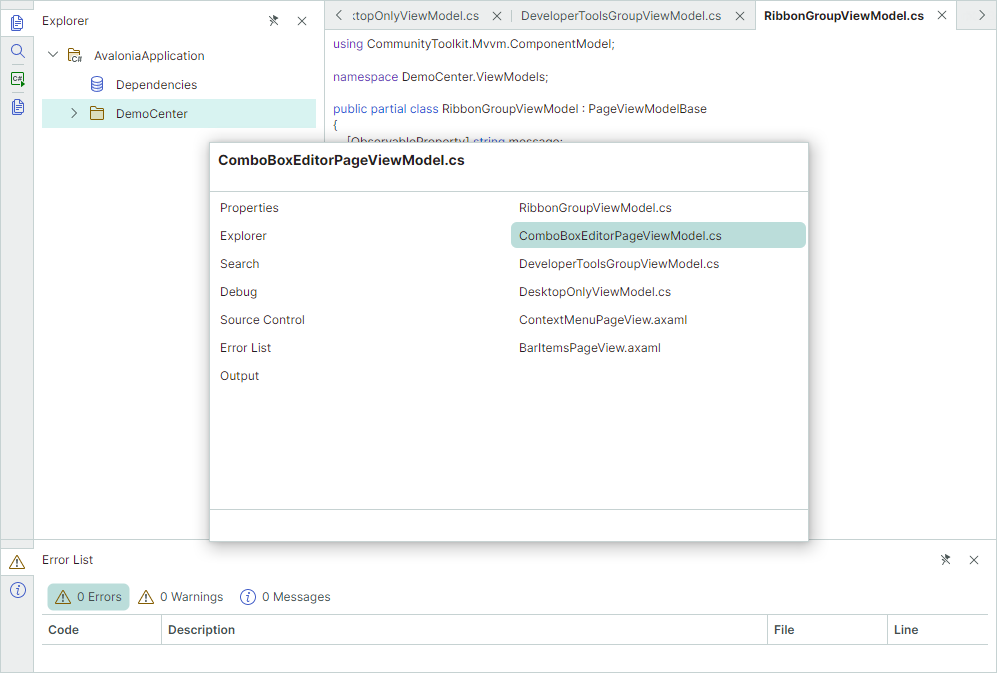

# Переключатель документов

Переключатель документов предоставляет классическое решение для переключения на конкретный документ или панель с помощью клавиатуры. Чтобы открыть переключатель документов, используйте следующие сочетания клавиш:

- Удерживайте клавишу CTRL и нажмите TAB

    или

- Удерживайте клавишу CTRL и нажмите SHIFT+TAB

Быстрое нажатие CTRL+TAB или CTRL+SHIFT+TAB немедленно переключает на предыдущий или следующий недавно использованный документ соответственно.

Переключатель документов отображает список панелей ([Dock-панелей](dock-panes-and-containers.md)) слева и список документов ([Document-панелей](document-panes.md)) справа. 

Переключатель документов остаётся открытым, пока нажата клавиша CTRL.
Чтобы перемещаться между элементами докинга в активном переключателе документов, удерживайте нажатой клавишу CTRL и используйте следующие сочетания клавиш:

- TAB и SHIFT+TAB — перемещение по активному списку вперёд и назад.
- Клавиши «Вниз» и «Вверх» — эквивалент сочетаний TAB и SHIFT+TAB.
- Клавиши «Влево» и «Вправо» — переключение между левым списком панелей и правым списком документов.

Чтобы закрыть переключатель документов и активировать выбранную панель или документ, отпустите клавишу CTRL или щёлкните по панели/документу мышью.

## Отключение переключателя документов

Установите свойство `DockManager.AllowDocumentSwitcher` в `false`, чтобы отключить переключатель документов. Эта настройка также отключает сочетания клавиш CTRL+TAB и CTRL+SHIFT+TAB для навигации между элементами докинга.

## Показ панелей в переключателе документов

Чтобы предотвратить отображение панели в переключателе документов, отключите опцию `DockPane.ShowInDocumentSwitcher`.

Закрытые панели недоступны в переключателе документов.

## Отображение описаний панелей в переключателе документов

Переключатель документов поддерживает две области, где он отображает описания выбранной панели.

Используйте следующие свойства, чтобы задать описания панели для отображения в переключателе документов: 

- `DockPane.DocumentSwitcherDescription` — задаёт описание панели для отображения в верхней части переключателя документов.
- `DockPane.DocumentSwitcherFooterDescription` — задаёт описание панели для отображения в нижней части переключателя документов.

 
 

* Эта страница переведена с использованием технологий машинного перевода.
