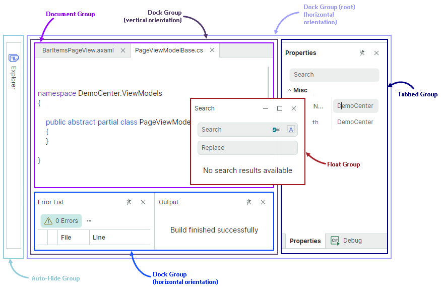
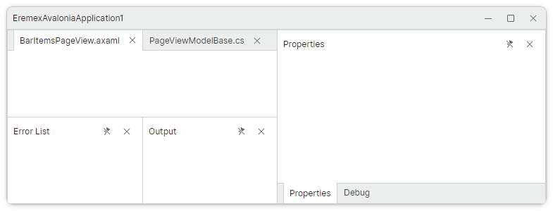
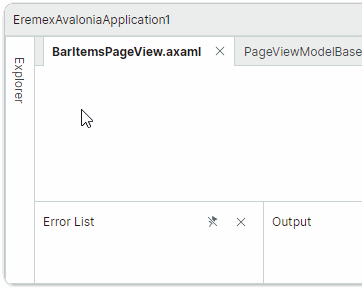
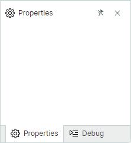

# Начало работы с Docking

Это руководство показывает, как с нуля настроить размещение dock-панелей, показанное на изображении ниже.
Сначала мы создадим размещение закреплённых панелей, а затем покажем, как определить автоскрытые и плавающие панели.


Этот пример демонстрирует элементы докинга, составляющие интерфейс докинга:

- Dock-панель (`DockPane`) — панель, которую можно закреплять, делать плавающей, автоскрывать и объединять в группу вкладок (контейнер).

- Document-панель (`DocumentPane`) — контейнер для основного содержимого вашего окна. Вы можете использовать Document-панели для реализации MDI с вкладками (Multiple Document Interface).


Чтобы построить показанное выше размещение закреплённых панелей, отдельные панели нужно объединить в группы (контейнеры). Контейнеры задают режим отображения и поведение для своих дочерних элементов. Вы можете агрегировать контейнеры в другие контейнеры, чтобы создавать сложные размещения панелей. 

Библиотека докинга поддерживает следующие контейнеры:

- `DockGroup` (сплит-контейнер) — отображает элементы докинга (Dock-панели и контейнеры) рядом друг с другом, горизонтально или вертикально. Дочерние элементы разделяются разделителями, которые позволяют изменять размер панелей.
- `TabbedGroup` (контейнер вкладок) — отображает Dock-панели как вкладки.
- `DocumentGroup` (контейнер вкладок) — отображает Document-панели как вкладки.
- `AutoHideGroup` — дочерние Dock-панели этого контейнера обладают функцией автоматического скрытия. Автоскрытая панель появляется, когда пользователь щёлкает по заголовку панели. 
- `FloatGroup` — отображает элементы докинга в плавающем окне.




## 1. Создание компонента DockManager

Создайте [новое приложение Avalonia UI с контролами Eremex](../../get-started/index.md).
Откройте файл MainWindow.axaml и определите компонент `DockManager` в XAML. 

``` xml
xmlns:mxd="https://schemas.eremexcontrols.net/avalonia/docking"

<mxd:DockManager>
</mxd:DockManager>
```

`DockManager` — это контрол, который управляет созданием элементов докинга (Dock-панелей и Document-панелей), поддерживает операции над элементами докинга во время работы, предоставляет контекстные меню и выполняет сериализацию и десериализацию интерфейса докинга.


## 2. Определение корневой группы

Добавьте объект `DockGroup` как дочерний элемент контрола `DockManager`. Этот объект используется для инициализации корневой группы докинга (свойство `DockManager.Root`, помеченное атрибутом `ContentAttribute`).

``` xml
xmlns:mxd="https://schemas.eremexcontrols.net/avalonia/docking"

<mxd:DockManager>
    <mxd:DockGroup>
    </mxd:DockGroup>
</mxd:DockManager>
```

Корневая группа докинга — это контейнер для всех панелей и документов в закреплённом состоянии.


## 3. Добавление панелей «Properties» и «Debug»

Добавьте объекты `DockPane` «Properties» и «Debug» в корневую группу.

``` xml
xmlns:mxd="https://schemas.eremexcontrols.net/avalonia/docking"

<mxd:DockManager>
    <mxd:DockGroup>
        <mxd:DockPane Header="Properties"/>
        <mxd:DockPane Header="Debug"/>
    </mxd:DockGroup>
</mxd:DockManager>
```

Контейнер `DockGroup` по умолчанию располагает панели горизонтально. Вы можете изменить направление на вертикальное с помощью свойства `DockGroup.Orientation`.


## 4. Объединение панелей в контейнер вкладок

Оберните панели «Properties» и «Debug» в контейнер `TabbedGroup`. Этот контейнер представляет свои дочерние элементы как вкладки.

``` xml
xmlns:mxd="https://schemas.eremexcontrols.net/avalonia/docking"

<mxd:DockManager>
    <mxd:DockGroup>
        <mxd:TabbedGroup>
            <mxd:DockPane Header="Properties"/>
            <mxd:DockPane Header="Debug"/>
        </mxd:TabbedGroup>
    </mxd:DockGroup>
</mxd:DockManager>
```


## 5. Добавление панели «Error List»

Определите панель «Error List» перед объектом `TabbedGroup`. 

``` xml
xmlns:mxd="https://schemas.eremexcontrols.net/avalonia/docking"

<mxd:DockManager>
    <mxd:DockGroup>
        <mxd:DockPane Header="Error List"/>
        <mxd:TabbedGroup>
            <mxd:DockPane Header="Properties"/>
            <mxd:DockPane Header="Debug"/>
        </mxd:TabbedGroup>
    </mxd:DockGroup>
</mxd:DockManager>
```

Контейнер `DockGroup` располагает панель «Error List» и `TabbedGroup` в горизонтальном направлении.


## 6. Добавление группы документов над панелью «Error List»

Чтобы отобразить `DocumentGroup` над панелью «Error List», сначала создайте новый контейнер `DockGroup` с вертикальной ориентацией. Затем поместите панель «Error List» и новый объект `DocumentGroup` в этот контейнер.

``` xml
xmlns:mxd="https://schemas.eremexcontrols.net/avalonia/docking"

<mxd:DockManager>
    <mxd:DockGroup>
        <mxd:DockGroup Orientation="Vertical">
            <mxd:DocumentGroup></mxd:DocumentGroup>
            <mxd:DockPane Header="Error List"/>
        </mxd:DockGroup>
        <mxd:TabbedGroup>
            <mxd:DockPane Header="Properties"/>
            <mxd:DockPane Header="Debug"/>
        </mxd:TabbedGroup>
    </mxd:DockGroup>
</mxd:DockManager>
```


## 7. Добавление панели «Output»

Панель «Output» должна отображаться справа от панели «Error List». В настоящее время панель «Error List» принадлежит контейнеру, который располагает свои дочерние элементы вертикально. Таким образом, нам нужно агрегировать панели «Error List» и «Output» в новый контейнер (`DockGroup`) с горизонтальной ориентацией.

``` xml
xmlns:mxd="https://schemas.eremexcontrols.net/avalonia/docking"

<mxd:DockManager>
    <mxd:DockGroup>
        <mxd:DockGroup Orientation="Vertical">
            <mxd:DocumentGroup></mxd:DocumentGroup>
            <mxd:DockGroup Orientation="Horizontal">
                <mxd:DockPane Header="Error List"/>
                <mxd:DockPane Header="Output"/>
            </mxd:DockGroup>
        </mxd:DockGroup>
        <mxd:TabbedGroup>
            <mxd:DockPane Header="Properties"/>
            <mxd:DockPane Header="Debug"/>
        </mxd:TabbedGroup>
    </mxd:DockGroup>
</mxd:DockManager>
```


## 8. Заполнение группы документов вкладками

Добавьте два объекта `DocumentPane` в контейнер `DocumentGroup`. `DocumentGroup` отображает свои дочерние элементы как вкладки, реализуя тем самым MDI с вкладками.

``` xml
xmlns:mxd="https://schemas.eremexcontrols.net/avalonia/docking"

<mxd:DockManager>
    <mxd:DockGroup>
        <mxd:DockGroup Orientation="Vertical">
            <mxd:DocumentGroup>
                <mxd:DocumentPane Header="BarItemsPageView.axaml"/>
                <mxd:DocumentPane Header="PageViewModelBase.cs"/>
            </mxd:DocumentGroup>
            <mxd:DockGroup Orientation="Horizontal">
                <mxd:DockPane Header="Error List"/>
                <mxd:DockPane Header="Output"/>
            </mxd:DockGroup>
        </mxd:DockGroup>
        <mxd:TabbedGroup>
            <mxd:DockPane Header="Properties"/>
            <mxd:DockPane Header="Debug"/>
        </mxd:TabbedGroup>
    </mxd:DockGroup>
</mxd:DockManager>
```




## 9. Задание размера закреплённых панелей

Пространство любого сплит-контейнера (`DockGroup`) по умолчанию делится поровну между его дочерними элементами. Вы можете использовать свойства `DockWidth` и `DockHeight`, чтобы задать пользовательский размер дочерних элементов контейнера. Эти свойства имеют тип `Avalonia.Controls.GridLength`, поэтому вы можете установить их в следующие значения:

- Число пикселей (абсолютные значения).
- Взвешенную долю доступного пространства, используя нотацию «звёздочка (`*`)». Например, `3*`.
- Значение «Auto» — элемент автоматически изменяет размер, чтобы уместить своё содержимое.

Код ниже использует свойства `DockWidth` и `DockHeight`, чтобы задать пропорциональный размер панелей и контейнеров.

``` xml
xmlns:mxd="https://schemas.eremexcontrols.net/avalonia/docking"

<mxd:DockManager>
    <mxd:DockGroup>
        <mxd:DockGroup Orientation="Vertical" DockWidth="3*">
            <mxd:DocumentGroup DockHeight="2*">
                <mxd:DocumentPane Header="BarItemsPageView.axaml"/>
                <mxd:DocumentPane Header="PageViewModelBase.cs"/>
            </mxd:DocumentGroup>
            <mxd:DockGroup Orientation="Horizontal" DockHeight="*">
                <mxd:DockPane Header="Error List"/>
                <mxd:DockPane Header="Output"/>
            </mxd:DockGroup>
        </mxd:DockGroup>
        <mxd:TabbedGroup DockWidth="*">
            <mxd:DockPane Header="Properties"/>
            <mxd:DockPane Header="Debug"/>
        </mxd:TabbedGroup>
    </mxd:DockGroup>
</mxd:DockManager>
```


## 10. Создание автоскрытой панели

Автоскрытая панель автоматически сворачивается, когда теряет фокус. Для свёрнутых автоскрытых панелей отображаются только заголовки. 

Чтобы создать автоскрытую панель в XAML, добавьте контейнер `AutoHideGroup` в коллекцию `DockManager.AutoHideGroups`, а затем определите панель `DockPane` в контейнере `AutoHideGroup`.

``` xml
xmlns:mxd="https://schemas.eremexcontrols.net/avalonia/docking"

<mxd:DockManager>
    <!--...-->
    <mxd:DockManager.AutoHideGroups>
        <mxd:AutoHideGroup Dock="Left">
            <mxd:DockPane Header="Explorer"/>
        </mxd:AutoHideGroup>
    </mxd:DockManager.AutoHideGroups>
</mxd:DockManager>
```

Свойство `AutoHideGroup.Dock` позволяет задать край, у которого отображается контейнер автоскрытия.




## 11. Создание плавающей панели

Пользователь может перетащить панель мышью из её закреплённого состояния, чтобы сделать панель плавающей. 

Вы также можете определить плавающую панель в XAML. Для этого добавьте контейнер `FloatGroup` в коллекцию `DockManager.FloatGroups`, а затем добавьте панель `DockPane` в контейнер `FloatGroup`.

``` xml
xmlns:mxd="https://schemas.eremexcontrols.net/avalonia/docking"

<mxd:DockManager>
    <!--...-->
    <mxd:DockManager.FloatGroups>
        <mxd:FloatGroup FloatLocation="300,300" FloatWidth="150" FloatHeight="100">
            <mxd:DockPane Header="Search"/>
        </mxd:FloatGroup>
    </mxd:DockManager.FloatGroups>
</mxd:DockManager>
```


Используйте свойства `FloatWidth` и `FloatHeight`, чтобы задать размер плавающего окна. 
Вы также можете применить присоединённые свойства `FloatGroup.FloatWidth` и `FloatGroup.FloatHeight` к любой панели, даже в закреплённом состоянии. Эти настройки зададут начальный плавающий размер, когда панель будет сделана плавающей.


## 12. Задание заголовков и глифов панелей

Вы можете использовать свойства `Header` и `Glyph`, чтобы задать подписи и глифы для Dock-панелей и Document-панелей. 

Следующий XAML инициализирует подписи для панелей «Properties» и «Debug» и отображает SVG-изображения в заголовках. Предполагается, что SVG-изображения, используемые в этом примере, имеют свойство `Build Action`, установленное в `AvaloniaResource`.

``` xml
<mxd:TabbedGroup DockWidth="*">
    <mxd:DockPane 
        Header="Properties"
        Glyph="{SvgImage 'avares://EremexAvaloniaApplication1/Images/settings.svg'}"
        GlyphSize="16,16"/>
    <mxd:DockPane 
        Header="Debug"
        Glyph="{SvgImage 'avares://EremexAvaloniaApplication1/Images/debug2.svg'}"
        GlyphSize="16,16"/>
</mxd:TabbedGroup>
```



## 13. Задание содержимого панелей

Используйте свойство `DockPane.Content`, чтобы определить содержимое для Dock-панелей и Document-панелей. В XAML вы можете определить содержимое панели между открывающим и закрывающим тегами __&lt;DockPane&gt;__ и __&lt;DocumentPane&gt;__.

``` xml
xmlns:mxd="https://schemas.eremexcontrols.net/avalonia/docking"
xmlns:mxe="https://schemas.eremexcontrols.net/avalonia/editors"
xmlns:mxi="https://schemas.eremexcontrols.net/avalonia/icons"

<mxd:DockPane Header="Search">
    <Grid RowDefinitions="Auto *">
        <StackPanel>
            <mxe:ButtonEditor Watermark="Search" Margin="5">
                <mxe:ButtonEditor.Buttons>
                    <mxe:ButtonSettings ToolTip.Tip="Match case"
                                        Glyph="{x:Static mxi:Filter.Starts_with }"
                                        ButtonKind="Toggle"/>
                    <mxe:ButtonSettings ToolTip.Tip="Match whole word"
                                        Glyph="{x:Static mxi:Painting.Report_text_column }"
                                        ButtonKind="Toggle"/>
                </mxe:ButtonEditor.Buttons>
            </mxe:ButtonEditor>
            <mxe:ButtonEditor Watermark="Replace" Margin="5"/>
        </StackPanel>
        <TextBlock Grid.Row="1"
                    Text="No search results available"
                    TextWrapping="Wrap"
                    TextAlignment="Center"
                    HorizontalAlignment="Center"
                    VerticalAlignment="Center"/>
    </Grid>
</mxd:DockPane>
```


Пример, создающий сложное размещение dock-панелей и задающий содержимое различных панелей, смотрите в демо «IDE Layout».

## 14. Полный код

Ниже приведён полный код этого руководства. SVG-изображения, используемые в этом примере, включены в проект как «Avalonia Resources».

_MainWindow.axaml_:

``` xml
<mx:MxWindow xmlns="https://github.com/avaloniaui"
             xmlns:x="http://schemas.microsoft.com/winfx/2006/xaml"
             xmlns:d="http://schemas.microsoft.com/expression/blend/2008"
             xmlns:mc="http://schemas.openxmlformats.org/markup-compatibility/2006"
             xmlns:mx="https://schemas.eremexcontrols.net/avalonia"
             xmlns:mxd="https://schemas.eremexcontrols.net/avalonia/docking"
             xmlns:mxe="https://schemas.eremexcontrols.net/avalonia/editors"
             xmlns:mxi="https://schemas.eremexcontrols.net/avalonia/icons"
             mc:Ignorable="d" d:DesignWidth="800" d:DesignHeight="450"
             x:Class="EremexAvaloniaApplication1.MainWindow"
             Title="EremexAvaloniaApplication1"
             >
    <mxd:DockManager>
        <mxd:DockGroup>
            <mxd:DockGroup Orientation="Vertical" DockWidth="3*">
                <mxd:DocumentGroup DockHeight="2*">
                    <mxd:DocumentPane Header="BarItemsPageView.axaml"/>
                    <mxd:DocumentPane Header="PageViewModelBase.cs"/>
                </mxd:DocumentGroup>
                <mxd:DockGroup Orientation="Horizontal" DockHeight="*">
                    <mxd:DockPane Header="Error List"/>
                    <mxd:DockPane Header="Output"/>
                </mxd:DockGroup>
            </mxd:DockGroup>
            <mxd:TabbedGroup DockWidth="*">
                <mxd:DockPane
                    Header="Properties"
                    Glyph="{SvgImage 'avares://EremexAvaloniaApplication1/Images/settings.svg'}"
                    GlyphSize="16,16"/>
                <mxd:DockPane
                    Header="Debug"
                    Glyph="{SvgImage 'avares://EremexAvaloniaApplication1/Images/debug2.svg'}"
                    GlyphSize="16,16"/>
            </mxd:TabbedGroup>
        </mxd:DockGroup>
        <mxd:DockManager.AutoHideGroups>
            <mxd:AutoHideGroup Dock="Left">
                <mxd:DockPane Header="Explorer"/>
            </mxd:AutoHideGroup>
        </mxd:DockManager.AutoHideGroups>
        <mxd:DockManager.FloatGroups>
            <mxd:FloatGroup FloatLocation="300,300" FloatWidth="200" FloatHeight="250">
                <mxd:DockPane Header="Search">
                    <Grid RowDefinitions="Auto *">
                        <StackPanel>
                            <mxe:ButtonEditor Watermark="Search" Margin="5">
                                <mxe:ButtonEditor.Buttons>
                                    <mxe:ButtonSettings ToolTip.Tip="Match case"
                                                        Glyph="{x:Static mxi:Filter.Starts_with }"
                                                        ButtonKind="Toggle"/>
                                    <mxe:ButtonSettings ToolTip.Tip="Match whole word"
                                                        Glyph="{x:Static mxi:Painting.Report_text_column }"
                                                        ButtonKind="Toggle"/>
                                </mxe:ButtonEditor.Buttons>
                            </mxe:ButtonEditor>
                            <mxe:ButtonEditor Watermark="Replace" Margin="5"/>
                        </StackPanel>
                        <TextBlock Grid.Row="1"
                                    Text="No search results available"
                                    TextWrapping="Wrap"
                                    TextAlignment="Center"
                                    HorizontalAlignment="Center"
                                    VerticalAlignment="Center"/>
                    </Grid>
                </mxd:DockPane>
            </mxd:FloatGroup>
        </mxd:DockManager.FloatGroups>
    </mxd:DockManager>
</mx:MxWindow>
```


## Смотрите также

- [Dock Manager и элементы докинга](dock-manager.md)
- [Dock-панели и контейнеры](dock-panes-and-containers.md)
- [Document-панели](document-panes.md)
- [Использование паттерна MVVM для заполнения элементами закрепления](use-mvvm-pattern-to-populate-dock-items.md)
- [Сохранение и восстановление размещения панелей](save-and-restore-layout.md)


<br>
<br>

<sup>*</sup> Эта страница переведена с использованием технологий машинного перевода.
