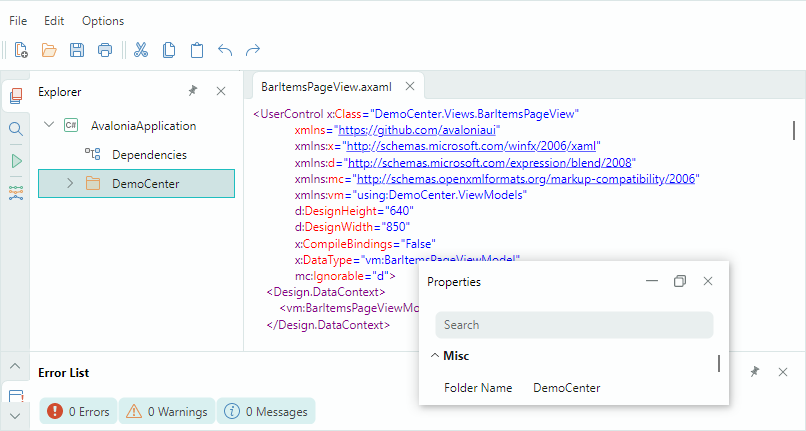

# Интерфейс Докинга

Компонент **Dock Manager**, поставляемый в составе библиотеки контролов Eremex Avalonia UI, позволяет реализовать классический интерфейс докинга, который можно встретить в популярных IDE. Вы можете создавать инструментальные панели, поддерживающие операции закрепления, автоскрытия и плавающего режима. Специальные контейнеры Document предназначены для отображения основного содержимого вашего окна. Вы можете создавать несколько документов и организовывать их в интерфейс с вкладками.

Основные возможности библиотеки докинга включают:

- Интерфейс, вдохновлённый IDE Visual Studio
- Переключатель документов
- Закрепляемые инструментальные панели
- Плавающие панели
- Функцию автоскрытия панелей
- Настройку размещения во время работы
- Поддержку документов (специальных контейнеров для отображения основного содержимого окна)
- Интерфейс с вкладками
- Встроенные контекстные команды
- Поддержку MVVM
- Механизм сериализации и десериализации

Дополнительную информацию смотрите в следующих разделах: 

- [Начало работы с Docking](get-started-with-docking.md)
- [Dock Manager и элементы докинга](dock-manager.md)
- [Dock-панели и контейнеры](dock-panes-and-containers.md)
- [Document-панели](document-panes.md)
- [Переключатель документов](document-switcher.md)
- [Выполнение операций закрепления в коде](perform-dock-operations-in-code.md)
- [Использование паттерна MVVM для заполнения элементами закрепления](use-mvvm-pattern-to-populate-dock-items.md)
- [Сохранение и восстановление размещения панелей](save-and-restore-layout.md)

 
 

* Эта страница переведена с использованием технологий машинного перевода.
