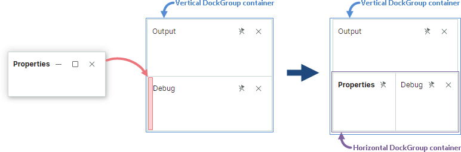
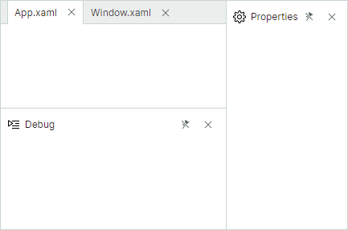
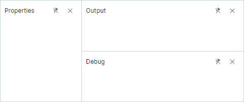
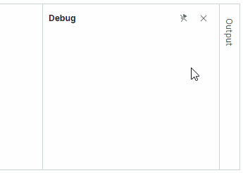

# Выполнение операций закрепления в коде

Этот раздел описывает операции над dock-панелями в code-behind.

## Создание Dock-панелей

Вы можете создавать объекты `DockPane` и `DocumentPane` с помощью их конструкторов. После создания панели вам обычно нужно отобразить её в определённой позиции относительно другой панели или [контейнера (группы)](dock-panes-and-containers.md). Метод `DockManager.Dock` позволяет закрепить панель у края другой панели, добавить панель в существующий контейнер и объединить панели в интерфейсе с вкладками. Чтобы добавить панель как дочерний элемент существующего контейнера, вы также можете использовать метод контейнера `Add`.


Наиболее часто используемая перегрузка метода `DockManager.Dock` определяется следующим образом:

``` cs
public bool Dock(DockItemBase item, DockItemBase target, DockType dockType)
```

Параметр `target` задаёт панель или контейнер, относительно которого закрепляется исходный элемент (передаваемый как параметр `item`).

Параметр `dockType` задаёт, как закрепить элемент относительно целевого элемента:

- `DockType.Fill` — исходная и целевая панели объединяются в контейнер вкладок (`TabGroup`). Если целевая панель уже принадлежит контейнеру вкладок, исходная панель добавляется в этот контейнер; дополнительный контейнер вкладок не создаётся.

- `DockType.Left`, `DockType.Right`, `DockType.Top`, `DockType.Bottom` — исходный элемент докинга закрепляется у соответствующей стороны целевого элемента докинга. При необходимости методом `DockManager.Dock` создаётся дополнительный горизонтальный или вертикальный сплит-контейнер (`DockGroup`), как описано ниже. 

  Предположим, что вы закрепляете исходную панель сверху или снизу от целевой панели, принадлежащей **вертикальному** сплит-контейнеру. 
  
  ``` cs
  dockManager1.Dock(paneProperties, paneDebug, DockType.Top);
  ```

  В этом случае исходная панель добавляется как дочерний элемент существующего контейнера. 

  
  
  Если вы закрепляете панель слева или справа от целевой панели, создаётся дополнительный горизонтальный сплит-контейнер, объединяющий исходную и целевую панели.

  ``` cs
  dockManager1.Dock(paneProperties, paneDebug, DockType.Left);
  ```

  

  Та же логика применяется, когда панель закрепляется рядом с целевой панелью, находящейся в **горизонтальном** сплит-контейнере. Если вы закрепляете исходную панель слева или справа от целевой панели, исходная панель добавляется как дочерний элемент существующего горизонтального контейнера. 
  
  ``` cs
  dockManager1.Dock(paneProperties, paneOutput, DockType.Right);
  ```

  

  Если вы закрепляете панель сверху или снизу от целевой панели, создаётся дополнительный вертикальный сплит-контейнер, объединяющий исходную и целевую панели.

  ``` cs
  dockManager1.Dock(paneProperties, paneOutput, DockType.Bottom);
  ```

  
  
  Используйте свойства `DockPane.DockWidth` и `DockPane.DockHeight`, чтобы задать размер панелей, когда они размещены в сплит-контейнере.


### Пример - создание и отображение панелей рядом друг с другом

Следующий код создаёт объекты `DockPane` и `DocumentPane` и располагает их, как показано на изображении ниже. Объекты `DocumentPane` размещаются в контейнере `DocumentGroup`, чтобы представить их как вкладки.



``` cs
DockPane paneProperties = new DockPane()
{
    Header = "Properties",
    Glyph = ImageLoader.LoadSvgImage(Assembly.GetExecutingAssembly(), "Images/settings.svg"),
    GlyphSize = new Avalonia.Size(16, 16)
};
DockPane paneDebug = new DockPane()
{
    Header = "Debug",
    Glyph = ImageLoader.LoadSvgImage(Assembly.GetExecutingAssembly(), "Images/debug2.svg"),
    GlyphSize = new Avalonia.Size(16, 16)
};
DockPane paneOutput = new DockPane() { Header = "Output" };

dockManager1.Root = new DockGroup();
dockManager1.Dock(paneProperties, dockManager1.Root, DockType.Right);
paneProperties.DockWidth = new GridLength(150, GridUnitType.Pixel);

dockManager1.Dock(paneOutput, paneProperties, DockType.Left);
dockManager1.Dock(paneDebug, paneOutput, DockType.Bottom);
paneDebug.DockHeight = new GridLength(150, GridUnitType.Pixel);

```


Смотрите также:

- [Управление автоскрытыми панелями](#управление-автоскрытыми-панелями)
- [Управление плавающими панелями](#управление-плавающими-панелями)

Больше примеров: 

- [Как создать сложный макет для докинга в коде](examples/how-to-create-a-complex-docking-layout-in-code-behind.md)

### Доступ к родителю и дочерним элементам элемента докинга

Свойство `DockPane.DockParent` позволяет вернуть непосредственного родителя любого элемента докинга (панели или контейнера). Например, когда панель находится в сплит-контейнере (`DockGroup`), `DockPane.DockParent` возвращает этот сплит-контейнер. Для панелей, объединённых в контейнер вкладок, `DockPane.DockParent` возвращает этот родительский контейнер вкладок (объект `TabbedGroup` или `DocumentGroup`).

Чтобы получить непосредственные дочерние элементы контейнера докинга, используйте его свойство `Items`.

Смотрите также: [Доступ к dock-панелям и контейнерам](#доступ-к-dock-панелям-и-контейнерам).

#### Пример - доступ к родителю и задание его размера

Следующий код создаёт интерфейс докинга, состоящий из трёх панелей. Пример задаёт относительную ширину для панели «Properties» и вертикального сплит-контейнера, объединяющего панели «Output» и «Debug».



``` cs
DockPane paneProperties = new DockPane() { Header = "Properties" };
DockPane paneDebug = new DockPane() { Header = "Debug" };
DockPane paneOutput = new DockPane() { Header = "Output" };

dockManager1.Root = new DockGroup();
dockManager1.Root.Add(paneProperties);
dockManager1.Dock(paneDebug, paneProperties, DockType.Right);
dockManager1.Dock(paneOutput, paneDebug, DockType.Top);
paneProperties.DockWidth = new GridLength(1, GridUnitType.Star);
paneDebug.DockParent.DockWidth = new GridLength(2, GridUnitType.Star);
```


## Закрытие панелей

Метод `DockManager.Close` позволяет временно скрыть панель или контейнер. Этот метод вызывается, когда пользователь закрывает панель щелчком по кнопке «Close» ('x').


При вызове для контейнера (группы) метод `Close` скрывает все панели этого контейнера.

Закрытые панели доступны из коллекции `DockManager.ClosedPanes`.

Используйте свойство `DockPane.AllowClose`, чтобы скрыть кнопку «Close» для панели и тем самым предотвратить закрытие панели этой кнопкой. Эта опция не предотвращает закрытие панели методом `DockManager.Close`.

Когда панель закрывается, активируется команда `DockPane.CloseCommand`.

## Удаление панелей

Вы можете использовать метод `DockManager.Remove`, чтобы удалить панель из `DockManager`. Этот метод не освобождает панель и её содержимое.

`DockManager` не хранит ссылки на удалённые панели.

## Объединение панелей в контейнер вкладок

Вы можете объединять панели в контейнер вкладок (`TabGroup`). Для этого используйте следующую перегрузку метода `DockManager.Dock`:

``` cs
public bool Dock(DockItemBase item, DockItemBase target, DockType dockType)
```

Параметр `target` может быть панелью или существующим контейнером вкладок. 

Параметр `dockType` задаёт, как закрепить панель. Установите этот параметр в `DockType.Fill`, чтобы объединить панели в интерфейсе с вкладками.

Когда вы закрепляете объект `DockPane` в другом объекте `DockPane`, создаётся контейнер `TabGroup`. Контейнер `DocumentGroup` создаётся, когда вы закрепляете `DocumentPane` в другом объекте `DocumentPane`.

Вы также можете использовать метод `Add` контейнера вкладок, чтобы добавить новый элемент как вкладку.

### Пример - создание контейнера вкладок

Следующий код использует метод `DockManager.Dock`, чтобы создать контейнер вкладок из двух панелей.


``` cs
dockManager1.Root = new DockGroup();
DockPane paneDebug = new DockPane() 
{ 
    Header = "Debug", 
    DockWidth = new GridLength(250, GridUnitType.Pixel) 
};
dockManager1.Root.Add(paneDebug);
DockPane paneOutput = new DockPane() { Header = "Output" };
dockManager1.Dock(paneOutput, paneDebug, DockType.Fill);
```

### Доступ к контейнеру вкладок

Чтобы получить родительский контейнер вкладок для панели, используйте свойство панели `DockParent`.

Смотрите также: [Доступ к dock-панелям и контейнерам](#доступ-к-dock-панелям-и-контейнерам).

## Управление автоскрытыми панелями

Автоскрытые панели изначально свёрнуты. Пользователь может щёлкнуть по кнопке панели, чтобы развернуть панель.




### Создание автоскрытой панели

Используйте метод `DockManager.AutoHide`, чтобы включить функцию автоскрытия для панели в code-behind. Этот метод скрывает панель в её текущей или предыдущей позиции докинга.

``` cs
dockManager1.AutoHide(paneOutput);
```

Когда панель становится автоскрытой, создаётся контейнер `AutoHideGroup`, и панель перемещается в этот контейнер.

Вы можете вызвать метод `DockManager.AutoHide` для контейнера `TabGroup`. В этом случае все панели контейнера вкладок становятся автоскрытыми.

#### Пример - автоскрытие контейнеров вкладок

Следующий код создаёт два контейнера вкладок у правого края `DockManager`, а затем включает функцию автоскрытия для этих контейнеров вкладок. В результате создаются два контейнера `AutoHideGroup`, каждый из которых отображает панели из соответствующего контейнера вкладок.


``` cs
dockManager1.Root = new DockGroup();
dockManager1.Root.Add(new DocumentGroup());
DockPane paneDebug = new DockPane() { Header = "Debug" };
dockManager1.Root.Add(paneDebug);
DockPane paneOutput = new DockPane() { Header = "Output" };
// Создать контейнер вкладок, объединяющий панели 'Debug' и 'Output'
dockManager1.Dock(paneOutput, paneDebug, DockType.Fill);

DockPane paneTasks = new DockPane() { Header = "Tasks" };
dockManager1.Root.Add(paneTasks);
DockPane paneExplorer = new DockPane() { Header = "Explorer" };
//Создать контейнер вкладок, объединяющий панели 'Tasks' и 'Explorer'
dockManager1.Dock(paneExplorer, paneTasks, DockType.Fill);

//Автоскрыть контейнеры вкладок
dockManager1.AutoHide(paneDebug.DockParent);
dockManager1.AutoHide(paneTasks.DockParent);
```


### Восстановление панели из автоскрытого состояния

Используйте перегрузку метода `DockManager.Dock(DockItemBase item)`, чтобы восстановить панель из автоскрытого состояния в её предыдущую позицию докинга.

``` cs
dockManager1.Dock(paneOutput);
```

Вы также можете использовать перегрузку `Dock(DockItemBase item, DockItemBase target, DockType dockType)`, чтобы восстановить автоскрытую панель, одновременно перемещая её в конкретную позицию в размещении.

``` cs
dockManager1.Dock(paneOutput, paneDebug, DockType.Right););
```

### Отображение и сворачивание автоскрытой панели

Методы `DockManager.ExpandAutoHidePanel` и `DockManager.CollapseAutoHidePanel` позволяют отображать и сворачивать автоскрытую панель. Свойство `DockPane.IsActive` позволяет сфокусировать любую панель. Для автоскрытой панели это свойство разворачивает панель (если она свёрнута), а затем фокусирует её.

### Доступ к автоскрытым панелям

Вы можете использовать коллекцию `DockManager.AutoHideGroups`, чтобы обратиться ко всем существующим контейнерам `AutoHideGroup`. Свойство `AutoHideGroup.Items` позволяет получить все автоскрытые панели, отображаемые в конкретном контейнере.

Чтобы получить родительский контейнер для автоскрытой панели, см. свойство `DockPane.AutoHideGroup`.

Смотрите также: [Доступ к dock-панелям и контейнерам](#доступ-к-dock-панелям-и-контейнерам).

## Управление плавающими панелями


### Создание плавающих панелей

Используйте метод `DockManager.Float`, чтобы сделать панель плавающей в code-behind. Когда вы делаете панель плавающей, она перемещается в контейнер `FloatGroup` (плавающее окно). Свойство плавающей панели `DockPane.FloatGroup` позволяет обратиться к родительскому плавающему окну и задать его границы (см. `FloatGroup.FloatLocation`, `FloatGroup.FloatWidth` и `FloatGroup.FloatHeight`).


``` cs
DockPane paneTasks = new DockPane() { Header = "Tasks" };
dockManager1.Float(paneTasks);
// Задать границы плавающего окна
paneTasks.FloatGroup.FloatLocation = new Avalonia.PixelPoint(200, 200);
paneTasks.FloatGroup.FloatWidth = 300;
paneTasks.FloatGroup.FloatHeight = 200;
```

Если панель плавающая, вы можете закрепить другую панель рядом с ней и тем самым создать плавающий контейнер.


``` cs
DockPane paneTasks = new DockPane() { Header = "Tasks" };
dockManager1.Float(paneTasks);
DockPane paneExplorer = new DockPane() { Header = "Explorer" };
dockManager1.Dock(paneExplorer, paneTasks, DockType.Right);
```

### Доступ к плавающим панелям

Коллекция `DockManager.FloatGroups` позволяет получить существующие плавающие окна (объекты `FloatGroup`). Используйте свойство `FloatGroup.Items`, чтобы получить список панелей, отображаемых в каждом плавающем окне.

Смотрите также: [Доступ к dock-панелям и контейнерам](#доступ-к-dock-панелям-и-контейнерам).

## Доступ к dock-панелям и контейнерам

Следующий список суммирует свойства и методы, которые вы можете использовать для доступа к dock-панелям и группам (контейнерам).

- Метод расширения `GetItems` для DockManager — возвращает линейный список всех закреплённых, автоскрытых и закрытых панелей и групп.
- Метод расширения `FindItem` для DockManager — возвращает элемент по имени.
- `DockGroup.Items` — возвращает список непосредственных дочерних элементов контейнера.
- `DockPane.DockParent` — возвращает непосредственного родителя элемента докинга.
- `DockPane.FloatGroup` — возвращает плавающее окно, в котором размещена панель в плавающем состоянии. 
- `DockPane.AutoHideGroup` — возвращает контейнер `AutoHideGroup`, в котором размещена панель в автоскрытом состоянии. 
- `DockManager.Root` — возвращает корневую группу (контейнер), отображающую все закреплённые панели и контейнеры.
- `DockManager.FloatGroups` — возвращает коллекцию существующих объектов `FloatGroup` (плавающих окон).
- `DockManager.AutoHideGroups` — возвращает коллекцию существующих объектов `AutoHideGroup`.
- `DockManager.ClosedPanes` — возвращает коллекцию закрытых панелей.


## Управление операциями докинга

Если вам нужен гибкий контроль над операциями докинга, выполняемыми пользователями, вы можете обработать следующие события:

- `DockManager.DockOperationStarting` — возникает, когда операция докинга вот-вот начнётся.

- `DockManager.DockOperationCompleted` — возникает после завершения операции докинга.

- `DockManager.DockItemActivated` — возникает после активации элемента докинга.

- `DockManager.DockItemStartFloatDragging` — возникает, когда панель становится плавающей или начинается перемещение плавающего окна.

- `DockManager.DockItemEndFloatDragging` — возникает после завершения перемещения плавающего окна.

### Пример - предотвращение закрытия панели

Следующий обработчик события `DockManager.DockOperationStarting` не позволяет закрыть панель «Output», когда пользователь щёлкает по кнопке «Close» ('x') панели.

``` cs
private void DockManager1_DockOperationStarting(object? sender, DockOperationStartingEventArgs e)
{
    if(e.Item is DockPane pane)
    {
        e.Cancel = e.DockOperation == DockOperation.Close && pane.Header == "Output";
    }
    
}
```


<br>
<br>

<sup>*</sup> Эта страница переведена с использованием технологий машинного перевода.
