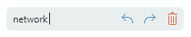
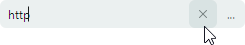
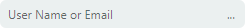

# ButtonEditor

`ButtonEditor` — это текстовый редактор, который может отображать несколько встроенных обычных кнопок и кнопок-переключателей. 



Основные возможности контрола включают:

- Обычные кнопки и кнопки-переключатели.
- Отображение текста и изображений на кнопках.
- Выравнивание кнопок по правому и левому краям.
- Всплывающие подсказки.
- Предопределённая кнопка «x» для очистки значения редактора.
- Водяные знаки.

## Встроенные кнопки

Чтобы добавить встроенную кнопку, добавьте объект `ButtonSettings` в коллекцию `ButtonEditor.Buttons`. Объект `ButtonSettings` содержит параметры отображения и поведения кнопки.

### Основные свойства и события

- `ButtonKind` — задаёт, является ли кнопка обычной или кнопкой-переключателем.
- `Content` — текст кнопки или пользовательские данные. Используйте свойство `ContentTemplate`, чтобы задать шаблон для отрисовки пользовательских данных.
- `Glyph` — изображение кнопки.
- `GlyphSize` — размер изображения кнопки.
- `IsLeft` — задаёт, выравнивается ли кнопка по левому или правому (по умолчанию) краю поля ввода.
- `Click` — событие, позволяющее реагировать на щелчки по кнопке.
- `Command` — задаёт команду, вызываемую при щелчке по кнопке.
- `CommandParameter` — задаёт параметр команды.
- `IsChecked` — возвращает или задаёт, нажата ли кнопка-переключатель.


### Пример - как добавить обычные кнопки и кнопки-переключатели

Следующий пример определяет контрол `ButtonEditor` с двумя кнопками:

- Обычная кнопка, связанная с командой _ResetValue_, которая устанавливает значение редактора в «0».
- Кнопка-флажок, которая переключает настройку `IsTextEditable` родительского редактора. Редактирование текста отключено, когда кнопка нажата.

Предполагается, что проект содержит изображения «_dot.svg_», «_locked.svg_» и «_unlocked.svg_» в папке «_Images_». Обычная кнопка отображает изображение «_dot.svg_». Кнопка-флажок отображает изображение «_locked.svg_» или «_unlocked.svg_» в зависимости от состояния нажатия.

``` xml
xmlns:mxe="https://schemas.eremexcontrols.net/avalonia/editors"
xmlns:local="clr-namespace:EditorsSample"

<Window.DataContext>
    <local:MainViewModel/>
</Window.DataContext>

<mxe:ButtonEditor Name="btnEditor1" 
                  EditorValue="{Binding Quantity, Mode=TwoWay}"
                  IsTextEditable="True">
    <mxe:ButtonEditor.Buttons>
        <mxe:ButtonSettings ButtonKind="Simple"
                            Glyph="{SvgImage 'avares://EditorsSample/Images/dot.svg'}"
                            Command="{Binding ResetValueCommand}"
                            CommandParameter="{Binding #btnEditor1}"
                            ToolTip.Tip = "Reset value"
                            >
        </mxe:ButtonSettings>
        <mxe:ButtonSettings ButtonKind="Toggle"
                            Glyph="{Binding $self.IsChecked, 
                             Converter={local:LockedStateToSvgNameConverter}}"
                            IsChecked="{Binding !$parent.IsTextEditable}"
                            ToolTip.Tip = "Toggle text editing mode"
                >
        </mxe:ButtonSettings>
    </mxe:ButtonEditor.Buttons>
</mxe:ButtonEditor>
```

```csharp
using Eremex.AvaloniaUI.Controls.Utils;

namespace EditorsSample;

[ObservableObject]
public partial class MainViewModel
{
    [ObservableProperty]
    decimal quantity = 0;

    // Sets the editor's value to '0'.
    [RelayCommand]
    void ResetValue(TextEditor editor)
    {
        // You can access the current editor from the command parameter, 
        // and change its value.
        editor.EditorValue = 0;
    }
}

public class LockedStateToSvgNameConverter : MarkupExtension, IValueConverter
{
    public object? Convert(object? value, Type targetType, object? parameter, CultureInfo culture)
    {
        if (value == null)
            return null;
        bool isLocked = (bool)value;
        string lockedState = isLocked ? "locked" : "unlocked";
        if (isLocked)
            lockedState = "locked";
        return ImageLoader.LoadSvgImage(Assembly.GetExecutingAssembly(), $"Images/{lockedState}.svg");
    }

    public object? ConvertBack(object? value, Type targetType, object? parameter, CultureInfo culture)
    {
        throw new NotImplementedException();
    }

    public override object ProvideValue(IServiceProvider serviceProvider)
    {
        return this;
    }
}
```

<!--TODO ## Provide Custom Template to Render Buttons

### Example - How to display an Image and Text in a Button

 -->

## Кнопка очистки значения («x»)

Установите свойство `ButtonEditor.NullValueButtonPosition` в `ComponentPlacement.EditorBox`, чтобы включить встроенную кнопку «x», позволяющую пользователю установить текущее значение в null. 



## Водяной знак

Как и все потомки `TextEditor`, контрол `ButtonEditor` поддерживает водяной знак (серую подсказку, отображаемую, когда значение редактора пусто или равно null). 



Используйте унаследованное свойство `TextEditor.Watermark`, чтобы задать водяной знак.

``` xml
xmlns:mxe="https://schemas.eremexcontrols.net/avalonia/editors"

<mxe:ButtonEditor Name="buttonEditor1" Watermark="User Name or Email" Margin="5">
    ...
</mxe:ButtonEditor>
```


<br>
<br>

<sup>*</sup> Эта страница переведена с использованием технологий машинного перевода.
