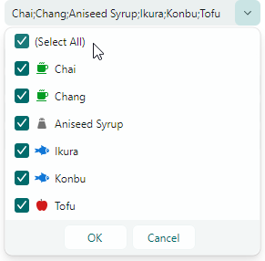
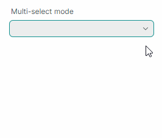
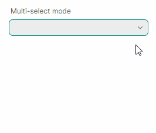

# ComboBoxEditor

Контрол `ComboBoxEditor` — это контрол, отображающий список элементов в своём выпадающем окне. Пользователь может выбирать один или несколько элементов одновременно в соответствии с режимом выбора контрола.


Основные возможности контрола включают:

- Отображение значений из списка строк, списка бизнес-объектов или типа перечисления.
- Режимы одиночного и множественного выбора элементов.
- Функция автозавершения.
- Редактирование текста в поле ввода в режиме одиночного выбора элемента.
- Шаблоны элементов позволяют отрисовывать элементы произвольным образом.
- Использование контрола как встроенного редактора в контейнерных контролах (например, TreeList, TreeView и PropertyGrid).

## Источник объектов

Используйте свойство `ComboBoxEditor.ItemsSource`, чтобы задать список элементов для отображения в выпадающем списке. Вы можете привязать редактор к списку строк, списку бизнес-объектов или типу перечисления.

## Привязка к списку строк

Простейший источник элементов — список строк.

Пользователь может выбрать одно или несколько значений в соответствии с текущим режимом выбора (см. ниже).
Если в поле ввода включено редактирование текста (см. `IsTextEditable`), пользователь может ввести текст, не совпадающий ни с одним элементом в выпадающем списке.

### Пример - как привязать к списку строк
Следующий пример заполняет `ComboBoxEditor` списком строк.

``` xml
xmlns:mxe="https://schemas.eremexcontrols.net/avalonia/editors"
xmlns:sys="clr-namespace:System;assembly=mscorlib"
xmlns:local="clr-namespace:ComboBoxTestSample"

<mxe:ComboBoxEditor x:Name="myComboBox1">
    <mxe:ComboBoxEditor.ItemsSource>
        <local:MyItemList>
            <sys:String>Moscow</sys:String>
            <sys:String>Kazan</sys:String>
            <sys:String>Tver</sys:String>
        </local:MyItemList>
    </mxe:ComboBoxEditor.ItemsSource>
</mxe:ComboBoxEditor>
```
``` csharp
public class MyItemList : List<string>
{
}
```

## Привязка к списку бизнес-объектов

Вы можете привязать `ComboBoxEditor` к списку бизнес-объектов. В этом случае поведение контрола по умолчанию следующее:

- Метод `ToString` бизнес-объекта задаёт текстовое представление элементов по умолчанию.
- Когда вы выбираете элемент, значение редактора (`ComboBoxEditor.EditorValue`) устанавливается в соответствующий бизнес-объект.

Типичный бизнес-объект имеет несколько свойств. Вы можете задать, какие свойства бизнес-объекта предоставляют отображаемый текст элемента и значения редактирования. Используйте для этого следующие члены API:

- `ComboBoxEditor.DisplayMember` — возвращает или задаёт имя свойства бизнес-объекта, задающего отображаемый текст элемента. 
- `ComboBoxEditor.ValueMember` — возвращает или задаёт имя свойства бизнес-объекта, задающего значения элементов. Когда вы выбираете элемент, значение редактора (`ComboBoxEditor.EditorValue`) устанавливается в значение свойства `ValueMember` элемента. 

### Пример - как привязать к списку бизнес-объектов

Следующий пример привязывает `ComboBoxEditor` к списку бизнес-объектов _Product_. Свойство _Product.ProductName_ задаёт отображаемый текст элемента. Свойство _Product.ProductID_ задаёт значения элементов.

``` xml
xmlns:mxe="https://schemas.eremexcontrols.net/avalonia/editors"
xmlns:local="clr-namespace:ComboBoxTestSample"

<Window.DataContext>
    <local:MainViewModel/>
</Window.DataContext>

<mxe:ComboBoxEditor
    x:Name="myComboBox2"
    ItemsSource="{Binding Products}"
    DisplayMember="ProductName"
    ValueMember="ProductID"
    SelectionMode="Multiple"
/>
```
``` csharp
public MainViewModel()
{
    Products = new ObservableCollection<Product>();
    //...
}

public partial class Product :ObservableObject
{
    public Product(int productID, string productName, string category, int productPrice)
    {
        ProductID = productID;
        ProductName = productName;
        Category = category;
        ProductPrice = productPrice;
    }

    [ObservableProperty]
    public int productID;

    [ObservableProperty]
    public string productName;

    [ObservableProperty]
    public string category;

    [ObservableProperty]
    public decimal productPrice;
}
```

## Привязка к перечислению

ComboBoxEditor может отображать значения типа перечисления в выпадающем списке. 

Вспомогательный класс `Eremex.AvaloniaUI.Controls.Common.EnumItemsSource` облегчает привязку к перечислению. Его основные возможности:

- Изображения для членов перечисления в выпадающем списке. Примените атрибут `Eremex.AvaloniaUI.Controls.Common.ImageAttribute` к целевым членам перечисления, чтобы задать изображения.
- Пользовательские отображаемые имена для членов перечисления. Используйте атрибут `System.ComponentModel.DataAnnotations.DisplayAttribute` или пользовательский конвертер, чтобы изменить отображаемый текст элемента по умолчанию.
- Всплывающие подсказки для элементов выпадающего списка. Всплывающая подсказка содержит описание целевого элемента, которое вы можете предоставить с помощью атрибута `System.ComponentModel.DataAnnotations.DisplayAttribute` или пользовательского конвертера.

Используйте следующие свойства `EnumItemsSource`, чтобы настроить привязку к типу перечисления:

- `EnumItemsSource.EnumType` — задаёт тип перечисления, значения которого отображаются в ComboBoxEditor.
- `EnumItemsSource.ShowImages` — задаёт, отображать ли изображения для членов перечисления в выпадающем списке. Вы можете предоставить изображения с помощью атрибута `Eremex.AvaloniaUI.Controls.Common.ImageAttribute`.
- `EnumItemsSource.ShowNames` — задаёт, отображать ли текст элемента. Установите `ShowNames` в `false`, а `ShowImages` в `true`, чтобы отрисовывать члены перечисления с помощью изображений без текста.
- `EnumItemsSource.ImageSize` — задаёт размер отображения изображений, назначенных членам перечисления.
- `EnumItemsSource.NameToDisplayTextConverter` — позволяет назначить конвертер, который получает пользовательский отображаемый текст для членов перечисления.
- `EnumItemsSource.NameToDescriptionConverter` — позволяет назначить конвертер, который получает описания членов перечисления, отображаемые как всплывающие подсказки при наведении курсора на элементы выпадающего списка.

### Пример - как отобразить значения перечисления и использовать атрибуты для предоставления отображаемого текста и изображений для членов перечисления.

Следующий пример отображает значения перечисления _ProductCategoryEnum_ в ComboBoxEditor. Он использует класс `EnumItemsSource` для привязки данных.

Атрибуты `System.ComponentModel.DataAnnotations.DisplayAttribute` и `Eremex.AvaloniaUI.Controls.Common.ImageAttribute` задают пользовательский отображаемый текст, описания (всплывающие подсказки) и изображения для членов перечисления.

``` xml
xmlns:mx="https://schemas.eremexcontrols.net/avalonia"
xmlns:mxe="https://schemas.eremexcontrols.net/avalonia/editors"

<mxe:ComboBoxEditor Name="comboBoxEditorEnum"
 ItemsSource="{mx:EnumItemsSource 
  EnumType=local:ProductCategoryEnum, ImageSize='16, 16', 
  ShowImages=True, ShowNames=True}"
 IsTextEditable="True"
 AutoComplete="True">
</mxe:ComboBoxEditor>
```
``` csharp
using Eremex.AvaloniaUI.Controls.Common;
using System.ComponentModel.DataAnnotations;

public enum ProductCategoryEnum
{
    // The images assigned to the enumeration values below are placed 
    // in the ComboBoxTestSample/Images folder.
    // They have their "Build Action" properties set to "AvaloniaResource".
    [Image($"avares://ComboBoxTestSample/Images/Products/DairyProducts.svg")]
    [Display(Name = "Dairy Products", Description = "Products made from milk")]
    DairyProducts,

    [Image($"avares://ComboBoxTestSample/Images/Products/Beverages.svg")]
    [Display(Description = "Edible drinks")]
    Beverages,

    [Image($"avares://ComboBoxTestSample/Images/Products/Condiments.svg")]
    [Display(Description = "Flavor Enhancers")]
    Condiments,

    [Image($"avares://ComboBoxTestSample/Images/Products/Confections.svg")]
    [Display(Description = "Sweets")]
    Confections
}
```

### Пример - как отобразить значения перечисления и использовать пользовательские конвертеры для предоставления отображаемого текста для членов перечисления.

Следующий пример использует класс `EnumItemsSource`, чтобы отобразить значения типа перечисления в ComboBoxEditor. Объекты `EnumItemsSource.NameToDisplayTextConverter` и `EnumItemsSource.NameToDescriptionConverter` предоставляют пользовательский отображаемый текст и описания (всплывающие подсказки) для членов перечисления.

``` xml
xmlns:mxe="https://schemas.eremexcontrols.net/avalonia/editors"
xmlns:mx="https://schemas.eremexcontrols.net/avalonia"
xmlns:local="clr-namespace:ComboBoxTestSample"

<mxe:ComboBoxEditor Name="comboBoxEditorEnumWithConverters"
 ItemsSource="{mx:EnumItemsSource EnumType=local:ProductCategoryEnum, 
  ImageSize='16, 16', ShowImages=True, ShowNames=True, 
  NameToDisplayTextConverter={local:EnumMemberNameToDisplayTextConverter}, 
  NameToDescriptionConverter={local:EnumMemberNameToDescriptionConverter}}"
 IsTextEditable="True"
 AutoComplete="True">
</mxe:ComboBoxEditor>
```

``` csharp
using Eremex.AvaloniaUI.Controls.Common;

public enum ProductCategoryEnum
{
    // The images assigned to the enumeration values below are placed 
    // in the ComboBoxTestSample/Images folder.
    // They have their "Build Action" properties set to "AvaloniaResource".
    [Image($"avares://ComboBoxTestSample/Images/Products/DairyProducts.svg")]
    DairyProducts,

    [Image($"avares://ComboBoxTestSample/Images/Products/Beverages.svg")]
    Beverages,

    [Image($"avares://ComboBoxTestSample/Images/Products/Condiments.svg")]
    Condiments,

    [Image($"avares://ComboBoxTestSample/Images/Products/Confections.svg")]
    Confections
}

public class EnumMemberNameToDisplayTextConverter : BaseEnumConverter
{
    protected override void PopulateDictionary()
    {
        TextValueDictionary.Add("ProductCategoryEnum_DairyProducts", "Dairy");
    }
}
public class EnumMemberNameToDescriptionConverter : BaseEnumConverter
{
    protected override void PopulateDictionary()
    {
        TextValueDictionary.Add("ProductCategoryEnum_DairyProducts", "Milk Products");
    }
}

public abstract class BaseEnumConverter : MarkupExtension, IValueConverter
{
    protected Dictionary<string, string> TextValueDictionary;

    public BaseEnumConverter()
    {
        TextValueDictionary = new Dictionary<string, string>();
        PopulateDictionary();
    }

    protected abstract void PopulateDictionary();

    public override object ProvideValue(IServiceProvider serviceProvider)
    {
        return this;
    }
    public object? Convert(object? value, Type targetType, object? parameter, 
     System.Globalization.CultureInfo culture)
    {
        var type = value?.GetType();
        var memberName = value?.ToString();
        if (type == null || !type.IsEnum || string.IsNullOrEmpty(memberName))
            return null;
        return EnumMemberToString(type.Name, memberName);
    }
        
    protected virtual string EnumMemberToString(string enumName, string enumMemberName)
    {
        string fullMemberName = enumName + "_" + enumMemberName;
        if (TextValueDictionary.ContainsKey(fullMemberName))
            return TextValueDictionary[fullMemberName];
        else 
            return enumMemberName;
    }
        
    public object? ConvertBack(object? value, Type targetType, object? parameter, 
     System.Globalization.CultureInfo culture)
    {
        return null;
    }
}
```

## Режим выбора элемента

Свойство `SelectionMode` позволяет выбирать между режимами одиночного и множественного выбора элементов. 

Режим одиночного выбора используется по умолчанию. Если редактирование текста включено (см. `IsTextEditable`), можно задать значение редактирования (или текст в поле ввода), не совпадающее ни с одним элементом в выпадающем списке.

Установите свойство `SelectionMode` в `ItemSelectionMode.Multiple`, чтобы включить множественный выбор элементов. В режиме множественного выбора редактор отображает флажки перед каждым элементом в выпадающем списке. Пользователь может переключать эти флажки, чтобы добавлять элементы в выбор и удалять их из него.
Редактирование текста в поле ввода отключено в режиме множественного выбора.

### Получение и установка выбранного элемента(ов)

Свойство `SelectedItem` позволяет выбирать и получать выбранный элемент в режиме одиночного выбора. Свойство возвращает значение `null`, если ни один элемент не выбран.

Свойство `SelectedItems` задаёт список (объект `IList`), содержащий выбранные элементы в режиме множественного выбора. Свойство возвращает пустой список, если ни один элемент не выбран.

!!! note

    Свойства `SelectedItem` и `SelectedItems` синхронизированы способом, описанным ниже.

    В режиме одиночного выбора свойство `SelectedItems` задаёт список, содержащий один элемент — выбранный элемент (значение свойства `SelectedItem`). Свойство возвращает пустой список, если ни один элемент не выбран.

    В режиме множественного выбора свойство `SelectedItem` задаёт первый выбранный элемент (первый элемент списка `SelectedItems`). Свойство возвращает значение `null`, если ни один элемент не выбран.

### Пример - как выбрать элементы

Следующий код выбирает элементы в ComboBoxEditor, работающих в режимах одиночного и множественного выбора.

``` csharp
// Select an item in single selection mode
var itemSource1 = myComboBox1.ItemsSource as MyItemList;
if(itemSource1 != null) 
    myComboBox1.SelectedItem = itemSource1[0];

// Select items in multi-select mode
var itemSource2 = myComboBox2.ItemsSource as ObservableCollection<Product>;
if (itemSource2 != null)
    myComboBox2.SelectedItems = new List<Product>() 
     { itemSource2[0], itemSource2[1] };

```

### Элемент '(Select All)' в режиме множественного выбора
В режиме множественного выбора редактор отображает предопределённый флажок _(Select All)_ в верхней части выпадающего списка. Этот флажок позволяет пользователю выбрать/снять выбор со всех элементов. Чтобы скрыть флажок _(Select All)_, установите свойство `ComboBoxEditor.ShowPredefinedSelectItem` в `false`.



**Связанный API**
- `SelectAllItemText` — позволяет задать пользовательский отображаемый текст для элемента '(Select All)'.

### Элемент '_(None)_' в режиме одиночного выбора

В режиме одиночного выбора вы можете установить свойство `ComboBoxEditor.ShowPredefinedSelectItem` в `true`, чтобы отобразить предопределённый элемент _(None)_ в выпадающем списке. Элемент _(None)_ устанавливает значение редактора в `null` и тем самым очищает выбор.


**Связанный API**
- `ClearValueItemText` — позволяет задать пользовательский отображаемый текст для элемента '(None)'.

## Значение редактора

Когда пользователь вводит текст, выбирает элемент в поле ввода с помощью функции автозавершения или выбирает элемент в выпадающем списке, редактор изменяет своё значение редактирования (значение свойства `EditorValue`). 

Обычно значение редактирования совпадает со значением свойства `SelectedItem` (в режиме одиночного выбора) или свойства `SelectedItems` (в режиме множественного выбора), за исключениями, описанными в этом разделе.

Значение редактирования зависит от режима выбора элемента. В режиме одиночного выбора значение редактирования — это одно значение, тогда как в режиме множественного выбора значение редактирования — это объект `IList`, задающий список значений.

Свойства `EditorValue` и `SelectedItem/SelectedItems` не синхронизированы в следующих случаях: 

- ComboBoxEditor привязан к списку строк, и текст, заданный в поле ввода, не совпадает ни с одним элементом в выпадающем списке. В этом случае свойство `SelectedItem` возвращает `null`, тогда как свойство `EditorValue` задаёт текст, отображаемый в поле ввода.

    !!! tip
    
        Включите опцию `ComboBoxEditor.IsTextEditable`, чтобы позволить пользователю редактировать текст в поле ввода.
  
    ### Пример - как задать значение редактора, когда ComboBox привязан к списку строк

    Следующий пример задаёт значение редактирования для ComboBoxEditor, привязанного к списку строк.

    ``` xml
    xmlns:mxe="https://schemas.eremexcontrols.net/avalonia/editors"
    xmlns:sys="clr-namespace:System;assembly=mscorlib"
    xmlns:local="clr-namespace:ComboBoxTestSample"

    <mxe:ComboBoxEditor x:Name="myComboBox1">
        <mxe:ComboBoxEditor.ItemsSource>
            <local:MyItemList>
                <sys:String>Moscow</sys:String>
                <sys:String>Kazan</sys:String>
                <sys:String>Tver</sys:String>
            </local:MyItemList>
        </mxe:ComboBoxEditor.ItemsSource>
    </mxe:ComboBoxEditor>
    ```

    ``` csharp
    myComboBox1.EditorValue = "Moscow";
    //The SelectedItem property will return "Moscow" as well.

    myComboBox1.EditorValue = "Rostov";
    //The SelectedItem property will return `null`, 
    //since the edit value does not match any item in the bound list.

    //...
    public class MyItemList : List<string>
    {
    }
    ```

- ComboBoxEditor привязан к списку бизнес-объектов, и задано свойство `ValueMember`. Свойство `ValueMember` задаёт имя свойства бизнес-объекта, предоставляющего значения элементов. Когда вы выбираете элемент(ы), свойство `SelectedItem/SelectedItems` содержит выбранный объект(ы), тогда как свойство `EditorValue` задаёт значение (значения) выбранных объектов.

    ### Пример - как выбрать элемент, когда ComboBoxEditor привязан к списку бизнес-объектов

    В следующем примере ComboBoxEditor привязан к списку объектов _Product_ в режиме множественного выбора. Свойство `ValueMember` ссылается на член _Product.ProductID_.
    Таким образом, идентификаторы продуктов служат значениями элементов. Когда пользователь выбирает элементы, свойство `EditorValue` устанавливается в список, содержащий соответствующие идентификаторы продуктов. Пример использует свойство `EditorValue`, чтобы выбрать элементы в коде.

    ``` xml
    xmlns:mxe="https://schemas.eremexcontrols.net/avalonia/editors"
    xmlns:sys="clr-namespace:System;assembly=mscorlib"
    xmlns:local="clr-namespace:ComboBoxTestSample"

    <mxe:ComboBoxEditor
        x:Name="myComboBox2"
        ItemsSource="{Binding Products}"
        DisplayMember="ProductName"
        ValueMember="ProductID"
        SelectionMode="Multiple"
    />
    ```
    ``` csharp
    // Select items by their product IDs:
    var itemSource2 = myComboBox2.ItemsSource as ObservableCollection<Product>;
    if(itemSource2 != null) 
        myComboBox2.EditorValue = new List<int>() 
        { itemSource2[3].ProductID, itemSource2[5].ProductID };
    //The SelectedItems property will return a list that contains 
    //two Product objects (itemSource2[3] and itemSource2[5]).

    //...
    public partial class Product :ObservableObject
    {
        public Product(int productID, string productName, string category, int productPrice)
        {
            ProductID = productID;
            ProductName = productName;
            Category = category;
            ProductPrice = productPrice;
        }

        [ObservableProperty]
        public int productID;

        [ObservableProperty]
        public string productName;

        [ObservableProperty]
        public string category;

        [ObservableProperty]
        public decimal productPrice;
    }
    ```

## Немедленное обновление значения редактора в режиме множественного выбора

Поведение редактора по умолчанию — отображать кнопки OK и Cancel в выпадающем списке в режиме множественного выбора. Эти кнопки позволяют пользователям подтвердить или отменить свой выбор элементов.
В этом режиме значение редактора обновляется только после того, как пользователь нажмёт кнопку OK.



ComboBoxEditor может обновлять своё значение немедленно по мере того, как пользователь отмечает или снимает отметки с элементов в выпадающем списке. Чтобы активировать этот режим, скройте кнопки OK и Cancel, установив свойство `PopupFooterButtons` в `None`.

``` xml
<mxe:ComboBoxEditor x:Name="MultiSelectComboBox" 
    SelectionMode="Multiple"
    PopupFooterButtons="None"/>
```




## Шаблоны элементов

ComboBoxEditor по умолчанию отрисовывает каждый элемент в выпадающем списке с помощью отображаемого текста элемента. Отображаемый текст элемента по умолчанию задаётся методом `ToString` элементов. Когда редактор привязан к списку бизнес-объектов, вы можете использовать свойство `DisplayMember`, чтобы задать свойство, предоставляющее отображаемый текст элемента.

Вы можете использовать свойство `ItemTemplate`, чтобы назначить шаблон данных, представляющий элементы в выпадающем списке произвольным образом. Например, шаблон данных помогает отображать изображения для элементов, как показано в примере ниже.

Включите опцию `ComboBoxEditor.ApplyItemTemplateToEditBox`, чтобы применить заданный шаблон элемента (свойство `ItemTemplate`) к полю ввода. Это свойство не действует, если включено редактирование текста (опция `IsTextEditable` установлена в `true`).

### Пример - как отобразить изображения для элементов ComboBox с помощью DataTemplate

Следующий пример использует свойство `ItemTemplate`, чтобы задать шаблон данных, отображающий изображения для элементов ComboBox в выпадающем списке.

ComboBoxEditor привязан к списку, хранящему объекты _Product_. Объект _Product_ содержит свойство _Category_, задающее категорию продукта (Beverages, Condiments, Seafood или Produce).

Предполагается, что проект хранит SVG-изображения для категорий продуктов в папке "_ComboBoxTestSample/Images/Products_". Изображения имеют следующие имена: "_Beverages.svg_", "_Condiments.svg_", "_Seafood.svg_" и "_Produce.svg_", и они помечены флагом "_AvaloniaResource_".

Созданный шаблон данных элемента отображает название продукта и изображение, соответствующее категории продукта.

``` xml
xmlns:mxe="https://schemas.eremexcontrols.net/avalonia/editors"
xmlns:sys="clr-namespace:System;assembly=mscorlib"
xmlns:local="clr-namespace:ComboBoxTestSample"

<Window.DataContext>
    <local:MainViewModel/>
</Window.DataContext>
<Window.Resources>
    <local:NameToSvgConverter x:Key="NameToSvgConverter"/>
    <DataTemplate x:Key="ProductItemTemplate">
        <Grid>
            <Grid.ColumnDefinitions>
                <ColumnDefinition Width="Auto"/>
                <ColumnDefinition Width="*"/>
            </Grid.ColumnDefinitions>
            <Image Width="16" Height="16" Source="{Binding Path=Category, 
             Converter={StaticResource NameToSvgConverter}}"/>
            <TextBlock VerticalAlignment="Center" Grid.Column="1" Margin="6,0,0,0" 
             Text="{Binding Path=ProductName}"/>
        </Grid>
    </DataTemplate>
</Window.Resources>

<mxe:ComboBoxEditor
    x:Name="myComboBox2"
    ItemsSource="{Binding Products}"
    DisplayMember="ProductName"
    ValueMember="ProductID"
    SelectionMode="Multiple"
    ItemTemplate="{StaticResource ProductItemTemplate}"
/>
```

```csharp
using Avalonia.Svg.Skia;
using Eremex.AvaloniaUI.Controls.Utils;

public partial class MainViewModel : ViewModelBase
{
    [ObservableProperty]
    public ObservableCollection<Product> products;

    public MainViewModel()
    {
        Products = new ObservableCollection<Product>();
        Products.Add(new Product(0, "Chai", "Beverages", 200));
        Products.Add(new Product(1, "Chang", "Beverages", 100));
        Products.Add(new Product(2, "Aniseed Syrup", "Condiments", 150));
        Products.Add(new Product(3, "Ikura", "Seafood", 500));
        Products.Add(new Product(4, "Konbu", "Seafood", 390));
        Products.Add(new Product(5, "Tofu", "Produce", 430));
    }
}

public partial class Product :ObservableObject
{
    public Product(int productID, string productName, string category, int productPrice)
    {
        ProductID = productID;
        ProductName = productName;
        Category = category;
        ProductPrice = productPrice;
    }

    [ObservableProperty]
    public int productID;

    [ObservableProperty]
    public string productName;

    [ObservableProperty]
    public string category;

    [ObservableProperty]
    public decimal productPrice;
}

public class NameToSvgConverter : MarkupExtension, IValueConverter
{
    public object? Convert(object? value, Type targetType, object? parameter, 
     CultureInfo culture)
    {
        if(value == null) 
            return null;
        string name = value.ToString();

        return ImageLoader.LoadSvgImage(Assembly.GetExecutingAssembly(), $"Images/Products/{name}.svg");
    }

    public object? ConvertBack(object? value, Type targetType, object? parameter, 
     CultureInfo culture)
    {
        throw new NotImplementedException();
    }

    public override object ProvideValue(IServiceProvider serviceProvider)
    {
        return this;
    }
}
```

## Добавление пользовательских кнопок

ComboBoxEditor является потомком контрола ButtonEditor. Таким образом, вы можете добавлять пользовательские кнопки в поле ввода рядом со стандартной кнопкой выпадающего списка. Используйте коллекцию `ComboBoxEditor.Buttons`, чтобы добавлять пользовательские кнопки.

### Пример - как добавить пользовательские кнопки

Следующий пример добавляет обычную кнопку и кнопку-флажок в ComboBoxEditor. Редактор привязан к перечислению _ProductCategoryEnum_ с помощью вспомогательного класса `EnumItemsSource`.

Первая кнопка обычная (её свойство `ButtonKind` установлено в `Simple`). Щелчок по этой кнопке вызывает команду _ResetValue_, которая устанавливает значение редактора в значение по умолчанию (первый элемент привязанного типа перечисления).

Вторая кнопка — кнопка-флажок (её свойство `ButtonKind` установлено в `Toggle`). Щелчок по этой кнопке переключает значение свойства `IsTextEditable` редактора. Конвертер _LockedStateToSvgNameConverter_ назначает изображение "_locked.svg_" или "_unlocked.svg_" глифу кнопки в соответствии с состоянием нажатия кнопки. Эти изображения хранятся в папке _ComboBoxTestSample/Images_ и помечены флагом "_AvaloniaResource_".

``` xml
xmlns:mxe="https://schemas.eremexcontrols.net/avalonia/editors"
xmlns:mx="https://schemas.eremexcontrols.net/avalonia"
xmlns:local="clr-namespace:ComboBoxTestSample"

<mxe:ComboBoxEditor Name="comboBoxEditorEnum"
 ItemsSource="{mx:EnumItemsSource EnumType=local:ProductCategoryEnum, 
  ImageSize='16, 16', ShowImages=True, ShowNames=True}"
 IsTextEditable="True"
 AutoComplete="True">
    <mxe:ComboBoxEditor.Buttons>
        <mxe:ButtonSettings ButtonKind="Simple" 
         Glyph="{SvgImage 'avares://ComboBoxTestSample/Images/square_dot_icon.svg'}"
         Command="{Binding ResetValueCommand}" 
         CommandParameter="{Binding #comboBoxEditorEnum}">
        </mxe:ButtonSettings>
        <mxe:ButtonSettings ButtonKind="Toggle" 
         Glyph="{Binding $self.IsChecked, Converter={local:LockedStateToSvgNameConverter}}" 
         IsChecked="{Binding !$parent.IsTextEditable}">
        </mxe:ButtonSettings>
    </mxe:ComboBoxEditor.Buttons>
</mxe:ComboBoxEditor>
```

```csharp
using CommunityToolkit.Mvvm.Input;
using Eremex.AvaloniaUI.Controls.Editors;
using Avalonia.Svg.Skia;
using Eremex.AvaloniaUI.Controls.Utils;

public partial class MainViewModel : ViewModelBase
{
    // Sets the editor's value to the first element.
    [RelayCommand]
    void ResetValue(ComboBoxEditor editor)
    {
        // Get the first item in the ComboBoxEditor's bound list.
        var enumerator = editor.ItemsSource.GetEnumerator();
        enumerator.MoveNext();
        object firstItem = enumerator.Current;
        // When the ComboBoxEditor is bound to an EnumItemsSource, 
        // the editor's items are EnumMemberInfo objects.
        EnumMemberInfo mInfo = firstItem as EnumMemberInfo;
        if (mInfo != null)
            editor.EditorValue = mInfo.Id;
    }
}

public class LockedStateToSvgNameConverter : MarkupExtension, IValueConverter
{
    public object? Convert(object? value, Type targetType, object? parameter, 
    CultureInfo culture)
    {
        if (value == null)
            return null;
        bool isLocked = (bool)value;
        string lockedState = isLocked ? "locked" : "unlocked";

        if (isLocked)
            lockedState = "locked";

        return ImageLoader.LoadSvgImage(Assembly.GetExecutingAssembly(), $"Images/{lockedState}.svg");
    }

    public object? ConvertBack(object? value, Type targetType, object? parameter, 
     CultureInfo culture)
    {
        throw new NotImplementedException();
    }

    public override object ProvideValue(IServiceProvider serviceProvider)
    {
        return this;
    }
}

public enum ProductCategoryEnum
{
    [Image($"avares://ComboBoxTestSample/Images/Products/DairyProducts.svg")]
    [Display(Name = "Dairy Products", Description = "Products made from milk")]
    DairyProducts,

    [Image($"avares://ComboBoxTestSample/Images/Products/Beverages.svg")]
    [Display(Description = "Edible drinks")]
    Beverages,

    [Image($"avares://ComboBoxTestSample/Images/Products/Condiments.svg")]
    [Display(Description = "Flavor Enhancers")]
    Condiments,

    [Image($"avares://ComboBoxTestSample/Images/Products/Confections.svg")]
    [Display(Description = "Sweets")]
    Confections
}
```


## Автозавершение текста 

Установите опцию `AutoComplete` в `true`, чтобы включить автоматическое завершение текста. Эта функция автоматически завершает текст, набранный пользователем, если он совпадает с каким-либо элементом в выпадающем списке.

ComboBoxEditor не поддерживает автозавершение текста в следующих случаях:

- Редактирование текста отключено (свойство `IsTextEditable` установлено в `false`).
- Используется режим множественного выбора элементов (свойство `SelectionMode` установлено в `Multiple`).

## Автофильтр

Если [функция автозавершения](#автозавершение-текста) отключена, ComboBox использует механизм автоматической фильтрации, чтобы фильтровать элементы в выпадающем списке для соответствия тексту, который пользователь набирает в редакторе. 


Свойство `FilterCondition` задаёт оператор фильтра (`StartsWith` или `Contains`), используемый для фильтрации элементов.

Следующий пример применяет к редактору фильтр `Contains`.


``` xml
<mxe:ComboBoxEditor x:Name="comboBox1" FilterCondition="Contains" .../>
```

Вы можете обработать событие `FilterItem`, чтобы выполнять пользовательскую фильтрацию элементов во время автоматической фильтрации. Это событие срабатывает многократно, для каждого элемента в выпадающем списке. Аргументы события позволяют идентифицировать элементы combobox и задавать их видимость.

- `e.Item` — объект, представляющий текущий обрабатываемый элемент.
- `e.SearchText` — текст, набранный пользователем в поле ввода, используемый для автоматической фильтрации элементов.
- `e.IsVisible` — видимость элемента в выпадающем списке.

Следующий обработчик события `FilterItem` выполняет пользовательскую фильтрацию элементов в контроле `ComboBoxEditor` путём поиска в поле _MyBusinessObject.InvoiceID_ элементов combobox.

``` cs
void ComboBox1_FilterItem(object sender, Eremex.AvaloniaUI.Controls.Editors.ComboBoxFilterEventArgs e)
{
    var invID = (e.Item as MyBusinessObject)!.InvoiceID;
    e.IsVisible = invID == null || string.IsNullOrEmpty(e.SearchText) ? 
      false : invID.Contains(e.SearchText!.Substring(0, 3));
}
```

## Предотвращение всплывающих окон в редакторах только для чтения

В режиме «только для чтения» поведение любого всплывающего редактора по умолчанию — позволять пользователям открывать выпадающий список редактора. Однако они не могут изменять значения ни через поле ввода, ни через выпадающий список. Чтобы отключить всплывающие окна для редакторов только для чтения, установите свойство `ShowPopupIfReadOnly` в `false`.

## Предотвращение открытия и закрытия всплывающих окон

Вы можете обработать следующие унаследованные события, чтобы отменить операции открытия и закрытия всплывающего окна:

- `PopupEditor.PopupOpening` — возникает, когда всплывающее окно собирается создаться. 
- `PopupEditor.PopupClosing` — возникает, когда всплывающее окно собирается закрыться. 

Эти события предоставляют параметр `e.Cancel`. Установите его в `true`, чтобы отменить текущую операцию.

## Настройка всплывающего окна при его появлении

Обработайте следующее унаследованное событие, чтобы изменить всплывающее окно или его вложенные контролы:

- `PopupEditor.PopupOpened` — возникает после создания всплывающего окна и непосредственно перед его отображением. Это уведомляющее событие. Оно не позволяет отменить открытие всплывающего окна. Обработайте событие `PopupOpened`, чтобы настроить всплывающее окно или его дочерние контролы.

При обработке события `PopupEditor.PopupOpened` используйте свойство `PopupContent` редактора, чтобы безопасно обратиться к контролу внутри всплывающего окна редактора. Событие `PopupOpened` гарантирует, что контрол всплывающего окна существует, когда вы к нему обращаетесь. Для контрола ComboBoxEditor свойство `PopupContent` возвращает экземпляр класса `ComboBoxPopupControl`. 

## Реакция на закрытие всплывающего окна

Используйте следующее унаследованное событие, чтобы выполнять действия после закрытия всплывающего окна:

- `PopupEditor.PopupClosed` — возникает сразу после закрытия всплывающего окна. Это уведомляющее событие. Оно не позволяет отменить закрытие всплывающего окна.


<br>
<br>

<sup>*</sup> Эта страница переведена с использованием технологий машинного перевода.
