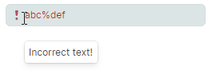
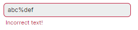

# Валидация данных

Редакторы Eremex поддерживают следующие подходы к валидации данных, которые обеспечивают корректный ввод данных, проверку значений и отображение ошибок для недопустимых данных:

- [Маски](masks/index.md) — позволяют задать шаблон, ограничивающий ввод данных пользователями в текстовых редакторах. 
- Валидация данных на уровне редактора с помощью события `BaseEditor.Validate`.
- Валидация данных на уровне привязанного объекта с помощью атрибутов `DataAnnotation` и интерфейса `INotifyDataErrorInfo`.

<!-- TODO
 and `IDataErrorInfo` interface. -->

В этом разделе подробнее рассматривается валидация данных в редакторах Eremex.

Чтобы узнать о валидации данных в контейнерных контролах, смотрите следующий раздел:

<!--TODO
 - [DataGrid - Data Validation](../datagrid/data-validation.md) -->
- [TreeList - Валидация данных](../treelist/data-validation.md)

## Автоматическая валидация

Редакторы Eremex поддерживают автоматическую валидацию значений, которые вводит пользователь. Автоматическая валидация проверяет значение редактора по [маске](masks/index.md), если она задана. Если редактор привязан к свойству, механизм валидации также делает следующее:

- Проверяет атрибуты валидации `DataAnnotation`, применённые к свойству.
- Проверяет ошибки, созданные с помощью интерфейса `INotifyDataErrorInfo`.
- Проверяет, можно ли преобразовать введённое значение в тип данных привязанного свойства. 


Валидация данных вызывается в следующих случаях:

- Значение редактора обновляется в коде.
- Когда редактор собирается потерять фокус.
- Пользователь вводит любой символ при условии, что свойство `BaseEdit.ValidateOnInput` установлено в `true` (значение по умолчанию).
- Пользователь нажимает клавишу `Enter` при условии, что опция `BaseEdit.ValidateOnInput` установлена в `false`.


<!-- TODO
IsModified property is missing?
Why ValidateOnInput is true by default?
 -->

### Принудительная валидация данных

В определённых случаях вам может потребоваться принудительно вызвать механизм валидации для редактора. Используйте для этого метод `BaseEditor.DoValidate`.

## Валидация данных на уровне редактора

### Событие 'Validate'

Событие `BaseEditor.Validate` позволяет выполнять валидацию данных на уровне редактора в code-behind. Доступны следующие аргументы события:

- `ValidationEventArgs.Value` — возвращает текущее значение.
- `ValidationEventArgs.ErrorContent` — позволяет задать ошибку, если текущее значение недопустимо. Если вы оставите свойство `ErrorContent` установленным в `null`, текущее значение считается допустимым.

#### Пример - проверка того, что введённое значение является допустимым адресом электронной почты

Следующий пример обрабатывает событие `BaseEditor.Validate`, чтобы проверить, что строка, введённая в Text Editor, является допустимым адресом электронной почты. Опция `ValidateOnInput`, установленная в `true`, обеспечивает вызов валидации при каждом нажатии символа.


``` xml
<mxe:TextEditor x:Name="textEditor3" 
                ValidateOnInput="true"
                Validate="textEditorValidate"/>

```
``` csharp
private void textEditorValidate(object sender, Eremex.AvaloniaUI.Controls.Editors.ValidationEventArgs e)
{
    if(e.Value == null || !IsEmailAddress(e.Value.ToString()))
    {
        e.ErrorContent = "Please enter a valid e-mail address";
    }
}

bool IsEmailAddress(string email)
{
    Regex regex = new Regex(@"^([\w\.\-]+)@([\w\-]+)((\.(\w){2,3})+)$");
    Match match = regex.Match(email);
    return match.Success;
}
```

## Валидация данных на уровне привязанного объекта


### Валидация данных с помощью атрибутов DataAnnotation

Вы можете использовать атрибуты валидации `DataAnnotations` (потомки `System.ComponentModel.DataAnnotations.ValidationAttribute`), чтобы создать правило валидации для свойства бизнес-объекта. При привязке к этому свойству редактор Eremex автоматически проверяет правило допустимости данных, заданное этим атрибутом.

Список ниже показывает наиболее распространённые атрибуты валидации:

- [`CompareAttribute`](https://learn.microsoft.com/en-us/dotnet/api/system.componentmodel.dataannotations.compareattribute?view=net-7.0) — предоставляет атрибут, сравнивающий два свойства.
- [`CustomValidationAttribute`](https://learn.microsoft.com/en-us/dotnet/api/system.componentmodel.dataannotations.customvalidationattribute?view=net-7.0) — задаёт пользовательский метод валидации, используемый для проверки свойства или экземпляра класса.
- [`MaxLengthAttribute`](https://learn.microsoft.com/en-us/dotnet/api/system.componentmodel.dataannotations.maxlengthattribute?view=net-8.0) — задаёт максимальную длину массива или строковых данных, допустимую в свойстве.
- [`MinLengthAttribute`](https://learn.microsoft.com/en-us/dotnet/api/system.componentmodel.dataannotations.minlengthattribute?view=net-8.0) — задаёт минимальную длину массива или строковых данных, допустимую в свойстве.
- [`RangeAttribute`](https://learn.microsoft.com/en-us/dotnet/api/system.componentmodel.dataannotations.rangeattribute?view=net-8.0) — задаёт числовые ограничения диапазона для значения поля данных.
- [`RegularExpressionAttribute`](https://learn.microsoft.com/en-us/dotnet/api/system.componentmodel.dataannotations.regularexpressionattribute?view=net-8.0) — задаёт, что значение поля данных должно соответствовать заданному регулярному выражению.
- [`RequiredAttribute`](https://learn.microsoft.com/en-us/dotnet/api/system.componentmodel.dataannotations.requiredattribute?view=net-8.0) — задаёт, что значение поля данных обязательно.
- [`StringLengthAttribute`](https://learn.microsoft.com/en-us/dotnet/api/system.componentmodel.dataannotations.stringlengthattribute?view=net-8.0) — задаёт минимальную и максимальную длину символов, допустимую в поле данных.

#### Пример - валидация с помощью 'RangeAttribute'

Следующий пример использует атрибут `RangeAttribute`, чтобы обеспечить, что значение свойства находится в диапазоне от 10 до 100. Редактор отображает ошибку, если значение выходит за этот диапазон.


``` xml
<mxe:TextEditor x:Name="textEditor1" 
    Grid.Row="1" 
    HorizontalContentAlignment="Right" 
    EditorValue="{Binding Capacity}" />
```
``` csharp
public partial class MyViewModel : ObservableObject
{
    [ObservableProperty]
    [property: Range(10, 100, ErrorMessage = "Value for {0} must be between {1} and {2}.")]
    int capacity;
}
```


### Валидация данных с помощью интерфейса 'INotifyDataErrorInfo'

Интерфейс `System.ComponentModel.INotifyDataErrorInfo` позволяет реализовать пользовательские правила валидации на уровне бизнес-объекта. Интерфейс поддерживает синхронную и асинхронную валидацию, несколько ошибок на свойство и межсвойственные ошибки.

#### Пример - реализация интерфейса 'INotifyDataErrorInfo'

Следующий пример привязывает Text Editor к свойству _NickName_, определённому в классе _MainViewModel_. Класс _MainViewModel_ реализует интерфейс `INotifyDataErrorInfo`, определяющий три правила валидации для свойства _NickName_. Text Editor отображает ошибку, если метод `INotifyDataErrorInfo.GetErrors` возвращает ошибку (ошибки) для свойства _NickName_.


``` xml
<mxe:TextEditor x:Name="textEditor2" EditorValue="{Binding NickName}"/>
```
``` csharp
public partial class MainViewModel : ObservableObject, INotifyDataErrorInfo
{
    private Dictionary<string, List<string>> propertyErrors = new Dictionary<string, List<string>>();

    [ObservableProperty]
    public string nickName;

    partial void OnNickNameChanged(string oldValue, string newValue)  => ValidateNickName();

    public bool HasErrors => propertyErrors.Any();

    public event EventHandler<DataErrorsChangedEventArgs> ErrorsChanged;

    public IEnumerable GetErrors(string propertyName)
    {
        if (propertyErrors.ContainsKey(propertyName))
            return propertyErrors[propertyName];
        else
            return null;
    }

    private void RaiseErrorsChanged(string propertyName)
    {
        ErrorsChanged?.Invoke(this, new DataErrorsChangedEventArgs(propertyName));
    }

    private void ValidateNickName()
    {
        ClearErrors(nameof(NickName));

        if (string.IsNullOrEmpty(NickName))
            AddError(nameof(NickName), "Nick Name cannot be empty.");
        if (string.Equals(NickName, "user", StringComparison.OrdinalIgnoreCase))
            AddError(nameof(NickName), "Invalid Nick Name: 'user'");
        if (NickName == null || NickName?.Length <= 5)
            AddError(nameof(NickName), "The string is too short");
    }

    private void AddError(string propertyName, string error)
    {
        if (!propertyErrors.ContainsKey(propertyName))
            propertyErrors[propertyName] = new List<string>();

        if (!propertyErrors[propertyName].Contains(error))
        {
            propertyErrors[propertyName].Add(error);
            RaiseErrorsChanged(propertyName);
        }
    }

    private void ClearErrors(string propertyName)
    {
        if (propertyErrors.ContainsKey(propertyName))
        {
            propertyErrors.Remove(propertyName);
            RaiseErrorsChanged(propertyName);
        }
    }

    public MainViewModel()
    {
        //...
        NickName = "user";
    }
}
```


## Индикация ошибок

Когда во время валидации данных возникает ошибка, редактор индицирует ошибку в соответствии со свойством `BaseEditor.ErrorShowMode`. Поддерживаются два режима отображения ошибок: 

### Показ встроенного значка ошибки и всплывающей подсказки

Если свойство `ErrorShowMode` установлено в `Inplace`, редактор отображает значок ошибки внутри поля ввода. Когда пользователь наводит курсор на значок, появляется всплывающая подсказка с описанием ошибки.



### Показ ошибки под редактором

Установите свойство `ErrorShowMode` в `Full`, чтобы отобразить описание ошибки под полем ввода. Встроенный значок ошибки в этом случае скрыт.




### Установка и очистка текста ошибки

Чтобы задать текст ошибки, вы можете выполнить одно из следующих действий:

- Обработать событие `BaseEditor.Validate` и установить аргумент события `ErrorContent`. Ошибка не применяется, если вы оставите аргумент события `ErrorContent` установленным в `null`.

    Чтобы принудительно инициировать событие `BaseEditor.Validate`, вызовите метод `BaseEditor.DoValidate`.

- Задать ошибку с помощью свойства `BaseEditor.ValidationInfo`.

    Следующий код устанавливает ошибку для редактора, если значение редактора равно `null` или `0`.

    ``` csharp
    if(textEditor2.EditorValue == null || 
       Convert.ToInt32(textEditor2.EditorValue)==0)
    textEditor2.ValidationInfo = new ValidationInfo("Invalid value");

    ```

    Установите свойство `BaseEditor.ValidationInfo` в `null`, чтобы очистить ошибку.


### Получение текста ошибки

Используйте свойство `BaseEditor.ErrorText`, чтобы получить текст ошибки.


<!-- TODO
Tell about the BaseEditor.ValidationInfo property (ValidationInfo.ErrorText, Exception)
 -->

<!-- TODO
Validate Using IDataErrorInfo ?

https://docs.devexpress.com/WPF/7076/controls-and-libraries/data-editors/common-features/input-validation#validate-using-idataerrorinfo
 -->


<br>
<br>

<sup>*</sup> Эта страница переведена с использованием технологий машинного перевода.
