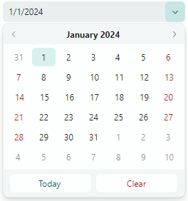
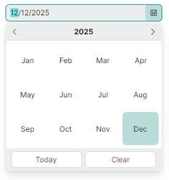

# DateEditor

Контрол `DateEditor` содержит выпадающий календарь, позволяющий пользователям выбирать дату. Редактор поддерживает несколько форматов отображения значения даты в поле ввода.



Выпадающий календарь содержит навигационный заголовок, используемый для перемещения по месяцам и годам. Кнопки Today и Clear помогают пользователям быстро выбрать сегодняшнюю дату и очистить текущее значение соответственно.

Основные возможности контрола включают:

- Выбор даты в выпадающем календаре с помощью мыши.
- Перемещение по месяцам и годам с помощью панели навигации.
- Три представления календаря: представление месяца, представление года и представление диапазона лет.
- Встроенные кнопки Today и Clear.
- Ограничение доступного диапазона дат.
- Множество форматов отображения выбранного значения даты в поле ввода.


## Выбор даты

Пользователь может выбрать дату, открыв выпадающее окно и выбрав дату в появившемся календаре.

Навигационный заголовок выпадающего календаря позволяет пользователю перемещаться по месяцам и годам:


В коде вы можете задать дату или прочитать текущую выбранную дату с помощью свойства `DateEditor.DateTime` или `DateEditor.EditorValue`. Эти свойства синхронизированы. Они различаются типом значения: свойство `DateTime` имеет тип nullable `System.DateTime`, тогда как свойство `EditorValue` имеет тип `object`, как во всех редакторах Eremex.

## Настройка всплывающего календаря

Следующие свойства позволяют настроить календарь `DateEditor`:

- `ShowToday` — возвращает или задаёт, выделять ли сегодняшнюю дату в календаре. 
- `NullValueButtonPosition` — возвращает или задаёт, видима ли кнопка (_'x'_) (очистки значения). 
- `MinValue` — задаёт минимальную допустимую дату. Свойства `MinValue` и `MaxValue` позволяют задать диапазон значений, отображаемых в календаре.
- `MaxValue` — задаёт максимальную допустимую дату.

<!--TODO
`ShowToday` — `HighlightTodayDate`?
`NullValueButtonPosition` — `ShowClearButton`? 
-->

Вы также можете обработать событие `PopupOpened`, чтобы выполнить дополнительные настройки выпадающего календаря. В обработчике события `PopupOpened` к объекту календаря можно обратиться с помощью свойства `DateEditor.PopupContent`. Приведите это свойство к объекту класса `CalendarControl`, чтобы изменить его свойства. См. следующий пример: [Пример - включение представления года при открытии календаря](#пример---включение-представления-года-при-открытии-календаря)


### Пример - как создать DateEditor

Следующий пример определяет DateEditor, задаёт начальное значение и указывает допустимый диапазон дат.

``` xml
xmlns:mxe="https://schemas.eremexcontrols.net/avalonia/editors"

<Window.DataContext>
    <local:MainViewModel/>
</Window.DataContext>

<mxe:DateEditor 
    DateTime="{Binding SelectedDate, Mode=TwoWay}" 
    MinValue="{Binding MinimumDate}" 
    MaxValue="{Binding MaximumDate}" />
```
``` csharp
using CommunityToolkit.Mvvm.ComponentModel;
using System.Collections.ObjectModel;

[ObservableObject]
public partial class MainViewModel
{
    [ObservableProperty]
    DateTime selectedDate = DateTime.Now;
    [ObservableProperty]
    DateTime minimumDate = DateTime.Now.AddDays(-15);
    [ObservableProperty] 
    DateTime maximumDate = DateTime.Now.AddDays(15);
}
```

## Формат отображения значения

Используйте свойство `DisplayFormatString`, чтобы задать формат отображения значения даты/времени, отображаемого в поле ввода.

## Предотвращение всплывающих окон в редакторах только для чтения

В режиме «только для чтения» поведение любого всплывающего редактора по умолчанию — позволять пользователям открывать выпадающий список редактора. Однако они не могут изменять значения ни через поле ввода, ни через выпадающий список. Чтобы отключить всплывающие окна для редакторов только для чтения, установите свойство `ShowPopupIfReadOnly` в `false`.

## Предотвращение открытия и закрытия всплывающих окон

Вы можете обработать следующие унаследованные события, чтобы отменить операции открытия и закрытия всплывающего окна:

- `PopupEditor.PopupOpening` — возникает, когда всплывающее окно собирается создаться. 
- `PopupEditor.PopupClosing` — возникает, когда всплывающее окно собирается закрыться. 

Эти события предоставляют параметр `e.Cancel`. Установите его в `true`, чтобы отменить текущую операцию.

## Настройка всплывающего окна при его появлении

Обработайте следующее унаследованное событие, чтобы изменить всплывающее окно или его вложенные контролы:

- `PopupEditor.PopupOpened` — возникает после создания всплывающего окна и непосредственно перед его отображением. Это уведомляющее событие. Оно не позволяет отменить открытие всплывающего окна. Обработайте событие `PopupOpened`, чтобы настроить всплывающее окно или его дочерние контролы.

При обработке события `PopupEditor.PopupOpened` используйте свойство `PopupContent` редактора, чтобы безопасно обратиться к контролу внутри всплывающего окна редактора. Событие `PopupOpened` гарантирует, что контрол всплывающего окна существует, когда вы к нему обращаетесь. Для контрола DateEditor свойство `PopupContent` возвращает экземпляр класса `CalendarControl`. 

### Пример - включение представления года при открытии календаря

Этот пример показывает, как установить выпадающий календарь DateEditor в представление года при открытии.



Класс `DateEditor` не предоставляет публичного свойства для изменения текущего представления своего календаря. Однако встроенный календарь (объект `CalendarControl`) предоставляет публичное свойство `DisplayMode`. Это свойство задаёт режим представления календаря (`Month`, `Year` или `Decade`).

Этот пример обрабатывает событие `PopupOpened`, чтобы обратиться к встроенному календарю при его создании. Обработчик приводит свойство `DateEditor.PopupContent` к объекту `CalendarControl`, а затем устанавливает свойство `CalendarControl.DisplayMode` в `Year`.

``` cs
using Eremex.AvaloniaUI.Controls.Editors;

dateEditor1.PopupOpened += DateEditor_PopupOpened;

private void DateEditor_PopupOpened(object sender, Avalonia.Interactivity.RoutedEventArgs e)
{
    DateEditor editor = sender as DateEditor;
    (editor.PopupContent as CalendarControl).DisplayMode = CalendarMode.Year;
}
```

## Реакция на закрытие всплывающего окна

Используйте следующее унаследованное событие, чтобы выполнять действия после закрытия всплывающего окна:

- `PopupEditor.PopupClosed` — возникает сразу после закрытия всплывающего окна. Это уведомляющее событие. Оно не позволяет отменить закрытие всплывающего окна.


<br>
<br>

<sup>*</sup> Эта страница переведена с использованием технологий машинного перевода.
