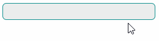

# Как создать текстовое поле для ввода пароля

Этот пример показывает, как маскировать ввод пользователя символом пароля (например, «*») и позволить пользователю показывать и скрывать введённый пароль с помощью кнопки.



Класс `TextEditor` в настоящее время не содержит свойства `PasswordChar`. Однако вы можете включить режим пароля для внутреннего текстового поля (контрола `TextBox`), которое встроено в контрол `TextEditor` и предоставляет функциональность редактирования текста.

Следующий пример создаёт поведение _PasswordBoxBehavior_, которое активирует режим пароля для внутреннего текстового поля редактора (`TextBox`). Класс _PasswordBoxBehavior_ предоставляет свойства `PasswordChar` и `ShowRevealButton`, чтобы задать символ маски пароля и видимость кнопки показа пароля.

Вам нужно добавить NuGet-пакет `Avalonia.Xaml.Behaviors` в ваш проект, чтобы использовать поведения.

``` cs
namespace DemoCenter.Views;

public class PasswordBoxBehavior : Avalonia.Xaml.Interactivity.Behavior<TextEditor>
{
    private const string revealButtonClassName = "revealPasswordButton";
    public char PasswordChar { get; set; } = '*';
    public bool ShowRevealButton { get; set; } = true;

    protected override void OnAttached()
    {
        base.OnAttached();
        if (AssociatedObject != null)
            AssociatedObject.Loaded += OnLoaded;
    }
    private void OnLoaded(object sender, RoutedEventArgs e)
    {
        var realEditor = AssociatedObject.FindVisualChild<TextBox>();
        if (realEditor == null)
            return;
        realEditor.PasswordChar = PasswordChar;
        if (ShowRevealButton)
            realEditor.Classes.Add(revealButtonClassName);
    }

    protected override void OnDetaching()
    {
        base.OnDetaching();
        if (AssociatedObject != null)
            AssociatedObject.Loaded -= OnLoaded;
    }
}
```

Присоедините поведение _PasswordBoxBehavior_ к контролу `TextEditor` в вашем проекте следующим образом:

``` xml
xmlns:view="using:DemoCenter.Views"

<mxe:TextEditor>
    <Interaction.Behaviors>
        <view:PasswordBoxBehavior />
    </Interaction.Behaviors>
</mxe:TextEditor>
```


<br>
<br>

<sup>*</sup> Эта страница переведена с использованием технологий машинного перевода.
