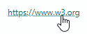

# HyperlinkEditor

Контрол `HyperlinkEditor` отображает гиперссылку, по которой пользователь может щёлкнуть. Редактор не выполняет переход по ссылке при нажатии на неё. Вместо этого он вызывает связанную команду, которую вы можете обработать для обработки щелчков по ссылке.



Текст редактора не редактируется пользователями.

## Отображаемая гиперссылка

Используйте свойство `EditorValue` контрола, чтобы задать отображаемый текст редактора. Редактор подчёркивает текст, имитируя гиперссылку.

Если редактору не назначена команда (см. ниже), щелчок по отображаемой ссылке не имеет эффекта.

## Обработка переходов по гиперссылкам

Назначьте команду свойству `Command` редактора, чтобы обрабатывать щелчки по гиперссылке. Используйте `CommandParameter`, чтобы предоставить команде дополнительные данные.

## Пример

Следующий пример определяет `HyperlinkEditor`, отображающий ссылку на веб-страницу. Щелчок по ссылке вызывает команду _ShowWebPageCommand_. Адрес ссылки для вызова передаётся как параметр команды.

``` xml
xmlns:mxe="https://schemas.eremexcontrols.net/avalonia/editors"

<mxe:HyperlinkEditor EditorValue="https://www.w3.org" Command="{Binding ShowWebPageCommand}" 
                     CommandParameter="https://www.w3.org"/>
```

``` csharp
using CommunityToolkit.Mvvm.ComponentModel;
using System.Diagnostics;

public partial class HyperlinkEditorPageViewModel : ObservableObject
{
    [RelayCommand]
    public void ShowWebPage(string parameter)
    {
        try
        {
            Process.Start(new ProcessStartInfo(parameter) 
            { 
                UseShellExecute = true 
            });
        }
        catch { };
    }
}
```


<br>
<br>

<sup>*</sup> Эта страница переведена с использованием технологий машинного перевода.
