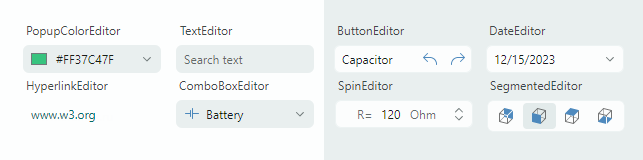
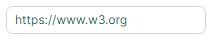
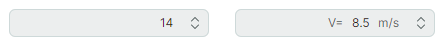
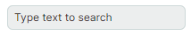

# Редакторы

Библиотека Eremex Controls включает несколько редакторов, предоставляющих продвинутые возможности редактирования данных. Редакторы позволяют отображать и редактировать данные различных типов (числовые, логические, дата-время, перечисления и т. д.). Они поддерживают механизм валидации данных для информирования пользователей об ошибках при вводе данных. 

Вы можете встраивать редакторы данных Eremex в ячейки контейнерных контролов (DataGrid, TreeList, PropertyGrid и ToolbarManager), чтобы представлять и редактировать данные ячеек. Хотя в ячейки можно встроить любой пользовательский контрол, использование редакторов данных Eremex имеет много преимуществ с точки зрения производительности приложения.

 

- [ButtonEditor](buttoneditor.md) — текстовый редактор со встроенными пользовательскими кнопками.

    

    - Обычные кнопки и кнопки-переключатели.
    - Отображение текста и изображений на кнопках.
    - Выравнивание кнопок по левому и правому краям.
    - Всплывающие подсказки.
    - Предопределённая кнопка «x» для очистки значения редактора.
    - Водяные знаки.

 

- [CheckEditor](checkeditor.md) — отображает флажок, который переключается при щелчке.

    

    - Поддерживает два или три состояния нажатия (установленное, сброшенное и неопределённое).
    - Механизм валидации изменяет внешний вид контрола для информирования пользователей об ошибках.

 

- [ComboBoxEditor](comboboxeditor.md) — позволяет пользователю выбрать элемент из списка элементов, отображаемого в связанном всплывающем окне. 

    

   - Поддерживаемые источники элементов: список строк, список бизнес-объектов и тип перечисления.
   - Поддержка шаблонов данных для отрисовки элементов произвольным образом.
   - Режимы одиночного и множественного выбора элементов.
   - Встроенные флажки в режиме множественного выбора.
   - Функция автозавершения текста предсказывает выбор элемента, когда пользователь начинает вводить текст в поле ввода в режиме одиночного выбора.

 

- [DateEditor](dateeditor.md) — редактор со встроенным выпадающим календарём, позволяющий пользователям выбирать дату.

    

    - Встроенные кнопки «Today» и «Clear».
    - Поддержка нескольких форматов отображения даты.
    - Панель навигации в выпадающем календаре позволяет перемещаться по месяцам и годам.
    - Три представления календаря: представление месяца, представление года и представление диапазона лет.
    - Опция ограничения доступного диапазона дат.

 

- [HyperlinkEditor](hyperlinkeditor.md) — отображает кликабельную гиперссылку.

    

    - Позволяет задать команду для обработки щелчков по гиперссылке.

 

- [MemoEditor](memoeditor.md) — выпадающий текстовый редактор.

    
    - Текстовый редактор, встроенный во всплывающее окно.
    - Чтобы указать на наличие текста в выпадающем редакторе, поле ввода может отображать специальный значок или первую строку выпадающего текста. 

 

- [PopupColorEditor](popupcoloreditor.md) — позволяет пользователю выбрать цвет во всплывающем окне.

    

    - Три цветовые палитры — Default, Standard, Custom.
    - Палитру Default можно инициализировать в коде.
    - Палитра Standard отображает предопределённые стандартные цвета.
    - Палитра Custom позволяет пользователям добавлять и изменять цвета с помощью встроенного Color Picker.
    - Возможность задавать цвета в форматах RGB и HSB.
    
 

- `PopupEditor` — базовый класс для редакторов, имеющих выпадающие окна.

<!--TODO Describe PopupEditor
 -->

 

- [SegmentedEditor](segmentededitor.md) — отображает сегменты (элементы), один из которых может выбрать пользователь.

    

    - Горизонтальное расположение сегментов.
    - Пользователь может щёлкнуть по сегменту, чтобы выбрать его и снять выбор с других сегментов.
    - Ctrl+щелчок по выбранному элементу очищает выбор.
    - Поддерживаемые источники элементов: список строк, список бизнес-объектов и тип перечисления.
    - Используйте шаблоны данных для отрисовки элементов произвольным образом.

 

- [SpinEditor](spineditor.md) — позволяет редактировать числовые значения с помощью кнопок прокрутки.

    

    - Встроенные кнопки прокрутки позволяют пользователю увеличивать и уменьшать значение.
    - Ограничение доступного диапазона значений.
    - Пользовательское значение приращения.
    - Отображение пользовательского префикса и суффикса в поле ввода.

 

- [TextEditor](texteditor.md) — текстовый редактор с базовой функциональностью редактирования текста.

    

    - Базовый класс всех текстовых редакторов Eremex.
    - Ввод с маской.
    - Поддержка механизма валидации данных для показа ошибок пользователям.

## Общие функции

- [Маски](masks/index.md)
    - Текстовые редакторы поддерживают ввод с маской, который предотвращает ввод недопустимых значений.
    - Маски можно использовать для форматирования текста ячеек в контейнерных контролах в режиме отображения (когда редактирование текста не активно).
    - Поддерживаемые типы масок: числовые и дата-время.
    - DateEditor по умолчанию использует маску ввода даты-времени.
    - SpinEditor по умолчанию использует числовую маску ввода.

 

- [Валидация данных](data-validation.md)
    - Встроенный механизм валидации значений позволяет показывать ошибки пользователям во всех текстовых редакторах и в CheckEditor.
    - Текстовые редакторы могут отображать ошибки валидации внутри полей ввода или под ними.

 

- [Визуальные темы Eremex](../themes/index.md)
    - Темы определяют внешний вид всех контролов Eremex.
    - Они автоматически применяются к набору стандартных контролов Avalonia UI, обеспечивая единообразный внешний вид с контролами Eremex.
    - Редакторы Eremex поддерживают основной и дополнительный цветовые варианты для каждой темы. Эти цветовые варианты позволяют придать редакторам другой цветовой акцент, изменив одно свойство.

 
 

* Эта страница переведена с использованием технологий машинного перевода.
