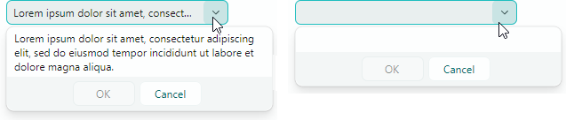

# MemoEditor

`MemoEditor` позволяет пользователям просматривать и редактировать многострочный текст во всплывающем окне. Поле ввода контрола не предоставляет операций редактирования текста.


Основные возможности контрола включают:

- Пользователь может щёлкнуть по полю ввода или по встроенной кнопке выпадающего списка, чтобы открыть выпадающий текстовый редактор.
- Вы можете включить перенос текста в выпадающем редакторе.
- Управление видимостью полос прокрутки во всплывающем окне.
- Поле ввода может отображать специальный значок, когда выпадающий редактор содержит текст. Пустой значок отображается, когда текста нет.
- Поле ввода может отображать предпросмотр выпадающего текста (первую строку текста) вместо специального значка.

## Задание текста и параметров текста

Используйте свойство `MemoEditor.EditorValue`, чтобы получить и задать текст в выпадающем редакторе. Если заданный текст содержит символы _NewLine_, редактор отображает текст на нескольких строках. 

### Перенос текста

Свойство `MemoEditor.TextWrapping` позволяет активировать автоматический перенос текста у правого края редактора. Установите это свойство в значение `Avalonia.Media.TextWrapping.Wrap`, чтобы включить обычный режим переноса текста.

### Приём клавиш _Tab_ и _Enter_ при вводе

Пользователи могут нажимать клавиши _Tab_ и _Enter_, чтобы вставлять символы _Tab_ и _Return_ в текст. Вы можете использовать следующие опции, чтобы изменить это поведение:

- `MemoEditor.MemoAcceptsReturn` — задаёт, принимает ли выпадающий редактор нажатие _Enter_. Если свойство отключено, выпадающий редактор игнорирует клавишу _Enter_.
- `MemoEditor.MemoAcceptsTab` — задаёт, принимает ли выпадающий редактор нажатие _Tab_. Если свойство отключено, фокус перемещается на следующий контрол в порядке табуляции при нажатии клавиши _Tab_.

### Пример - как включить перенос текста в MemoEditor

``` xml
xmlns:mxe="https://schemas.eremexcontrols.net/avalonia/editors"
xmlns:mxtl="https://schemas.eremexcontrols.net/avalonia/treelist"

<mxe:MemoEditor x:Name="memoEditor" Grid.Row="1"  MemoTextWrapping="Wrap"/>
```

## Индикация наличия текста

Поведение контрола по умолчанию — отображать специальный значок для индикации наличия текста:


Отключите свойство `MemoEditor.ShowIcon`, чтобы скрыть значок и отображать первую строку текста в поле ввода:



## Открытие выпадающего редактора

Пользователь может вызвать выпадающий редактор щелчком по полю ввода или по встроенной кнопке выпадающего списка.

Свойство `MemoEditor.IsPopupOpen` позволяет открывать и закрывать выпадающий редактор в коде.

## Задание видимости полос прокрутки

Используйте следующие свойства, чтобы управлять видимостью полос прокрутки:

- `MemoEditor.MemoHorizontalScrollBarVisibility` — возвращает или задаёт значение `Avalonia.Controls.Primitives.ScrollBarVisibility`, задающее видимость горизонтальной полосы прокрутки в выпадающем текстовом редакторе.
- `MemoEditor.MemoVerticalScrollBarVisibility` — возвращает или задаёт значение `Avalonia.Controls.Primitives.ScrollBarVisibility`, задающее видимость вертикальной полосы прокрутки в выпадающем текстовом редакторе.

## Предотвращение всплывающих окон в редакторах только для чтения

В режиме «только для чтения» поведение любого всплывающего редактора по умолчанию — позволять пользователям открывать выпадающий список редактора. Однако они не могут изменять значения ни через поле ввода, ни через выпадающий список. Чтобы отключить всплывающие окна для редакторов только для чтения, установите свойство `ShowPopupIfReadOnly` в `false`.

## Предотвращение открытия и закрытия всплывающих окон

Вы можете обработать следующие унаследованные события, чтобы отменить операции открытия и закрытия всплывающего окна:

- `PopupEditor.PopupOpening` — возникает, когда всплывающее окно собирается создаться. 
- `PopupEditor.PopupClosing` — возникает, когда всплывающее окно собирается закрыться. 

Эти события предоставляют параметр `e.Cancel`. Установите его в `true`, чтобы отменить текущую операцию.

## Настройка всплывающего окна при его появлении

Обработайте следующее унаследованное событие, чтобы изменить всплывающее окно или его вложенные контролы:

- `PopupEditor.PopupOpened` — возникает после создания всплывающего окна и непосредственно перед его отображением. Это уведомляющее событие. Оно не позволяет отменить открытие всплывающего окна. Обработайте событие `PopupOpened`, чтобы настроить всплывающее окно или его дочерние контролы.

При обработке события `PopupEditor.PopupOpened` используйте свойство `PopupContent` редактора, чтобы безопасно обратиться к контролу внутри всплывающего окна редактора. Событие `PopupOpened` гарантирует, что контрол всплывающего окна существует, когда вы к нему обращаетесь. Для контрола MemoEditor свойство `PopupContent` возвращает экземпляр класса `TextBox`. 

### Пример - выделение всего текста при открытии всплывающего окна

Этот пример обрабатывает событие `PopupOpened`, чтобы выделить весь текст внутри всплывающего окна MemoEditor при его появлении. Код обращается к текстовому редактору, встроенному во всплывающее окно, с помощью свойства `PopupContent`, а затем вызывает метод `SelectAll`, чтобы выделить весь его текст.


``` cs
using Eremex.AvaloniaUI.Controls.Editors;

 private void MemoEditor_PopupOpened(object sender, Avalonia.Interactivity.RoutedEventArgs e)
 {
     MemoEditor memoEditor = sender as MemoEditor;
     (memoEditor.PopupContent as TextBox).SelectAll();
 }
```


## Реакция на закрытие всплывающего окна

Используйте следующее унаследованное событие, чтобы выполнять действия после закрытия всплывающего окна:

- `PopupEditor.PopupClosed` — возникает сразу после закрытия всплывающего окна. Это уведомляющее событие. Оно не позволяет отменить закрытие всплывающего окна.


<br>
<br>

<sup>*</sup> Эта страница переведена с использованием технологий машинного перевода.
