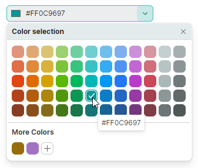
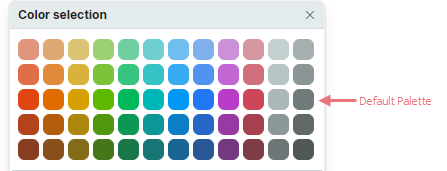
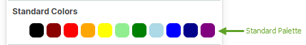
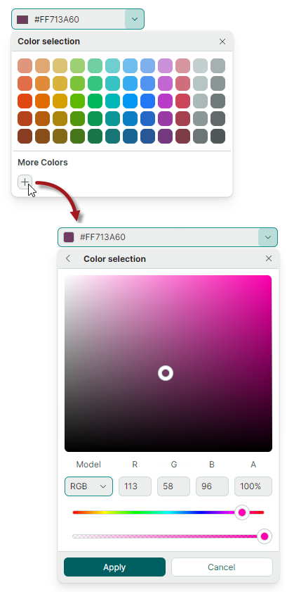

# PopupColorEditor

Библиотека Eremex Controls включает контрол `PopupColorEditor`, который позволяет отображать цвет в поле ввода и выбирать цвет из связанного всплывающего окна.



Основные возможности контрола включают:

- Настраиваемую цветовую палитру по умолчанию.
- Стандартную цветовую палитру.
- Пользовательскую цветовую палитру, которую могут настраивать пользователи.
- Встроенный диалог позволяет выбирать цвета с помощью палитры выбора цвета или путём задания отдельных компонентов цвета в формате RGB или HSB.

## Выбор цвета

Пользователь может выбрать цвет с помощью цветовых палитр, отображаемых в выпадающем окне.

В коде вы можете задать цвет или прочитать текущий выбранный цвет с помощью свойства `PopupColorEditor.Color` или `PopupColorEditor.EditorValue`. Эти свойства синхронизированы. Они различаются типом значения: свойство `Color` имеет тип nullable `Color`, тогда как свойство `EditorValue` имеет тип `object`, как во всех редакторах Eremex.

## Палитры

`PopupColorEditor` поддерживает три палитры: по умолчанию (default), стандартную (standard) и пользовательскую (custom). Используйте свойство `PopupColorEditor.ColorsShowMode`, чтобы настроить видимость отдельных палитр. Свойство `ColorsShowMode` определено как набор флагов.


## Дефолтная цветовая палитра

Палитра по умолчанию отображает набор предопределённых цветов. 



Вы можете заменить эти цвета пользовательской палитрой, используя следующий код:

``` cs
List<uint> fluentIntColors = new List<uint>() 
{
    0xffef6950, 0xffc30052, 0xff0063b1, 0xff881798, 0xff018574, 0xff515c6b, 0xff4c4a48, 0xff7e735f,
    0xffda3b01, 0xffea005e, 0xff0078d7, 0xffb146c2, 0xff00b294, 0xff68768a, 0xff767676, 0xff847545,
    0xffca5010, 0xffe81123, 0xff9a0089, 0xff744da9, 0xff038387, 0xff5d5a57, 0xff107c10, 0xff525e54,
    0xfff7630c, 0xffe74856, 0xffc239b3, 0xff8764b8, 0xff00b7c3, 0xff7a7574, 0xff498205, 0xff647c64
};

List<Color> fluentColors = new List<Color>();
fluentIntColors.ForEach(intColor => fluentColors.Add(Color.FromUInt32(intColor)));

ColorPalette colorPalette = new Eremex.AvaloniaUI.Controls.Editors.CustomPalette("myPalette", fluentColors);
popupColorEditor1.ThemePalette = colorPalette;
```


<!--TODO
..\Controls\Source\Eremex.Avalonia.Controls\Editors\ColorEditor\PalettesHelper.cs
-->


## Стандартная цветовая палитра

Включите флаг `StandardColors` в значении свойства `ColorsShowMode`, чтобы отобразить палитру «Standard Colors».



``` xml
<mxe:PopupColorEditor 
    Width="190" Height="30"
    Name="popupColorEditor1"
    ColorsShowMode="StandardColors,CustomColors"/>
```

## Пользовательская цветовая палитра

Включите флаг `CustomColors` в значение свойства `ColorsShowMode`, чтобы отобразить палитру «Custom Colors». 


``` xml
<mxe:PopupColorEditor ColorsShowMode="CustomColors"/>
```

Пользователи могут добавлять и настраивать цвета в пользовательской палитре во время работы. Нажмите кнопку «+», чтобы добавить цвет. 



Щёлкните правой кнопкой мыши по существующему цвету, чтобы отобразить контекстное меню, позволяющее изменить и удалить цвет.


Вы можете заранее заполнить палитру «Custom Colors» в коде с помощью свойства `CustomColors`.

### Пример - как настроить пользовательскую палитру

Следующий код включает палитру Custom Colors и заполняет её из свойства _CustomColorCollection_, определённого во ViewModel.

``` xml
xmlns:mxe="https://schemas.eremexcontrols.net/avalonia/editors"
xmlns:sys="clr-namespace:System;assembly=mscorlib"
xmlns:local="clr-namespace:ComboBoxTestSample"

<Window.DataContext>
    <local:MainViewModel/>
</Window.DataContext>

<mxe:PopupColorEditor ColorsShowMode="CustomColors" 
 CustomColors="{Binding CustomColorCollection}"/>
```

``` csharp
using Avalonia.Media;
using CommunityToolkit.Mvvm.ComponentModel;
using System.Collections.ObjectModel;

[ObservableObject]
public partial class MainViewModel 
{
    public MainViewModel()
    {
        CustomColorCollection = new ObservableCollection<Color>()
        {
            Color.FromRgb(0x7d, 0xd7, 0xab), 
            Color.FromRgb(0xc5, 0x94, 0x88), 
            Color.FromRgb(0x47, 0xfe, 0xff), 
            Color.FromRgb(0xe9, 0xbf, 0x3f),
        };
    }

    [ObservableProperty]
    ObservableCollection<Color> customColorCollection;
}
```

### Диалог выбора цвета

Когда пользователь нажимает кнопку «+» или щёлкает правой кнопкой мыши по существующему полю цвета в пользовательской палитре, редактор активирует диалог Color Picker.


Интерфейс диалога содержит палитру выбора цвета и контролы для задания компонентов цвета в формате RGB или HSB.

#### Связанный API

- `ShowAlphaChannel` — позволяет скрыть контролы, используемые для задания компонента Alpha цвета.
- `PopupFooterButtons` — задаёт, отображать ли кнопки Apply и Cancel в диалоге выбора цвета. Если свойство установлено в `OkCancel`, пользователю нужно нажать кнопку Apply, чтобы подтвердить выбор цвета. Щелчок по кнопке Back или Cancel отменяет диалог. 

<!-- TODO 
rename PopupFooterButtons  to ShowConfirmationButtons
to sync the API with ColorEditor
 -->

## Предотвращение всплывающих окон в редакторах только для чтения

В режиме «только для чтения» поведение любого всплывающего редактора по умолчанию — позволять пользователям открывать выпадающий список редактора. Однако они не могут изменять значения ни через поле ввода, ни через выпадающий список. Чтобы отключить всплывающие окна для редакторов только для чтения, установите свойство `ShowPopupIfReadOnly` в `false`.

## Предотвращение открытия и закрытия всплывающих окон

Вы можете обработать следующие унаследованные события, чтобы отменить операции открытия и закрытия всплывающего окна:

- `PopupEditor.PopupOpening` — возникает, когда всплывающее окно собирается создаться. 
- `PopupEditor.PopupClosing` — возникает, когда всплывающее окно собирается закрыться. 

Эти события предоставляют параметр `e.Cancel`. Установите его в `true`, чтобы отменить текущую операцию.

## Настройка всплывающего окна при его появлении

Обработайте следующее унаследованное событие, чтобы изменить всплывающее окно или его вложенные контролы:

- `PopupEditor.PopupOpened` — возникает после создания всплывающего окна и непосредственно перед его отображением. Это уведомляющее событие. Оно не позволяет отменить открытие всплывающего окна. Обработайте событие `PopupOpened`, чтобы настроить всплывающее окно или его дочерние контролы.

При обработке события `PopupEditor.PopupOpened` используйте свойство `PopupContent` редактора, чтобы безопасно обратиться к контролу внутри всплывающего окна редактора. Событие `PopupOpened` гарантирует, что контрол всплывающего окна существует, когда вы к нему обращаетесь. Для контрола PopupColorEditor свойство `PopupContent` возвращает экземпляр класса `ColorEditor`.

## Реакция на закрытие всплывающего окна

Используйте следующее унаследованное событие, чтобы выполнять действия после закрытия всплывающего окна:

- `PopupEditor.PopupClosed` — возникает сразу после закрытия всплывающего окна. Это уведомляющее событие. Оно не позволяет отменить закрытие всплывающего окна.


<br>
<br>

<sup>*</sup> Эта страница переведена с использованием технологий машинного перевода.
