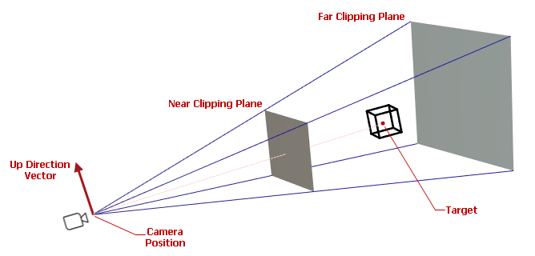
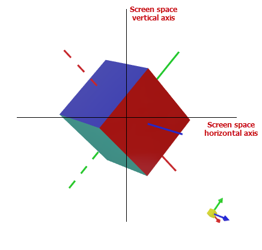

# Camera

Камера — это виртуальное представление точки обзора, определяющее, как 3D-модель проецируется на 2D-экран. `Graphics3DControl` позволяет выбирать между изометрической и перспективной камерой, а также управлять настройками и положением камеры в коде.


По умолчанию `Graphics3DControl` использует перспективную камеру.

Свойство `Graphics3DControl.Camera` позволяет обращаться к текущему объекту камеры. Однако изначально это свойство возвращает `null`, что означает, что `Graphics3DControl` использует камеру по умолчанию (перспективную).

Чтобы обращаться к объекту камеры и настраивать его в коде, вам нужно явно инициализировать свойство `Graphics3DControl.Camera` объектом `PerspectiveCamera` или `IsometricCamera`.


## Перспективная камера

Перспективная камера имитирует реалистичное восприятие глубины, проецируя 3D-модель на 2D-плоскость и делая объекты меньше по мере удаления.

Перспективная камера используется по умолчанию в Graphics3DControl. Чтобы обратиться к объекту камеры и настроить его параметры, установите свойство `Graphics3DControl.Camera` в объект `PerspectiveCamera`.

``` xml
xmlns:mx3d="https://schemas.eremexcontrols.net/avalonia/controls3d"

<mx3d:Graphics3DControl Name="g3DControl" ShowAxes="True">
    <mx3d:Graphics3DControl.Camera>
        <mx3d:PerspectiveCamera FieldOfView="0.9" />
    </mx3d:Graphics3DControl.Camera>
</mx3d:Graphics3DControl>
```

Свойство `PerspectiveCamera.FieldOfView` позволяет задать угол поля зрения перспективной камеры, выраженный в радианах. Значение свойства по умолчанию — `MathF.PI/4`.


## Изометрическая камера

Изометрическая камера сохраняет одинаковый масштаб для всех объектов независимо от их расстояния до камеры. 

Установите свойство `Graphics3DControl.Camera` в объект `IsometricCamera`, чтобы переключиться на изометрическую камеру.

``` xml
xmlns:mx3d="https://schemas.eremexcontrols.net/avalonia/controls3d"

<mx3d:Graphics3DControl Name="g3DControl" ShowAxes="True">
    <mx3d:Graphics3DControl.Camera>
        <mx3d:IsometricCamera FarClipPlane="1000"/>
    </mx3d:Graphics3DControl.Camera>
</mx3d:Graphics3DControl>
```

<!-- TODO
Describe camera settings
 -->

## Просмотр сцен

### Просмотр предопределённых сцен

`Graphics3DControl` позволяет позиционировать камеру так, чтобы она смотрела на верх, перед и другие предопределённые стороны 3D-модели.

Сцена по умолчанию — `IsoXYZ` (изометрическая). В изометрической сцене оси _X_, _Y_ и _Z_ имеют равные пропорции, а углы между осями всегда составляют 120 градусов:


Чтобы изменить сцену по умолчанию, используйте свойство `Camera.DefaultCameraPosition` объектов `PerspectiveCamera` и `IsometricCamera`. Вы можете установить `Camera.DefaultCameraPosition` в следующие значения перечисления `CameraPosition`:

- `Down` — низ модели. Камера позиционируется вдоль отрицательного направления оси _Y_. 
- `Front` — перед модели. Камера позиционируется вдоль положительного направления оси _Z_. 
- `IsoXYZ` — изометрическая сцена, в которой оси _X_, _Y_ и _Z_ имеют равные пропорции, а углы между осями всегда составляют 120 градусов.
- `Left` — левая сторона модели. Камера позиционируется вдоль отрицательного направления оси _X_. 
- `Rear` — задняя сторона модели. Камера позиционируется вдоль отрицательного направления оси _Z_. 
- `Right` — правая сторона модели. Камера позиционируется вдоль положительного направления оси _X_. 
- `Up` — верх модели. Камера позиционируется вдоль положительного направления оси _Y_. 

Следующий код устанавливает положение камеры по умолчанию для просмотра правой стороны модели.


``` xml
<mx3d:Graphics3DControl.Camera>
    <mx3d:PerspectiveCamera DefaultCameraPosition="Right" />
</mx3d:Graphics3DControl.Camera>
```


Во время работы вы можете использовать следующие члены для просмотра конкретной сцены 3D-модели:

- Метод `Graphics3DControl.LookCameraAtScene`
- Свойство `Camera.Position` объектов `PerspectiveCamera` и `IsometricCamera`.

``` cs
g3DControl.LookCameraAtScene(CameraPosition.Left);
```


<!-- TODO
What if I change the coordinate system ?
-->

Вместо использования метода `LookCameraAtScene` вы можете визуализировать предопределённые сцены с помощью команды `Graphics3DControl.LookCameraAtSceneCommand`. Передайте значение перечисления `CameraPosition` в качестве параметра этой команде.

### Просмотр модели целиком под определённым углом

Следующая перегрузка `Graphics3DControl.LookCameraAtScene` позиционирует и направляет камеру, чтобы показать модель целиком под определённым углом.

```
public void LookCameraAtScene(Vector3 cameraViewDirection, Vector3 upDirection)
```

Эта перегрузка автоматически вычисляет оптимальное положение камеры, обеспечивающее видимость всей модели. Параметры метода задают направление и ориентацию камеры в 3D-пространстве:

- `cameraViewDirection` — вектор, задающий направление, в которое смотрит камера.
- `upDirection` — вектор, задающий направление «вверх» камеры. Этот параметр соответствует свойству `Camera.UpDirection`.


## Позиционирование камеры вручную

Классы `PerspectiveCamera` и `IsometricCamera` наследуются от базового класса `Camera`, который предоставляет члены для получения и настройки положения и ориентации камеры в 3D-пространстве:

- Свойство `Camera.Position` — координаты _X_, _Y_ и _Z_ положения камеры. 
  
    !!! tip
    
        Когда вы устанавливаете свойство `Position`, убедитесь, что расстояние между камерой и её целью (`Camera.Target`) находится в допустимом диапазоне, заданном `Camera.MinDistance` и `Camera.MaxDistance`. В противном случае модель может стать скрытой.
  
- Свойство `Camera.Target` — координаты _X_, _Y_ и _Z_ точки, на которую нацелена камера. Целью по умолчанию является начало системы координат _(0, 0, 0)_. Целевая точка автоматически меняется, когда вы панорамируете (сдвигаете) модель с помощью методов `Camera.MoveLeft`/`Camera.MoveUp` и [сочетаний клавиш и жестов мыши](user-interactions-with-3d-models.md).
- Свойство `Camera.UpDirection` — вектор (значение `Vector3`), задающий направление «вверх» камеры. Например, когда `UpDirection` установлен в _Vector3(0, 1, 0)_, ось _Y_ направлена вверх. 

- Метод `Camera.LookAt` — одновременно устанавливает цель камеры и направление «вверх».



Другие настройки камеры задают ограничения расстояния и усечённую пирамиду видимости:

- `Camera.NearClipPlane` — расстояние между камерой и ближней плоскостью отсечения. Объекты, находящиеся ближе этой плоскости отсечения, скрыты. См. также `FarClipPlane`.
- `Camera.FarClipPlane` — расстояние между камерой и дальней плоскостью отсечения. Объекты за дальней плоскостью отсечения скрыты. Graphics3DControl отображает только те объекты, которые расположены между ближней и дальней плоскостями отсечения.
- `Camera.MaxDistance` — максимально допустимое расстояние между камерой (`Camera.Position`) и целевой точкой (`Camera.Target`). Свойства `MaxDistance` и `MinDistance` задают, насколько далеко камера может находиться от цели. Эти свойства влияют на операции масштабирования, выполняемые с помощью метода `Camera.MoveForward` и [сочетаний клавиш и жестов мыши](user-interactions-with-3d-models.md).
- `Camera.MinDistance` — минимально допустимое расстояние между камерой (`Camera.Position`) и целевой точкой (`Camera.Target`).


  


### Пример - размещение камеры в пользовательском положении

Следующий код размещает камеру в положении _(X=40, Y=200, Z=40)_ и устанавливает свойство `Target` в _Vector3(0, 0, 0)_, чтобы направить её вниз, на начало системы координат, и просматривать верх модели. Свойство `UpDirection` установлено в _Vector3(1, 0, 1)_, выравнивая оси _X_ и _Z_ с левым-верхним и правым-верхним углами экрана соответственно.
Свойство `MaxDistance` установлено в _300_, обеспечивая, чтобы новое расстояние между камерой и целью находилось в диапазоне \[`MinDistance`, `MaxDistance`\].


``` cs
g3DControl.Camera.MaxDistance = 300;
g3DControl.Camera.Position = new Vector3(40, 200, 40);
g3DControl.Camera.Target = new Vector3(0, 0, 0);
g3DControl.Camera.UpDirection = new Vector3(1, 0, 1);

// or

g3DControl.Camera.MaxDistance = 300;
g3DControl.Camera.Position = new Vector3(40, 200, 40);
g3DControl.Camera.LookAt(new Vector3(0, 0, 0), new Vector3(1, 0, 1));
```

## Перемещение и вращение камеры

Graphics3DControl поддерживает [сочетания клавиш и жесты мыши](user-interactions-with-3d-models.md), которые позволяют пользователям перемещать (панорамировать), вращать и масштабировать модель (модели) во время работы. Вы также можете выполнять эти операции в коде, используя следующие методы, предоставляемые объектом `Camera`: 

- `MoveForward` — приближает камеру к модели (положительное смещение) или отдаляет от неё (отрицательное смещение).
- `MoveLeft` — сдвигает камеру влево (положительное смещение) или вправо (отрицательное смещение).
- `MoveUp` — сдвигает камеру вверх (положительное смещение) или вниз (отрицательное смещение).
- `Rotate` — вращает камеру вокруг горизонтальной и вертикальной осей **экранного пространства**. Точкой поворота является начало системы координат контрола _(0, 0, 0)_.

  


<br>
<br>

<sup>*</sup> Эта страница переведена с использованием технологий машинного перевода.
