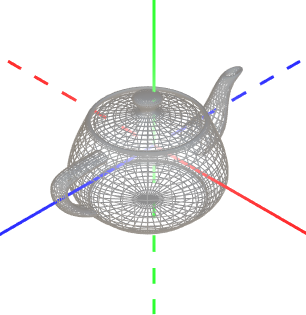
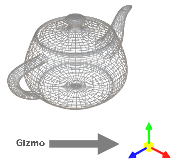
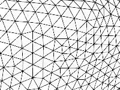
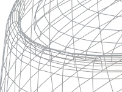
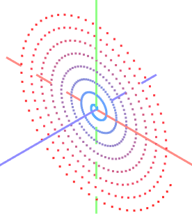
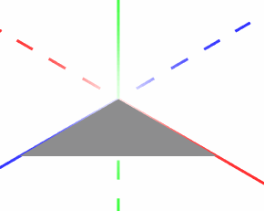
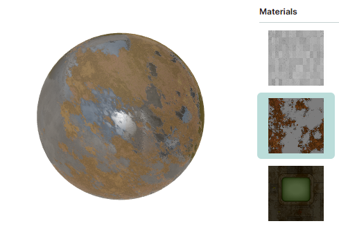
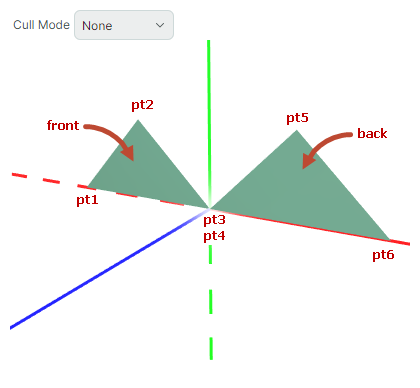

# Обзор Graphics3DControl

Контрол `Graphics3DControl` позволяет встраивать 3D-модели в ваше приложение Avalonia. Контрол поддерживает операции вращения, панорамирования и масштабирования с помощью мыши и клавиатуры, позволяя пользователю взаимодействовать с моделями во время работы. 


Любая 3D-модель составлена из сеток, отрисованных с использованием заданных материалов. `Graphics3DControl` предоставляет API для определения сеток, материалов, настроек камеры и света. Вы также можете использовать сторонние библиотеки, чтобы загружать модели в форматах OBJ и STL в контрол `Graphics3DControl`.

## Основные возможности

- API для задания 3D-моделей
- Одновременное отображение нескольких 3D-моделей
- Перспективная и изометрическая камеры
- Поддерживаемые типы сеток: треугольные, линии и точки
- Простые и текстурированные материалы
- Трансформации 3D-моделей
- Отсечение передних и задних граней
- Поддержка паттерна проектирования MVVM для определения 3D-моделей
- Отображение осей и сеток

### Взаимодействие с пользователем

- Вращение, панорамирование и масштабирование моделей с помощью мыши и клавиатуры
- Подсказки
- Подсветка и выбор элементов

См. [Взаимодействие пользователя с 3D-моделями](user-interactions-with-3d-models.md)

## Начало работы

- [Начало работы с Graphics3DControl](get-started-with-graphics3dcontrol.md) — демонстрирует, как создать 3D-модель с нуля.

## Демо

Ознакомьтесь с приложением [Eremex Avalonia Controls Demo](https://github.com/Eremex/controls-demo), которое содержит примеры, демонстрирующие различные возможности `Graphics3DControl`:

- Загрузка моделей Wavefront (Obj) и Stl из внешних файлов с помощью сторонних библиотек и создание 3D-моделей из загруженных данных.
- Создание 3D-моделей с нуля.
- Демонстрация поддерживаемых типов сеток: треугольных, линий и точек.
- Использование паттерна проектирования MVVM для определения 3D-моделей и другое.


## Визуальная тема для Graphics3DControl

Начиная с версии 1.3, для использования `Graphics3DControl` вы должны зарегистрировать визуальную тему `Controls3D` в файле _App.xaml_. Эта тема содержит общие настройки внешнего вида, необходимые для отрисовки `Graphics3DControl`. Дополнительную информацию смотрите в следующем разделе:

- [Регистрация визуальной темы для Graphics3DControl](get-started-with-graphics3dcontrol.md#предварительные-требования-регистрация-визуальной-темы-для-graphics3dcontrol)


!!! note

    Если визуальная тема `Controls3D` не зарегистрирована, `Graphics3DControl` будет отображаться пустым.


## Система координат, оси и сетки

`Graphics3DControl` поддерживает правостороннюю (по умолчанию) и левостороннюю системы координат. Вы можете использовать свойство `Graphics3DControl.CoordinateSystem`, чтобы включить нужный вариант.

``` xml
<mx3d:Graphics3DControl Name="g3DControl" ShowAxes="True" CoordinateSystem="LeftHanded" ...>
```

### Правосторонняя система координат

Положительные оси X, Y и Z направлены вправо, вверх и к наблюдателю соответственно.


### Левосторонняя система координат

Положительные оси X, Y и Z направлены вправо, вверх и от наблюдателя соответственно.


<!-- TODO
перепутаны оси
 -->

### Оси

Включите свойство `Graphics3DControl.ShowAxes`, чтобы отобразить оси X, Y и Z в контроле.



``` xml
<mx3d:Graphics3DControl Name="g3DControl" ShowAxes="True"/>
```

#### Связанные опции

- Свойство `Graphics3DControl.AxisThickness` — задаёт толщину осей.


### Gizmo

`Graphics3DControl` может отображать гизмо (Gizmo). Это отдельный виджет, визуально указывающий текущую ориентацию осей в 3D-пространстве.



Чтобы включить гизмо, инициализируйте свойство `Graphics3DControl.Gizmo` экземпляром класса `Eremex.AvaloniaUI.Controls3D.Gizmo`.

``` xml
<mx3d:Graphics3DControl Name="g3DControl" >
        <!-- ... -->
    <mx3d:Graphics3DControl.Gizmo>
        <mx3d:Gizmo Name="gizmo" />
    </mx3d:Graphics3DControl.Gizmo>
</mx3d:Graphics3DControl>
```

Вы можете отрисовывать гизмо произвольным образом. Для этого используйте свойство `Gizmo.Models` или `Gizmo.ModelsSource`, чтобы задать 3D-модель (модели) для отрисовки гизмо. Процесс заполнения этих свойств идентичен процессу для `Graphics3dControl`, так как оба класса наследуются от одного базового класса.

### Сетки (Grids)

Свойство `Graphics3DControl.ShowGrid` позволяет отображать сетки на плоскостях XY, XZ и YZ.

](../../images/g3d-grid.png)

``` xml
<mx3d:Graphics3DControl Name="g3DControl" ShowGrid="True"/>
```

#### Связанные опции

- Свойство `Graphics3DControl.GridThickness` — задаёт толщину линий сетки.

<!-- TODO
Option for grid spacing ?
 -->


## Модели

Чтобы определить 3D-модели для `Graphics3DControl`, используйте API `Graphics3DControl` для создания объектов, представляющих модели, сетки, вершины, материалы, камеры и т. д.

###  Определение 3D-моделей

Класс `GeometryModel3D` инкапсулирует одну 3D-модель в `Graphics3DControl`. 
Используйте одно из следующих свойств, чтобы добавить 3D-модели в контрол:

- `Graphics3DControl.Models` — коллекция объектов `GeometryModel3D`. 
- `Graphics3DControl.ModelsSource` — источник бизнес-объектов, используемых для создания 3D-моделей (объектов `GeometryModel3D`) в соответствии с паттерном проектирования MVVM.

``` xml
xmlns:mx3d="https://schemas.eremexcontrols.net/avalonia/controls3d"

<mx3d:Graphics3DControl Name="g3DControl" ShowAxes="True"/>
```

``` cs
using Eremex.AvaloniaUI.Controls3D;

GeometryModel3D model = new GeometryModel3D();
g3DControl.Models.Add(model);
```


### Сетки (Meshes)

3D-модель представляет собой коллекцию сеток, отрисованных с использованием определённых материалов. Сетки определяют форму и структуру 3D-объекта. 

Класс `MeshGeometry3D` представляет сетку в `Graphics3DControl`. Следующие свойства позволяют задавать сетки для модели:

- `GeometryModel3D.Meshes` — коллекция объектов `MeshGeometry3D`.
- `GeometryModel3D.MeshesSource` — источник бизнес-объектов, используемых для создания сеток (объектов `MeshGeometry3D`) в соответствии с паттерном проектирования MVVM.

Контрол поддерживает три типа сеток, которые вы можете выбрать с помощью свойства `MeshGeometry3D.FillType`.


- `MeshFillType.Triangles` (по умолчанию) — треугольная сетка. Состоит из треугольных граней (плоских областей, ограниченных тремя рёбрами). 

  

- `MeshFillType.Lines` — линейная сетка. Вершины соединяются линиями, образуя каркас.

  

- `MeshFillType.Points` — точечная сетка (облако точек). Состоит из вершин, которые не соединены линиями.

  
  


``` cs
using DynamicData;

MeshGeometry3D meshTriangle1 = new MeshGeometry3D();
MeshGeometry3D meshSquare = new MeshGeometry3D();
MeshGeometry3D meshPoints = new MeshGeometry3D() { FillType = MeshFillType.Points };
//Define the meshes
//...
model.Meshes.AddRange(new[] { meshTriangle1, meshSquare, meshPoints });
```

При создании сетки используйте следующие свойства для определения вершин и граней/линий:

- Массив `MeshGeometry3D.Vertices` — задаёт массив всех вершин, составляющих сетку. 
- Массив `MeshGeometry3D.Indices` — определяет треугольные грани (для треугольной сетки) или линии (для линейной сетки).


#### Вершины

Вершина — это точка в 3D-пространстве, определяемая своими координатами (x, y, z).

Тип `Vertex3D` инкапсулирует одну вершину в `Graphics3DControl`. Используйте массив `MeshGeometry3D.Vertices`, чтобы добавлять вершины в сетку.

Тип `Vertex3D` предоставляет следующие основные свойства, которые нужно инициализировать.

- `Vertex3D.Position` — значение `Vector3`, задающее координаты (x, y, z) вершины.
- `Vertex3D.Normal` — значение `Vector3`, задающее нормаль вершины. Нормаль вершины — это вектор, перпендикулярный поверхности 3D-модели в этой вершине. В 3D-графике нормали вершин используются для расчёта освещения и затенения сетки. Нормали соседних треугольников должны быть выровнены, чтобы обеспечить плавное затенение (рёбер).

  

- `Vertex3D.TextureCoord` — значение `Vector2`, задающее координаты (x, y) точки в текстурированном материале, которая отображается на текущую вершину.

#### Определение треугольной сетки

Чтобы создать треугольную сетку, вам нужно разделить фигуру на треугольники. Вершины задают углы треугольников. Свойство `MeshGeometry3D.FillType` должно быть установлено в значение по умолчанию (`MeshFillType.Triangles`).

Рассмотрим пример, в котором сетка имеет четырёхугольную форму. Её можно триангулировать, добавив одну диагональ.


Сначала добавьте все вершины в массив `MeshGeometry3D.Vertices`.

``` xml
<mx3d:Graphics3DControl Name="g3DControl" ShowAxes="True"/>
```

``` cs
using DynamicData;

GeometryModel3D model = new GeometryModel3D();
g3DControl.Models.Add(model);

Vector3 pt1 = new(2f, 0, 0);
Vector3 pt2 = new(0, 0, 0);
Vector3 pt3 = new(0, 0, 1);
Vector3 pt4 = new(2f, 0, 1);

MeshGeometry3D meshSquare = new MeshGeometry3D();
meshSquare.FillType = MeshFillType.Triangles;
Vertex3D[] meshSquareVertices = new Vertex3D[]
{
    new Vertex3D() { Position = pt1,  Normal = new Vector3(0, 1, 0) },
    new Vertex3D() { Position = pt2,  Normal = new Vector3(0, 1, 0) },
    new Vertex3D() { Position = pt3,  Normal = new Vector3(0, 1, 0) },
    new Vertex3D() { Position = pt4,  Normal = new Vector3(0, 1, 0) }
};
meshSquare.Vertices = meshSquareVertices;
//...
model.Meshes.AddRange(new[] { meshSquare });
```

Затем используйте свойство `MeshGeometry3D.Indices`, чтобы сформировать треугольные грани.

Для треугольной сетки свойство `MeshGeometry3D.Indices` — это массив индексов вершин в массиве `MeshGeometry3D.Vertices`, определяющих отдельные треугольники сетки. Этот массив содержит группы по **три** индекса каждая. Первые три индекса в массиве ссылаются на вершины первого треугольника сетки. Следующие три индекса ссылаются на вершины второго треугольника сетки, и так далее.
Порядок индексов для каждого треугольника важен, поскольку он определяет нормаль поверхности. Нормаль поверхности, в свою очередь, определяет переднюю и заднюю стороны треугольника, что существенно для операций вроде отсечения задних и передних граней.

Для приведённой выше четырёхугольной сетки массив `MeshGeometry3D.Indices` должен содержать шесть индексов. Первые три индекса ссылаются на вершины первого треугольника. Вторые три индекса ссылаются на вершины второго треугольника.

``` cs
uint[] meshSquareIndices = new uint[] { 0, 1, 3, 1, 2, 3 };
meshSquare.Indices = meshSquareIndices;
```

#### Определение линейной сетки

В линейной сетке вершины соединяются линиями. Чтобы определить линейную сетку, создайте объект `MeshGeometry3D` и установите его свойство `MeshGeometry3D.FillType` в `MeshFillType.Lines`. Затем используйте свойство `MeshGeometry3D.Vertices`, чтобы задать все вершины, и свойство `MeshGeometry3D.Indices`, чтобы соединить вершины линиями.

Рассмотрим следующую 3D-модель, составленную из линий, соединяющих шесть точек.


Сначала добавьте все вершины в массив `MeshGeometry3D.Vertices`.

``` xml
<mx3d:Graphics3DControl Name="g3DControl" ShowAxes="True"/>
```

``` cs
GeometryModel3D model = new GeometryModel3D();
g3DControl.Models.Add(model);

Vector3 p0 = new(1, 0, 0);
Vector3 p1 = new(1, 1, 0);
Vector3 p2 = new(1, 1, 2);
Vector3 p3 = new(2, 1, 2);
Vector3 p4 = new(2, 1, 0);
Vector3 p5 = new(2, 2, 0);

MeshGeometry3D meshLines = new MeshGeometry3D();
meshLines.PrimitiveSize = 3;
meshLines.FillType = MeshFillType.Lines;
Vertex3D[] meshLinesVertices = new Vertex3D[]
{
    new Vertex3D() { Position = p0,  Normal = new Vector3(0, 1, 0) },
    new Vertex3D() { Position = p1,  Normal = new Vector3(0, 1, 0) },
    new Vertex3D() { Position = p2,  Normal = new Vector3(0, 1, 0) },
    new Vertex3D() { Position = p3,  Normal = new Vector3(0, 1, 0) },
    new Vertex3D() { Position = p4,  Normal = new Vector3(0, 1, 0) },
    new Vertex3D() { Position = p5,  Normal = new Vector3(0, 1, 0) }
};
meshLines.Vertices = meshLinesVertices;
//...
model.Meshes.Add(meshLines);
```

<!-- TODO
Should I specify vertex Normals in a line and point meshes?
 -->


Используйте свойство `MeshGeometry3D.Indices`, чтобы соединить вершины линиями. Для линейной сетки свойство `MeshGeometry3D.Indices` — это массив индексов вершин в массиве `MeshGeometry3D.Vertices`, определяющих отдельные линии.
Этот массив содержит пары индексов. Первые два индекса в массиве ссылаются на вершины первой линии. Следующие два индекса ссылаются на вершины второй линии, и так далее.

Для приведённого выше примера массив `MeshGeometry3D.Indices` должен содержать 10 индексов. Первая пара индексов ссылается на точки, определяющие первую линию. Вторая пара индексов ссылается на вершины второй линии, и так далее.

``` cs
uint[] meshLinesIndices = new uint[] { 0, 1, 1, 2, 2, 3, 3, 4, 4, 5 };
meshLines.Indices = meshLinesIndices;
```

##### Толщина линий

В линейной сетке используйте свойство `PrimitiveSize`, чтобы изменить толщину линий. 


#### Определение точечной сетки

В точечной сетке вершины отрисовываются как отдельные точки. 

Чтобы определить точечную сетку, создайте объект `MeshGeometry3D` и установите его свойство `MeshGeometry3D.FillType` в `MeshFillType.Points`. Затем используйте свойство `MeshGeometry3D.Vertices`, чтобы задать все вершины, и свойство `MeshGeometry3D.Indices`, чтобы указать, какие вершины отрисовывать.

Давайте создадим точечную сетку, образующую спираль, в которой точки расположены в плоскости XY.



``` cs
int pointCount = 500;

GeometryModel3D model = new GeometryModel3D();
g3DControl.Models.Add(model);
var vertices = new Vertex3D[pointCount];
var indices = new uint[pointCount];
MeshGeometry3D meshPoints = new MeshGeometry3D();
meshPoints.PrimitiveSize = 3;
meshPoints.MaterialKey = "pointsMaterial";
meshPoints.FillType = MeshFillType.Points;
double radius = 0;
double angle = 0;
double radiusStep = 0.1;
double angleStep = 0.1;
for (uint i = 0; i < pointCount; i++)
{
    double x = radius * Math.Cos(angle);
    double y = radius * Math.Sin(angle);
    vertices[i] = new Vertex3D() { 
        // Vertex coordinates:
        Position = new Vector3((float)x, (float)y, 0), 
        // Normalized coordinates of a position in the texture mapped to the current vertex:
        TextureCoord= new Vector2((float)i/pointCount, 0) 
    };
    radius += radiusStep;
    angle += angleStep;
    indices[i] = i;
}
meshPoints.Vertices = vertices;
meshPoints.Indices = indices;
model.Meshes.Add(meshPoints);
```

<!-- TODO
Remove line:
meshPoints.MaterialKey = "pointsMaterial";

Display a non-colorlized image (intermediate stage)
Then colorlize the spiral
 -->


Вы можете окрашивать вершины в точечной сетке разными цветами. Например, вершины можно окрашивать цветами, определяемыми их позициями или координатами.

Код ниже показывает, как использовать текстурированный материал для окрашивания вершин. Индекс вершины определяет её цвет (позицию в следующем цветовом градиенте).


1. Добавьте текстурированный материал (`TexturedPbrMaterial`) в коллекцию `Graphics3DControl.Materials`. Текстурированный материал представляет собой набор растровых изображений, задающих следующие настройки текстуры:
    - `Albedo` — базовый цвет
    - `Alpha` — прозрачность
    - `Emission` — интенсивность света, излучаемого поверхностью
    - `AmbientOcclusion` — уровень затенения, вызванного объектами, блокирующими окружающий свет
    - `Roughness` — гладкость поверхности
    - `Metallic` — настройки отражательной способности поверхности 

    Вершины позже отображаются на конкретные позиции внутри этих растровых изображений текстур.

    Чтобы вершины отображали реалистичные цвета из целевого цветового градиента, настройте растровые изображения текстур следующим образом:
    
    - Установите `TexturedPbrMaterial.Emission` в растровое изображение градиента, определяющее реальный цвет вершин. 
    - Установите `TexturedPbrMaterial.Albedo` в растровое изображение, заполненное чёрным.
    - Установите `TexturedPbrMaterial.Roughness` и `TexturedPbrMaterial.AmbientOcclusion` в растровые изображения, заполненные белым.

    ``` cs
    using DynamicData;
    using Avalonia.Media;

    public void InitG3DControlMaterials()
    {
        g3DControl.Materials.AddRange(
            new[] {
                new TexturedPbrMaterial(){
                    Albedo = getSolidColorBitmap(Colors.Black),
                    Roughness = getSolidColorBitmap(Colors.White),
                    AmbientOcclusion = getSolidColorBitmap(Colors.White),
                    Emission = getGradientColorBitmap(Colors.DodgerBlue, Colors.Red), 
                    Key= "pointsMaterial"
                }
            }
        );
    }

    Bitmap getSolidColorBitmap(Color fillColor)
    {
        var bitmap = new RenderTargetBitmap(new PixelSize(pointCount, 1));
        using (var context = bitmap.CreateDrawingContext())
        {
            Brush brush = new SolidColorBrush(fillColor);
            context.FillRectangle(brush, new Rect(0, 0, pointCount, 1));
        }
        return bitmap;
    }

    Bitmap getGradientColorBitmap(Color fillColor1, Color fillColor2)
    {
        var bitmap = new RenderTargetBitmap(new PixelSize(pointCount, 1));
        using (var context = bitmap.CreateDrawingContext())
        {
            var gradientBrush = new LinearGradientBrush
            {
                StartPoint = new RelativePoint(0, 0, RelativeUnit.Relative),
                EndPoint = new RelativePoint(1, 1, RelativeUnit.Relative),
                GradientStops = {
                    new GradientStop(fillColor1, 0.0),
                    new GradientStop(fillColor2, 1.0)
                }
            };

            context.FillRectangle(gradientBrush, new Rect(0, 0, pointCount, 1));
        }
        return bitmap;
    }
    ```

    Свойство материала `TexturedPbrMaterial.Key` устанавливается в уникальный ключ (строку). Уникальные ключи позволяют идентифицировать материалы в коллекции `Graphics3DControl.Materials`.

2. Назначьте созданный материал сетке с помощью свойства `MeshGeometry3D.MaterialKey`. Свойство `MeshGeometry3D.MaterialKey` должно совпадать со значением настройки `TexturedPbrMaterial.Key`.

    ``` cs
    meshPoints.MaterialKey = "pointsMaterial";
    ```

3. Используйте свойство `Vertex3D.TextureCoord`, чтобы отобразить вершины на конкретные позиции в текстуре. Это свойство должно задавать нормализованные координаты. Значения _TextureCoord.X_ и _TextureCoord.Y_ должны быть в диапазоне от 0 до 1, где 0 соответствует левому или верхнему краю растрового изображения текстуры, а 1 соответствует правому или нижнему краю растрового изображения текстуры.

    При создании вершин задайте свойство `Vertex3D.TextureCoord`, чтобы адресовать целевые позиции в текстуре. 

    ``` cs
    vertices[i] = new Vertex3D() { 
        // Vertex coordinates:
        Position = new Vector3((float)x, (float)y, 0), 
        // Normalized coordinates of a position in the texture mapped to the current vertex:
        TextureCoord= new Vector2((float)i/pointCount, 0) 
    };
    ```

    Теперь вершины окрашены с использованием заданного градиента.

    <!-- TODO
    Final image (with a different camera angle)
    -->

    <!-- TODO
    Check the phrase: where 0 corresponds to the left or ____top____ edge, 
    and 1 corresponds to the right or _____bottom_____
    -->

##### Толщина точек

В точечной сетке используйте свойство `PrimitiveSize`, чтобы изменить толщину точек.


### Видимость модели

Используйте свойство `GeometryModel3D.Visible`, чтобы временно скрыть, а затем восстановить модель.

``` cs
GeometryModel3D model = new GeometryModel3D();
g3DControl.Models.Add(model);
//...
model.Visible = !model.Visible;
```

### Трансформации моделей

`Graphics3DControl` позволяет выполнять трансформации моделей. Для этого постройте матрицу трансформации, которая вращает, масштабирует и/или перемещает модель. После создания назначьте эту матрицу свойству `GeometryModel3D.Transform`.

Чтобы очистить текущую трансформацию, установите свойство `GeometryModel3D.Transform` в объект `Matrix4x4.Identity`.

Класс `Matrix4x4` предоставляет методы для генерации матриц трансформации различных типов. Некоторые из этих методов:

- `Matrix4x4.CreateRotationX` — генерирует матрицу трансформации, представляющую вращение вокруг оси X на заданный угол.
- `Matrix4x4.CreateRotationY` — генерирует матрицу трансформации, представляющую вращение вокруг оси Y на заданный угол.
- `Matrix4x4.CreateRotationZ` — генерирует матрицу трансформации, представляющую вращение вокруг оси Z на заданный угол.
- `Matrix4x4.CreateTranslation` — генерирует матрицу трансформации, перемещающую объект на заданное смещение вдоль осей X, Y и Z.
- `Matrix4x4.CreateScale` — генерирует матрицу трансформации, масштабирующую объект вдоль осей X, Y и Z.


Чтобы применить несколько трансформаций одновременно, вы можете перемножить матрицы, выполняющие отдельные трансформации.

#### Пример - вращение модели

Следующий пример создаёт анимацию, вращающую 3D-модель (спираль, состоящую из точек). Метод `Matrix4x4.CreateRotationZ` вызывается для генерации матрицы трансформации, вращающей модель на заданный угол вокруг оси Z.
Чтобы применить трансформацию, эта матрица назначается свойству `GeometryModel3D.Transform`.


``` cs
GeometryModel3D model;
//Init the model
//...
float angleStep = MathF.PI / 180;
float angle = 0;

private void BtnRotate_Click(object? sender, Avalonia.Interactivity.RoutedEventArgs e)
{
    for (int i = 0; i < 180; i++) 
    {
        angle += angleStep;
        Matrix4x4 rotationMatrix = Matrix4x4.CreateRotationZ(angle);
        model.Transform = rotationMatrix;
        // Update the UI
        Dispatcher.UIThread.RunJobs();
        Thread.Sleep(12);
    }
}
```

#### Пример - выполнение нескольких трансформаций

Следующий пример создаёт 3D-модель, отрисовывающую треугольник, и показывает, как выполнять несколько трансформаций модели.

Пример объединяет операции масштабирования, вращения и перемещения в единую матрицу трансформации, а затем назначает эту матрицу свойству `GeometryModel3D.Transform`, чтобы применить трансформации.

Пример применяет небольшие пошаговые изменения к матрицам трансформации, создавая эффект плавной анимации.



``` xml
xmlns:mx3d="https://schemas.eremexcontrols.net/avalonia/controls3d"

<mx3d:Graphics3DControl Name="g3DControl" ShowAxes="True" Grid.Row="1"/>
```

``` cs
using DynamicData;

public MainWindow()
{
    InitG3dControl();
}

private void InitG3dControl()
{
    // Create a 3D model that renders a triangle.
    GeometryModel3D model = new GeometryModel3D();
    g3DControl.Models.Add(model);
    Vector3 pt1 = new(1f, 0, 0);
    Vector3 pt2 = new(0, 0, 0);
    Vector3 pt3 = new(0, 0, 1);
    MeshGeometry3D meshSquare = new MeshGeometry3D();
    meshSquare.FillType = MeshFillType.Triangles;
    Vertex3D[] meshSquareVertices = new Vertex3D[]
    {
        new Vertex3D() { Position = pt1,  Normal = new Vector3(0, 1, 0) },
        new Vertex3D() { Position = pt2,  Normal = new Vector3(0, 1, 0) },
        new Vertex3D() { Position = pt3,  Normal = new Vector3(0, 1, 0) }
    };
    uint[] meshSquareIndices = new uint[] { 0, 1, 2 };
    meshSquare.Indices = meshSquareIndices;
    meshSquare.Vertices = meshSquareVertices;
    model.Meshes.AddRange(new[] { meshSquare });
    this.model = model;
}

//Transform the model
private void BtnRotate_Click(object? sender, Avalonia.Interactivity.RoutedEventArgs e)
{
    int steps = 100;
    Vector3 stepTranslationVector = new Vector3(-0.5f, 0, 0)/steps;
    Vector3 stepScaleVector = new Vector3(-0.5f, 0, 0.1f)/steps;
    float stepRotationAngle = (MathF.PI/2)/steps;

    Vector3 translationVector = new Vector3(0,0,0), 
        scaleVector = new Vector3(1, 1, 1);
    float rotationAngle = 0;

    for (int i = 0; i < steps; i++)
    {
        rotationAngle += stepRotationAngle;
        translationVector += stepTranslationVector;
        scaleVector += stepScaleVector;

        // Translation Matrix (move by)
        Matrix4x4 translationMatrix = Matrix4x4.CreateTranslation(translationVector);
        // Scaling Matrix
        Matrix4x4 scalingMatrix = Matrix4x4.CreateScale(scaleVector);
        // Rotation Matrix
        Matrix4x4 rotationMatrix = Matrix4x4.CreateRotationY(rotationAngle);
        rotationMatrix *= Matrix4x4.CreateRotationX(rotationAngle);

        Matrix4x4 combinedMatrix = Matrix4x4.Identity;
        combinedMatrix *= scalingMatrix;
        combinedMatrix *= rotationMatrix;
        combinedMatrix *= translationMatrix;

        model.Transform = combinedMatrix;
        // Update the UI
        Dispatcher.UIThread.RunJobs();
        Thread.Sleep(12);
    }
}
```


### Мультисэмплинг (сглаживание)

- `Graphics3DControl.MultisamplingMode` — активирует мультисэмпловое сглаживание (MSAA) или отключает его. 

Функция сглаживания используется для уменьшения визуальных артефактов, таких как зазубренные края (алиасинг), в отрисованной графике, обеспечивая более плавные и качественные результаты. 


Свойство `MultisamplingMode` может быть установлено в следующие значения: `None`, `X2`, `X4`, `X8`, `X16`, `X32`, `X64`. Значения `X2`...`X64` определяют число точек выборки на пиксель для расчёта итогового цвета пикселя. Больше выборок приводит к лучшим результатам, однако это также более затратно с вычислительной точки зрения.

- Значение свойства `MultisamplingMode` по умолчанию — `X8`.
- Не все режимы MSAA могут поддерживаться вашим GPU. Если выбран неподдерживаемый режим MSAA, система переходит на более низкий доступный режим. Вы можете использовать свойство `Graphics3DControl.AvailableMultisamplingModes`, чтобы вернуть список режимов MSAA, поддерживаемых вашим графическим драйвером.
- Мультисэмплинг для больших 3D-моделей увеличивает использование памяти и вычислительные затраты. Чтобы улучшить производительность приложения в таких случаях, рассмотрите возможность установки `MultisamplingMode` в более низкое значение или отключения MSAA.


<!-- TODO

Демка с чайником:

- Слишком чувствительная реакция на события мыши

- Почему нельзя приблизить ближе ?

- можно ли попасть внутрь объекта?
 -->


## Материалы

Каждая сетка в контроле `Graphics3DControl` может быть отрисована со своим собственным материалом. Материал задаёт, как поверхности взаимодействуют со светом, придавая объектам их визуальный облик.

Контрол `Graphics3DControl` поддерживает два типа материалов:

- `SimplePbrMaterial` — материал, определяющий визуальные свойства поверхности с помощью числовых значений, таких как цвета (например, albedo и emission) и настройки взаимодействия со светом (например, metallic и roughness). Дополнительную информацию смотрите в разделе [Простые материалы (SimplePbrMaterial)](#простые-материалы-simplepbrmaterial)

- `TexturedPbrMaterial` — текстурированный материал в формате PBR. Этот материал задаёт визуальные свойства поверхности с помощью текстур (растровых изображений). Дополнительную информацию смотрите в разделе [Текстурированные материалы (TexturedPbrMaterial)](#текстурированные-материалы-texturedpbrmaterial)

Чтобы применить материалы к сеткам, сделайте следующее:

1. Создайте и инициализируйте материалы.
1. Установите свойство `Key` для материалов в уникальные строки. Ключи позволяют идентифицировать материал при назначении материалов сеткам.
1. Добавьте материалы в коллекцию `Graphics3DControl.Materials`.
1. Используйте свойство `MeshGeometry3D.MaterialKey`, чтобы связать сетку с конкретным материалом. Для этого установите свойство `MeshGeometry3D.MaterialKey` в свойство `Key` целевого материала.

### Пример - назначение материала сетке

Следующий пример создаёт три материала (объекта `SimplePbrMaterial`) и применяет один из этих материалов к сетке. Созданные материалы идентифицируются уникальными строковыми ключами ("BrownColor", "TomatoColor" и "VioletColor").

``` cs
using DynamicData;

g3DControl.Materials.AddRange(
    new[] {
        new SimplePbrMaterial(Color.FromUInt32(0xFF822c2e), "BrownColor"),
        new SimplePbrMaterial(Color.FromUInt32(0xffeb523f), "TomatoColor"),
        new SimplePbrMaterial(Color.FromUInt32(0xFFea3699), "VioletColor")
    }
);

//...

mesh1.MaterialKey = "VioletColor";
```

### Простые материалы (`SimplePbrMaterial`)

`SimplePbrMaterial` — материал, описывающий визуальные свойства поверхности числовыми значениями. Он предоставляет следующие члены для задания визуальных настроек:

- `Albedo` — базовый цвет. 

    Значение свойства — объект Vector3, чьи члены X, Y и Z задают нормализованные значения для компонентов цвета Red, Green и Blue. Нормализованные значения попадают в диапазон \[0;1\]. Чтобы преобразовать стандартный компонент цвета (0–255) в нормализованное значение, разделите его на 255. Вы также можете использовать конструктор `SimplePbrMaterial`, чтобы инициализировать свойства `Albedo` и `Alpha` из заданного объекта `Color`. Этот конструктор автоматически нормализует компоненты цвета.

- `Alpha` — уровень прозрачности. 

    Значение свойства должно быть в диапазоне \[0;1\], где `0` означает полную прозрачность, а `1` — полную непрозрачность.

- `Emission` — интенсивность света, излучаемого поверхностью.

    Значение свойства — объект Vector3, чьи члены X, Y и Z задают нормализованные значения для компонентов цвета Red, Green и Blue. Нормализованные значения попадают в диапазон \[0;1\]. Чтобы преобразовать стандартный компонент цвета (0–255) в нормализованное значение, разделите его на 255.

- `AmbientOcclusion` — уровень затенения, вызванного объектами, блокирующими окружающий свет.

    Значение свойства должно быть в диапазоне \[0;1\], где `0` означает, что применяется максимальный эффект окружающего затенения, а `1` означает, что окружающее затенение не применяется.

- `Roughness` — гладкость поверхности.

    Значение свойства должно быть в диапазоне \[0;1\], где `0` означает идеально гладкую и глянцевую поверхность, а `1` — полностью шероховатую и матовую поверхность.

- `Metallic` — отражательная способность поверхности.

    Значение свойства должно быть в диапазоне \[0;1\], где `0` означает неметаллическую поверхность, а `1` — полностью металлический материал.

#### Демо

Пример `Simple Materials` в [демонстрационном приложении](../../index.md#демонстрационное-приложение) демонстрирует 3D-модель, отрисованную с использованием простого материала. Демо позволяет настраивать параметры материала в реальном времени и мгновенно видеть эффект от ваших изменений.


#### Пример - применение простого материала к модели

Следующий код создаёт простой материал (объект `SimplePbrMaterial`) и применяет его к первой сетке 3D-модели.
Свойство `SimplePbrMaterial.Albedo` устанавливается в базовый цвет (Teal), используя нормализованные координаты цвета.

``` cs
SimplePbrMaterial material = new SimplePbrMaterial();
material.Albedo = ToNormalizedVector3(Colors.Teal);
material.Emission = ToNormalizedVector3(Colors.Black);
material.Metallic = 0;
material.Roughness = 0.5f;
material.AmbientOcclusion = 1;
material.Key = "myFavMaterial";
g3DControl.Materials.Add(material);

// Apply the material to the first mesh of the model
g3DControl.Models[0].Meshes[0].MaterialKey = "myFavMaterial";


public static Vector3 ToNormalizedVector3(Color color)
{
    return new Vector3(color.R/255f, color.G/255f, color.B/255f);
}
```

Этот материал, применённый к образцовой 3D-модели, показан ниже:


### Текстурированные материалы (`TexturedPbrMaterial`)

`TexturedPbrMaterial` — материал, использующий PBR-текстуры (растровые изображения) для определения визуальных свойств поверхности. Класс `TexturedPbrMaterial` предоставляет следующие члены для настройки параметров материала:

- `Albedo` — растровое изображение, задающее базовый цвет материала. 

- `Alpha` — растровое изображение, задающее уровень прозрачности. 

- `Emission` — растровое изображение, задающее интенсивность света, излучаемого поверхностью.

- `AmbientOcclusion` — растровое изображение, задающее уровень затенения, вызванного объектами, блокирующими окружающий свет.

- `Roughness` — растровое изображение, задающее гладкость поверхности.

- `Metallic` — растровое изображение, задающее отражательную способность поверхности.

- `Normal` — растровое изображение, задающее карту нормалей (Normal Map).

#### Демо

Пример `Textured Materials` в [демонстрационном приложении](../../index.md#демонстрационное-приложение) демонстрирует 3D-модель, отрисованную с использованием PBR-текстур. Текстуры загружаются из графических файлов, хранящихся в ресурсах приложения.



Следующий фрагмент кода из демо `Textured Materials` заполняет коллекцию `Materials` View Model материалами (объектами `TexturedPbrMaterial`). Эти материалы создаются для всех текстур, хранящихся в виде ZIP-файлов в ресурсах приложения, в папке `DemoCenter.Resources.Graphics3D.Materials`. Для каждого материала, если ZIP-файл с текстурой содержит растровые изображения для настроек `Albedo`, `AmbientOcclusion`, `Metallic`, `Roughness`, `Normal` и `Emission`, эти растровые изображения загружаются и применяются к материалу.

``` cs
public partial class Graphics3DControlTexturedMaterialsViewModel : Graphics3DControlViewModel
{
    [ObservableProperty] ObservableCollection<TexturedPbrMaterial> materials = new();
    [ObservableProperty] TexturedPbrMaterial selectedMaterial;

    public Graphics3DControlTexturedMaterialsViewModel()
    {
        var assembly = Assembly.GetAssembly(typeof(Graphics3DControlViewModel));
        var textureNames = assembly!.GetManifestResourceNames().Where(name => name.StartsWith("DemoCenter.Resources.Graphics3D.Materials."));
        foreach (var textureName in textureNames)
            materials.Add(LoadMaterial(assembly, textureName));
        selectedMaterial = Materials.First();
        //...
    }

    static TexturedPbrMaterial LoadMaterial(Assembly assembly, string resourceName)
    {
        var stream = assembly!.GetManifestResourceStream(resourceName);
        using var archive = new ZipArchive(stream!, ZipArchiveMode.Read);
        var material = new TexturedPbrMaterial { Key = resourceName.Split('.')[^2] };
        foreach (var entry in archive.Entries)
        {
            using var entryStream = entry.Open();
            using var memoryStream = new MemoryStream();
            entryStream.CopyTo(memoryStream);
            memoryStream.Seek(0, SeekOrigin.Begin);
            var bitmap = new Bitmap(memoryStream);
            if (entry.Name.StartsWith("Albedo"))
                material.Albedo = bitmap;
            else if (entry.Name.StartsWith("AO"))
                material.AmbientOcclusion = bitmap;
            else if (entry.Name.StartsWith("Metallic"))
                material.Metallic = bitmap;
            else if (entry.Name.StartsWith("Roughness"))
                material.Roughness = bitmap;
            else if (entry.Name.StartsWith("Normal"))
                material.Normal = bitmap;
            else if (entry.Name.StartsWith("Emissive"))
                material.Emission = bitmap;
        }
        return material;
    }
}
```

XAML-код ниже из демо `Textured Materials` привязывает контрол `Graphics3DControl` к коллекции материалов во View Model (`Graphics3DControlTexturedMaterialsViewModel.Materials`). Применённый в данный момент материал задаётся свойством `Graphics3DControlTexturedMaterialsViewModel.SelectedMaterial`.

``` xml
<mx3d:Graphics3DControl x:Name="DemoControl" MaterialsSource="{Binding Materials}">
    <mx3d:GeometryModel3D>
        <mx3d:MeshGeometry3D Vertices="{Binding Vertices}" Indices="{Binding Indices}" MaterialKey="{Binding SelectedMaterial.Key}" />
    </mx3d:GeometryModel3D>
</mx3d:Graphics3DControl>
```

#### Координаты текстуры

Когда вы используете текстурированный материал, вам нужно отобразить текстуру на поверхность. Для этого инициализируйте свойство `Vertex3D.TextureCoord` вершин в вашей сетке. Это свойство задаёт координаты текстуры (часто называемые UV-координатами). 

Координаты текстуры — это 2D-координаты `(x, y)`, на которые отображается вершина.

- `x` представляет горизонтальную координату в текстуре, в диапазоне \[0; 1\], где `0` представляет левый край, а `1` — правый край изображения. 

- `y` представляет вертикальную координату в текстуре, в диапазоне \[0; 1\], где `0` представляет верхний край, а `1` — нижний край изображения.

<!-- TODO
Check what's the meaning for 'y=1' and 'y=0'?
-->

Например, координата `(x, y)`, равная `(0.5, 0.5)`, выберет пиксель в центре текстуры.

##### Примеры

Примеры, демонстрирующие использование свойства `Vertex3D.TextureCoord`:

- Демо `Textured Materials`.

- Пример в разделе [Определение точечной сетки](#определение-точечной-сетки) в текущей документации.


## Отсечение задних и передних граней

Свойство `Graphics3DControl.CullMode` позволяет включать отсечение задних и передних граней для [треугольных сеток](#сетки-meshes). Режим отсечения определяет, какие грани 3D-модели должны отрисовываться, а какие — отбрасываться. Вы можете установить свойство `Graphics3DControl.CullMode` в следующие значения:

- `CullMode.Back` — включает отсечение задних граней, при котором задние грани треугольников не отрисовываются.

- `CullMode.Front` — включает отсечение передних граней, при котором передние грани треугольников не отрисовываются.

- `CullMode.None` — отрисовываются передние и задние грани.

### Определение задней и передней стороны граней

Когда вы [определяете треугольные грани](#определение-треугольной-сетки) для сетки, вы используете свойство `MeshGeometry3D.Indices`, чтобы задать индексы вершин, образующих каждый треугольник. 

Порядок индексов для каждого треугольника сетки важен, поскольку он определяет направление нормали поверхности, а значит, переднюю и заднюю сторону треугольника:

- Если индексы треугольника перечислены против часовой стрелки, нормаль поверхности направлена к наблюдателю, и наблюдатель видит переднюю сторону треугольника.

- Если индексы треугольника перечислены по часовой стрелке, нормаль поверхности направлена от наблюдателя, и наблюдатель видит заднюю сторону треугольника.

 

### Пример

Этот пример демонстрирует функцию отсечения граней. 
В этом примере создаётся модель, состоящая из двух треугольников. При отображении наблюдатель видит переднюю сторону первого (левого) треугольника и заднюю сторону второго (правого) треугольника.



``` xml
xmlns:mx3d="https://schemas.eremexcontrols.net/avalonia/controls3d"

<mx3d:Graphics3DControl Name="g3DControl" ShowAxes="True"/>
```

``` cs
using Avalonia.Media;
using DynamicData;

GeometryModel3D model = new GeometryModel3D();
g3DControl.Models.Add(model);

Vector3 pt1 = new(-1f, 0, 0);
Vector3 pt2 = new(-0.5f, 0.5f, 0);
Vector3 pt3 = new(0, 0, 0);
Vector3 pt4 = new(0, 0, 0);
Vector3 pt5 = new(0.5f, 0.5f, 0);
Vector3 pt6 = new(1f, 0, 0);

MeshGeometry3D mesh1 = new MeshGeometry3D();
mesh1.FillType = MeshFillType.Triangles;
Vertex3D[] meshVertices = new Vertex3D[]
{
    new Vertex3D() { Position = pt1,  Normal = new Vector3(0, 0, 1) },
    new Vertex3D() { Position = pt2,  Normal = new Vector3(0, 0, 1) },
    new Vertex3D() { Position = pt3,  Normal = new Vector3(0, 0, 1) },
    new Vertex3D() { Position = pt4,  Normal = new Vector3(0, 0, -1) },
    new Vertex3D() { Position = pt5,  Normal = new Vector3(0, 0, -1) },
    new Vertex3D() { Position = pt6,  Normal = new Vector3(0, 0, -1) }
};
mesh1.Vertices = meshVertices;
// Vertices of the first triangle are enumerated counter-clockwise (pt3->pt2->pt1),
// while vertices of the second triangle are enumerated clockwise (pt4->pt5->pt6):
uint[] meshIndices = new uint[] { 2, 1, 0, 3, 4, 5 };
mesh1.Indices = meshIndices;
model.Meshes.AddRange(new MeshGeometry3D[] { mesh1 });
g3DControl.Materials.Add(new SimplePbrMaterial(Colors.SeaGreen, "myMaterial"));
mesh1.MaterialKey = "myMaterial";
```

Когда вы устанавливаете свойство `Graphics3DControl.CullMode` в `CullMode.Back`, задние грани не отрисовываются. Второй (правый) треугольник обращён от камеры, поэтому он не отрисовывается.


Когда `Graphics3DControl.CullMode` равно `CullMode.Front`, передние грани не отрисовываются. Первый (левый) треугольник обращён к камере, поэтому он скрыт:


## Коррекция гаммы и экспозиции

- `Graphics3DControl.Exposure` — управляет уровнем коррекции экспозиции, регулирующим яркость отрисованного изображения. Значение по умолчанию — 4.5. Свойство может быть установлено в неотрицательное значение.
- `Graphics3DControl.Gamma` — управляет гамма-коррекцией. Значение по умолчанию — 2.2, что является стандартным значением гаммы для большинства дисплеев. Это свойство может быть установлено в неотрицательное значение.


<br>
<br>

<sup>*</sup> Эта страница переведена с использованием технологий машинного перевода.
