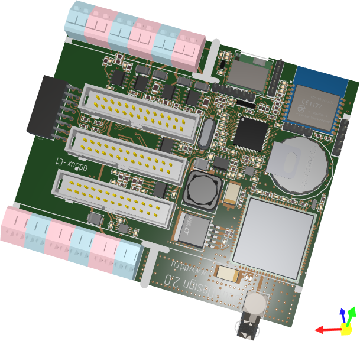

# Graphics 3D Control

`Graphics3DControl` позволяет отображать одну или несколько интерактивных 3D-моделей в окне вашего приложения Avalonia UI. Движок отрисовки контрола работает на API Vulkan v1.1.

Контрол поддерживает взаимодействие пользователя с моделями, позволяя вращать, панорамировать и масштабировать их с помощью мыши и клавиатуры.

Чтобы задать 3D-модели для `Graphics3DControl`, используйте API контрола. Этот API включает классы и члены для определения вершин, сеток, материалов (в формате PBR), настроек камеры, трансформаций моделей и т. д.

Основные возможности контрола включают:

- Построен на Vulkan SDK 1.1. См. [Системные требования](system-requirements.md).
- Отрисовка с аппаратным ускорением GPU с помощью Vulkan SDK
- Собственный API для задания 3D-моделей
- Простые материалы 
- Текстурированные материалы в формате PBR
- Одновременное отображение нескольких 3D-моделей
- Перспективный и изометрический режимы камеры
- Вращение, панорамирование и масштабирование модели мышью и клавиатурой во время работы
- Выбор и подсветка элементов модели.
- Отображение подсказок для элементов модели.
- Трансформации моделей
- Поддержка паттерна MVVM для задания 3D-моделей

## Визуальная тема для Graphics3DControl

Начиная с версии 1.3 библиотеки EMX Controls, для использования `Graphics3DControl` вы должны зарегистрировать визуальную тему `Controls3D` в файле _App.xaml_. Эта тема содержит общие настройки внешнего вида, необходимые для корректной отрисовки контрола. Дополнительную информацию смотрите в следующем разделе:

- [Регистрация визуальной темы для Graphics3DControl](get-started-with-graphics3dcontrol.md#предварительные-требования-регистрация-визуальной-темы-для-graphics3dcontrol)

!!! note

    Если визуальная тема `Controls3D` не зарегистрирована, `Graphics3DControl` будет отображаться пустым.

## Демо

Следующее демонстрационное приложение содержит примеры, демонстрирующие возможности компонента `Graphics3DControl`:

- [Eremex Avalonia Controls Demo](https://github.com/Eremex/controls-demo)

## Подробнее

- [Начало работы с Graphics3DControl](get-started-with-graphics3dcontrol.md)

- [Обзор Graphics3DControl](graphics3dcontrol-overview.md)

- [Системные требования](system-requirements.md)

 
 

* Эта страница переведена с использованием технологий машинного перевода.
