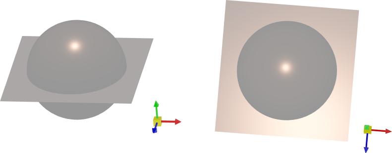

# Light

В Graphics3DControl источники света используются для освещения 3D-моделей. Вы можете использовать свет по умолчанию или создавать пользовательские источники света для вашей 3D-сцены.


## Свет по умолчанию

`Graphics3DControl` предоставляет свет по умолчанию «из коробки». Свет по умолчанию представляет собой белый точечный свет, связанный с камерой. Его направление всегда синхронизировано с направлением камеры.

Следующее изображение демонстрирует свет по умолчанию, отражённый от металлической плоскости. 


Фактический визуальный эффект любого света определяется [материалами](graphics3dcontrol-overview.md#материалы), применёнными к 3D-моделям.


#### Связанные опции

- `Graphics3DControl.AllowDefaultLight` (значение по умолчанию — `true`) — установите это свойство в `false`, чтобы принудительно отключить свет по умолчанию.

    Когда вы создаёте пользовательские источники света, свет по умолчанию автоматически отключается. 


## Пользовательские источники света


Чтобы добавить пользовательские источники света в 3D-сцену, создайте источники света и добавьте их в коллекцию `Graphics3DControl.Lights`. Вы также можете использовать свойства `Graphics3DControl.LightsSource` и `Graphics3DControl.LightTemplate`, чтобы добавлять пользовательские источники света в соответствии с паттерном MVVM.


`Graphics3DControl` поддерживает следующие типы источников света:

- Точечный свет (`PointLight`)
- Направленный свет (`DirectionalLight`)
- Точечный свет, связанный с камерой (`CameraPointLight`)
- Направленный свет, связанный с камерой (`CameraDirectionalLight`)

Все эти источники света имеют одного предка — абстрактный класс `Light`.

### Точечный свет

Излучает во всех направлениях (как лампочка). 

#### Класс

`PointLight`

#### Настройки
    
- `Color` — цвет света.
- `Position` — положение излучателя света.
- `Radius` — радиус излучателя света.

#### Пример

Следующий пример создаёт точечный свет цвета Coral. Изображение ниже демонстрирует этот свет, отражённый от металлической плоскости и сферы.


``` xml
<mx3d:Graphics3DControl.Lights>
    <mx3d:PointLight Color="{Binding MyLightColor}" Position="{Binding MyLightPosition}" Radius="10"/>
</mx3d:Graphics3DControl.Lights>
```
``` cs
PointLight myLight = new PointLight();
myLight.Color = Avalonia.Media.Colors.Coral;
myLight.Position = new Vector3(0, 50, 0);
myLight.Radius = 10;
g3DControl.Lights.Add(myLight);
```

### Направленный свет

Излучает параллельные лучи в заданном направлении, имитируя удалённое освещение (как солнечный свет).


#### Класс

`DirectionalLight`

#### Настройки

- `Color` — цвет света.
- `Direction` — вектор, задающий направление лучей света.

#### Пример


Следующий пример добавляет источник направленного света, направленный в сторону отрицательной оси Y. Изображение ниже демонстрирует этот свет, отражённый от металлической плоскости и сферы.




``` xml
<mx3d:Graphics3DControl.Lights>
    <mx3d:DirectionalLight Color="{Binding MyLightColor}" Direction="{Binding MyLightDirection}"/>
</mx3d:Graphics3DControl.Lights>
```
``` cs
using Eremex.AvaloniaUI.Controls3D;

DirectionalLight myLight = new DirectionalLight();
myLight.Direction = new System.Numerics.Vector3(0, -1, 0);
myLight.Color = Avalonia.Media.Colors.Coral;
g3DControl.Lights.Add(myLight);
```


### Точечный свет, связанный с камерой

Точечный свет, излучаемый из камеры. Положение и направление этого света синхронизированы с положением и направлением камеры.

#### Класс

`CameraPointLight`

#### Настройки

- `Color` — цвет света.
- `Radius` — радиус излучателя света.

#### Пример 

Следующий пример создаёт точечный свет, связанный с камерой. Изображение ниже демонстрирует этот свет, отражённый от металлической плоскости и сферы.


``` xml
<mx3d:Graphics3DControl.Lights>
    <mx3d:CameraPointLight Color="{Binding MyLightColor}" Radius="10"/>
</mx3d:Graphics3DControl.Lights>
```
``` cs
using Eremex.AvaloniaUI.Controls3D;

CameraPointLight myLight = new CameraPointLight();
myLight.Radius = 10;
myLight.Color = Avalonia.Media.Colors.Coral;
g3DControl.Lights.Add(myLight);
```


### Направленный свет, связанный с камерой

Излучает параллельные лучи в направлении камеры, имитируя удалённое освещение (как солнечный свет).

#### Класс

`CameraDirectionalLight`

#### Настройки

- `Color` — цвет света.


#### Пример 

Следующий пример создаёт направленный свет, связанный с камерой. Изображение ниже демонстрирует этот свет, отражённый от металлической плоскости и сферы.


``` xml
<mx3d:Graphics3DControl.Lights>
    <mx3d:CameraDirectionalLight Color="{Binding MyLightColor}"/>
</mx3d:Graphics3DControl.Lights>
```
``` cs
using Eremex.AvaloniaUI.Controls3D;

CameraDirectionalLight myLight = new CameraDirectionalLight();
myLight.Color = Avalonia.Media.Colors.Coral;
g3DControl.Lights.Add(myLight);
```


<!-- TODO

### Add Lights Using the MVVM Approach

- `Graphics3DControl.LightsSource` — Supports the MVVM design patters. The `LightsSource` property is a collection of business objects  -->


<br>
<br>

<sup>*</sup> Эта страница переведена с использованием технологий машинного перевода.
