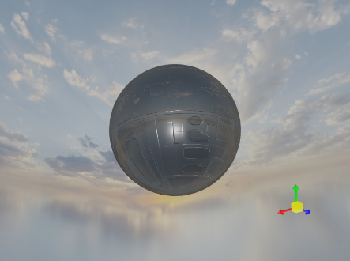

# Skybox

`Graphics3DControl` поддерживает скайбокс. Скайбокс — это техника, используемая для создания погружающего фона вокруг 3D-сцены.

Скайбокс состоит из большого куба, окружающего всю сцену, с шестью текстурированными гранями (передней, задней, левой, правой, верхней и нижней). Эти текстуры отображаются на внутренних сторонах куба, создавая иллюзию далёкого неба, горизонта или другого фона. Текстуры разработаны так, чтобы идеально совпадать на своих краях, обеспечивая бесшовную визуальную непрерывность при просмотре изнутри куба.

Скайбокс по умолчанию скрыт. Однако, если модель использует металлический материал, скайбокс может появляться в её отражениях.

## Включение скайбокса

Чтобы сделать скайбокс видимым, инициализируйте свойство `Graphics3DControl.Skybox` объектом `Skybox` и установите свойство `Skybox.IsVisible` в `true`.

``` xml
xmlns:mx3d="https://schemas.eremexcontrols.net/avalonia/controls3d"

<mx3d:Graphics3DControl Name="g3DControl1">
    <mx3d:Graphics3DControl.Skybox>
        <mx3d:Skybox IsVisible="True"/>
    </mx3d:Graphics3DControl.Skybox>
</mx3d:Graphics3DControl>
```

## Задание пользовательских текстур скайбокса

Чтобы создать пользовательский скайбокс, вам нужно задать шесть отдельных текстур (растровых изображений), которые будут отображены на переднюю, заднюю, левую, правую, верхнюю и нижнюю грани куба скайбокса.


- Все текстуры скайбокса должны быть одного размера.
- Каждая текстура должна иметь квадратное соотношение сторон (1:1), чтобы предотвратить искажения при отображении на грани куба.

Используйте следующие свойства объекта `Skybox`, чтобы предоставить текстуры скайбокса для граней куба:

 - `Skybox.Top`
 - `Skybox.Bottom`
 - `Skybox.Left`
 - `Skybox.Right`
 - `Skybox.Front`
 - `Skybox.Rear`


### Пример

Следующий код демонстрирует, как можно задать пользовательские текстуры скайбокса в XAML. Текстуры хранятся в папке проекта _G3dControlSample/Resources/Textures_ и имеют свойство `Build Action`, установленное в `AvaloniaResource`.

``` xml
xmlns:mx3d="https://schemas.eremexcontrols.net/avalonia/controls3d"

<mx3d:Graphics3DControl Name="g3DControl1"  ModelsSource="{Binding Models}">
    <mx3d:Graphics3DControl.Gizmo>
        <mx3d:Gizmo x:Name="Gizmo" />
    </mx3d:Graphics3DControl.Gizmo>
    <mx3d:Graphics3DControl.Skybox>
        <mx3d:Skybox IsVisible="True"
                     Top="avares://G3dControlSample/Resources/Textures/py.png"
                     Bottom="avares://G3dControlSample/Resources/Textures/ny.png"
                     Left="avares://G3dControlSample/Resources/Textures/nx.png"
                     Right="avares://G3dControlSample/Resources/Textures/px.png"
                     Front="avares://G3dControlSample/Resources/Textures/pz.png"
                     Rear="avares://G3dControlSample/Resources/Textures/nz.png"
                     />
    </mx3d:Graphics3DControl.Skybox>
    <mx3d:Graphics3DControl.Materials>
        <mx3d:SimplePbrMaterial Metallic="0.6" />
    </mx3d:Graphics3DControl.Materials>
</mx3d:Graphics3DControl>
```
Изображение ниже демонстрирует пример модели с пользовательским скайбоксом:



## Пример - отключение отражений для металлических материалов 

Когда 3D-модель использует металлический материал, поверхность отражает свет по умолчанию и скайбокс. Чтобы предотвратить эти отражения для металлических материалов, сделайте следующее:

- Отключите свет по умолчанию с помощью свойства `Graphics3DControl.AllowDefaultLight`.
- Примените белое растровое изображение ко всем граням куба скайбокса.


Следующий код показывает, как можно предотвратить отражения в code-behind:

``` cs
g3DControl.Exposure = 4.5f;
g3DControl.AllowDefaultLight = false;
Skybox skybox = new Skybox();
skybox.IsVisible = false;
Bitmap whiteBitmap = getSolidColorBitmap(Colors.White);
skybox.Top = skybox.Bottom = whiteBitmap;
skybox.Left = skybox.Right = whiteBitmap;
skybox.Rear = skybox.Front = whiteBitmap;
g3DControl.Skybox = skybox;

Bitmap getSolidColorBitmap(Color fillColor)
{
    var bitmap = new RenderTargetBitmap(new PixelSize(100, 100));
    using (var context = bitmap.CreateDrawingContext())
    {
        Brush brush = new SolidColorBrush(fillColor);
        context.FillRectangle(brush, new Rect(0, 0, 100, 100));
    }
    return bitmap;
}
```


<br>
<br>

<sup>*</sup> Эта страница переведена с использованием технологий машинного перевода.
