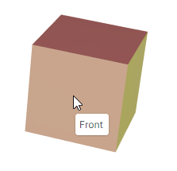
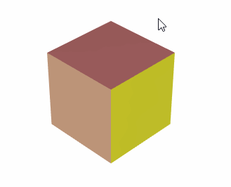

# Взаимодействие пользователя с 3D-моделями

`Graphics3DControl` позволяет пользователям взаимодействовать с 3D-моделями. Пользователи могут вращать, масштабировать и панорамировать (перемещать) модели с помощью мыши и клавиатуры. Кроме того, вы можете разрешить пользователям выбирать элементы модели щелчком мыши или подсвечивать элементы при наведении на них мышью. 
`Graphics3DControl` также поддерживает всплывающие подсказки для моделей и их элементов (сеток).

## Вращение модели

#### Сочетания клавиш

- Повернуть влево — Shift+Стрелка влево
- Повернуть вправо — Shift+Стрелка вправо
- Повернуть вверх — Shift+Стрелка вверх
- Повернуть вниз — Shift+Стрелка вниз


#### Операции мышью

- Вращение — перетаскивайте модель левой кнопкой мыши.

### Опции вращения

- `Graphics3DControl.RotateStep` — позволяет управлять скоростью вращения. Свойство `RotateStep` задаётся во внутренних единицах. Значение по умолчанию — 20. Более высокое значение приводит к большей скорости вращения. 

<!-- TODO
Check the property in the demo. 
 -->

## Масштабирование модели

#### Сочетания клавиш

- Приблизить — CTRL+клавиша «плюс»
- Отдалить — CTRL+клавиша «минус»

#### Операции мышью

- Масштабирование — используйте колесо прокрутки мыши для приближения и отдаления.

### Опции масштабирования

- `Graphics3DControl.ZoomRate` — управляет скоростью операций масштабирования, выполняемых с помощью клавиатуры и колеса мыши. Значение по умолчанию — 0.1. Более высокое значение увеличивает скорость масштабирования.

## Перемещение модели

#### Сочетания клавиш

- Переместить влево — CTRL+Стрелка влево
- Переместить вправо — CTRL+Стрелка вправо
- Переместить вверх — CTRL+Стрелка вверх
- Переместить вниз — CTRL+Стрелка вниз

#### Операции мышью

- Перемещение — перетаскивайте модель правой кнопкой мыши.

### Опции перемещения

- Свойство `Graphics3DControl.KeyboardMoveStep` — позволяет задать расстояние, на которое сдвигается модель за одну операцию перемещения с клавиатуры.

<!-- TODO
which units ?
 -->

## Вращение, масштабирование и перемещение моделей в коде

Чтобы просмотреть модель из определённого положения и под определённым углом в коде, вам нужно настроить положение и ориентацию камеры. Дополнительную информацию смотрите в следующем разделе:

- [Camera](camera.md)


## Переопределение сочетаний клавиш

Свойство `Graphics3DControl.NavigationBindings` класса `Graphics3DKeyBindings` позволяет переопределять сочетания клавиш по умолчанию. Класс `Graphics3DKeyBindings` содержит свойства, определяющие сочетания клавиш для операций масштабирования, вращения и панорамирования. Изначально эти свойства установлены в сочетания по умолчанию, перечисленные выше. Вы можете использовать эти свойства, чтобы назначить операциям пользовательские сочетания клавиш.

Следующий код назначает сочетания CTRL+1 и CTRL+2 операциям приближения и отдаления.

``` cs
g3DControl.NavigationBindings = new Graphics3DKeyBindings();
Graphics3DKeyBinding zoomInShortcut = new Graphics3DKeyBinding(Avalonia.Input.KeyModifiers.Control, Avalonia.Input.Key.D1);
Graphics3DKeyBinding zoomOutShortcut = new Graphics3DKeyBinding(Avalonia.Input.KeyModifiers.Control, Avalonia.Input.Key.D2);
g3DControl.NavigationBindings.ZoomIn = zoomInShortcut;
g3DControl.NavigationBindings.ZoomOut = zoomOutShortcut;
```

## Показ подсказок

`Graphics3DControl` может отображать подсказки, когда пользователь наводит курсор на модели или отдельные сетки. 



Используйте следующие свойства, чтобы назначать подсказки моделям, сеткам или одновременно и моделям, и сеткам:

- `GeometryModel3D.Hint` — подсказка для модели.
- `MeshGeometry3D.Hint` — подсказка для сетки.

Следующий пример задаёт подсказки для модели и её сеток. Подсказки для сеток указывают их имена.

``` xml
<mx3d:GeometryModel3D x:Name="Cube" MeshesSource="{Binding Meshes}" Hint="Cube">
    <mx3d:GeometryModel3D.MeshTemplate>
        <DataTemplate x:DataType="vm:MeshViewModel">
            <mx3d:MeshGeometry3D 
                Name="{Binding Name}" 
                Hint="{Binding Name}"
                ...
            />
        </DataTemplate>
    </mx3d:GeometryModel3D.MeshTemplate>
</mx3d:GeometryModel3D>
```
``` cs
public partial class MeshViewModel : ObservableObject
{
    [ObservableProperty] string name;
    [ObservableProperty] Vertex3D[] vertices;
    //...
}
```

Когда подсказки заданы и для модели, и для сетки, эти подсказки объединяются в одну подсказку, разделённую символом-разделителем «,».



Установите свойство `Graphics3DControl.ShowHints` в `false`, чтобы отключить подсказки. Это свойство имеет значение по умолчанию `true`.

## Подсветка элементов

`Graphics3DControl` поддерживает подсветку моделей и сеток. С помощью этой функции контрол рисует рамку подсветки вокруг модели/сетки, когда пользователь наводит на неё курсор.


Используйте свойство `Graphics3DControl.HighlightMode`, чтобы включить функцию подсветки и задать режим подсветки. Доступны следующие опции:

- `Mesh` — включает подсветку отдельных сеток.
- `Model` — включает подсветку отдельных моделей.
- `None` (по умолчанию) — функция подсветки отключена.

**Связанный API**

- `Graphics3DControl.HighlightedElement` — возвращает или задаёт текущий подсвеченный элемент.
- `Graphics3DControl.HighlightColor` — возвращает или задаёт цвет, используемый для рисования рамки подсветки вокруг подсвеченных элементов.


## Выбор элементов

Вы можете включить функцию выбора, чтобы позволить пользователю выбирать элементы (модели или сетки) щелчком мыши. Рамка выбора рисуется вокруг элемента, когда пользователь щёлкает по нему.


Используйте свойство `Graphics3DControl.SelectionMode`, чтобы активировать функцию выбора и задать режим выбора. Доступные опции:

- `Mesh` — включает выбор отдельных сеток по щелчку мыши.
- `Model` — включает выбор отдельных моделей по щелчку мыши.
- `None` (по умолчанию) — функция выбора отключена.


**Связанный API**

- `Graphics3DControl.SelectedElement` — возвращает или задаёт текущий выбранный элемент.
- `Graphics3DControl.SelectionColor` — возвращает или задаёт цвет, используемый для рисования рамки вокруг выбранных элементов.


## Смотрите также

- [Camera](camera.md)


<br>
<br>

<sup>*</sup> Эта страница переведена с использованием технологий машинного перевода.
