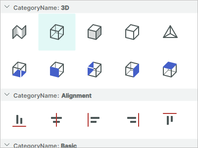
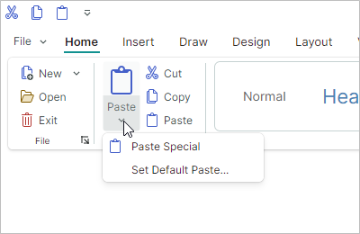
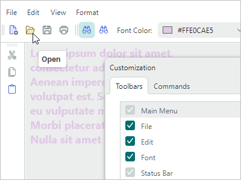
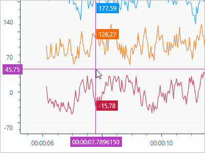
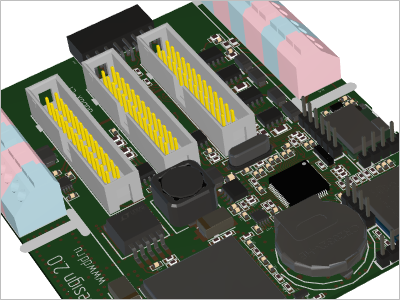
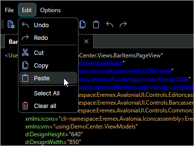

# Контролы

## Контролы управления данными

| 

 | col 2 |
| --- | --- |
| **Data Grid** |  |
|  | Отображает данные из источника элементов в виде двумерной таблицы и предоставляет богатые возможности форматирования и редактирования данных.  - Поддержка больших источников данных - Несвязанные данные - Сортировка и группировка данных - Встроенные редакторы - Поиск и фильтрация данных - Множественное выделение строк - Перетаскивание строк - Валидация данных - Встроенные и пользовательские контекстные меню - Бэнды колонок [Подробнее...](datagrid/index.md) |  
| **Tree List и Tree View** |
|  | Отображает иерархические данные в виде дерева. Tree List поддерживает несколько колонок данных, тогда как Tree View — это одноколоночный контрол.  - Привязка к самореферентным (плоским) и иерархическим источникам данных - Несвязанный режим (позволяет вручную задавать данные) - Множественное выделение строк - Выбор строк с помощью встроенных флажков - Сортировка данных - Встроенные редакторы - Поиск и фильтрация данных - Перетаскивание строк - Валидация данных - Встроенные и пользовательские контекстные меню - Бэнды колонок [Подробнее...](treelist/index.md) | 
| **Property Grid** |
|  | Эффективное решение для просмотра и редактирования свойств одного или нескольких объектов.   - Автоматическая генерация строк из публичных свойств привязанного объекта (объектов) - Режим ручного создания строк - Объединение строк в строки-категории - Объединение строк во встроенные вкладки - Панель поиска (для быстрого нахождения строк) - Встроенные редакторы [Подробнее...](propertygrid/index.md) | 
| **List View** |
|  | Расширенный список, отображающий элементы в соответствии с вашим шаблоном. Поддерживает сортировку, группировку, фильтрацию и множественное выделение элементов.  - Два режима размещения элементов: `Stack` (одна колонка элементов) и `Wrap` (многоколоночное размещение с переносом элементов)  - Отображение элементов ListView произвольным образом в соответствии с вашим шаблоном - Сортировка и группировка элементов по неограниченному числу свойств - Фильтрация элементов с помощью события - Режимы одиночного и множественного выделения [Подробнее...](listview/index.md) | 

## Контролы навигации и компоновки

| 

 | col 2 |
| --- | --- |
| **Ribbon** |
|  | Меню, вдохновлённое ленточным интерфейсом (ribbon) из продуктов Microsoft Office.  - Классический и упрощённый виды - Поддержка всех типов элементов (команд), доступных в [традиционных меню](toolbars-and-menus/index.md): обычные кнопки, кнопки-флажки, редакторы, надписи, подменю и группы кнопок. - Встроенные и выпадающие галереи - Панель быстрого доступа — пользователь может во время работы добавлять на неё часто используемые команды через контекстное меню. - Настройка положения панели быстрого доступа (над или под командной панелью Ribbon) и её видимости - Отображение элементов в области заголовков вкладок - Раскраска заголовков вкладок (позволяет выделять контекстные вкладки)- Навигация по элементам Ribbon с клавиатуры - Адаптивная компоновка групп и элементов (перестраивает расположение команд при изменении ширины контрола Ribbon) [Подробнее...](ribbon/index.md) |
| **Панели инструментов и меню** |  |
|  | Традиционные панели инструментов и меню для ваших приложений.  - Поддерживаемые типы элементов панели инструментов: кнопки, кнопки-флажки, подменю, группы элементов и другие - Закрепление панелей инструментов у краёв контейнера - Размещение панелей инструментов в любом месте окна (например, над клиентскими контролами) - Горизонтальная и вертикальная ориентация панелей инструментов - Адаптивная компоновка команд - Настройка компоновки панелей инструментов во время работы с помощью перетаскивания - Режим настройки во время работы для расширенной персонализации панелей инструментов - Быстрая настройка (без необходимости активировать режим настройки) - Отображение значений на панелях инструментов и возможность редактировать их с помощью встроенных редакторов - Поддержка горячих клавиш, включая сложные сочетания, такие как Ctrl+R, Ctrl+K - Контекстные меню для внешних контролов [Подробнее...](toolbars-and-menus/index.md) | 
| **Интерфейс Докинга** |
|  | Классический интерфейс докинга, вдохновлённый IDE Microsoft Visual Studio.  - Dock-панели помогают создавать инструментальные панели - Документы (встроенные закрепляемые окна) позволяют отображать основное содержимое интерфейса - Плавающие панели - Функция автоскрытия панелей - Контейнеры вкладок - Изменение размера панелей и перетаскивание - Подсказки докинга - Встроенные контекстные меню для выполнения операций над панелями и документами - Поддержка MVVM - Докинг на нескольких мониторах - Сохранение и восстановление размещения dock-панелей между запусками приложения [Подробнее...](docking/index.md) |

## Контролы визуализации данных

| 

 | col 2 |
| --- | --- |
| **Контролы диаграмм** |  |
|  | Контролы `CartesianChart`, `PolarChart` и `SmithChart` позволяют интегрировать наиболее популярные интерактивные графики в интерфейс вашего приложения.  - Неограниченное число серий данных - Поддерживаемые представления: Line, Bar, Range Bar, Step Line, Candlestick и другие - Несколько типов осей: числовые, дата-время, интервал времени, качественные и логарифмические - Прокрутка и масштабирование всего представления и отдельных осей - Высокая производительность при отображении больших объёмов данных. - Визуализация данных в реальном времени. [Подробнее...](charts/index.md) | 
| **Контрол Heatmap** |  |
|  | Двумерная тепловая карта — диаграмма, визуализирующая данные с помощью окрашенных точек.  - 2D-представление числовых значений цветом - Настройка осей X и Y - Перекрестие (crosshair) - Полосы и постоянные линии - Прокрутка и масштабирование мышью - Экспорт отрисовки в растровое изображение [Подробнее...](charts/heatmap.md) | 

## 3D-графика

| 

 | col 2 |
| --- | --- |
| **Контрол Graphics3D** |  |
|  | Позволяет визуализировать 3D-модели в ваших приложениях Avalonia.  - API для задания 3D-моделей - Простые материалы - Текстурированные материалы в формате PBR - Одновременное отображение нескольких 3D-моделей - Перспективный и изометрический режимы камеры - Вращение, панорамирование и масштабирование модели мышью и клавиатурой во время работы - Отрисовка на видеокарте с помощью Vulkan SDK - Поддержка паттерна MVVM для задания 3D-моделей [Подробнее...](graphics3dcontrol/index.md) | 

## Редакторы и вспомогательные контролы
| 

 | col 2 |
| --- | --- |
| **Редакторы данных** |  |
|  | Простые и продвинутые редакторы, которые позволяют пользователям редактировать практически всё — от текста и чисел до значений даты/времени и цветов. Их можно использовать как самостоятельные контролы или как встроенные редакторы   - ButtonEditor - CheckEditor - ComboBoxEditor - DateEditor - HyperlinkEditor - MemoEditor - PopupColorEditor - SegmentedEditor - SpinEditor - TextEditor  [Подробнее...](editors/index.md) |
| **Вспомогательные контролы** |  |
|  | Набор полезных контролов, поставляемых с библиотекой Eremex Controls, позволяет создавать функционально насыщенные приложения.  - TabControl -  SplitContainerControl -  GroupBox -  CalendarControl -  MxMessageBox -  CircleProgressIndicator [Подробнее...](utility-controls/index.md) |

## Визуальные темы Eremex

Библиотека контролов Eremex поставляется с визуальной темой «DeltaDesign», которая помогает создавать интерфейсы со светлой и тёмной цветовыми палитрами.

| 

 | 

 |
| --- | --- |
| **Светлая тема DeltaDesign** | **Тёмная тема DeltaDesign** |
|  |  |
|  |  |

Дополнительную информацию смотрите в следующем разделе: 

- [Визуальные темы](themes/index.md)

 
 

* Эта страница переведена с использованием технологий машинного перевода.
