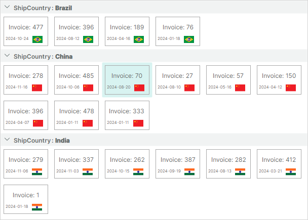
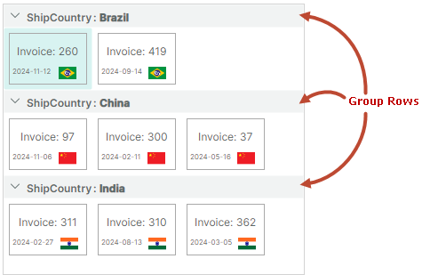
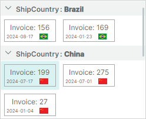
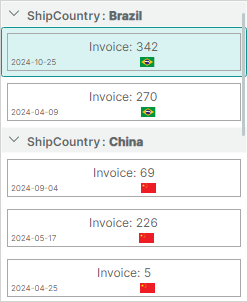

# Начало работы с контролом ListView

[ListViewControl](listview-overview.md) позволяет отображать список элементов в одной или нескольких колонках. Контрол поддерживает сортировку, группировку, фильтрацию и множественное выделение элементов. 


<!-- TODO
Поставить точку останова в MainWindowViewModel на строке
focusedItem = value;
После этого, селекшн не снимается с предыдущего выделенного айтема при выборе нового айтема
 -->

Это руководство показывает, как использовать контрол `ListViewControl` для реализации списка элементов, а также сортировать и группировать элементы по их свойствам. 



Контрол ListView можно заполнить элементами из источника элементов. Чтобы отрисовать привязанные элементы, вам нужно предоставить шаблон элемента. При использовании контрола ListView вы можете создавать сложные шаблоны элементов, состоящие из нескольких полей.
Этот пример создаёт шаблон элемента, определяющий рамку с SVG-изображением и текстовыми блоками внутри.

## Создание нового приложения
Создайте новое [приложение Eremex Avalonia .NET MVVM](../../get-started/index.md). Назовите его _ListView-example_.


Чтобы отображать SVG-изображения, добавьте в проект NuGet-пакет `Avalonia.Svg.Skia`.

## Определение источника элементов

В файле _MainWindowViewModel.cs_ создайте класс _ItemViewModel_, инкапсулирующий объект элемента. 

``` cs
public partial class ItemViewModel : ObservableObject
{
    [ObservableProperty] private int invoiceId;
    [ObservableProperty] private string shipCountry;
    [ObservableProperty] private DateTime date;
    [ObservableProperty] private IImage flag;

    public ItemViewModel(int id, string shipCountry, IImage flag)
    {
        InvoiceId = id;
        ShipCountry = shipCountry;
        Random random = new Random();
        Date = new DateTime(DateTime.Now.Year, random.Next(1, 12), random.Next(1, 28));
        Flag = flag;
    }
}
```

Свойства _InvoiceId_, _Date_ и _Flag_, предоставляемые классом _ItemViewModel_, содержат значения для отображения в элементах ListView. Свойство _ItemViewModel.ShipCountry_ задаёт страну доставки, связанную с элементом. Элементы ListView будут группироваться по этому свойству.

Создайте и инициализируйте коллекцию _Items_ в классе _MainWindowViewModel_, как показано ниже. Следующий код заполняет коллекцию _Items_ тремя наборами элементов. Каждый набор элементов связан со своей страной доставки (_China_, _Brazil_ и _India_).

``` cs
using CommunityToolkit.Mvvm.ComponentModel;
using Avalonia.Svg.Skia;
using Eremex.AvaloniaUI.Controls.Utils;

public partial class MainWindowViewModel : ViewModelBase
{
    [ObservableProperty] 
    private List<ItemViewModel> items;

    public MainWindowViewModel()
    {
        SvgImage chinaFlag = ImageLoader.LoadSvgImage(Assembly.GetExecutingAssembly(), "Assets/china-flag.svg");
        SvgImage indiaFlag = ImageLoader.LoadSvgImage(Assembly.GetExecutingAssembly(), "Assets/india-flag.svg");
        SvgImage brazilFlag = ImageLoader.LoadSvgImage(Assembly.GetExecutingAssembly(), "Assets/brazil-flag.svg");

        Random random = new Random();
        Items = new List<ItemViewModel>();
        for (int i = 1; i < 10; i++)
        {
            Items.Add(new ItemViewModel(random.Next(500), "China", chinaFlag));
        }
        
        for (int i = 1; i < 5; i++)
        {
            Items.Add(new ItemViewModel(random.Next(500), "Brazil", brazilFlag));
        }

        for (int i = 1; i < 8; i++)
        {
            Items.Add(new ItemViewModel(random.Next(500), "India", indiaFlag));
        }
    }
}
```

Метод `Eremex.AvaloniaUI.Controls.Utils.ImageLoader.LoadSvgImage` используется для загрузки SVG-изображений, хранящихся в определённой папке текущего проекта. Предполагается, что SVG-изображения размещены в папке _Assets_ и имеют свойство `Build Action`, установленное в `AvaloniaResource`. Убедитесь, что пакет `Avalonia.Svg.Skia` включён в проект.

## Создание контрола ListView

Откройте файл _MainWindow.axaml_ и определите компонент `ListViewControl` в XAML.

``` xml
xmlns:mxlv="https://schemas.eremexcontrols.net/avalonia/listview"

<mxlv:ListViewControl Name="listViewControl1">
</mxlv:ListViewControl>
```

## Привязка ListView к коллекции элементов

Убедитесь, что DataContext главного окна и, следовательно, DataContext ListView установлен в объект _MainWindowViewModel_. См. файл _App.axaml.cs_, который назначает DataContext главному окну.

Привяжите ListView к коллекции элементов, определённой в классе _MainWindowViewModel_, с помощью свойства `ListViewControl.ItemsSource`.

``` xml
<mxlv:ListViewControl Name="listViewControl1" ItemsSource="{Binding Items}">
</mxlv:ListViewControl>
```

## Определение шаблона элемента

В контроле ListView нет отрисовки элементов по умолчанию. Чтобы отрисовывать элементы определённым образом, задайте шаблон элемента из свойства `ListViewControl.ItemTemplate`.

В коде ниже шаблон элемента определяет объект Grid с рамкой с двумя текстовыми блоками и изображением внутри. Текстовые блоки отображают значения свойств _ItemViewModel.InvoiceId_ и _ItemViewModel.Date_ соответственно. Контрол Image привязан к свойству _ItemViewModel.Flag_, которое хранит SVG-изображение. 


``` xml
<mxlv:ListViewControl Name="listViewControl1" ItemsSource="{Binding Items}">
    <mxlv:ListViewControl.ItemTemplate>
        <DataTemplate DataType="vm:ItemViewModel">
            <Border BorderBrush="DarkGray" BorderThickness="1">
                <Grid RowDefinitions="2*, *" Margin="3">
                    <TextBlock Text="{Binding InvoiceId, StringFormat={}Invoice: {0}}" HorizontalAlignment="Center" VerticalAlignment="Center"/>
                    <DockPanel Grid.Row="1" VerticalAlignment="Center">
                        <TextBlock Text="{Binding Date, StringFormat=yyyy-MM-dd}" FontSize="8" DockPanel.Dock="Left"/>
                        <Image Width="20"  DockPanel.Dock="Right" Source="{Binding Flag}"/>
                    </DockPanel>
                </Grid>
            </Border>
        </DataTemplate>
    </mxlv:ListViewControl.ItemTemplate>
</mxlv:ListViewControl>
```

## Задание размера элемента

Контрол ListView вычисляет размер элемента по умолчанию по первому элементу и применяет его к остальным элементам. Таким образом, все элементы ListView имеют одинаковый размер отображения.

Если размер элемента по умолчанию не соответствует вашим потребностям, вы можете использовать свойства `ListViewControl.ItemWidth` и `ListViewControl.ItemHeight`, чтобы задать пользовательский размер элемента. Код ниже применяет пользовательский размер к элементам ListView.

``` xml
<mxlv:ListViewControl Name="listViewControl1" ItemsSource="{Binding Items}" 
    ItemHeight="70" ItemWidth="100">
```


## Группировка элементов

Вы можете сортировать и/или группировать элементы ListView по неограниченному числу свойств элементов. Когда вы группируете по свойству, создаются групповые строки, объединяющие элементы. Обратите внимание, что групповые строки автоматически сортируются по свойству группировки. 



Коллекция `ListViewControl.SortInfo` определяет свойства элементов, используемые для сортировки и группировки элементов. 
Чтобы сгруппировать элементы, сделайте следующее:

- Добавьте объект (объекты) `ListViewSortInfo` в коллекцию `ListViewControl.SortInfo`. Установите член `ListViewSortInfo.FieldName` в свойство элемента, по которому нужно группировать элементы. При необходимости используйте свойство `ListViewSortInfo.SortDirection`, чтобы выбрать между порядком сортировки по возрастанию и убыванию, в котором располагаются групповые строки.
- Установите свойство `ListViewControl.GroupCount` в число уровней группировки (свойств группировки). `ListViewControl.GroupCount` задаёт, сколько объектов `ListViewSortInfo`, начиная с начала коллекции `ListViewControl.SortInfo`, используется для группировки данных. Если вы группируете по одному свойству, установите `GroupCount` в `1`. Если вы группируете по двум свойствам, установите `GroupCount` в `2`, и так далее.

Следующий код реализует группировку элементов по свойству _ShipCountry_:

``` xml
<mxlv:ListViewControl Name="listViewControl1" ItemsSource="{Binding Items}" 
        ItemHeight="40" ItemWidth="60"
        GroupCount="1">
    <mxlv:ListViewControl.SortInfo>
        <mxlv:ListViewSortInfo FieldName="ShipCountry" SortDirection="Ascending" />
    </mxlv:ListViewControl.SortInfo>
    <!-- ... -->
</mxlv:ListViewControl>
```

## Сортировка элементов

Давайте отсортируем элементы в каждой группе по свойству _Date_ в порядке убывания. Для этого добавьте новый объект `ListViewSortInfo` в коллекцию `ListViewControl.SortInfo` и установите его члены `ListViewSortInfo.FieldName` и `ListViewSortInfo.SortDirection` в соответствующие значения.

``` xml
<mxlv:ListViewControl.SortInfo>
    <mxlv:ListViewSortInfo FieldName="ShipCountry" SortDirection="Ascending" />
    <mxlv:ListViewSortInfo FieldName="Date" SortDirection="Descending" />
</mxlv:ListViewControl.SortInfo>
```

Поскольку свойство `ListViewControl.GroupCount` установлено в `1`, первый объект `ListViewSortInfo` в коллекции `ListViewControl.SortInfo` задаёт поле, используемое для группировки данных. Второй объект `ListViewSortInfo` относится к полю, используемому только для сортировки данных.

## Выбор режима размещения элементов

ListView поддерживает два режима размещения элементов, которые вы можете выбрать с помощью свойства `ListViewControl.ItemLayoutMode`:

- `ListViewItemLayoutMode.Wrap` (по умолчанию) — элементы размещаются слева направо, затем вниз. Они автоматически переносятся у правого края контрола, создавая несколько строк.

    

- `ListViewItemLayoutMode.Stack` — элементы размещаются в вертикальный список. Они растягиваются, чтобы заполнить ширину LayoutView.

    

В этом руководстве мы будем придерживаться режима размещения `Wrap` по умолчанию.


## Получение сфокусированного (выбранного) элемента

Когда пользователь щёлкает по конкретному элементу мышью или клавиатурой в режиме одиночного выбора, сфокусированный элемент меняется. Вы можете использовать свойство `ListViewControl.FocusedItem` или `ListViewControl.FocusedItemIndex`, чтобы определить сфокусированный элемент.

Следующий код определяет свойство _FocusedItem_ в главной View Model и привязывает член `ListViewControl.FocusedItem` к этому свойству.

```cs
//MainWindowViewModel.cs
public partial class MainWindowViewModel : ViewModelBase
{
    //...
    ItemViewModel focusedItem;
    ItemViewModel FocusedItem {
        get {
            return focusedItem;
        }
        set
        {
            if (value != focusedItem)
            {
                focusedItem = value;
                // Perform actions when the focused item changes.
            }
        }
    }
}
```

```xml
<!-- MainWindow.axaml -->
<mxlv:ListViewControl Name="listViewControl1" ItemsSource="{Binding Items}"
                      ItemHeight="70" ItemWidth="100"
                      GroupCount="1"
                      FocusedItem="{Binding FocusedItem, Mode=TwoWay}"
                      >
```

Чтобы позволить одновременно выбирать несколько элементов, установите свойство `ListViewControl.SelectionMode` в `Multiple`. В этом случае вы можете получить выбранные элементы из коллекции `ListViewControl.SelectedItems`.

## Результат

Вы можете собрать и запустить приложение, чтобы увидеть следующий результат:


## Полный код

_MainWindow.axaml_:

``` xml 
<mx:MxWindow xmlns="https://github.com/avaloniaui"
        xmlns:x="http://schemas.microsoft.com/winfx/2006/xaml"
        xmlns:vm="using:ListView_example.ViewModels"
        xmlns:d="http://schemas.microsoft.com/expression/blend/2008"
        xmlns:mc="http://schemas.openxmlformats.org/markup-compatibility/2006"
        xmlns:mx="https://schemas.eremexcontrols.net/avalonia"
        mc:Ignorable="d" d:DesignWidth="800" d:DesignHeight="450"
        x:Class="ListView_example.Views.MainWindow"
        x:DataType="vm:MainWindowViewModel"
        Icon="/Assets/EMXControls.ico"
        Title="ListView_example"
        xmlns:mxlv="https://schemas.eremexcontrols.net/avalonia/listview"
        >

    <Design.DataContext>
        <!-- This only sets the DataContext for the previewer in an IDE,
             to set the actual DataContext for runtime, set the DataContext property in code (look at App.axaml.cs) -->
        <vm:MainWindowViewModel/>
    </Design.DataContext>
    <Border BorderBrush="LightGray" BorderThickness="1" Margin="5">
        <mxlv:ListViewControl Name="listViewControl1" ItemsSource="{Binding Items}"
                              ItemHeight="70" ItemWidth="100"
                              GroupCount="1"
                              FocusedItem="{Binding FocusedItem, Mode=TwoWay}" SelectionMode="Multiple" SelectedItems=""
                              >
            <mxlv:ListViewControl.SortInfo>
                <mxlv:ListViewSortInfo FieldName="ShipCountry" SortDirection="Ascending" />
                <mxlv:ListViewSortInfo FieldName="Date" SortDirection="Descending" />
            </mxlv:ListViewControl.SortInfo>

            <mxlv:ListViewControl.ItemTemplate>
                <DataTemplate DataType="vm:ItemViewModel">
                    <Border BorderBrush="DarkGray" BorderThickness="1">
                        <Grid RowDefinitions="2*, *" Margin="3">
                            <TextBlock Text="{Binding InvoiceId, StringFormat={}Invoice: {0}}" HorizontalAlignment="Center" VerticalAlignment="Center"/>
                            <DockPanel Grid.Row="1" VerticalAlignment="Center">
                                <TextBlock Text="{Binding Date, StringFormat=yyyy-MM-dd}" FontSize="8" DockPanel.Dock="Left"/>
                                <Image Width="20"  DockPanel.Dock="Right" Source="{Binding Flag}"/>
                            </DockPanel>
                        </Grid>
                    </Border>
                </DataTemplate>
            </mxlv:ListViewControl.ItemTemplate>
        </mxlv:ListViewControl>
    </Border>
</mx:MxWindow>
```

_MainWindowViewModel.cs_:

``` cs
using Avalonia.Media;
using Avalonia.Svg.Skia;
using CommunityToolkit.Mvvm.ComponentModel;
using Eremex.AvaloniaUI.Controls.ListView;
using Eremex.AvaloniaUI.Controls.Utils;
using System;
using System.Collections.Generic;
using System.Reflection;
using System.Xml.Linq;

namespace ListView_example.ViewModels;

public partial class MainWindowViewModel : ViewModelBase
{
    [ObservableProperty] 
    private List<ItemViewModel> items;

    public MainWindowViewModel()
    {
        SvgImage chinaFlag = ImageLoader.LoadSvgImage(Assembly.GetExecutingAssembly(), "Assets/china-flag.svg");
        SvgImage indiaFlag = ImageLoader.LoadSvgImage(Assembly.GetExecutingAssembly(), "Assets/india-flag.svg");
        SvgImage brazilFlag = ImageLoader.LoadSvgImage(Assembly.GetExecutingAssembly(), "Assets/brazil-flag.svg");

        Random random = new Random();
        Items = new List<ItemViewModel>();
        for (int i = 1; i < 10; i++)
        {
            Items.Add(new ItemViewModel(random.Next(500), "China", chinaFlag));
        }

        for (int i = 1; i < 5; i++)
        {
            Items.Add(new ItemViewModel(random.Next(500), "Brazil", brazilFlag));
        }

        for (int i = 1; i < 8; i++)
        {
            Items.Add(new ItemViewModel(random.Next(500), "India", indiaFlag));
        }

        // Set focus to the first item in the item collection.
        focusedItem = Items[0];
    }

    ItemViewModel focusedItem;
    ItemViewModel FocusedItem {
        get {
            return focusedItem;
        }
        set
        {
            if (value != focusedItem)
            {
                focusedItem = value;
                // Perform actions when the focused item changes.
            }
        }
    }
}

public partial class ItemViewModel : ObservableObject
{
    [ObservableProperty] private int invoiceId;
    [ObservableProperty] private string shipCountry;
    [ObservableProperty] private DateTime date;
    [ObservableProperty] private IImage flag;

    public ItemViewModel(int id, string shipCountry, IImage flag)
    {
        InvoiceId = id;
        ShipCountry = shipCountry;
        Random random = new Random();
        Date = new DateTime(DateTime.Now.Year, random.Next(1, 12), random.Next(1, 28));
        Flag = flag;
    }
}
```

Изображения _*.svg_, используемые в этом руководстве, размещены в папке _Assets_ проекта. Они имеют свойство `Build Action`, установленное в `AvaloniaResource`.


<br>
<br>

<sup>*</sup> Эта страница переведена с использованием технологий машинного перевода.
