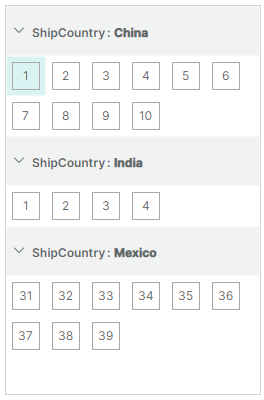
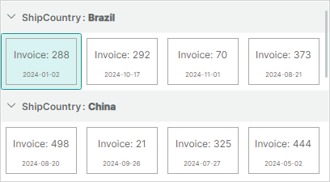
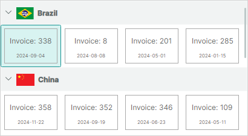
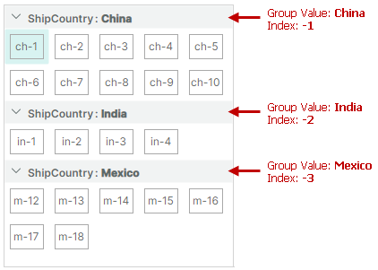
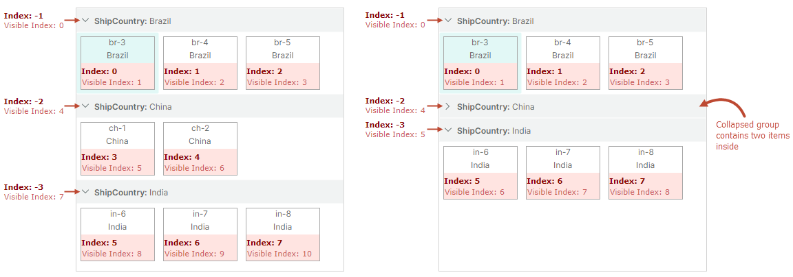
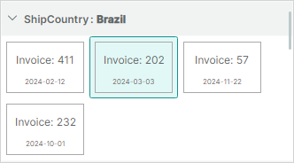

# Обзор контрола ListView

`ListViewControl` — это продвинутый контрол для отображения списка элементов в одной или нескольких колонках. Контрол поддерживает различные варианты размещения элементов, сортировку, группировку, фильтрацию и выделение элементов.
Вы можете использовать ListView, чтобы имитировать интерфейс правой панели Проводника Microsoft Windows. 

ListView поддерживает паттерн проектирования MVVM для отрисовки элементов. Контрол получает элементы из привязанного источника элементов и отрисовывает их с помощью заданного шаблона элемента. Вам нужно определить шаблон, чтобы отрисовывать элементы так, как вы хотите. Например, шаблон может указать ListView отрисовывать элементы в виде значков, значков с текстом или просто текста.


 

## Начало работы

- [Начало работы с контролом ListView](get-started-with-listview.md)

## Предоставление элементов в ListView

Используйте свойство `ListViewControl.ItemsSource`, чтобы привязать контрол к коллекции объектов, которые будут отрисованы как элементы ListView. 

### Шаблон элемента

Чтобы отрисовывать элементы определённым образом, задайте шаблон элемента с помощью свойства `ListViewControl.ItemTemplate`. Без этого шаблона ListView не отрисовывает свои элементы.

**DataContext шаблона ItemTemplate**: объект элемента из коллекции `ListViewControl.ItemsSource`.

### Пример 

Следующий пример заполняет ListView элементами из коллекции _SvgIconsBrowserViewModel.Categories_ и определяет шаблон для отрисовки элементов. Полный код этого примера смотрите в модуле _SVG Icons Browser_.


Класс _SvgIconCategoryViewModel_ в коде ниже инкапсулирует элементы в привязанной коллекции элементов. 
Шаблон элемента ListView состоит из флажка, за которым следует текстовое поле. Флажок и текстовое поле привязаны к свойствам _SvgIconCategoryViewModel.IsChecked_ и _SvgIconCategoryViewModel.DisplayName_ соответственно.


``` xml
<mxlv:ListViewControl ItemLayoutMode="Stack" ItemHeight="28" ItemsSource="{Binding Categories}" >
    <mxlv:ListViewControl.ItemTemplate>
        <DataTemplate DataType="vm:SvgIconCategoryViewModel">
            <Grid ColumnDefinitions="Auto, *">
                <CheckBox IsChecked="{Binding IsChecked}" Margin="0,0,4,0" VerticalAlignment="Center"/>
                <TextBlock Grid.Column="1" Text="{Binding DisplayName}" VerticalAlignment="Center"/>
            </Grid>
        </DataTemplate>
    </mxlv:ListViewControl.ItemTemplate>
</mxlv:ListViewControl>
```
``` cs
public partial class SvgIconsBrowserViewModel : PageViewModelBase
{
    [ObservableProperty] private List<SvgIconCategoryViewModel> categories;
    //...
}

public partial class SvgIconCategoryViewModel : ObservableObject, IComparable<SvgIconCategoryViewModel>, IComparable
{
    [ObservableProperty] private bool isChecked;
    [ObservableProperty] private string name;
    [ObservableProperty] private string displayName;
    [ObservableProperty] private bool isExpanded;
    //...
}
```

## Размещение элементов

Контрол ListView поддерживает два режима размещения элементов: `Wrap` (по умолчанию) и `Stack`. Используйте свойство `ListViewControl.ItemLayoutMode`, чтобы выбрать нужный вариант.

### Компоновка _Wrap_

Установите свойство `ListViewControl.ItemLayoutMode` в `ListViewItemLayoutMode.Wrap`, чтобы размещать элементы слева направо, затем вниз. Элементы автоматически переносятся у правого края контрола, создавая несколько строк.


Все элементы имеют один размер. Размер элемента по умолчанию вычисляется из данных первого элемента в соответствии с заданным шаблоном (`ListViewControl.ItemTemplate`).
Вы можете использовать свойства `ListViewControl.ItemWidth` и `ListViewControl.ItemHeight`, чтобы задать пользовательский размер элемента для ListView. 

### Компоновка _Stack_

Установите свойство `ListViewControl.ItemLayoutMode` в `ListViewItemLayoutMode.Stack`, чтобы размещать элементы в вертикальный список. Элементы растягиваются, чтобы заполнить ширину LayoutView.


В режиме компоновки `Stack` вы можете использовать свойство `ListViewControl.ItemHeight`, чтобы задать пользовательскую высоту элемента.

## Сортировка элементов

Вы можете сортировать элементы ListView по одному или нескольким свойствам элементов в порядке возрастания или убывания. Чтобы отсортировать элементы, добавьте объект (объекты) `ListViewSortInfo` в коллекцию `ListViewControl.SortInfo`. Эта коллекция также используется для определения [группировки](#группировка-элементов) элементов.

Объект `ListViewSortInfo` содержит следующие свойства для настройки параметров сортировки:

- `ListViewSortInfo.FieldName` — задаёт свойство элемента, по которому сортируются элементы ListView.
- `ListViewSortInfo.SortDirection` — задаёт порядок, в котором сортируются элементы ListView. Порядок сортировки по умолчанию — по возрастанию.

### Пример — сортировка элементов

Следующий пример сортирует элементы по их свойствам _ShipCountry_ и _Date_. Контрол сначала сортирует элементы по свойству _ShipCountry_ в порядке возрастания, организуя их в подмножества с одинаковой страной доставки. Затем контрол сортирует элементы внутри каждого подмножества по свойству _Date_ в порядке убывания.


``` xml
<mxlv:ListViewControl Name="listViewControl1" ItemsSource="{Binding Items}" >
    <mxlv:ListViewControl.SortInfo>
        <mxlv:ListViewSortInfo FieldName="ShipCountry" SortDirection="Ascending" />
        <mxlv:ListViewSortInfo FieldName="Date" SortDirection="Descending"/>
    </mxlv:ListViewControl.SortInfo>
</mxlv:ListViewControl>
```

``` cs
public partial class MainWindowViewModel : ViewModelBase
{
    [ObservableProperty] 
    private List<ItemViewModel> items;
    //...
}

public partial class ItemViewModel : ObservableObject
{
    [ObservableProperty] private int invoiceId;
    [ObservableProperty] private string shipCountry;
    [ObservableProperty] private DateTime date;
    //...
}
```


## Группировка элементов

Группировка позволяет объединять элементы с одинаковыми значениями в одни разворачиваемые группы. 

Например, если объект элемента содержит свойство _ShipCountry_, вы можете сгруппировать по этому свойству, чтобы получить следующий результат:



Групповая строка предшествует каждой группе элементов. Групповые строки отображают имена и значения свойств группировки. Пользователь может нажать кнопку сворачивания/разворачивания групповой строки, чтобы скрыть/показать содержимое группы.

Обратите внимание, что когда вы группируете по свойству, групповые строки автоматически сортируются по свойству группировки. В коде вы можете выбрать порядок групповых строк по возрастанию или убыванию при применении группировки.

Чтобы сгруппировать по свойству или свойствам элементов, сделайте следующее:

- Добавьте объект (объекты) `ListViewSortInfo` в начало коллекции `ListViewControl.SortInfo`. 
Установите `ListViewSortInfo.FieldName` в свойство элемента, по которому нужно группировать элементы. При необходимости используйте `ListViewSortInfo.SortDirection`, чтобы выбрать между порядком сортировки по возрастанию и убыванию, в котором располагаются групповые строки.

- Установите свойство `ListViewControl.GroupCount` в число уровней группировки (свойств группировки). 
`ListViewControl.GroupCount` задаёт, сколько объектов `ListViewSortInfo`, начиная с начала коллекции `ListViewControl.SortInfo`, используется для группировки данных. Если вы группируете по одному свойству элемента, установите `ListViewControl.GroupCount` в _1_. Чтобы группировать по двум свойствам, установите `ListViewControl.GroupCount` в 2, и так далее.

Коллекция `ListViewControl.SortInfo` может содержать больше элементов, чем `ListViewControl.GroupCount`. Первые элементы, число которых задано `GroupCount`, используются для группировки элементов ListView. Остальные элементы используются для сортировки элементов ListView.

### Пример — группировка элементов

Предположим, что объект элемента содержит свойство _ShipCountry_. Чтобы сгруппировать по этому свойству, объект `ListViewSortInfo`, ссылающийся на свойство _ShipCountry_, нужно поместить в начало коллекции `ListViewControl.SortInfo`. Свойство `ListViewControl.GroupCount` должно быть установлено в `1`.



``` xml
<mxlv:ListViewControl Name="lv" ItemsSource="{Binding Items}" ItemHeight="40" ItemWidth="40" 
                      ItemLayoutMode="Wrap"                        
                      GroupCount="1">
    <mxlv:ListViewControl.SortInfo>
        <mxlv:ListViewSortInfo FieldName="ShipCountry" SortDirection="Ascending" />
    </mxlv:ListViewControl.SortInfo>
</mxlv:ListViewControl>
```

``` cs
public partial class MainWindowViewModel : ViewModelBase
{
    [ObservableProperty] 
    private List<ItemViewModel> items;
}

public partial class ItemViewModel : ObservableObject
{
    [ObservableProperty] private int invoiceId;
    [ObservableProperty] private string shipCountry;
    [ObservableProperty] private DateTime date;
    [ObservableProperty] private IImage flag;
    //...
}
```


### Пользовательский шаблон групповой строки

Если шаблон групповой строки по умолчанию не соответствует вашим потребностям, вы можете использовать свойство `ListViewControl.GroupTemplate`, чтобы задать пользовательский DataTemplate для отрисовки групповых строк.  

**DataContext шаблона GroupTemplate**: объект `Eremex.AvaloniaUI.Controls.ListView.Data.ListViewGroupData`

Объект `ListViewGroupData`, хранящийся в DataContext шаблона, предоставляет следующие свойства, которые помогают получить информацию о групповых строках и настроить шаблон групповой строки:

- `ListViewGroupData.FieldName` — имя свойства группировки.
- `ListViewGroupData.GroupValue` — значение свойства группировки.
- `ListViewGroupData.GroupValueDisplayText` — текстовое представление значения свойства группировки. Вы можете предоставить пользовательский отображаемый текст для значения группы, обработав событие `ListViewControl.CustomGroupValueDisplayText`.
- `ListViewGroupData.IsExpanded` — задаёт, развёрнута группа или свёрнута.
- `ListViewGroupData.Level` — уровень группы. Для групповых строк корневого уровня свойство `ListViewGroupData.Level` возвращает `0`. Для групповых строк второго уровня свойство `ListViewGroupData.Level` возвращает `1`, и так далее.

Пользовательский шаблон может требовать другую высоту групповой строки. Вы можете задать пользовательскую высоту групповой строки с помощью свойства `ListViewControl.GroupHeight`.

#### Пример — пользовательский шаблон групповой строки

Следующий пример определяет пользовательский шаблон групповой строки с помощью свойства `ListViewControl.GroupTemplate`. Шаблон состоит из текстового блока, отображающего значение группы, и контрола Image, отображающего SVG-изображение, связанное с групповой строкой.



Пример предполагает, что проект содержит изображения _brazil-flag.svg_ и _china-flag.svg_ в папке _Assets_. Все изображения должны иметь свойство _Build Action_, установленное в _AvaloniaResource_. Для чтения изображений из файлов код ниже использует вспомогательный класс `Eremex.AvaloniaUI.Controls.Utils.ImageLoader`.


``` xml
xmlns:mxlv="https://schemas.eremexcontrols.net/avalonia/listview"
xmlns:mxlvd="using:Eremex.AvaloniaUI.Controls.ListView.Data"
xmlns:vm="using:ListView_example.ViewModels"

<mxlv:ListViewControl Name="listViewControl1" ItemsSource="{Binding Items}" 
                      ItemHeight="70" ItemWidth="100"
                      GroupCount="1"
                      GroupHeight="40">
    <mxlv:ListViewControl.SortInfo>
        <mxlv:ListViewSortInfo FieldName="ShipCountry" SortDirection="Ascending" />
    </mxlv:ListViewControl.SortInfo>
    <mxlv:ListViewControl.GroupTemplate>
        <DataTemplate DataType="mxlvd:ListViewGroupData">
            <StackPanel Orientation="Horizontal" >
                <Image Height="20" 
                  Source="{Binding GroupValue, Converter={vm:CountryNameToFlagConverter}}}" 
                  Margin="0,0,5,0" VerticalAlignment="Center"/>
                <TextBlock Text="{Binding GroupValueDisplayText}" VerticalAlignment="Center"/>
            </StackPanel>
        </DataTemplate>
    </mxlv:ListViewControl.GroupTemplate>
```

``` cs
using Eremex.AvaloniaUI.Controls.Utils;

namespace ListView_example.ViewModels;

public class CountryNameToFlagConverter : MarkupExtension, IValueConverter
{
    public object? Convert(object? value, Type targetType, object? parameter, CultureInfo culture)
    {
        if (value == null)
            return null;
        string countryName = ((string)value).ToLower();
        return ImageLoader.LoadSvgImage(Assembly.GetExecutingAssembly(), $"Assets/{countryName}-flag.svg");
    }

    public object? ConvertBack(object? value, Type targetType, object? parameter, CultureInfo culture)
    {
        throw new NotImplementedException();
    }

    public override object ProvideValue(IServiceProvider serviceProvider)
    {
        return this;
    }
}
```


### Пользовательский текст значения группы

Групповые строки по умолчанию отображают текстовое представление значений группировки. Вы можете обработать событие `ListViewControl.CustomGroupValueDisplayText`, чтобы переопределить отображаемый текст значений группировки. Это событие срабатывает многократно для каждой групповой строки.

### Идентификация групповых строк

Элементы ListView и групповые строки можно идентифицировать по **индексам**. Групповым строкам назначаются отрицательные индексы, тогда как элементы имеют неотрицательные индексы. Помимо индексов, вы можете идентифицировать групповые строки по значениям группировки.



Подробнее смотрите в следующем разделе: [Идентификация и получение элементов и групповых строк](#идентификация-и-получение-элементов-и-групповых-строк).


### Связанный API группировки

- `ListViewControl.GroupHeight` — задаёт высоту групповой строки.
- `ListViewControl.GroupLevelIndent` — задаёт отступ перед вложенными групповыми строками (на втором и более низких уровнях).
- `ListViewControl.AutoExpandAllGroups` — позволяет отключить автоматическое разворачивание групповых строк при загрузке контрола.
- `ListViewControl.CollapseAllGroups` — сворачивает все групповые строки.
- `ListViewControl.CollapseGroup` — сворачивает конкретную групповую строку.
- `ListViewControl.ExpandAllGroups` — разворачивает все групповые строки.
- `ListViewControl.ExpandGroup` — разворачивает конкретную групповую строку.
- `ListViewControl.IsGroupExpanded` — возвращает, развёрнута ли конкретная группа.

Смотрите также: [Методы для обхода групповых строк и их дочерних элементов](#методы-для-обхода-групповых-строк-и-их-дочерних-элементов).


<!-- TODO
string GroupClass/ItemClass -->

## Фильтрация элементов

Обработайте событие `ListViewControl.FilterItem`, чтобы динамически настраивать видимость определённых элементов ListView. Это событие срабатывает многократно для каждого элемента в коллекции `ListViewControl.ItemsSource`. Чтобы скрыть конкретный элемент, установите параметр события `e.Visible` в `false`.

Если правила фильтрации элементов динамически изменяются в вашем приложении, вам может потребоваться принудительно повторно вызвать механизм фильтрации элементов и, следовательно, событие `ListViewControl.FilterItem`. Для этого вызовите метод `ListViewControl.RefreshData`.

### Пример

Следующий пример из модуля _SVG Icons Browser_ скрывает элементы согласно определённому условию.

``` xml
<mxlv:ListViewControl x:Name="IconsListControl" 
    FilterItem="ListViewControl_OnFilterItem">
```

``` cs
private void ListViewControl_OnFilterItem(object sender, ListViewFilterEventArgs e)
{
    ((SvgIconsBrowserViewModel)DataContext)?.OnCustomFilter(e);
}

public partial class SvgIconsBrowserViewModel : PageViewModelBase
{
    public void OnCustomFilter(ListViewFilterEventArgs e)
    {
        SvgIconViewModel vm = (SvgIconViewModel)e.Item;
        e.Visible = vm.Category.IsChecked && (string.IsNullOrEmpty(SearchText) || vm.Name.Contains(SearchText, StringComparison.OrdinalIgnoreCase));
    }
}
```

## Идентификация и получение элементов и групповых строк

ListView назначает **индексы** элементам и групповым строкам, чтобы обеспечить их идентификацию.


- Индексы отражают порядок элементов и групповых строк.
- Элементы нумеруются неотрицательными индексами, начинающимися с нуля. Самый верхний элемент имеет индекс **0**, второй элемент имеет индекс **1**, и так далее.
- Групповые строки нумеруются отрицательными индексами. Верхняя групповая строка имеет индекс **-1**, вторая групповая строка имеет индекс **-2**, и так далее.
- Индексы используются для идентификации как видимых, так и скрытых (внутри свёрнутых групп) элементов.
- Когда порядок элементов меняется (например, когда данные сортируются или группируются), элементам присваиваются новые индексы в соответствии с их новыми позициями.
- Индексы не назначаются элементам, скрытым из-за фильтрации данных.

Когда элементы не сгруппированы, индексы совпадают с видимыми индексами:


Когда элементы сгруппированы, индексы и видимые индексы не совпадают:



### Специальные индексы

ListView резервирует следующий предопределённый индекс для идентификации недопустимых элементов:

- Константа `ListViewControl.InvalidItemIndex` — идентифицирует элемент, который не существует в контроле ListView. Это значение может возвращаться методами ListView, используемыми для получения индексов элементов.

Например, элементы корневого уровня не имеют родителей. Если вы попытаетесь получить родителя корневого элемента с помощью метода `ListViewControl.GetParentItemIndex`, этот метод вернёт константу `ListViewControl.InvalidItemIndex`.

### Элементы источника и индексы элементов источника

Каждый элемент ListView соответствует конкретному бизнес-объекту в привязанном источнике элементов (`ListViewControl.ItemsSource`). Позиция элемента в источнике элементов называется **индексом элемента источника**.

Вы можете использовать следующие методы, чтобы получить базовый элемент источника и индекс элемента источника. 

- `ListViewControl.GetSourceItemIndexByItemIndex`
- `ListViewControl.GetSourceItemIndexByVisibleItemIndex`

<!-- TODO
не хватает методов
- `GetSourceItemByRowIndex`
- `GetSourceItemByVisibleRowIndex` 
issue=MX-253
 -->

Для выполнения обратного преобразования индексов смотрите следующие методы:

- `ListViewControl.GetItemIndexBySourceItemIndex`
- `ListViewControl.GetVisibleItemIndexBySourceItemIndex`


Индексы элементов источника начинаются с нуля. Когда вы сортируете, группируете или фильтруете элементы, их индексы элементов источника не меняются.

Групповые строки не имеют соответствующих элементов в источнике элементов, поэтому к ним нельзя обращаться с помощью элементов источника и индексов элементов источника.


### Связанный API

ListView предоставляет члены API для получения элементов по индексам и преобразования между индексами элементов, видимыми индексами элементов и индексами элементов источника. Следующий список обобщает эту информацию:

- `ListViewControl.FocusedItemIndex` — задаёт индекс сфокусированного элемента/групповой строки. Это свойство позволяет сфокусировать конкретный элемент или групповую строку.
- `ListViewControl.GetItemIndexBySourceItemIndex` — возвращает индекс элемента по индексу элемента источника.
- `ListViewControl.GetItemIndexByVisibleItemIndex` — возвращает индекс элемента по видимому индексу элемента.
- `ListViewControl.GetSourceItemIndexByItemIndex` — возвращает индекс элемента источника для элемента с указанным индексом.
- `ListViewControl.GetSourceItemIndexByVisibleItemIndex` — возвращает индекс элемента источника для элемента с указанным видимым индексом.
- `ListViewControl.GetVisibleItemIndexByItemIndex` — возвращает видимый индекс элемента по индексу элемента.
- `ListViewControl.GetVisibleItemIndexBySourceItemIndex` — возвращает видимый индекс элемента по индексу элемента источника.

#### Методы для обхода групповых строк и их дочерних элементов


- `ListViewControl.GetGroupChildItemIndex(int childIndex)` — возвращает индекс конкретной корневой групповой строки. Параметр `childIndex` задаёт порядковый номер целевой корневой групповой строки (начиная с нуля) среди её соседей. Этот параметр принимает значения от `0` до `GetGroupChildrenCount() - 1`.
- `ListViewControl.GetGroupChildItemIndex(int itemIndex, int childIndex)` — возвращает индекс дочернего элемента или вложенной групповой строки. Параметр `itemIndex` задаёт индекс родительской групповой строки. Параметр `childIndex` задаёт порядковый номер (начиная с нуля) целевого дочернего элемента или групповой строки среди её соседей. Этот параметр принимает значения от `0` до `GetGroupChildrenCount(itemIndex) - 1`.
- `ListViewControl.GetGroupChildrenCount()` — эта перегрузка без параметров возвращает число групповых строк на корневом уровне.
- `ListViewControl.GetGroupChildrenCount(int itemIndex)` — возвращает число непосредственных дочерних элементов конкретной групповой строки. Родительская групповая строка идентифицируется по её индексу.

- `ListViewControl.GetGroupIndex` — возвращает индекс групповой строки по имени поля строки и значению группы.
- `ListViewControl.GetGroupValue` — возвращает значение групповой строки по индексу строки.
- `ListViewControl.GetParentItemIndex` — возвращает индекс родительской групповой строки для вложенного элемента или групповой строки. 

!!! note

    Методы выше не действуют, если элементы не сгруппированы.

## Фокус элемента 

Когда пользователь переходит к конкретному элементу или групповой строке с помощью клавиатуры или щелчка мышью, ListView перемещает фокус на этот элемент/групповую строку. 



Вы можете использовать следующие свойства, чтобы получить/задать сфокусированный элемент/групповую строку в коде:

- `ListViewControl.FocusedItem` — возвращает или задаёт бизнес-объект из коллекции `ListViewControl.ItemsSource`, соответствующий сфокусированному элементу ListView. Чтобы переместить фокус на конкретный элемент, вы можете назначить объект из коллекции `ItemsSource` свойству `FocusedItem`.

    !!! note
    
        Свойство `FocusedItem` возвращает `null`, если сфокусирована групповая строка. Вы не можете использовать это свойство, чтобы сфокусировать групповую строку.

- `ListViewControl.FocusedItemIndex` — возвращает или задаёт [индекс](#идентификация-и-получение-элементов-и-групповых-строк) сфокусированного элемента/групповой строки. Вы можете использовать свойство `FocusedItemIndex`, чтобы переместить фокус на элемент или групповую строку.

Следующий код фокусирует групповую строку, чьё поле _ShipCountry_ установлено в "India".

``` cs
int groupRowindex = listViewControl1.GetGroupIndex("ShipCountry", "India");
if(groupRowindex != ListViewControl.InvalidItemIndex)
    listViewControl1.FocusedItemIndex = groupRowindex;
```


### Пример — реакция на фокусировку элемента 

Следующий пример привязывает свойство `ListViewControl.FocusedItem` к свойству _MainWindowViewModel.FocusedItem_. Вы можете реагировать на изменения сфокусированного элемента в сеттере свойства _MainWindowViewModel.FocusedItem_.

``` xml
xmlns:mxlv="https://schemas.eremexcontrols.net/avalonia/listview"

<mxlv:ListViewControl Name="listViewControl1" ItemsSource="{Binding Items}" 
    FocusedItem="{Binding FocusedItem, Mode=TwoWay}">
</mxlv:ListViewControl>
```

``` cs
public partial class MainWindowViewModel : ViewModelBase
{
    ItemViewModel focusedItem;
    ItemViewModel FocusedItem {
        get {
            return focusedItem;
        }
        set
        {
            if (value != focusedItem)
            {
                focusedItem = value;
                // Perform actions when the focused item changes.
            }
        }
    }
}

public partial class ItemViewModel : ObservableObject
{
    //...
}
```


## Множественное выделение элементов

ListView позволяет выбирать несколько элементов и групповых строк. Чтобы включить этот режим выделения, установите свойство `ListViewControl.SelectionMode` в `Multiple`. Выбранные элементы и групповые строки имеют подсвеченный фон.


- Щелчок по элементу выбирает этот элемент и снимает выделение с ранее выбранных элементов.
- CTRL+щелчок по элементу переключает состояние выделения элемента. 
- SHIFT+щелчок по элементу выбирает диапазон элементов (между ранее сфокусированным элементом и элементом, по которому щёлкнули).

<!-- TODO
I cannot select items using the keyboard.
 -->


Когда пользователь выбирает элемент, этот элемент также фокусируется (свойства `ListViewControl.FocusedItem` и `ListViewControl.FocusedItemIndex` обновляются). 
Последующий CTRL+щелчок по этому элементу снимает с него выделение, но сохраняет фокус.


Используйте следующие члены API, чтобы получить выбранные элементы и групповые строки:

- `ListViewControl.SelectedItems` — коллекция бизнес-объектов из источника `ListViewControl.ItemsSource`, соответствующих выбранным элементам ListView. Коллекция `SelectedItems` не содержит выбранных групповых строк, так как групповые строки не соответствуют никакому бизнес-объекту в источнике `ListViewControl.ItemsSource`.

- `ListViewControl.GetSelectedIndices` — этот метод возвращает массив [индексов](#идентификация-и-получение-элементов-и-групповых-строк) выбранных в настоящий момент элементов и групповых строк. Индексы элементов неотрицательны, тогда как индексы групповых строк отрицательны. Подробнее смотрите в следующем разделе: [Идентификация и получение элементов и групповых строк](#идентификация-и-получение-элементов-и-групповых-строк).


Следующие свойства и методы позволяют выбирать элементы и групповые строки в коде:

- `ListViewControl.SelectedItems` — вы можете назначить свою коллекцию бизнес-объектов из источника `ListViewControl.ItemsSource` свойству `SelectedItems`, чтобы выбрать соответствующие элементы ListView.
- `ListViewControl.SelectAll` — выбирает все элементы и групповые строки, если они есть.
- `ListViewControl.SetSelected` — выбирает или снимает выделение с конкретного элемента или групповой строки.
- `ListViewControl.ToggleSelected` — переключает состояние выделения для элемента или групповой строки.


Чтобы реагировать на изменения выделения, вы можете обработать событие `ListViewControl.SelectionChanged`. 

<!-- TODO
GetSelectedIndices

selected group rows are not included in the selection
 -->


### Связанный API

- `ListViewControl.ClearSelection` — очищает выделение.
- `ListViewControl.GetIsSelected` — возвращает, выбран ли элемент.


<br>
<br>

<sup>*</sup> Эта страница переведена с использованием технологий машинного перевода.
