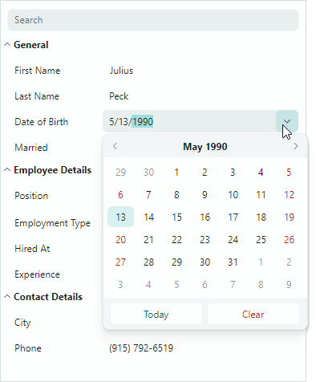

# Редактирование данных

## Встроенные редакторы Eremex, используемые по умолчанию

Если вы не задаёте встроенные редакторы для строк явно, контрол PropertyGrid использует встроенные редакторы Eremex для отображения и редактирования значений строк распространённых типов данных.



Следующий список показывает редакторы Eremex, связанные с распространёнными типами данных:

- Значения Boolean — `CheckEditor`
- Значения Double — `SpinEditor`
- Значения перечислений — `ComboBoxEditor`
- Свойства с атрибутом `TypeConverter`, чей метод `TypeConverter.GetStandardValuesSupported` возвращает `true` — `ComboBoxEditor`
- Другие значения — `TextEditor`

Вы можете динамически обращаться к экземплярам встроенных редакторов Eremex и изменять их, когда эти редакторы активны. Подробнее смотрите в разделе [Доступ к активному встроенному редактору Eremex](#доступ-к-активному-встроенному-редактору-eremex).

## Назначение встроенных редакторов Eremex

Вы можете явно назначать встроенные редакторы Eremex строкам, если вам нужно переопределить назначение редактора по умолчанию или настроить редакторы строк в XAML или code-behind. 

Используйте для этого свойство `PropertyGridRow.EditorProperties` следующим образом:

1. Создайте и настройте экземпляр вспомогательного класса `...EditorProperties`, хранящего настройки, специфичные для нужного встроенного редактора. Все эти вспомогательные классы являются потомками `BaseEditorProperties`: 
    - `ButtonEditorProperties` — содержит настройки, специфичные для контрола `ButtonEditor`.
    - `CheckEditorProperties` — содержит настройки, специфичные для контрола `CheckEditor`.
    - `ColorEditorProperties` — содержит настройки, специфичные для контрола `ColorEditor`.
    - `ComboBoxEditorProperties` — содержит настройки, специфичные для контрола `ComboBoxEditor`.
    - `HyperlinkEditorProperties` — содержит настройки, специфичные для контрола `HyperlinkEditor`.
    - `PopupColorEditorProperties` — содержит настройки, специфичные для контрола `PopupColorEditor`.
    - `PopupEditorProperties` — содержит настройки, специфичные для контрола `PopupEditor`.
    - `SegmentedEditorProperties` — содержит настройки, специфичные для контрола `SegmentedEditor`.
    - `SpinEditorProperties` — содержит настройки, специфичные для контрола `SpinEditor`.
    - `TextEditorProperties` — содержит настройки, специфичные для контрола `TextEditor`.
    
2. Установите свойство `PropertyGridRow.EditorProperties` в созданный экземпляр `...EditorProperties`.

``` xml
xmlns:mxpg="https://schemas.eremexcontrols.net/avalonia/propertygrid"
xmlns:mxe="https://schemas.eremexcontrols.net/avalonia/editors"

<mxpg:PropertyGridRow FieldName="OrderNo">
    <mxpg:PropertyGridRow.EditorProperties >
        <mxe:ButtonEditorProperties TextWrapping="Wrap" />
    </mxpg:PropertyGridRow.EditorProperties>
</mxpg:PropertyGridRow>
```

Свойство `PropertyGridRow.CellTemplate` — ещё один способ назначить редактор Eremex строке. Убедитесь, что у редактора Eremex свойство `x:Name` установлено в **"PART_Editor"**. В этом случае PropertyGrid автоматически привязывает свойство редактора `EditorValue` к привязанному полю строки. Кроме того, PropertyGrid начинает поддерживать настройки внешнего вида встроенного редактора (видимость рамок и цвета текста в активном и неактивном состояниях).

``` xml
xmlns:mxpg="https://schemas.eremexcontrols.net/avalonia/propertygrid"
xmlns:mxe="https://schemas.eremexcontrols.net/avalonia/editors"
...
<mxpg:PropertyGridRow FieldName="Caption">
    <mxpg:PropertyGridRow.CellTemplate>
        <DataTemplate>
            <mxe:ButtonEditor x:Name="PART_Editor">
                <mxe:ButtonEditor.Buttons>
                    <mxe:ButtonSettings Content="..."/>
                </mxe:ButtonEditor.Buttons>
            </mxe:ButtonEditor>
        </DataTemplate>
    </mxpg:PropertyGridRow.CellTemplate>
</mxpg:PropertyGridRow>
```


## Пользовательские редакторы
PropertyGrid позволяет задавать пользовательские редакторы для ячеек строк. Вы можете назначить редактор непосредственно конкретной строке или динамически назначать редакторы строкам на основе типа данных базового объекта строки.
Дополнительную информацию смотрите в следующем разделе: [Пользовательские редакторы](custom-editors.md).

<!--TODO ## Get and Set Cell values

-->

## Доступ к активному встроенному редактору Eremex

- Свойство `ActiveEditor` — возвращает активный встроенный редактор. 
  
  Для повышения производительности контрола PropertyGrid использует облегчённые версии встроенных редакторов Eremex, когда отрисовывает значения ячеек в режиме отображения (когда редактирование текста не активно). Когда в ячейке начинается операция редактирования текста, встроенный редактор переключается со своей облегчённой версии на полнофункциональную версию. В этом случае вы можете использовать свойство `ActiveEditor` для доступа к экземпляру редактора Eremex. Когда ячейка строки теряет фокус, редактор переключается обратно на свою облегчённую версию, и свойство `ActiveEditor` возвращает `null`.

- Событие `ShowingEditor` — позволяет получать уведомления о начале операций редактирования в ячейках строк. Вы можете безопасно обращаться к свойству `ActiveEditor` в обработчике события `ShowingEditor`.

## Показ редактора ячейки

- Метод `ShowEditor` — активирует редактор ячейки в сфокусированной строке.
- Событие `ShowingEditor` — позволяет в определённых случаях предотвратить активацию редактора ячейки пользователями. При обработке события `ShowingEditor` установите параметр события `Cancel` в `true`, чтобы отключить активацию редактора.

## Закрытие активного встроенного редактора

- Метод `CloseEditor` — сохраняет изменения, внесённые в редактор ячейки, и закрывает редактор.
- Метод `HideEditor` — закрывает редактор ячейки без сохранения изменений.

- Событие `HiddenEditor` — возникает после закрытия активного редактора ячейки.


## Сохранение изменений, внесённых во встроенный редактор

- Метод `CloseEditor` — сохраняет изменения, внесённые в редактор ячейки, и закрывает редактор.
- Метод `PostEditor` — сохраняет изменения, внесённые в активный редактор ячейки, не закрывая редактор.


<br>
<br>

<sup>*</sup> Эта страница переведена с использованием технологий машинного перевода.
