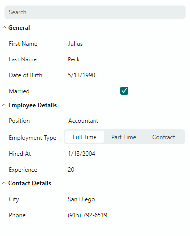

# Обзор контрола PropertyGrid

`PropertyGridControl` отображает публичные свойства и их значения привязанного объекта (объектов) в виде вертикального списка. Каждый элемент списка отрисовывается как строка, содержащая две ячейки: «имя свойства» и «значение свойства».

PropertyGrid может автоматически заполнять строки из привязанного объекта (объектов). Вы также можете вручную создавать строки в коде. Специальные атрибуты, применённые к свойствам привязанного объекта, позволяют задать пользовательскую видимость, состояние «только для чтения», отображаемое имя, категорию и конвертер типов.

Контрол поддерживает категориальные строки, которые позволяют объединять строки в разворачиваемые группы.

## Привязка данных и настройка строк

Когда вы привязываете контрол к объекту (объектам), контрол автоматически генерирует строки для всех публичных свойств. Специальные атрибуты позволяют настраивать параметры генерации строк.

Контрол также поддерживает ручную генерацию обычных и категориальных строк. Информацию смотрите в следующих разделах:

- [Привязка к одному объекту](data-binding.md#привязка-к-одному-объекту)
- [Привязка к нескольким объектам](data-binding.md#привязка-к-нескольким-объектам)
- [Создание строк](data-binding.md#создание-строк)
- [Строки](rows.md)

## Редактирование данных

Пользователи могут редактировать часть «значение» строк, если редактирование данных включено. Контрол использует редакторы по умолчанию для отображения и редактирования значений строк распространённых типов данных (Boolean, Double, Integer, перечисления и т. д.). При необходимости вы также можете задать пользовательские редакторы для конкретных строк.

Чтобы узнать, как задавать редакторы и обращаться к ним, получать и устанавливать значения ячеек, смотрите следующие разделы:

- [Редактирование данных](data-editing.md)
- [Пользовательские редакторы](custom-editors.md)

## Встроенный поиск

Панель поиска PropertyGrid позволяет пользователям быстро находить строки по именам.

Подробнее смотрите в следующем разделе: 

- [Поиск данных](data-search.md)

## Часто используемый API

В следующем разделе описаны члены API, которые помогают выполнять наиболее популярные задачи настройки:

- [Часто используемый API](frequently-used-api.md)

 
 

* Эта страница переведена с использованием технологий машинного перевода.
