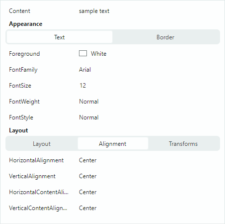

# Строки в контроле PropertyGrid

PropertyGrid может автоматически создавать строки для свойств, предоставляемых привязанным объектом (объектами) (см. `PropertyGridControl.SelectedObject` и `PropertyGridControl.SelectedObjects`). 
Автоматическая генерация строк включена по умолчанию. 
Вы можете отключить автоматическую генерацию строк с помощью параметра `PropertyGridControl.AutoGenerateRows`, а затем создавать строки вручную.


PropertyGrid поддерживает три типа строк:

- Обычные строки (строки данных) (`PropertyGridRow`) — отображают имена и значения привязанных свойств.
  
  

- Категориальные строки (`PropertyGridCategoryRow`) — используются для группировки других строк в категории. Пользователи могут сворачивать и разворачивать категориальные строки, чтобы скрывать/показывать их дочерние элементы.
  
  

- Строки-вкладки (`PropertyGridTabRow`) — используются для организации строк в интерфейс с вкладками. Строки-вкладки не поддерживают функцию сворачивания/разворачивания.
  
  

## Создание строк

При включённой функции автоматической генерации строк пустой контрол PropertyGrid создаёт строки данных и категориальные строки на основе информации, полученной из привязанного объекта:

- Обычные строки создаются для всех публичных свойств.
- Категориальные строки генерируются из атрибутов `System.ComponentModel.CategoryAttribute`, применённых к базовым публичным свойствам. Соответствующие строки данных группируются внутри этих категорий.

Если какая-либо строка была добавлена в контрол вручную (например, в XAML), автоматическая генерация строк не действует. Установите свойство `PropertyGridControl.AutoGenerateRows` в `false`, чтобы принудительно отключить автоматическую генерацию строк.

Используйте метод `PopulateRows`, чтобы сгенерировать строки данных и категориальные строки из привязанного объекта (объектов) в code-behind. Этот метод очищает существующую коллекцию строк перед добавлением новых строк.

Вы можете применять определённые атрибуты Data Annotation к свойствам привязанного объекта, чтобы управлять наличием, отображаемым именем и статусом «только для чтения» генерируемых строк PropertyGrid. Подробнее смотрите в следующем разделе: [Использование атрибутов для настройки свойств строк](#использование-атрибутов-для-настройки-свойств-строк).

Коллекция `PropertyGridControl.Rows` позволяет обращаться к строкам контрола, добавлять и удалять отдельные элементы.

### Создание строк данных

Используйте объекты `PropertyGridRow`, чтобы создавать строки данных. Чтобы добавить строки данных на корневом уровне, добавьте объекты `PropertyGridRow` в коллекцию `PropertyGridControl.Rows`.

Основные свойства класса `PropertyGridRow`:

- `PropertyGridRow.FieldName` — возвращает или задаёт имя публичного свойства, к которому привязана строка.
- `PropertyGridRow.Caption` — возвращает или задаёт заголовок строки. Для автоматически генерируемых строк свойство `Caption` содержит отображаемое имя свойства.
- `PropertyGridRow.AllowEditing` — возвращает или задаёт, включены ли операции редактирования значения.
- `PropertyGridRow.EditorProperties` — позволяет назначить пользовательский встроенный редактор значению строки. См. [Редактирование данных](data-editing.md).

#### Пример

Следующий XAML-код создаёт три строки данных (объекта `PropertyGridRow`) и привязывает их к полям объекта, назначенного контексту данных контрола.

``` xml
xmlns:mxpg="https://schemas.eremexcontrols.net/avalonia/propertygrid"

<mxpg:PropertyGridControl x:Name="pGrid1" SelectedObject="{Binding}" Grid.Column="1">
    <mxpg:PropertyGridRow FieldName="Caption">
    </mxpg:PropertyGridRow>
    <mxpg:PropertyGridRow FieldName="OrderNo">
    </mxpg:PropertyGridRow>
    <mxpg:PropertyGridRow FieldName="InvoiceNo">
    </mxpg:PropertyGridRow>
</mxpg:PropertyGridControl>
```

#### Пример

Следующий пример создаёт строки данных в code-behind:

``` xml
xmlns:mxpg="https://schemas.eremexcontrols.net/avalonia/propertygrid"

<mxpg:PropertyGridControl x:Name="pGrid1" AutoGenerateRows="False" 
 SelectedObject="{Binding}" Grid.Column="1">
</mxpg:PropertyGridControl>
```
``` csharp
using Eremex.AvaloniaUI.Controls.PropertyGrid;

pGrid1.Rows.Add(new PropertyGridRow() { FieldName = "Caption" });
pGrid1.Rows.Add(new PropertyGridRow() { FieldName = "OrderNo" });
pGrid1.Rows.Add(new PropertyGridRow() { FieldName = "InvoiceNo" });
```

### Создание категориальных строк

PropertyGrid может генерировать категориальные строки из атрибутов `System.ComponentModel.CategoryAttribute`, применённых к базовым публичным свойствам. Соответствующие строки данных группируются в этих категориальных строках.

Вы можете отключить автоматическую генерацию строк и создать пользовательский набор строк данных и категориальных строк. Используйте объекты `PropertyGridCategoryRow`, чтобы определить категориальные строки. Добавьте объекты `PropertyGridCategoryRow` в коллекцию `PropertyGridControl.Rows`, чтобы отобразить их на корневом уровне.

Основные свойства класса `PropertyGridCategoryRow`:

- `PropertyGridCategoryRow.Rows` — коллекция строк, отображаемых как дочерние элементы категориальной строки. Обычно вы добавляете в эту коллекцию строки данных (объекты `PropertyGridRow`).
- `PropertyGridCategoryRow.Caption` — возвращает или задаёт отображаемое имя категориальной строки. Для автоматически генерируемых категориальных строк это свойство возвращает значение `CategoryAttribute`.

#### Пример

Следующий XAML-код создаёт две категориальные строки (_Name_ и _Details_). Они имеют одну и две строки данных в качестве дочерних элементов соответственно.

``` xml
xmlns:mxpg="https://schemas.eremexcontrols.net/avalonia/propertygrid"
<mxpg:PropertyGridControl x:Name="pGrid1" SelectedObject="{Binding}" Grid.Column="1">
    <mxpg:PropertyGridCategoryRow Caption="Name">
        <mxpg:PropertyGridRow FieldName="Caption">
        </mxpg:PropertyGridRow>
    </mxpg:PropertyGridCategoryRow>
    <mxpg:PropertyGridCategoryRow Caption="Details">
        <mxpg:PropertyGridRow FieldName="OrderNo">
        </mxpg:PropertyGridRow>
        <mxpg:PropertyGridRow FieldName="InvoiceNo">
        </mxpg:PropertyGridRow>
    </mxpg:PropertyGridCategoryRow>
</mxpg:PropertyGridControl>
```

#### Пример
Следующий пример создаёт категориальные строки и размещает строки данных в созданные категории в code-behind.

``` xml
xmlns:mxpg="https://schemas.eremexcontrols.net/avalonia/propertygrid"

<mxpg:PropertyGridControl x:Name="pGrid1" AutoGenerateRows="False" 
 SelectedObject="{Binding}" Grid.Column="1">
</mxpg:PropertyGridControl>
```
``` csharp
using Eremex.AvaloniaUI.Controls.PropertyGrid;

PropertyGridCategoryRow categoryRowName = new PropertyGridCategoryRow() 
{ 
    Caption = "Name" 
};
pGrid1.Rows.Add(categoryRowName);
categoryRowName.Rows.Add(new PropertyGridRow() 
{ 
    FieldName = "Caption" 
});

PropertyGridCategoryRow categoryRowDetails = new PropertyGridCategoryRow() 
{ 
    Caption = "Details" 
};
pGrid1.Rows.Add(categoryRowDetails);
categoryRowDetails.Rows.Add(new PropertyGridRow() { FieldName = "OrderNo" });
categoryRowDetails.Rows.Add(new PropertyGridRow() { FieldName = "InvoiceNo" });
```

## Создание строк-вкладок

Строка-вкладка (`PropertyGridTabRow`) позволяет группировать строки в интерфейс с вкладками. Она состоит из заголовка, переключателя вкладок и клиентской области. Когда пользователь выбирает вкладку, клиентская область отображает набор свойств, соответствующий выбранной вкладке. Следующее изображение демонстрирует контрол PropertyGrid с двумя строками-вкладками (_Appearance_ и _Layout_):



Контрол заполняет коллекцию вкладок из дочерних элементов строки-вкладки (объектов `PropertyGridTabRowItem`). Каждый объект `PropertyGridTabRowItem` определяет коллекцию строк, связанных с этой вкладкой.

### Пример

Следующий пример создаёт строку-вкладку _Appearance_, состоящую из двух вкладок (_Text_ и _Border_). Каждая вкладка при выборе отображает свой набор свойств.


``` xml
xmlns:mxpg="https://schemas.eremexcontrols.net/avalonia/propertygrid"
xmlns:mxe="https://schemas.eremexcontrols.net/avalonia/editors"

<UserControl.Resources>
    <DataTemplate x:Key="spinEditorTemplate1">
        <mxe:SpinEditor x:Name="PART_Editor" HorizontalContentAlignment="Stretch"/>
    </DataTemplate>
    <DataTemplate x:Key="spinEditorTemplate2">
        <mxe:SpinEditor x:Name="PART_Editor" HorizontalContentAlignment="Stretch" 
         Increment="0.1"/>
    </DataTemplate>
</UserControl.Resources>

<mxpg:PropertyGridControl x:Name="propertyGrid" 
                          SelectedObject="{Binding}" 
                          UseModernAppearance="True" 
                          ImmediatePostEditor="True" 
                          BorderThickness="1,0" Grid.Column="1"
                          ShowSearchPanel="False"
                          >
    <mxpg:PropertyGridRow FieldName="Content"/>

    <mxpg:PropertyGridTabRow Caption="Appearance">
        <mxpg:PropertyGridTabRowItem Header="Text">
            <mxpg:PropertyGridRow FieldName="Foreground"/>
            <mxpg:PropertyGridRow FieldName="FontFamily">
                <mxpg:PropertyGridRow.EditorProperties>
                    <mxe:ComboBoxEditorProperties 
                        IsTextEditable="False" 
                        ItemsSource="{Binding Source={x:Static FontManager.Current}, 
                         Path=SystemFonts}" 
                        ValueMember="Name" DisplayMember="Name"/>
                </mxpg:PropertyGridRow.EditorProperties>
            </mxpg:PropertyGridRow>
            <mxpg:PropertyGridRow FieldName="FontSize" 
             CellTemplate="{StaticResource spinEditorTemplate1}"/>

        </mxpg:PropertyGridTabRowItem>

        <mxpg:PropertyGridTabRowItem Header="Border">
            <mxpg:PropertyGridRow FieldName="Background"/>
            <mxpg:PropertyGridRow FieldName="Opacity" 
             CellTemplate="{StaticResource spinEditorTemplate2}"/>
            <mxpg:PropertyGridRow FieldName="BorderThickness" 
             CellTemplate="{StaticResource spinEditorTemplate1}"/>
            <mxpg:PropertyGridRow FieldName="BorderBrush"/>
        </mxpg:PropertyGridTabRowItem>
    </mxpg:PropertyGridTabRow>
</mxpg:PropertyGridControl>
```

## Использование атрибутов для настройки свойств строк

Вы можете применять атрибуты к свойствам привязанного объекта, чтобы настроить статус видимости, параметры отображения и поведения для соответствующих строк в контроле PropertyGridControl. Поддерживаются следующие атрибуты:

### Атрибут `Browsable`
Атрибут `System.ComponentModel.BrowsableAttribute` управляет наличием строк PropertyGrid, соответствующих конкретным свойствам в привязанном объекте. Чтобы предотвратить создание отдельных строк, примените атрибут **Browsable(false)** к соответствующим свойствам.

``` csharp
public partial class MyBusinessObject : ObservableObject
{
    [Browsable(false)]
    public string Caption {
        get;set;
    }
}
```

### Атрибут `Category`

Атрибут `System.ComponentModel.CategoryAttribute` задаёт имя категории для свойства. Когда PropertyGrid встречает этот атрибут, применённый к свойству, контрол создаёт категориальную строку с указанным именем категории и размещает соответствующую строку данных внутри этой категориальной строки.

``` csharp
[Category("Title")]
public string Caption {
    get;set;
}
```

### Атрибут `DisplayName`

Атрибут `System.ComponentModel.DisplayNameAttribute` назначает свойству пользовательское отображаемое имя. Когда этот атрибут задан, контрол PropertyGrid использует это отображаемое имя для заголовков соответствующих строк.

``` csharp
[DisplayName("Name")]
public string Caption {
    get;set;
}
```

### Атрибут `ReadOnly`

Атрибут `System.ComponentModel.ReadOnlyAttribute` помечает свойство как «только для чтения» и предотвращает операции редактирования соответствующей строки в контроле PropertyGrid.

``` csharp
[ReadOnly(true)]
public string OrderId {
    get; set;
}
```

### Атрибут `TypeConverter`

Атрибут `System.ComponentModel.TypeConverterAttribute` позволяет связать со свойством объект `TypeConverter` (потомок `System.ComponentModel.TypeConverter`). PropertyGrid использует этот конвертер для преобразования между отображаемыми значениями и значениями редактирования. Функциональность конвертера типов вызывается в следующих случаях:

- Когда контрол собирается отобразить значение в ячейке или когда значение редактирования ячейки изменяется. `TypeConverter` преобразует значение редактирования ячейки в отображаемое значение.
- Когда пользователь редактирует ячейку, а затем уводит фокус на другую ячейку. `TypeConverter` выполняет обратное преобразование.

## Пользовательские шаблоны строк

Отрисовка строки данных по умолчанию состоит из областей заголовка и значения. 

Вы можете использовать свойство `CellTemplate`, чтобы задать шаблон для отрисовки областей значения строк. Дополнительную информацию смотрите в следующих разделах: [Редактирование данных](data-editing.md) и [Пользовательские редакторы](custom-editors.md)

Используйте свойство `PropertyGridRow.RowTemplate`, чтобы отрисовывать целые строки (области заголовка и значения) произвольным образом. Это свойство задаёт пользовательский шаблон строки.

### Пример - Пользовательский шаблон строк

Следующий код привязывает PropertyGrid к объекту _MyBusinessObject_, имеющему свойства _BorderSize_ и _Location_ типов `Integer` и `Point` соответственно. Код определяет три объекта `PropertyGridRow`, два из которых используют пользовательские шаблоны. Шаблоны содержат пользовательские контролы для представления и редактирования свойств _BorderSize_ и _Location_.


Шаблон строки для свойства _BorderSize_ отображает надпись, слайдер и `SpinEditor`. Слайдер и редактор привязаны к целевому свойству _BorderSize_.

Шаблон строки для редактирования свойства _Location_ содержит две надписи и два `SpinEditor`. Соответствующий объект `PropertyGridRow` привязан к свойству _Location_, тогда как `SpinEditor` привязаны к вложенным полям _X_ и _Y_. Альтернативный вариант — использовать пути привязки _Location.X_ и _Location.Y_ для редакторов.

``` xml
xmlns:mxpg="https://schemas.eremexcontrols.net/avalonia/propertygrid"
xmlns:mxe="https://schemas.eremexcontrols.net/avalonia/editors"

<Window.DataContext>
    <local:SampleViewModel/>
</Window.DataContext>

<mxpg:PropertyGridControl
            x:Name="propertyGrid1" 
            SelectedObject="{Binding Path=MyBusinessObject}"
            UseModernAppearance="True"
            Margin="10"
            BorderThickness="1"
            ShowSearchPanel="False"
            >
            
    <mxpg:PropertyGridCategoryRow Caption="Common">
                
        <mxpg:PropertyGridRow FieldName="Text" />
                
        <mxpg:PropertyGridRow>
            <mxpg:PropertyGridRow.RowTemplate>
                <DataTemplate>
                    <Grid ColumnDefinitions="Auto, 2*, *" Margin="18,5,5,5">
                        <TextBlock Text="Border Size: "  VerticalAlignment="Center" 
                         Classes="PropertyGridRow_Modern"/>
                        <Slider Value="{Binding BorderSize, 
                         Converter={local:MyDoubleToIntConverter}}" 
                         Maximum="500" Focusable="False" Margin="0,0,5,0" Grid.Column="1" />
                        <mxe:SpinEditor EditorValue="{Binding BorderSize}" Maximum="500" 
                         Minimum="0" Grid.Column="2" />
                    </Grid>
                </DataTemplate>
            </mxpg:PropertyGridRow.RowTemplate>
        </mxpg:PropertyGridRow>
    </mxpg:PropertyGridCategoryRow>
            
    <mxpg:PropertyGridCategoryRow Caption="Coordinates">
        <mxpg:PropertyGridRow FieldName="Location">
            <mxpg:PropertyGridRow.RowTemplate>
                <DataTemplate>
                    <Grid ColumnDefinitions="*, 20, *"  Margin="18,5,5,5" Grid.Column="0">
                        <Grid ColumnDefinitions="Auto, *" >
                            <TextBlock Text="X:" HorizontalAlignment="Right" 
                             Classes="PropertyGridRow_Modern" VerticalAlignment="Center"/>
                            <mxe:SpinEditor EditorValue="{Binding X}" Minimum="0" 
                             Maximum="10000" Grid.Column="1" VerticalAlignment="Center"/>
                        </Grid>
                        <Grid ColumnDefinitions="Auto, *" Grid.Column="2">
                            <TextBlock Text="Y:" HorizontalAlignment="Right" 
                             Classes="PropertyGridRow_Modern" VerticalAlignment="Center"/>
                            <mxe:SpinEditor EditorValue="{Binding Y}" Minimum="0" 
                             Maximum="10000" Grid.Column="1" VerticalAlignment="Center"/>
                        </Grid>
                    </Grid>
                </DataTemplate>
            </mxpg:PropertyGridRow.RowTemplate>
        </mxpg:PropertyGridRow>
    </mxpg:PropertyGridCategoryRow>
</mxpg:PropertyGridControl>
```
``` csharp
using System.Drawing;
using CommunityToolkit.Mvvm.ComponentModel;

public partial class SampleViewModel : ViewModelBase
{
    [ObservableProperty]
    MyBusinessObject myBusinessObject = new MyBusinessObject();
}
public partial class MyBusinessObject : ViewModelBase
{
    [ObservableProperty]
    string text = "Sample text";

    [ObservableProperty]
    double borderSize = 5;

    [ObservableProperty]
    string fontFamily = FontManager.Current.DefaultFontFamily.Name;

    [ObservableProperty]
    double fontSize = 14;

    [ObservableProperty]
    Point location = new Point(11, 22);
}

public class ViewModelBase : ObservableObject
{
}
```

## Генерация строк из коллекции View Model строк (MVVM)
 
PropertyGrid позволяет использовать паттерн проектирования MVVM, чтобы заполнять контрол строками и инициализировать строки из View Model. 

Следующие свойства PropertyGrid поддерживают паттерн MVVM:
 
- `PropertyGridControl.RowsSource` — источник View Model строк, которые будут отрисованы как корневые строки.  
- `PropertyGridCategoryRow.RowsSource` — источник View Model строк, которые будут отрисованы как дочерние элементы категориальной строки.
- `PropertyGridControl.RowsDataTemplates` — коллекция шаблонов данных, определяющих объекты `PropertyGridRow` и `PropertyGridCategoryRow`, используемые для отрисовки соответствующих View Model строк из коллекций `RowsSource`.

### Пример 

Следующее руководство демонстрирует MVVM-подход к заполнению строк. Этот пример инициализирует строки PropertyGrid из View Model и создаёт интерфейс, показанный ниже:


Пример создаёт категориальные строки _Common_, _Coordinates_ и _Alignment_ (объекты `PropertyGridCategoryRow`) из объектов _CategoryRowViewModel_. 

Приведённые ниже View Model используются для создания обычных строк внутри категориальных строк:

- _DefaultRowViewModel_ — View Model, соответствующая строке по умолчанию (объект `PropertyGridRow` с настройками по умолчанию). Тип данных значения строки по умолчанию определяет тип встроенного редактора. Объект _DefaultRowViewModel_ используется для создания строк _Display Text_, _Horz Alignment_ и _Vert Alignment_.

- _NumericSpinEditorRowViewModel_ — View Model, соответствующая строке PropertyGrid со встроенным SpinEditor. Эта View Model используется для создания строки _Value_.

- _PointEditorViewModel_ — View Model, соответствующая строке PropertyGrid с пользовательским шаблоном строки. Этот шаблон строки отображает два SpinEditor и две надписи, расположенные в линию, для представления и редактирования значений типа данных `Point`.

Шаги:

1. Определите целевой бизнес-объект, данные которого нужно отображать/редактировать в PropertyGrid. Привяжите этот объект к контролу с помощью члена `PropertyGridControl.SelectedObject`.

    ``` csharp
    public partial class MyBusinessObject : ViewModelBase
    {
        [ObservableProperty]
        string text = "Sample text";

        [ObservableProperty]
        int value = 99;

        [ObservableProperty]
        double borderSize = 5;

        [property: Category("Font")]
        [ObservableProperty]
        string fontFamily = FontManager.Current.DefaultFontFamily.Name;

        [property: Category("Font")]
        [ObservableProperty]
        double fontSize = 14;

        [property: Category("Font")]
        [ObservableProperty]
        bool isBold = true;

        [property: Category("Font")]
        [ObservableProperty]
        bool isItalic;

        [property: Category("Alignment")]
        [ObservableProperty]
        HorizontalAlignment horizontalAlignment = HorizontalAlignment.Center;

        [property: Category("Alignment")]
        [ObservableProperty]
        VerticalAlignment verticalAlignment;

        [ObservableProperty]
        Point location = new Point(11, 22);
    }

    ```

    ``` xml
    xmlns:mxpg="https://schemas.eremexcontrols.net/avalonia/propertygrid"

    <mxpg:PropertyGridControl
        SelectedObject="{Binding MyBusinessObject}"
        ...
        >
        ...
    </mxpg:PropertyGridControl>
    ```

2. Создайте классы View Model строк, содержащие настройки для инициализации строк PropertyGrid (например, настройки для инициализации свойств строки `PropertyGridRow.FieldName` и `PropertyGridRow.Caption`). Каждая View Model строки обычно предоставляет уникальный набор свойств и возможностей. View Model для категориальных строк должна предоставлять объект `IEnumerable`, содержащий View Model дочерних строк.

    ``` csharp
    // A View Model that corresponds to regular data rows.
    public class DefaultRowViewModel
    {
        // The path to a target object's property.
        public string? FieldName { get; set; }

        // The property's display name.
        public string? Caption { get; set; }
    }

    // A View Model that corresponds to category rows.
    public class CategoryRowViewModel
    {
        // The category's display name.
        public string? Caption { get; set; }

        // Child row View Models that will be rendered as child rows.
        public IEnumerable? Items { get; set; }
    }

    // A View Model that corresponds to a data row with an embedded SpinEditor 
    // used to edit numeric values.
    public class NumericSpinEditorRowViewModel
    {
        public string? FieldName { get; set; }

        public string? Caption { get; set; }

        // The minimum allowed value for the SpinEditor.
        public int? MinValue { get; set; }
        // The maximum allowed value for the SpinEditor.
        public int? MaxValue { get; set; }
    }

    // A View Model for a data row that uses two standalone SpinEditors 
    // to edit values of the Point data type.
    // This data row will be created from a custom row template.
    public class PointEditorViewModel
    {
        public string? FieldName { get; set; }
    }
    ```

3. Создайте объект `IEnumerable`, хранящий экземпляры View Model строк в порядке, в котором PropertyGrid должен отображать соответствующие строки.

    ``` csharp
    public partial class SampleViewModel : ViewModelBase
    {
        [ObservableProperty]
        IEnumerable myRowSource = GetMyRowSource();

        public static IEnumerable GetMyRowSource()
        {
            return new List<object>
                {
                    new CategoryRowViewModel()
                    {
                        Caption = "Common",
                        Items = new List<object>
                        {
                            new DefaultRowViewModel() 
                            { 
                                FieldName = "Text", Caption = "Display Text" 
                            },
                            new NumericSpinEditorRowViewModel() 
                            { 
                                FieldName = "Value", Caption = "Value", 
                             MinValue=1, MaxValue=100 
                            },
                        }
                    },

                    new CategoryRowViewModel()
                    {
                        Caption = "Coordinates",
                        Items = new List<object>
                        {
                            new PointEditorViewModel() 
                            { 
                                FieldName = "Location" 
                            }
                        }
                    },

                    new CategoryRowViewModel()
                    {
                        Caption = "Alignment",
                        Items = new List<object>
                        {
                            new DefaultRowViewModel() 
                            { 
                                FieldName = "HorizontalAlignment", 
                                Caption = "Horz Alignment" 
                            },
                            new DefaultRowViewModel() 
                            { 
                                FieldName = "VerticalAlignment", 
                             Caption = "Vert Alignment" 
                            },
                        }
                    }
                };
        }
    }
    ```

4. Установите свойство `PropertyGridControl.RowsSource` в созданный объект `IEnumerable`.

    ``` xml
    xmlns:local="using:PropertyGridSample"
    xmlns:mxpg="https://schemas.eremexcontrols.net/avalonia/propertygrid"

    <Window.DataContext>
        <local:SampleViewModel/>
    </Window.DataContext>

    <mxpg:PropertyGridControl
        SelectedObject="{Binding MyBusinessObject}"
        RowsSource="{Binding MyRowSource}"
        ...
        >
    ...
    </mxpg:PropertyGridControl>
    ```

5. Используйте коллекцию `PropertyGridControl.RowsDataTemplates`, чтобы создать шаблоны данных, которые сопоставляют View Model строк со строками PropertyGrid. Каждый шаблон данных должен определять объект `PropertyGridRow` или `PropertyGridCategoryRow` и инициализировать настройки строки, используя информацию, содержащуюся в соответствующей View Model строки.  

    Когда вы определяете объект `PropertyGridCategoryRow`, установите свойство `PropertyGridCategoryRow.RowsSource` в источник View Model дочерних строк.

    ``` xml
    <mxpg:PropertyGridControl
        ...>
        <mxpg:PropertyGridControl.RowsDataTemplates>
            <DataTemplates>
                <DataTemplate DataType="local:CategoryRowViewModel">
                    <mxpg:PropertyGridCategoryRow 
                        Caption="{Binding Path=Caption}"
                        RowsSource="{Binding Path=Items}"/>
                </DataTemplate>
                <DataTemplate DataType="local:DefaultRowViewModel">
                    <mxpg:PropertyGridRow 
                        FieldName="{Binding Path=FieldName}" 
                        Caption="{Binding Path=Caption}"/>
                </DataTemplate>

                <DataTemplate DataType="local:NumericSpinEditorRowViewModel">
                    <mxpg:PropertyGridRow FieldName="{Binding Path=FieldName}">
                        <mxpg:PropertyGridRow.EditorProperties >
                            <mxe:SpinEditorProperties 
                                Minimum="{Binding MinValue}" 
                                Maximum="{Binding MaxValue}"/>
                        </mxpg:PropertyGridRow.EditorProperties>
                    </mxpg:PropertyGridRow>
                </DataTemplate>
                <DataTemplate DataType="local:PointEditorViewModel">
                    <mxpg:PropertyGridRow 
                        FieldName="{Binding Path=FieldName}" 
                        RowTemplate="{DynamicResource ResourceKey=pointEditorTemplate}"/>
                </DataTemplate>
            </DataTemplates>
        </mxpg:PropertyGridControl.RowsDataTemplates>
    </mxpg:PropertyGridControl>
    ```

    !!! tip
    
        Avalonia UI поддерживает иерархический поиск целевых `DataTemplate` по логическому дереву. Помимо использования свойства `RowsDataTemplates`, вы можете определять шаблоны в коллекции `DataTemplates` родителя (родителей) контрола, объекта `Window` или `Application`.

6. Определите пользовательский шаблон _pointEditorTemplate_ для отрисовки `PropertyGridRow`, соответствующей объекту _PointEditorViewModel_.  

    ``` xml
    <Window.Resources>
        <DataTemplate x:Key="pointEditorTemplate">
            <Grid ColumnDefinitions="*, 20, *"  Margin="18,5,5,5" Grid.Column="0">
                <Grid ColumnDefinitions="Auto, *" >
                    <TextBlock Text="X:" HorizontalAlignment="Right" 
                     Classes="PropertyGridRow_Modern" VerticalAlignment="Center"/>
                    <mxe:SpinEditor EditorValue="{Binding X}" Minimum="0" Maximum="10000" 
                     Grid.Column="1" VerticalAlignment="Center"/>
                </Grid>
                <Grid ColumnDefinitions="Auto, *" Grid.Column="2">
                    <TextBlock Text="Y:" HorizontalAlignment="Right" 
                     Classes="PropertyGridRow_Modern" VerticalAlignment="Center"/>
                    <mxe:SpinEditor EditorValue="{Binding Y}" Minimum="0" Maximum="10000" 
                     Grid.Column="1" VerticalAlignment="Center"/>
                </Grid>
            </Grid>
        </DataTemplate>
    </Window.Resources>
    ```

#### Полный код

Ниже приведён полный код руководства.

``` xml
xmlns:mxpg="https://schemas.eremexcontrols.net/avalonia/propertygrid"
xmlns:local="using:PropertyGridSample"

<Window.DataContext>
    <local:SampleViewModel/>
</Window.DataContext>

<Window.Resources>
    <DataTemplate x:Key="pointEditorTemplate">
        <Grid ColumnDefinitions="*, 20, *"  Margin="18,5,5,5" Grid.Column="0">
            <Grid ColumnDefinitions="Auto, *" >
                <TextBlock Text="X:" HorizontalAlignment="Right" 
                 Classes="PropertyGridRow_Modern" VerticalAlignment="Center"/>
                <mxe:SpinEditor EditorValue="{Binding X}" Minimum="0" Maximum="10000" 
                 Grid.Column="1" VerticalAlignment="Center"/>
            </Grid>
            <Grid ColumnDefinitions="Auto, *" Grid.Column="2">
                <TextBlock Text="Y:" HorizontalAlignment="Right" 
                 Classes="PropertyGridRow_Modern" VerticalAlignment="Center"/>
                <mxe:SpinEditor EditorValue="{Binding Y}" Minimum="0" Maximum="10000" 
                 Grid.Column="1" VerticalAlignment="Center"/>
            </Grid>
        </Grid>
    </DataTemplate>
</Window.Resources>

<mxpg:PropertyGridControl
    Background="FloralWhite" BorderThickness="1"
    SelectedObject="{Binding MyBusinessObject}"
    RowsSource="{Binding MyRowSource}"
    UseModernAppearance="true"
    Margin="10">

    <mxpg:PropertyGridControl.RowsDataTemplates>
        <DataTemplates>
            <DataTemplate DataType="local:CategoryRowViewModel">
                <mxpg:PropertyGridCategoryRow 
                    Caption="{Binding Path=Caption}"
                    RowsSource="{Binding Path=Items}"/>
            </DataTemplate>
            <DataTemplate DataType="local:DefaultRowViewModel">
                <mxpg:PropertyGridRow 
                    FieldName="{Binding Path=FieldName}" 
                    Caption="{Binding Path=Caption}"/>
            </DataTemplate>

            <DataTemplate DataType="local:NumericSpinEditorRowViewModel">
                <mxpg:PropertyGridRow FieldName="{Binding Path=FieldName}">
                    <mxpg:PropertyGridRow.EditorProperties >
                        <mxe:SpinEditorProperties 
                            Minimum="{Binding MinValue}" 
                            Maximum="{Binding MaxValue}"/>
                    </mxpg:PropertyGridRow.EditorProperties>
                </mxpg:PropertyGridRow>
            </DataTemplate>
            <DataTemplate DataType="local:PointEditorViewModel">
                <mxpg:PropertyGridRow 
                    FieldName="{Binding Path=FieldName}" 
                    RowTemplate="{DynamicResource ResourceKey=pointEditorTemplate}"/>
            </DataTemplate>
        </DataTemplates>
    </mxpg:PropertyGridControl.RowsDataTemplates>
</mxpg:PropertyGridControl>
```

``` csharp
using Eremex.AvaloniaUI.Controls.Common;
using Avalonia.Layout;
using System.Drawing;
using CommunityToolkit.Mvvm.ComponentModel;

namespace PropertyGridSample;

public partial class SampleViewModel : ViewModelBase
{
    [ObservableProperty]
    IEnumerable myRowSource = GetMyRowSource();

    [ObservableProperty]
    MyBusinessObject myBusinessObject = new MyBusinessObject();

    public static IEnumerable GetMyRowSource()
    {
        return new List<object>
            {
                new CategoryRowViewModel()
                {
                    Caption = "Common",
                    Items = new List<object>
                    {
                        new DefaultRowViewModel() 
                        { 
                            FieldName = "Text", 
                            Caption = "Display Text" 
                        },
                        new NumericSpinEditorRowViewModel() 
                        { 
                            FieldName = "Value", Caption = "Value", 
                         MinValue=1, MaxValue=100 
                        },
                    }
                },

                new CategoryRowViewModel()
                {
                    Caption = "Coordinates",
                    Items = new List<object>
                    {
                        new PointEditorViewModel() { FieldName = "Location" }
                    }
                },

                new CategoryRowViewModel()
                {
                    Caption = "Alignment",
                    Items = new List<object>
                    {
                        new DefaultRowViewModel() 
                        { 
                            FieldName = "HorizontalAlignment", 
                            Caption = "Horz Alignment" 
                        },
                        new DefaultRowViewModel()
                        { 
                            FieldName = "VerticalAlignment", 
                            Caption = "Vert Alignment" 
                        },
                    }
                }
            };
    }
}

// A View Model that corresponds to regular data rows.
public class DefaultRowViewModel
{
    // The path to a target object's property.
    public string? FieldName { get; set; }

    // The property's display name.
    public string? Caption { get; set; }
}

// A View Model that corresponds to category rows.
public class CategoryRowViewModel
{
    // The category's display name.
    public string? Caption { get; set; }

    // Child row View Models that will be rendered as child rows.
    public IEnumerable? Items { get; set; }
}

// A View Model that corresponds to a data row 
// with an embedded SpinEditor used to edit numeric values.
public class NumericSpinEditorRowViewModel
{
    public string? FieldName { get; set; }

    public string? Caption { get; set; }

    // The minimum allowed value for the SpinEditor.
    public int? MinValue { get; set; }
    // The maximum allowed value for the SpinEditor.
    public int? MaxValue { get; set; }
}

// A View Model for a data row that uses two standalone SpinEditors 
// to edit values of the Point data type.
// This data row will be created from a custom row template.
public class PointEditorViewModel
{
    public string? FieldName { get; set; }
}

public partial class MyBusinessObject : ViewModelBase
{
    [ObservableProperty]
    string text = "Sample text";

    [ObservableProperty]
    int value = 99;

    [ObservableProperty]
    double borderSize = 5;

    [property: Category("Font")]
    [ObservableProperty]
    string fontFamily = FontManager.Current.DefaultFontFamily.Name;

    [property: Category("Font")]
    [ObservableProperty]
    double fontSize = 14;

    [property: Category("Font")]
    [ObservableProperty]
    bool isBold = true;

    [property: Category("Font")]
    [ObservableProperty]
    bool isItalic;

    [property: Category("Alignment")]
    [ObservableProperty]
    HorizontalAlignment horizontalAlignment = HorizontalAlignment.Center;

    [property: Category("Alignment")]
    [ObservableProperty]
    VerticalAlignment verticalAlignment;

    [ObservableProperty]
    Point location = new Point(11, 22);
}
```


<br>
<br>

<sup>*</sup> Эта страница переведена с использованием технологий машинного перевода.
