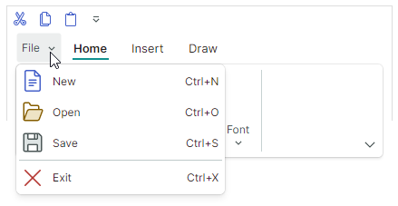

# Application Button и главное меню

Контрол Ribbon имеет встроенную Application Button. Щелчок по Application Button обычно вызывает связанное выпадающее меню приложения. Вы также можете выполнять пользовательские действия при щелчке по этой кнопке.


## Содержимое Application Button

Application Button может отображать изображение и содержимое (текст). 

- `RibbonControl.ApplicationButtonContent` — задаёт подпись Application Button.
- `RibbonControl.ApplicationButtonContentTemplate` — шаблон данных для отрисовки подписи Application Button произвольным образом.
- `RibbonControl.ApplicationButtonGlyph` — задаёт изображение, отображаемое перед подписью.

Следующий код назначает Application Button пользовательскую подпись и изображение:


``` xml
xmlns:icons="https://schemas.eremexcontrols.net/avalonia/icons"

<mxr:RibbonControl Name="ribbon1" 
  ApplicationButtonContent="File" 
  ApplicationButtonGlyph="{x:Static icons:Basic.Small_Images}" 
  ApplicationButtonKeyTip="F" >
```

## Видимость Application Button

Application Button расположена у левого края, перед заголовками страниц Ribbon. 

Когда Application Button и меню не нужны, вы можете использовать свойство `RibbonControl.IsApplicationButtonVisible`, чтобы скрыть Application Button.

## Щелчок по Application Button

Щелчок по Application Button вызывает [меню приложения](#меню-приложения) (если оно задано).

Вы также можете обрабатывать щелчок по Application Button с помощью следующих членов API:

- `RibbonControl.ApplicationButtonCommand` — команда, возникающая при щелчке правой кнопкой мыши по Application Button. Используйте свойство `RibbonControl.ApplicationButtonCommandParameter`, чтобы задать параметр команды.
- `RibbonControl.ApplicationButtonClick` — событие, возникающее при щелчке правой кнопкой мыши по Application Button.
- `RibbonControl.ApplicationButtonPress` — событие, возникающее при нажатии любой кнопки мыши над Application Button.


## Меню приложения

Используйте свойство `RibbonControl.ApplicationButtonDropDownControl`, чтобы задать всплывающее меню/выпадающий контрол, вызываемый при щелчке по кнопке приложения. Вы можете установить свойство `ApplicationButtonDropDownControl` в следующие объекты:

- `PopupMenu` — всплывающее меню, которое может отображать различные элементы (кнопки, кнопки-флажки, подменю и так далее). Подробнее смотрите [Всплывающие и контекстные меню](../toolbars-and-menus/popup-and-context-menus.md).
  
  

- `PopupContainer` — всплывающий контрол, который может отображать пользовательское содержимое.


Следующий пример задаёт компонент `PopupMenu` в качестве меню приложения для контрола Ribbon.



``` xml
<mxr:RibbonControl Name="ribbon1" ApplicationButtonContent="File">
    <mxr:RibbonControl.ApplicationButtonDropDownControl>
        <mxb:PopupMenu MinWidth="250" ContentRightIndent="30">
            <mxb:ToolbarButtonItem Header="New" Glyph="{x:Static icons:Basic.Doc}" 
              GlyphSize="24,24" HotKey="Ctrl+N"/>
            <mxb:ToolbarButtonItem Header="Open" Glyph="{x:Static icons:Basic.Folder_Open}" 
              GlyphSize="24,24" HotKey="Ctrl+O"/>
            <mxb:ToolbarButtonItem Header="Save" Glyph="{x:Static icons:Basic.Save}" 
              GlyphSize="24,24"  HotKey="Ctrl+S"/>
            <mxb:ToolbarButtonItem Header="Exit" Glyph="{x:Static icons:Basic.Cancel}" 
              ShowSeparator="True" GlyphSize="24,24"  HotKey="Ctrl+X"/>
        </mxb:PopupMenu>
    </mxr:RibbonControl.ApplicationButtonDropDownControl>
    <!-- ... -->
</mxr:RibbonControl>
```


<br>
<br>

<sup>*</sup> Эта страница переведена с использованием технологий машинного перевода.
