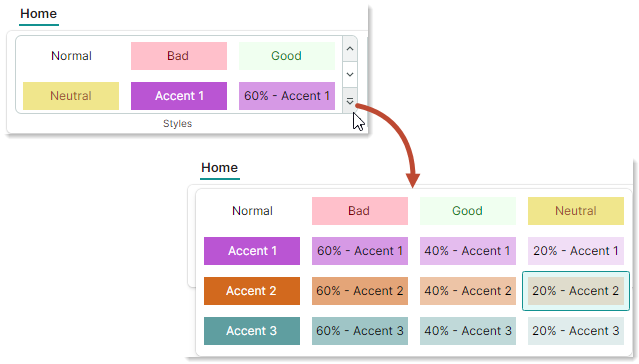
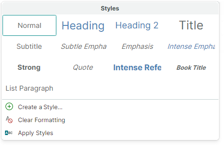
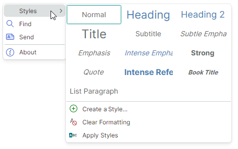
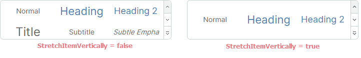
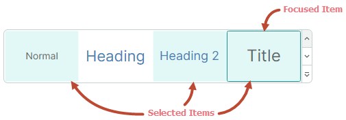

# Галереи

Галерея — это [элемент Ribbon](ribbon-items.md), который может отображать набор графически насыщенных элементов (например, форматированный текст с изображениями), отрисованных в соответствии с заданными шаблонами данных. Элементы галереи располагаются слева направо, затем вниз, образуя многоколоночный список. 

Следующее изображение демонстрирует встроенную в Ribbon галерею, отображающую 3 столбца элементов.


Встроенная в Ribbon галерея содержит две кнопки для вертикальной прокрутки. Под этими кнопками находится кнопка выпадающего списка, которая отображает всё содержимое галереи во всплывающем окне.


## Создание галереи Ribbon

Используйте элемент `RibbonGalleryItem`, чтобы добавить галерею в интерфейс Ribbon. Вы можете добавить объект `RibbonGalleryItem` в [группу страниц](page-groups.md), во всплывающие меню, в [область заголовков страниц](page-header-items.md) или на [панель быстрого доступа](quick-access-toolbar.md) так же, как и другие [элементы Ribbon](ribbon-items.md). Например, чтобы добавить элементы Ribbon в группу страниц, определите их между открывающим и закрывающим тегами &lt;RibbonPageGroup&gt;. В code-behind вы можете добавлять элементы с помощью коллекции `RibbonPageGroup.Items`.

Следующий фрагмент кода из демо _WordPad Example_ добавляет галерею в группу страниц _Styles_. Источник элементов галереи задаётся коллекцией _FontStyles_, определённой во View Model.


``` xml
<mxr:RibbonPageGroup Header="Styles" IsHeaderButtonVisible="True">
    <mxr:RibbonGalleryItem MaxColumnCount="3" ItemWidth="108" StretchItemVertically="True"
                           ItemHeight="80"
                           Header="Styles"
                           MaxDropDownColumnCount="3"
                           ItemsSource="{Binding FontStyles}">
</mxr:RibbonPageGroup>
```

## Элементы галереи

Используйте свойство `RibbonGalleryItem.ItemsSource`, чтобы предоставить коллекцию бизнес-объектов для отображения в виде элементов галереи. Чтобы отрисовать эти бизнес-объекты в галерее, определите соответствующие шаблоны данных. 

Чтобы определить шаблоны элементов галереи, вы также можете использовать свойство `RibbonGalleryItem.ItemTemplate`.

### Пример - использование нескольких шаблонов для элементов галереи

В следующем коде из демо _WordPad Example_ элементы галереи заполняются из коллекции _FontStyles_, определённой во View Model. Элементы коллекции _FontStyles_ — это бизнес-объекты (_NormalGalleryItem_, _HeadingGalleryItem_ и _TitleGalleryItem_), для которых шаблоны данных определены в коллекции `UserControl.DataTemplates`.


``` xml
<mxr:RibbonGalleryItem 
  ItemsSource="{Binding FontStyles}"
  ...
  >
```

``` cs
public partial class WordPadExampleViewModel : PageViewModelBase
{
    [ObservableProperty] private ObservableCollection<FontStyleGalleryItem> fontStyles;
    //...
    fontStyles = new ObservableCollection<FontStyleGalleryItem>();
    fontStyles.Add(new NormalGalleryItem() { Header = "Normal" });
    fontStyles.Add(new HeadingGalleryItem() { Header = "Heading" });
    fontStyles.Add(new TitleGalleryItem() { Header = "Title" });
}
```

``` xml
<!-- Define data templates -->
<UserControl.DataTemplates>
    <DataTemplate DataType="vm:NormalGalleryItem">
        <Grid>
            <TextBlock Text="{Binding Header}"
                        FontSize="14"
                        HorizontalAlignment="Center"
                        VerticalAlignment="Center" />
        </Grid>
    </DataTemplate>
    <DataTemplate DataType="vm:HeadingGalleryItem">
        <Grid>
            <TextBlock Text="{Binding Header}"
                        FontSize="22"
                        Foreground="SteelBlue"
                        HorizontalAlignment="Center"
                        VerticalAlignment="Center" />
        </Grid>
    </DataTemplate>
    <DataTemplate DataType="vm:TitleGalleryItem">
        <Grid>
            <TextBlock Text="{Binding Header}"
                        FontSize="24"
                        HorizontalAlignment="Center"
                        VerticalAlignment="Center" />
        </Grid>
    </DataTemplate>
</UserControl.DataTemplates>
```

Полный код смотрите в демо _WordPad Example_.


### Пример - использование одного шаблона для всех элементов галереи

Пример ниже использует свойство `RibbonGalleryItem.ItemTemplate`, чтобы определить шаблон данных для отрисовки всех элементов галереи. Этот шаблон рисует текстовый блок, текст и цвета которого задаются настройками объектов элементов галереи (объектов _CellStyle_), хранящихся в коллекции _CellStyles_ View Model.

Свойство `RibbonGalleryItem.FocusedItem` идентифицирует текущий [выбранный элемент галереи](#фокус-и-выбор-элементов-галереи). В примере свойство `RibbonGalleryItem.FocusedItem` привязано к свойству _SelectedCellStyle_ во View Model. Чтобы выполнять действия при выборе элемента галереи, обработчик события `PropertyChanged` View Model отслеживает изменения свойства _SelectedCellStyle_.



``` xml
<mxb:ToolbarManager IsWindowManager="True">
    <mxr:RibbonControl IsApplicationButtonVisible="False">
        <mxr:RibbonPage Header="Home">
            <mxr:RibbonPageGroup Header="Styles" IsHeaderButtonVisible="True">
                <mxr:RibbonGalleryItem MaxColumnCount="3"
                                        ItemWidth="108"
                                        ItemHeight="40"
                                        Header="Cell Styles"
                                        MaxDropDownColumnCount="4"
                                        ItemsSource="{Binding CellStyles}"
                                        FocusedItem="{Binding SelectedCellStyle, Mode=TwoWay}"
                                        >
                    <mxr:RibbonGalleryItem.ItemTemplate>
                        <DataTemplate>
                            <Border Background="{Binding BackColor}">
                                <TextBlock Text="{Binding Text}" 
                                  HorizontalAlignment="Center" 
                                  VerticalAlignment="Center"
                                  Foreground="{Binding TextColor}"/>
                            </Border>
                        </DataTemplate>
                    </mxr:RibbonGalleryItem.ItemTemplate>
                </mxr:RibbonGalleryItem>
            </mxr:RibbonPageGroup>
        </mxr:RibbonPage>
    </mxr:RibbonControl>
</mxb:ToolbarManager>
```

``` cs
public partial class MainWindowViewModel : ViewModelBase
{
    [ObservableProperty] private ObservableCollection<CellStyle> cellStyles;
    [ObservableProperty] private CellStyle selectedCellStyle;

    public MainWindowViewModel()
    {
        cellStyles = new ObservableCollection<CellStyle>
        {
            new CellStyle(){ Text="Normal", TextColor=Brushes.Black, BackColor=Brushes.White },
            new CellStyle(){ Text="Bad", TextColor=Brushes.Maroon, BackColor=Brushes.Pink },
            new CellStyle(){ Text="Good", TextColor=Brushes.Green, BackColor=Brushes.Honeydew },
            new CellStyle(){ Text="Neutral", TextColor=Brushes.Sienna, BackColor=Brushes.Khaki }
        };
        //Add accent colors
        Color[] accentColors = new Color[] { Colors.MediumOrchid, Colors.Chocolate, Colors.CadetBlue };
        for (int accentColorIndex=1; accentColorIndex<= accentColors.Length; accentColorIndex++)
        {
            Color accentColor = accentColors[accentColorIndex-1];
            string accentTitle = $"Accent {accentColorIndex}";
            cellStyles.Add(new CellStyle() { 
              Text = accentTitle, 
              TextColor=Brushes.White, 
              BackColor=new SolidColorBrush(accentColor) 
            });
            for (double opacity = 0.6; opacity > 0.1; opacity -= 0.2)
            {
                cellStyles.Add(new CellStyle() { 
                  Text = $"{opacity:p0} - " + accentTitle, 
                  TextColor=Brushes.Black, 
                  BackColor=new SolidColorBrush(accentColor, opacity)  
                });
            }
        };
        selectedCellStyle = cellStyles[0];
        PropertyChanged += PropertyChanged1;
    }

    // Perform actions when a gallery item is selected.
    private void PropertyChanged1(object? sender, System.ComponentModel.PropertyChangedEventArgs e)
    {
        if (e.PropertyName == nameof(SelectedCellStyle))
        {
            string selectedCellStyleName = SelectedCellStyle.Text;
            //...
        }
    }
}

public class CellStyle : ObservableObject
{
    public CellStyle() 
    {
        Text = "Default";
        TextColor = Brushes.Black;
        BackColor = Brushes.White;
    }
    public string Text { get; set; }
    public IBrush TextColor { get; set; }
    public IBrush BackColor { get; set; }
}
```

## Настройки отображения галереи

- `RibbonGalleryItem.Header` — подпись галереи.  

  ``` xml
  <mxr:RibbonGalleryItem Header="Styles" ...>
  ```


  Подпись галереи отображается в следующих случаях:

  - В выпадающей галерее, когда включена опция `IsDropDownHeaderVisible`.

    
    

  - Когда объект `RibbonGalleryItem` отрисовывается как кнопка со связанной выпадающей галереей. Это происходит, когда объект `RibbonGalleryItem` встроен во всплывающее меню или когда используется [упрощённая компоновка команд](ribbon-command-layouts.md). Свойство `RibbonGalleryItem.Header` задаёт подпись этой кнопки. 
  
    

    Подробнее смотрите в следующих разделах: [Галереи в упрощённой компоновке команд](#галереи-в-упрощённой-компоновке-команд) и [Галереи на панелях инструментов, во всплывающих и контекстных меню](#галереи-на-панелях-инструментов-во-всплывающих-и-контекстных-меню).

- `RibbonGalleryItem.ItemHeight` — задаёт высоту элементов галереи. Это свойство имеет более высокий приоритет, чем настройка `RibbonGalleryItem.StretchItemVertically`.

  Если свойство `RibbonGalleryItem.ItemHeight` не задано, высота элемента галереи по умолчанию задаётся высотой первого элемента галереи. Эта высота берётся из соответствующего шаблона данных.

- `RibbonGalleryItem.ItemWidth` — задаёт ширину элементов галереи.
- `RibbonGalleryItem.MaxColumnCount` — задаёт максимальное число столбцов во встроенной в Ribbon галерее.
- `RibbonGalleryItem.MaxDropDownColumnCount` — задаёт максимальное число столбцов в выпадающей галерее.
- `RibbonGalleryItem.StretchItemVertically` — задаёт, растягивать ли по вертикали первую строку элементов галереи, чтобы уместить её в высоту встроенной в Ribbon галереи. Эта автоматическая высота распространяется на другие строки, включая строки в выпадающей галерее.

  

  Свойство `RibbonGalleryItem.StretchItemVertically` не действует, если задано свойство `RibbonGalleryItem.ItemHeight`.

  Когда свойство `RibbonGalleryItem.StretchItemVertically` равно `false`, а свойство `RibbonGalleryItem.ItemHeight` не используется, высота элемента галереи по умолчанию задаётся высотой первого элемента галереи. Эта высота берётся из соответствующего шаблона данных.

## Фокус и выбор элементов галереи

- `RibbonGalleryItem.FocusedItem` — позволяет получить бизнес-объект, соответствующий текущему сфокусированному элементу галереи. Сфокусированный элемент — это тот, который получает фокус. Вы можете определить сфокусированный элемент по рамке фокуса.

  
  

- `RibbonGalleryItem.ItemSelectionMode` — позволяет выбирать между режимами одиночного и множественного выбора элементов. Когда свойство `ItemSelectionMode` установлено в `Multiple`, пользователи могут выбирать несколько элементов галереи одновременно.
  
  В режиме одиночного выбора используйте свойство `RibbonGalleryItem.FocusedItem`, чтобы получить/задать сфокусированный (выбранный) элемент.
  
  В режиме множественного выбора используйте свойство `RibbonGalleryItem.SelectedItems`, чтобы получить/задать текущие выбранные элементы. 

  Когда вы щёлкаете по элементу в режиме множественного выбора, этот элемент автоматически фокусируется и выбирается. 
  Выбранные элементы имеют подсвеченный фон. Рамка вокруг элемента галереи указывает, что он сфокусирован.

  
  
  Чтобы выбрать несколько элементов, щёлкайте по элементам, удерживая клавишу CTRL и/или SHIFT. 
  
  Действие CTRL+щелчок переключает состояние выбора сфокусированного элемента. Это позволяет пользователю снять выбор со сфокусированного элемента.

  

- `RibbonGalleryItem.SelectedItems` — коллекция бизнес-объектов, соответствующих выбранным элементам галереи. Установите свойство `RibbonGalleryItem.ItemSelectionMode` в `Multiple`, чтобы разрешить множественный выбор элементов.

  
  В режиме одиночного выбора свойство `RibbonGalleryItem.SelectedItems` содержит один элемент. Он совпадает со свойством `RibbonGalleryItem.FocusedItem`.

  


## Показ и закрытие выпадающей галереи

- `RibbonGalleryItem.IsPopupOpen` — возвращает или задаёт, открыта ли выпадающая галерея.
- `RibbonGalleryItem.ClosePopup` — закрывает выпадающую галерею.

## Дополнительные команды в выпадающей галерее

Выпадающая галерея может отображать дополнительные элементы Ribbon (команды) внизу. 


Используйте свойство `RibbonGalleryItem.DropDownItems`, чтобы задать эти дополнительные элементы.

``` xml
<mxr:RibbonPageGroup Header="Styles" IsHeaderButtonVisible="True">
    <mxr:RibbonGalleryItem MaxColumnCount="3" ItemWidth="108" StretchItemVertically="True"
                           ItemHeight="80"
                           Header="Styles"
                           MaxDropDownColumnCount="3"
                           ItemsSource="{Binding FontStyles}">
        <mxr:RibbonGalleryItem.DropDownItems>
            <mxb:ToolbarButtonItem Header="Create A Style..." Glyph="{x:Static icons:Basic.Add}" />
            <mxb:ToolbarButtonItem Header="Clear Formatting"
                                   Glyph="{x:Static icons:Filter.Does_not_contain}" />
            <mxb:ToolbarButtonItem Header="Apply Styles" Glyph="{x:Static icons:Filter.Starts_with}" />
        </mxr:RibbonGalleryItem.DropDownItems>
    </mxr:RibbonGalleryItem>
</mxr:RibbonPageGroup>
```

## Галереи в упрощённой компоновке команд

В [упрощённой компоновке команд](ribbon-command-layouts.md) галерея, добавленная в группу страниц, отрисовывается как кнопка. Щелчок по этой кнопке вызывает всю галерею.


Текст кнопки задаётся свойством `RibbonGalleryItem.Header`.

## Галереи на панелях инструментов, во всплывающих и контекстных меню

Когда вы добавляете галерею на традиционную панель инструментов или во всплывающее меню, галерея отображается как подменю.


Подпись подменю задаётся свойством `RibbonGalleryItem.Header`.


<br>
<br>

<sup>*</sup> Эта страница переведена с использованием технологий машинного перевода.
