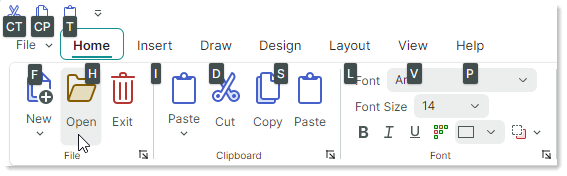

# Key Tips

Вы можете нажать ALT, чтобы переместить фокус на контрол Ribbon, а затем использовать клавиши со стрелками для навигации по интерфейсу Ribbon.


Во время навигации с клавиатуры контрол Ribbon также поддерживает быстрый доступ к элементам Ribbon с помощью **Key Tips**. Key Tips — это клавиши доступа (от одной до трёх клавиш), отображаемые при нажатии клавиши ALT. Они позволяют пользователю быстро сфокусировать или активировать элементы Ribbon. 

Нажмите ALT, чтобы показать Key Tips для элементов Ribbon верхнего уровня ([страниц Ribbon](pages.md), [кнопки приложения](application-button-and-main-menu.md), [панели быстрого доступа](quick-access-toolbar.md) и [элементов заголовков страниц](page-header-items.md)). Key Tips появляются в виде небольших всплывающих подсказок. 




- Нажатие видимого Key Tip, назначенного команде, активирует эту команду.
- Нажатие видимого Key Tip, назначенного встроенному редактору, перемещает фокус на этот редактор.
- Нажатие видимого Key Tip, назначенного [кнопке приложения](application-button-and-main-menu.md), вызывает связанное [меню/выпадающий контрол приложения](application-button-and-main-menu.md).
- Нажатие видимого Key Tip, назначенного странице, отображает Key Tips для команд, расположенных на этой странице.

  Например, когда вы нажимаете "H" в состоянии контрола Ribbon, показанном на изображении выше, отображаются Key Tips для команд на странице _Home_.

  

  Теперь вы можете нажать любой из отображённых Key Tips, чтобы активировать соответствующую команду на активной странице.

- Нажатие Key Tip, который в данный момент не виден, не действует. 

    !!! tip
        Вы можете назначать сочетания клавиш (такие как CTRL+O, CTRL+B и так далее) командам Ribbon с помощью свойства `HotKey`. Горячие клавиши позволяют пользователям активировать команды, если фокус находится в пределах области действия горячих клавиш (область действия горячих клавиш по умолчанию задаётся границами компонента `ToolbarManager`). Подробнее смотрите [Элементы Ribbon. Горячие клавиши](ribbon-items.md#горячие-клавиши).

## Возврат назад во время навигации с клавиатуры

Чтобы вернуться на шаг назад и увидеть предыдущие Key Tips, нажмите Esc.

Если нажат неправильный символ, нажмите Backspace, чтобы стереть его.

## Отмена навигации с клавиатуры

- Нажимайте ESC, пока Key Tips не исчезнут.

или

- Уведите фокус с контрола Ribbon (например, щёлкните по другому контролу).

## Задание Key Tips

Следующие свойства позволяют назначать key tips элементам Ribbon:

- `ToolbarItem.KeyTip`
- `RibbonPage.KeyTip`
- `RibbonControl.ApplicationButtonKeyTip`

``` xml
<!-- Specify a Key Tip for the Application Menu-->
<mxr:RibbonControl ApplicationButtonContent="File" ApplicationButtonKeyTip="F" Name="ribbon">
    <mxr:RibbonControl.ApplicationButtonDropDownControl>
        <!-- Define the Application Menu displayed when the Application Button is clicked
            or activated with the "F" Key Tip.
         -->
        <mxb:PopupMenu MinWidth="250" >
            <!-- ... -->
        </mxb:PopupMenu>
    </mxr:RibbonControl.ApplicationButtonDropDownControl>
    <!-- Specify a Key Tip for the Home Page -->
    <mxr:RibbonPage Header="Home" KeyTip="H">
        <mxr:RibbonPageGroup Header="File">
            <!-- Specify Key Tips for ribbon commands -->
            <mxb:ToolbarButtonItem Header="New" KeyTip="N" .../>
            <mxb:ToolbarButtonItem Header="Open" KeyTip="O".../>
        </mxr:RibbonPageGroup>
        <mxr:RibbonPageGroup Header="Clipboard">
            <mxb:ToolbarButtonItem Header="Paste" KeyTip="PA" .../>
            <mxb:ToolbarButtonItem Header="Cut" KeyTip="CT" .../>
        </mxr:RibbonPageGroup>
    </mxr:RibbonPage>
</mxr:RibbonControl>
```

Убедитесь, что одновременно отображаемые Key Tips уникальны. Например, вам нужно назначить уникальные Key Tips для команд на страницах Ribbon.


<br>
<br>

<sup>*</sup> Эта страница переведена с использованием технологий машинного перевода.
