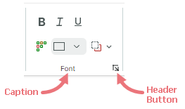
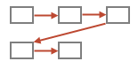
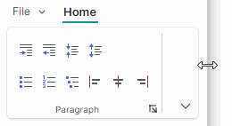
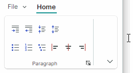
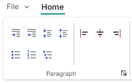

# Группы страниц

[Элементы (команды)](ribbon-items.md) на [страницах Ribbon](pages.md) можно логически разделить на группы. Группы страниц Ribbon разделяются вертикальными разделителями. Они отображают заголовки внизу, когда применена [классическая компоновка команд](ribbon-command-layouts.md). Следующее изображение демонстрирует группы страниц _File_, _Clipboard_, _Font_ и _Styles_, отображаемые на странице _Home_:


## Определение групп страниц Ribbon и доступ к ним

Группы страниц Ribbon инкапсулируются объектами класса `RibbonPageGroup`. В code-behind вы можете создавать, получать доступ и изменять группы страниц с помощью коллекции `RibbonPage.Groups`. Чтобы определить группы страниц в XAML, добавьте объекты `RibbonPageGroup` между открывающим и закрывающим тегами **&lt;RibbonPage&gt;**.

``` xml
<mxr:RibbonPage Header="Home" KeyTip="H" Name="pageHome">
    <mxr:RibbonPageGroup Header="File" IsHeaderButtonVisible="True">
        <!-- ... -->
    </mxr:RibbonPageGroup>
    <mxr:RibbonPageGroup Header="Clipboard" IsHeaderButtonVisible="True">
        <!-- ... -->
    </mxr:RibbonPageGroup>
    <mxr:RibbonPageGroup Header="Font" IsHeaderButtonVisible="True">
        <!-- ... -->
    </mxr:RibbonPageGroup>
    <!-- ... -->
</mxr:RibbonPageGroup>
```

Вы также можете использовать свойство `RibbonPage.GroupsSource`, чтобы создавать группы страниц из коллекции бизнес-объектов во View Model. Соответствующий шаблон данных должен определять объект `RibbonPageGroup` и инициализировать его настройки из бизнес-объекта.

<!-- TODO
GroupsSource example
 -->


## Заголовок группы страниц

Когда применена [классическая компоновка команд](ribbon-command-layouts.md), группы страниц имеют заголовки внизу. Заголовок группы отображает подпись (`RibbonPageGroup.Header`) и кнопку заголовка.



Щелчок по кнопке заголовка не имеет действия по умолчанию. Вы можете связать действие с кнопкой заголовка следующим образом:

- Обработайте событие `RibbonPageGroup.HeaderButtonClick` или `RibbonPageGroup.HeaderButtonPress`. Например, ваш обработчик события может отобразить диалог или меню с дополнительными настройками, связанными с группой.

  Событие `HeaderButtonClick` возникает после нажатия и отпускания левой кнопки мыши над кнопкой заголовка. Событие `HeaderButtonPress` возникает сразу после того, как пользователь нажимает любую кнопку мыши над кнопкой заголовка. 

- Назначьте команду свойству `RibbonPageGroup.HeaderButtonCommand`. Вы можете задать необязательный параметр команды с помощью свойства `RibbonPageGroup.HeaderButtonCommandParameter`.

Используйте свойство `RibbonPageGroup.IsHeaderButtonVisible`, чтобы скрыть кнопку заголовка.


## Содержимое группы страниц


Группа страниц отображает набор тесно связанных элементов Ribbon. Элементы Ribbon — это кнопки, кнопки-флажки, группы кнопок, подменю, встроенные редакторы, галереи и другое. Дополнительную информацию смотрите в следующих разделах: [Элементы Ribbon](ribbon-items.md) и [Галереи](galleries.md)

Чтобы заполнить группу страниц Ribbon элементами, используйте коллекцию `RibbonPageGroup.Items`. В XAML вы можете определять элементы между открывающим и закрывающим тегами **&lt;RibbonPageGroup&gt;**.


``` xml
 <mxr:RibbonPage Header="Home" KeyTip="H">
    <mxr:RibbonPageGroup Header="File" IsHeaderButtonVisible="True">
        <mxb:ToolbarButtonItem Header="New" KeyTip="N" Glyph="{x:Static icons:Basic.Docs_Add}"
                               mxr:RibbonControl.DisplayMode="Large"/>
        <mxb:ToolbarButtonItem Header="Open" KeyTip="O"
                               Glyph="{x:Static icons:Basic.Folder_Open}" />
        <mxb:ToolbarButtonItem Header="Exit" KeyTip="E"
                               Glyph="{x:Static icons:Basic.Remove}" />
    </mxr:RibbonPageGroup>
    <mxr:RibbonPageGroup Header="Font" IsHeaderButtonVisible="True">
        <mxb:ToolbarCheckItemGroup ShowSeparator="True">
            <mxb:ToolbarCheckItem Header="Bold" KeyTip="B" Glyph="{x:Static icons:Basic.Font_Bold}" />
            <mxb:ToolbarCheckItem Header="Italic" KeyTip="I" Glyph="{x:Static icons:Basic.Font_Italic}" />
            <mxb:ToolbarCheckItem Header="Underline" KeyTip="U" Glyph="{x:Static icons:Basic.Font_Underline}"  />
        </mxb:ToolbarCheckItemGroup>
       <!-- ... -->
    </mxr:RibbonPageGroup>
</mxr:RibbonPage>
```

Вы также можете использовать свойство `RibbonPageGroup.ItemsSource`, чтобы создавать элементы из коллекции бизнес-объектов во View Model. Соответствующие шаблоны данных должны определять элементы Ribbon и инициализировать их настройки из базовых бизнес-объектов.

<!-- TODO
ItemsSource example
 -->


## Изображение группы страниц

Когда контрол Ribbon изменяет размер, функция адаптивной компоновки может сворачивать определённые группы страниц. В свёрнутом состоянии элементы группы отображаются во всплывающем окне.


Вы можете использовать свойство `RibbonPageGroup.Glyph`, чтобы отобразить изображение на кнопке свёрнутой группы:


``` xml
xmlns:icons="https://schemas.eremexcontrols.net/avalonia/icons"
<mxr:RibbonPageGroup Header="File" Glyph="{x:Static icons:Basic.Doc}">
```


## Размещение элементов в группах страниц

### Адаптивная компоновка

Контрол Ribbon поддерживает функцию адаптивной компоновки, которая подстраивает размещение элементов в группах страниц Ribbon при изменении размера контрола Ribbon. 


#### Объединение элементов в группы

Вы можете группировать наборы [элементов Ribbon](ribbon-items.md) в неразрывные контейнеры (группы) с помощью [ToolbarItemGroup](ribbon-items.md#неразрывные-группы-элементов-toolbaritemgroup) и [ToolbarCheckItemGroup](ribbon-items.md#неразрывные-группы-флажков-toolbarcheckitemgroup).
Эти контейнеры гарантируют, что элементы отображаются вместе в одну линию, сохраняя эту компоновку даже при применении функции адаптивной компоновки. При изменении размера Ribbon может сворачиваться только весь контейнер целиком, а не отдельные его элементы.

Например, в анимации выше элементы ,  и  объединены в неразрывный контейнер. 

#### Изображения элементов

Когда применена [классическая компоновка команд](ribbon-command-layouts.md), функция адаптивной компоновки также подстраивает размер отображения элементов при изменении размера Ribbon — от больших к маленьким с текстом и к маленьким глифам, и обратно.


Присоединённое свойство `RibbonControl.DisplayMode` позволяет задавать поддерживаемые режимы отображения для элементов Ribbon в группах страниц Ribbon в [классической компоновке команд](ribbon-command-layouts.md).
Вы можете принудительно задать элементу использование только больших изображений, только маленьких изображений, маленьких изображений с текстом или комбинации этих режимов отображения.

  ``` xml
  <mxb:ToolbarButtonItem Header="Open" KeyTip="O" mxr:RibbonControl.DisplayMode="Large"
                            Glyph="{x:Static icons:Basic.Folder_Open}" />
  ```

  Дополнительную информацию смотрите в следующем разделе: [Адаптивный размер глифа в классической компоновке команд](ribbon-items.md#адаптивный-размер-глифа-в-классической-компоновке-команд)


#### Связанный API

- `AllowCollapse` — задаёт, может ли группа быть свёрнута при уменьшении ширины контрола Ribbon. 
- `IsCollapsed` — возвращает, свёрнута ли текущая группа в данный момент.


### Настройка размещения элементов в группах страниц

Контрол Ribbon поддерживает два режима размещения элементов в группах страниц:

- Столбец (вниз, затем поперёк)

    

    Элемент перемещается в новый столбец, если высоты группы недостаточно для отображения элемента под его предшествующим соседом.

    В настоящее время все элементы Ribbon, кроме [неразрывных групп](ribbon-items.md#неразрывные-группы-элементов-toolbaritemgroup), поддерживают только режим размещения «Столбец».
    

- Строка (поперёк, затем вниз)

    

    Элемент перемещается в новую строку, если ширины группы недостаточно для отображения элемента справа от его предшествующего соседа.

    Неразрывные контейнеры ([ToolbarItemGroup](ribbon-items.md#неразрывные-группы-элементов-toolbaritemgroup) и [ToolbarCheckItemGroup](ribbon-items.md#неразрывные-группы-флажков-toolbarcheckitemgroup)) по умолчанию используют режим размещения «Строка».

Присоединённое свойство `RibbonPageGroup.ItemLayouMode` позволяет изменить режим размещения для [неразрывных контейнеров](ribbon-items.md#неразрывные-группы-элементов-toolbaritemgroup) со «Строки» (по умолчанию) на «Столбец». Свойство `RibbonPageGroup.ItemLayouMode` в настоящее время не действует для других элементов Ribbon.

Значение свойства `RibbonPageGroup.ItemLayouMode` по умолчанию — `Default`, что эквивалентно `Row` для неразрывных контейнеров и `Column` для других элементов Ribbon.

- Если два последовательных элемента используют разные режимы размещения (Column и Row), второй элемент автоматически сдвигается в новый столбец.
- Чтобы расположить набор последовательных элементов в режиме размещения Column или Row, убедитесь, что нужный режим размещения применён ко всем этим элементам, явно или неявно.
- Совет: вы можете объединить два элемента Ribbon в отдельный [неразрывный контейнер](ribbon-items.md#неразрывные-группы-элементов-toolbaritemgroup), чтобы они действовали как единое целое.

#### Пример - размещение элементов в столбец
Следующий пример использует присоединённое свойство `RibbonPageGroup.ItemLayouMode`, чтобы разместить элементы в столбец.


Эта компоновка состоит из трёх строк элементов Ribbon:

- Строка 1 отображает элемент-флажок.

    ``` xml
    <mxb:ToolbarCheckItem Name="btnSort" Header="Sort Results Alphabetically" CheckBoxStyle="CheckBox"/>
    ```

- Строка 2 отображает контейнер (`ToolbarItemGroup`), объединяющий текстовый редактор и кнопку. Группировка элементов в контейнер необходима, чтобы разместить элементы рядом друг с другом.

    ``` xml
    <mxb:ToolbarItemGroup Name="groupSearchBox">
        <mxb:ToolbarEditorItem Header="Search" EditorWidth="150">
            <mxb:ToolbarEditorItem.EditorProperties>
                <mxe:TextEditorProperties/>
            </mxb:ToolbarEditorItem.EditorProperties>
        </mxb:ToolbarEditorItem>
        <mxb:ToolbarButtonItem
                Header="Find"
                Glyph="{SvgImage 'avares://Ribbon-Layout/Assets/arrow-right.svg'}"
                Command="{Binding FindCommand}"/>
    </mxb:ToolbarItemGroup>
    ```
    
- Строка 3 отображает контейнер (`ToolbarCheckItemGroup`), объединяющий три элемента-флажка:

    ``` xml
    <mxb:ToolbarCheckItemGroup Name="groupSearchProperties"  >
        <mxb:ToolbarCheckItem
            Header="Match case"
            IsChecked="{Binding IsMatchCase}"
            Glyph="{SvgImage 'avares://Ribbon-Layout/Assets/match-case.svg'}"/>
        <mxb:ToolbarCheckItem
            Header="Match whole word"
            IsChecked="{Binding IsMatchWholeWord}"
            Glyph="{SvgImage 'avares://Ribbon-Layout/Assets/match-whole-word.svg'}"/>
        <mxb:ToolbarCheckItem
            Header="Use regular expressions"
            IsChecked="{Binding IsUseRegExp}"
            Glyph="{SvgImage 'avares://Ribbon-Layout/Assets/match-regexp.svg'}"/>
    </mxb:ToolbarCheckItemGroup>
    ```

Поместите элементы _btnSort_, _groupSearchBox_ и _groupSearchProperties_ в `RibbonPageGroup`:

``` xml
<mxr:RibbonControl>
    <mxr:RibbonPage Header="Home">
        <mxr:RibbonPageGroup Header="Sort">
            <mxb:ToolbarCheckItem Name="btnSort" Header="Sort Results Alphabetically" CheckBoxStyle="CheckBox"/>
            <mxb:ToolbarItemGroup Name="groupSearchBox">
                <!-- ... -->
            </mxb:ToolbarItemGroup>
            <mxb:ToolbarCheckItemGroup Name="groupSearchProperties" >
                <!-- ... -->
            </mxb:ToolbarCheckItemGroup
        </mxr:RibbonPageGroup>
    </mxr:RibbonControl>
</mxr:RibbonPage
```

Этот код даёт нежелательную компоновку, в которой контейнеры _groupSearchBox_ и _groupSearchProperties_ сдвинуты в отдельный столбец. Это происходит потому, что элемент _btnSort_ использует режим размещения «Столбец», тогда как контейнеры по умолчанию используют режим «Строка».

 

Чтобы расположить контейнеры под кнопкой _btnSort_, установите присоединённое свойство `RibbonPageGroup.ItemLayouMode` в Column для этих контейнеров.

``` xml
<mxr:RibbonControl ApplicationButtonContent="File" ApplicationButtonKeyTip="F">
    <mxr:RibbonPage Header="Home" KeyTip="M">
        <mxr:RibbonPageGroup Header="Sort">
            <mxb:ToolbarCheckItem Name="btnSort" Header="Sort Results Alphabetically" CheckBoxStyle="CheckBox"/>
            <mxb:ToolbarItemGroup Name="groupSearchBox"
                                  mxr:RibbonPageGroup.ItemLayoutMode="Column">
                <mxb:ToolbarEditorItem Header="Search" EditorWidth="150">
                    <mxb:ToolbarEditorItem.EditorProperties>
                        <mxe:TextEditorProperties/>
                    </mxb:ToolbarEditorItem.EditorProperties>
                </mxb:ToolbarEditorItem>
                <mxb:ToolbarButtonItem
                        Header="Find"
                        Glyph="{SvgImage 'avares://Ribbon-Layout/Assets/arrow-right.svg'}"
                        Command="{Binding FindCommand}"/>
            </mxb:ToolbarItemGroup>

            <mxb:ToolbarCheckItemGroup Name="groupSearchProperties" 
                                       mxr:RibbonPageGroup.ItemLayoutMode="Column" >
                <mxb:ToolbarCheckItem
                    Header="Match case"
                    IsChecked="{Binding IsMatchCase}"
                    Glyph="{SvgImage 'avares://Ribbon-Layout/Assets/match-case.svg'}"/>
                <mxb:ToolbarCheckItem
                    Header="Match whole word"
                    IsChecked="{Binding IsMatchWholeWord}"
                    Glyph="{SvgImage 'avares://Ribbon-Layout/Assets/match-whole-word.svg'}"/>
                <mxb:ToolbarCheckItem
                    Header="Use regular expressions"
                    IsChecked="{Binding IsUseRegExp}"
                    Glyph="{SvgImage 'avares://Ribbon-Layout/Assets/match-regexp.svg'}"/>
            </mxb:ToolbarCheckItemGroup>
        </mxr:RibbonPageGroup>
    </mxr:RibbonPage>
</mxr:RibbonControl>
```

Теперь элементы _btnSort_, _groupSearchBox_ и _groupSearchProperties_ используют режим размещения Column, поэтому они располагаются в один столбец, как показано на изображении ниже:

 


### Размещение неразрывных контейнеров в две или три строки

Если группа страниц достаточно широка, элементы, объединённые в неразрывные контейнеры ([ToolbarItemGroup](ribbon-items.md#неразрывные-группы-элементов-toolbaritemgroup) и [ToolbarCheckItemGroup](ribbon-items.md#неразрывные-группы-флажков-toolbarcheckitemgroup)), располагаются в две строки. При уменьшении ширины группы страниц контейнеры располагаются в три строки, создавая более компактную компоновку.


В определённых случаях вам может потребоваться принудительно расположить неразрывные контейнеры в две или три строки.
Для этого установите присоединённое свойство `RibbonPageGroup.ItemGroupLayoutMode` для первого неразрывного контейнера в `Layout2Rows` или `Layout3Rows` (значение свойства по умолчанию — `AdaptiveLayout`).

#### Пример - принудительное размещение контейнеров в две строки

Рассмотрим `RibbonPageGroup`, содержащий четыре неразрывных контейнера (группы) элементов.


При изменении размера контрола Ribbon функция адаптивной компоновки располагает контейнеры в две или три строки, чтобы уместить их в доступное пространство.



Чтобы принудительно расположить контейнеры в две строки, установите присоединённое свойство `RibbonPageGroup.ItemGroupLayoutMode` для первого неразрывного контейнера в `Layout2Rows`.

``` xml
<mxr:RibbonPageGroup Header="Paragraph">
    <mxb:ToolbarItemGroup Name="gIndent"
                          mxr:RibbonPageGroup.ItemGroupLayoutMode="Layout2Rows">
        <mxb:ToolbarButtonItem Header="Increase Indent" Glyph="{x:Static icons:Basic.Level_Increase}"/>
        <mxb:ToolbarButtonItem Header="Decrease Indent" Glyph="{x:Static icons:Basic.Level_Reduce}"/>
    </mxb:ToolbarItemGroup>

    <mxb:ToolbarItemGroup  Name="gLineSpacing">
        <mxb:ToolbarButtonItem Header="Increase Line Spacing" Glyph="{x:Static icons:Basic.List_Collapse}"/>
        <mxb:ToolbarButtonItem Header="Decrease Line Spacing" Glyph="{x:Static icons:Basic.List_Expand}"/>
    </mxb:ToolbarItemGroup>
            
    <mxb:ToolbarItemGroup  Name="gParaNumbering">
        <mxb:ToolbarButtonItem Header="Bullets" Glyph="{x:Static icons:Office.Bullets}" />
        <mxb:ToolbarButtonItem Header="Numbering" Glyph="{x:Static icons:Office.Line_Numbering}" />
        <mxb:ToolbarButtonItem Header="Multilevel List" Glyph="{x:Static icons:Office.Multilevel_List}" />
    </mxb:ToolbarItemGroup>
            
    <mxb:ToolbarCheckItemGroup  Name="gAlign" CheckType="Radio">
        <mxb:ToolbarCheckItem Header="Align Left" Glyph="{x:Static icons:Alignment.Align_Left}"/>
        <mxb:ToolbarCheckItem Header="Align Center" Glyph="{x:Static icons:Alignment.Align_Horizontal_Centers}"/>
        <mxb:ToolbarCheckItem Header="Align Right" Glyph="{x:Static icons:Alignment.Align_Right}"/>
    </mxb:ToolbarCheckItemGroup>
</mxr:RibbonPageGroup>
```

В результате контейнеры располагаются в две строки. Если недостаточно места для отображения контейнеров целиком, они автоматически сворачиваются.



Если вам нужно, чтобы определённый элемент начинал новый столбец, поместите объект `ToolbarSeparatorItem` перед этим элементом.

``` xml
<mxr:RibbonPageGroup Header="Paragraph">
    <mxb:ToolbarItemGroup Name="gIndent" mxr:RibbonPageGroup.ItemGroupLayoutMode="Layout2Rows">
        <!-- ... -->
    </mxb:ToolbarItemGroup>

    <mxb:ToolbarItemGroup  Name="gLineSpacing">
        <!-- ... -->    
    </mxb:ToolbarItemGroup>
            
    <mxb:ToolbarItemGroup  Name="gParaNumbering">
        <!-- ... -->
    </mxb:ToolbarItemGroup>
    
    <mxb:ToolbarSeparatorItem/>
            
    <mxb:ToolbarCheckItemGroup  Name="gAlign" CheckType="Radio">
        <!-- ... -->        
    </mxb:ToolbarCheckItemGroup>
</mxr:RibbonPageGroup>
```




<br>
<br>

<sup>*</sup> Эта страница переведена с использованием технологий машинного перевода.
