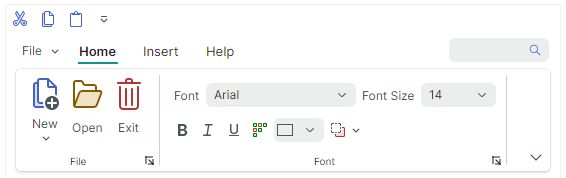

# Страницы

Страницы Ribbon используются для создания вкладок в командной панели контрола Ribbon. Следующее изображение показывает контрол Ribbon с тремя страницами (_Home_, _Insert_ и _Help_):



Вы можете изначально скрыть отдельные страницы, а затем делать их видимыми и активными в определённые моменты. Подробнее смотрите в следующем разделе: [Видимость страниц](#видимость-страниц).

## Определение страниц Ribbon и доступ к ним

Страницы Ribbon инкапсулируются объектами класса `RibbonPage`. В code-behind вы можете создавать, получать доступ и изменять страницы Ribbon с помощью коллекции `RibbonControl.Pages`. Чтобы определить страницы Ribbon в XAML, добавьте объекты `RibbonPage` между открывающим и закрывающим тегами **&lt;RibbonControl&gt;**.

``` xml
<mxb:ToolbarManager IsWindowManager="True">
    <mxr:RibbonControl>
      <mxr:RibbonPage Header="Home" KeyTip="H"> 
        <!-- ... -->
      </mxr:RibbonPage>
      <mxr:RibbonPage Header="Insert" KeyTip="I">
        <!-- ... -->
      </mxr:RibbonPage>
      <mxr:RibbonPage Header="Help" KeyTip="P">
        <!-- ... -->
      </mxr:RibbonPage>
    </mxr:RibbonControl>
</mxb:ToolbarManager>
```

<!-- TODO
Example of adding, hiding, positioning pages via `RibbonControl.Pages`.
 -->


Вы также можете использовать свойство `RibbonControl.PagesSource`, чтобы создавать страницы Ribbon из коллекции бизнес-объектов во View Model. Соответствующий шаблон данных должен определять объект `RibbonPage` и инициализировать его настройки из базового бизнес-объекта.

<!-- TODO
PagesSource example 
 -->

## Заголовок и содержимое страницы

Когда вы создаёте страницу, используйте свойство `RibbonPage.Header`, чтобы задать текст заголовка страницы.

<!-- TODO
There is a Glyph property in RibbonPage.  Doesn't work???
 -->

Содержимым страниц Ribbon являются [группы страниц Ribbon](page-groups.md). Используйте коллекцию `RibbonPage.Groups`, чтобы создавать группы страниц Ribbon и получать к ним доступ. В XAML вы можете определять группы страниц между открывающим и закрывающим тегами **&lt;RibbonPage&gt;**.

``` xml
 <mxr:RibbonPage Header="Home" KeyTip="H">
    <mxr:RibbonPageGroup Header="File" IsHeaderButtonVisible="True">
        <mxb:ToolbarButtonItem Header="New" KeyTip="N" Glyph="{x:Static icons:Basic.Docs_Add}"
                               mxr:RibbonControl.DisplayMode="Large"/>
        <mxb:ToolbarButtonItem Header="Open" KeyTip="O"
                               Glyph="{x:Static icons:Basic.Folder_Open}" />
        <mxb:ToolbarButtonItem Header="Exit" KeyTip="E"
                               Glyph="{x:Static icons:Basic.Remove}" />
    </mxr:RibbonPageGroup>
    <mxr:RibbonPageGroup Header="Font" IsHeaderButtonVisible="True">
        <mxb:ToolbarCheckItemGroup ShowSeparator="True">
            <mxb:ToolbarCheckItem Header="Bold" KeyTip="B" Glyph="{x:Static icons:Basic.Font_Bold}" />
            <mxb:ToolbarCheckItem Header="Italic" KeyTip="I" Glyph="{x:Static icons:Basic.Font_Italic}" />
            <mxb:ToolbarCheckItem Header="Underline" KeyTip="U" Glyph="{x:Static icons:Basic.Font_Underline}"  />
        </mxb:ToolbarCheckItemGroup>
       <!-- ... -->
    </mxr:RibbonPageGroup>
</mxr:RibbonPage>
```


Вы также можете использовать свойство `RibbonPage.GroupsSource`, чтобы создавать группы страниц из коллекции бизнес-объектов во View Model. Соответствующий шаблон данных должен определять объект `RibbonPageGroup` и инициализировать его настройки из бизнес-объекта.

## Выбранная страница

Содержимое страницы показывается пользователю, когда страница выбрана. Пользователь может выбрать страницу, щёлкнув по её заголовку. В коде вы можете выбрать страницу с помощью одного из следующих свойств:

- `RibbonControl.SelectedPage`
- `RibbonPage.IsSelected`

## Видимость страниц

Используйте свойство `RibbonPage.IsVisible`, чтобы скрывать и отображать страницу. Позиция страницы задаётся её местом в коллекции `RibbonControl.Pages`.

Следующий код отображает и активирует изначально скрытую страницу _Table_.

``` xml
<mxr:RibbonControl Name="ribbon">
    <mxr:RibbonPage Header="Table" Name="pageTable" IsVisible="False"> 
        <!-- ... -->
    </mxr:RibbonPage>
<mxr:RibbonControl>
```
``` cs
// Display and select the Table page.
pageTable.IsVisible = true;
pageTable.IsSelected = true;
```

## Раскраска страниц

В контроле Ribbon вы можете выделить любую страницу пользовательским цветом текста. Используйте для этого свойство `RibbonPage.Foreground`.

``` xml
<mxr:RibbonPage Header="Insert"  KeyTip="I" Foreground="Red"/>
<mxr:RibbonPage Header="Draw" KeyTip="D" Foreground="Goldenrod"/>
<mxr:RibbonPage Header="Design" KeyTip="S" Foreground="Green" />
```


Раскраска страниц полезна, когда вам нужно реализовать контекстные страницы (те, что временно видимы и выделены в определённые моменты). Вы должны вручную управлять видимостью, позицией и состоянием выбора этих страниц. Подробнее смотрите [Выбранная страница](#выбранная-страница) и [Видимость страниц](#видимость-страниц).


<br>
<br>

<sup>*</sup> Эта страница переведена с использованием технологий машинного перевода.
