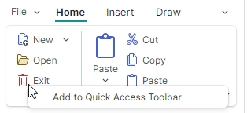
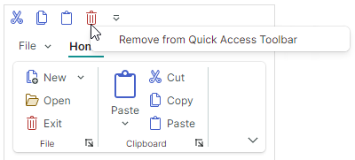
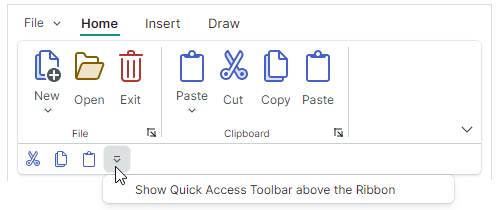

# Панель быстрого доступа

Панель быстрого доступа Ribbon — это настраиваемая панель инструментов, отображающая часто используемые [элементы Ribbon](ribbon-items.md). 


Пользователь может с помощью контекстного меню добавлять элементы на панель быстрого доступа Ribbon и удалять их с неё во время работы.

## Добавление и удаление элементов панели быстрого доступа

Чтобы добавить элементы на панель быстрого доступа во время работы, пользователь может щёлкнуть правой кнопкой мыши по элементу и выбрать **Add to Quick Access Toolbar** в появившемся контекстном меню.



Чтобы удалить элемент с панели быстрого доступа, щёлкните правой кнопкой мыши по элементу и выберите **Remove from Quick Access Toolbar**.



Чтобы узнать, как сохранять и восстанавливать пользовательские изменения панели быстрого доступа Ribbon между запусками приложения, следуйте этому разделу:

- [Сериализация и десериализация Ribbon](ribbon-serialization-and-deserialization.md)

### Отключение настройки панели быстрого доступа

Установите свойство `RibbonControl.AllowQuickAccessToolbarCustomizationMenu` в `false`, чтобы скрыть команды **Add to Quick Access Toolbar** и **Remove from Quick Access Toolbar**, тем самым запрещая пользователям настраивать панель быстрого доступа.

### Добавление элементов на панель быстрого доступа в коде

Чтобы заполнить панель быстрого доступа элементами в коде, используйте коллекцию `RibbonControl.QuickAccessToolbarItems`. Вы также можете использовать эту коллекцию, чтобы обращаться к элементам панели быстрого доступа и затем изменять их в code-behind.

``` xml
<mxr:RibbonControl.QuickAccessToolbarItems>
    <mxb:ToolbarButtonItem Header="Cut" KeyTip="CT"
                           Glyph="{x:Static icons:Basic.Cut}" />
    <mxb:ToolbarButtonItem Header="Copy" KeyTip="CP"
                           Glyph="{x:Static icons:Basic.Copy}" />
    <mxb:ToolbarButtonItem Header="Paste" KeyTip="P"
                           Glyph="{x:Static icons:Basic.Paste}" />
</mxr:RibbonControl.QuickAccessToolbarItems>
```

Используйте свойство `RibbonControl.QuickAccessToolbarItemsSource`, чтобы заполнить панель быстрого доступа элементами из коллекции бизнес-объектов, хранящихся во View Model. Соответствующие шаблоны данных должны определять элементы Ribbon и инициализировать их настройки из базовых бизнес-объектов.


## Изменение положения и видимости

Панель быстрого доступа Ribbon может отображаться над (по умолчанию) или под основной командной областью Ribbon. 

Пользователь может щёлкнуть по кнопке выпадающего списка на панели быстрого доступа и выбрать команду **Show Quick Access Toolbar Below/Above the Ribbon**, чтобы изменить положение панели.




Вы можете скрыть кнопку выпадающего списка на панели быстрого доступа с помощью свойства `RibbonControl.IsQuickAccessToolbarCustomizationButtonVisible`.

Следующие свойства позволяют управлять положением и видимостью панели быстрого доступа в коде:

- `RibbonControl.QuickAccessToolbarLocation` — позволяет выбирать между положениями `Top` и `Bottom` для панели быстрого доступа.
- `RibbonControl.IsQuickAccessToolbarVisible` — позволяет скрыть панель быстрого доступа.

## Смотрите также

- [Сериализация и десериализация Ribbon](ribbon-serialization-and-deserialization.md)


<br>
<br>

<sup>*</sup> Эта страница переведена с использованием технологий машинного перевода.
