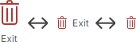
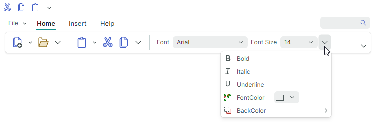
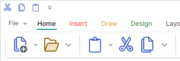

# Размещение команд Ribbon

Размещение команд Ribbon определяет расположение команд на панели Ribbon. Контрол Ribbon поддерживает две компоновки: классическую (Classic) и упрощённую (Simplified).

## Классическая компоновка команд


- Панель Ribbon достаточно высока, чтобы отображать три строки команд с маленькими значками.
- Заголовки групп страниц видимы
- Группы не могут быть частично свёрнуты при изменении размера Ribbon
- Поддержка встроенных галерей
- Размер маленьких значков по умолчанию — `16x16`. Вы можете использовать свойство `RibbonControl.SmallGlyphSize`, чтобы изменить размер маленьких значков. Большие значки вдвое больше маленьких.
- При изменении размера Ribbon [функция адаптивной компоновки](ribbon-items.md#адаптивный-размер-глифа-в-классической-компоновке-команд) подстраивает размер значков — от больших к маленьким с текстом и к маленьким глифам, и обратно.

  

## Упрощённая компоновка команд



- Кнопки располагаются в одну строку
- Заголовки групп страниц скрыты
- Группы могут быть частично свёрнуты при изменении размера Ribbon. Свёрнутые кнопки доступны из выпадающего меню группы.
- Галереи отображаются в выпадающих меню
- Размер значков по умолчанию в упрощённой компоновке команд — `22x22`. Используйте свойство `RibbonControl.GlyphSizeInSimplifiedLayout`, чтобы задать пользовательский размер значков.

    ``` xml
    <mxr:RibbonControl GlyphSizeInSimplifiedLayout="32">
    ```

    

## Выбор компоновки команд

Пользователь может переключаться между классическим и упрощённым видами во время работы, щёлкая по кнопке выбора компоновки команд в правом нижнем углу Ribbon.


Установите опцию `RibbonControl.IsCommandLayoutSelectionButtonVisible` в `false`, чтобы скрыть эту кнопку.

Свойство `RibbonControl.CommandLayout` позволяет задать компоновку команд в коде.

``` xml
<mxr:RibbonControl Name="ribbon" CommandLayout="Simplified">
    <!-- ... -->
</mxr:RibbonControl>
```


<br>
<br>

<sup>*</sup> Эта страница переведена с использованием технологий машинного перевода.
