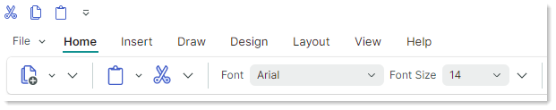
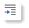
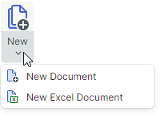
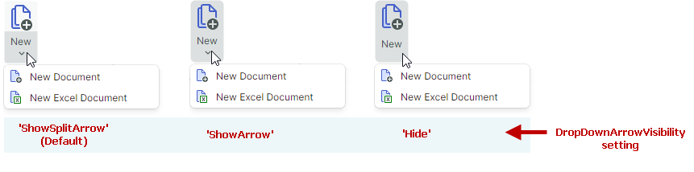
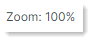
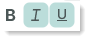

# Элементы Ribbon

Вы можете добавлять различные элементы в контрол Ribbon и его меню: кнопки, кнопки-флажки, текстовые надписи, подменю, встроенные редакторы и другое.  


Помимо этих классических элементов, контрол Ribbon поддерживает галереи. Они предназначены для отображения графически насыщенных элементов, расположенных в столбцы и строки. Дополнительную информацию смотрите в разделе [Галереи](galleries.md).

Все элементы, включая галереи, можно добавлять на [традиционные панели инструментов и в контекстные меню](../toolbars-and-menus/index.md). 

## Добавление элементов Ribbon 

Вы можете отображать различные элементы в разных элементах Ribbon: [группах страниц Ribbon](page-groups.md), на [панели быстрого доступа](quick-access-toolbar.md), в [области заголовков страниц](page-header-items.md), в [главном меню (меню приложения)](application-button-and-main-menu.md) и в подменю.

Чтобы добавить элементы в группу страниц Ribbon в XAML, определите эти элементы между открывающим и закрывающим тегами **&lt;RibbonPageGroup&gt;**. В code-behind вы можете добавлять, получать доступ и изменять элементы с помощью коллекции `RibbonPageGroup.Items`. Другие элементы Ribbon заполняются элементами таким же образом.

Следующий пример добавляет три кнопки (объекта `ToolbarButtonItem`) в объект `RibbonPageGroup`. 

``` xml
<mxb:ToolbarManager IsWindowManager="True">
    <mxr:RibbonControl ApplicationButtonContent="File" ApplicationButtonKeyTip="F">
        <mxr:RibbonPage Header="Home" KeyTip="H">
            <mxr:RibbonPageGroup Header="Editing" IsHeaderButtonVisible="False">
                <mxb:ToolbarButtonItem Header="Find" KeyTip="FN" 
                  Glyph="{x:Static icons:Basic.Search}" 
                  Command="FindButtonClick" />
                <mxb:ToolbarButtonItem Header="Replace" KeyTip="RP" 
                  Glyph="{x:Static icons:Basic.Update}" 
                  Command="ReplaceButtonClick"/>
                <mxb:ToolbarButtonItem Header="Clear" KeyTip="CL" 
                  Glyph="{x:Static icons:Basic.Table_Clear}" 
                  Command="ClearButtonClick"/>
            </mxr:RibbonPageGroup>
        </mxr:RibbonPage>
    </mxr:RibbonControl>
</mxb:ToolbarManager>
```

## Типы элементов Ribbon

Все элементы, которые вы можете добавлять в контрол Ribbon и на традиционные панели инструментов, являются потомками класса `ToolbarItem`. В следующих разделах описаны доступные элементы Ribbon и их настройки. 


### Обычные кнопки (ToolbarButtonItem)

Объекты `ToolbarButtonItem` позволяют реализовывать обычные кнопки и [кнопки с функцией выпадающего списка](#кнопки-с-функцией-выпадающего-списка-toolbarbuttonitem).

Обычная кнопка вызывает действие при щелчке.


#### Щелчок по кнопке

Чтобы реализовать действие для кнопки, вы можете задать команду или обработать события кнопки:

- `ToolbarItem.Command` — команда, выполняемая при щелчке по кнопке.

    ``` xml
    <mxb:ToolbarButtonItem Header="Open" KeyTip="O" 
    Command="{Binding OpenFileCommand}" 
    Glyph="{x:Static icons:Basic.Folder_Open}" />
    ```
    ``` cs
    [RelayCommand]
    public void OpenFile()
    {
        //...
    }
    ```
    
- `CommandParameter` — параметр команды, передаваемый заданной команде.

- `ToolbarItem.Click` — возникает при щелчке левой кнопкой мыши по элементу (после нажатия и отпускания левой кнопки мыши).
- `ToolbarItem.Press` — возникает при нажатии любой кнопки мыши над элементом.

#### Подпись и глиф кнопки

- `Header` — отображаемый текст элемента.
- `Glyph` — изображение элемента. Смотрите также: [Размер глифа](#размер-глифа).
- `GlyphTemplate` — пользовательский шаблон данных для отрисовки изображения элемента.

#### Размер глифа

Размер глифов команд в [группах страниц Ribbon](page-groups.md) различается в упрощённой и классической [компоновках команд](ribbon-command-layouts.md). Следующие разделы содержат подробности:

- [Размер глифа в упрощённой компоновке команд](#размер-глифа-в-упрощённой-компоновке-команд)
- [Размер глифа в классической компоновке команд](#размер-глифа-в-классической-компоновке-команд)
- [Адаптивный размер глифа в классической компоновке команд](#адаптивный-размер-глифа-в-классической-компоновке-команд)


!!! tip

    Чтобы настроить размер глифов элементов во всплывающих и контекстных меню, используйте свойство `GlyphSize` элемента.
    
    ``` xml
    <mxb:PopupMenu MinWidth="250" ContentRightIndent="30">
        <mxb:ToolbarButtonItem Header="New" Glyph="{x:Static icons:Basic.Doc}" GlyphSize="32,32" HotKey="Ctrl+N"/>
    </mxb:PopupMenu>
    ```


#### Размер глифа в упрощённой компоновке команд

Все команды в группах страниц используют один размер значков в [упрощённой компоновке команд](ribbon-command-layouts.md). 



Размер значков по умолчанию — `22x22`. Вы можете использовать свойство `RibbonControl.GlyphSizeInSimplifiedLayout`, чтобы задать пользовательский размер значков.

#### Размер глифа в классической компоновке команд

Команды в группах страниц могут отображать большие и маленькие глифы в [классической компоновке команд](ribbon-command-layouts.md).


Размер маленьких значков по умолчанию — `16x16`. Вы можете использовать свойство `RibbonControl.SmallGlyphSize`, чтобы изменить размер маленьких значков. Большие значки вдвое больше маленьких.

Присоединённое свойство `RibbonControl.DisplayMode` можно использовать, чтобы задать размер отображения (большой, маленький и маленький с текстом) для команд в группах страниц Ribbon. Дополнительную информацию смотрите в разделе [Адаптивный размер глифа в классической компоновке команд](#адаптивный-размер-глифа-в-классической-компоновке-команд).

#### Адаптивный размер глифа в классической компоновке команд

[Функция адаптивной компоновки](page-groups.md#адаптивная-компоновка) контрола Ribbon подстраивает размещение элементов в [группах страниц Ribbon](page-groups.md) при изменении размера контрола Ribbon. Эта функция также подстраивает размер отображения элементов при изменении размера Ribbon, когда используется классическая компоновка команд.


Присоединённое свойство `RibbonControl.DisplayMode` позволяет задавать поддерживаемые режимы отображения для элементов Ribbon в группах страниц Ribbon в [классической компоновке команд](ribbon-command-layouts.md).
Вы можете принудительно задать элементу использование только больших изображений, маленьких изображений, маленьких изображений с текстом или комбинации этих режимов отображения.

Предопределённые режимы отображения глифов определяются перечислением `RibbonItemDisplayMode`:

  - `Large` — элемент отображает большой глиф и текст.
  
     

  - `Small` — элемент отображает маленький глиф и текст.

    

  - `SmallGlyph` — элемент отображает маленький глиф.

    

  - `Auto` — элемент поддерживает режимы отображения `Large`, `Small` и `SmallGlyph`. В зависимости от места, доступного в родительской [группе](page-groups.md) элемента, контрол Ribbon автоматически выбирает один из этих режимов отображения для элемента.

Следующий фрагмент кода устанавливает присоединённое свойство `RibbonControl.DisplayMode` для элемента Ribbon в `Large`. Это заставляет элемент использовать только большие изображения.

``` xml
<mxr:RibbonPage Header="Home" KeyTip="H">
    <mxr:RibbonPageGroup Header="File" IsHeaderButtonVisible="True">
        <mxb:ToolbarButtonItem Header="Open" KeyTip="O" mxr:RibbonControl.DisplayMode="Large"
                            Glyph="{x:Static icons:Basic.Folder_Open}" />
    </mxr:RibbonPageGroup>
</mxr:RibbonPage>
```

Перечисление `RibbonItemDisplayMode` помечено атрибутом `[Flags]`. Поэтому вы можете использовать любую комбинацию флагов `Large`, `Small` и `SmallGlyph` при установке присоединённого свойства `RibbonControl.DisplayMode`.

Следующий код позволяет элементу Ribbon использовать только режимы отображения `Small` и `SmallGlyph`:

``` xml
<mxb:ToolbarButtonItem Header="Help" KeyTip="LP" Glyph="{x:Static icons:Basic.Info}"
                       mxr:RibbonControl.DisplayMode="Small, SmallGlyph" />
```

#### Общие настройки отображения элемента

- `ShowSeparator` — возвращает или задаёт, отображать ли разделитель перед элементом. Вы также можете использовать элемент `ToolbarSeparatorItem`, чтобы вставить разделитель.

<!-- TODO
 Check:
  - `GlyphAlignment` — The glyph alignment relative to the item's header. 
-->

    
### Кнопки с функцией выпадающего списка (ToolbarButtonItem)

Элемент `ToolbarButtonItem` позволяет создать кнопку со связанным выпадающим контролом или меню. 



Используйте свойство `ToolbarButtonItem.DropDownControl`, чтобы задать выпадающий контрол/меню. Этот выпадающий контрол вызывается, когда пользователь щёлкает по кнопке или по встроенной кнопке-стрелке вниз (в зависимости от настройки `DropDownArrowVisibility`; см. ниже).
  

  
``` xml
<mxb:ToolbarButtonItem Name="btnNew" Header="New" KeyTip="N" 
    Glyph="{x:Static icons:Basic.Docs_Add}"
    mxr:RibbonControl.DisplayMode="Large"
    DropDownArrowVisibility="ShowSplitArrow">
    <mxb:ToolbarButtonItem.DropDownControl>
        <mxb:PopupMenu>
            <mxb:ToolbarButtonItem Header="New Document" KeyTip="ND" 
                Glyph="{x:Static icons:Basic.Doc_Add}" />
            <mxb:ToolbarButtonItem Header="New Excel Document" KeyTip="NX"
                                    Glyph="{x:Static icons:Basic.Doc_Excel}" />
        </mxb:PopupMenu>
    </mxb:ToolbarButtonItem.DropDownControl>
</mxb:ToolbarButtonItem>
```
  
#### Выпадающий контрол и кнопка-стрелка вниз

- `DropDownControl` — возвращает или задаёт выпадающий контрол (объект `Eremex.AvaloniaUI.Controls.Bars.IPopup`), связанный с элементом. Контрол всплывает, когда пользователь щёлкает по элементу или по встроенной кнопке-стрелке вниз (см. `DropDownArrowVisibility`). Следующие объекты реализуют интерфейс `Eremex.AvaloniaUI.Controls.Bars.IPopup` и потому могут отображаться как выпадающие контролы:

    - `Eremex.AvaloniaUI.Controls.Bars.PopupMenu` — [всплывающее меню](../toolbars-and-menus/popup-and-context-menus.md). Вы можете добавлять в меню все типы элементов панели, чтобы заполнить его содержимым.
    - `Eremex.AvaloniaUI.Controls.Bars.PopupContainer` — контейнер контролов. Используйте `PopupContainer`, чтобы отображать пользовательские контролы в выпадающем списке.
    
- `DropDownArrowVisibility` — возвращает или задаёт, отображает ли элемент стрелку выпадающего списка, используемую для вызова связанного выпадающего контрола. 

    

    - `ShowSplitArrow` или `Default` — стрелка выпадающего списка видима. Она действует как отдельная кнопка, встроенная в элемент. Щелчок по стрелке вызывает связанный выпадающий контрол и инициирует событие `DropDownPress`. Щелчок по элементу вызывает его команду (`Command`) и события (`Click` и `Press`). 

    - `ShowArrow` — стрелка выпадающего списка видима. Элемент и стрелка действуют как единая кнопка. Щелчок по ним отображает связанный выпадающий контрол.

    - `Hide` — стрелка выпадающего списка скрыта. Щелчок по элементу вызывает выпадающий контрол.

<!-- - `DropDownArrowAlignment` — Gets or sets the position of the dropdown arrow. -->

#### Вызов выпадающего контрола

- `DropDownOpenMode` — возвращает или задаёт, вызывается ли выпадающий контрол и когда, при взаимодействии пользователя с элементом/стрелкой выпадающего списка. Поддерживаемые опции:
    - `Press` или `Default` — выпадающий список отображается по событию нажатия мыши.
    - `Click` — выпадающий список отображается после нажатия и отпускания мыши над элементом.
    - `Never` — выпадающий список не отображается.
- `DropDownPress` — событие, возникающее при нажатии стрелки выпадающего списка.
  


### Кнопки-флажки (ToolbarCheckItem)


Элемент `ToolbarCheckItem` позволяет создать кнопку-флажок. Кнопки-флажки поддерживают два состояния — обычное и нажатое. 


``` xml
xmlns:mxb="https://schemas.eremexcontrols.net/avalonia/bars"

<mxb:ToolbarCheckItem Header="Bold" 
 IsChecked="{Binding #textBox.FontWeight, 
  Converter={helpers:BoolToFontWeightConverter}, Mode=TwoWay}" 
 Glyph="{SvgImage 'avares://DemoCenter/Images/FontBold.svg'}" />
```

#### Нажатие кнопки

- `IsChecked` — возвращает или задаёт состояние нажатия кнопки.
- `CheckedChanged` — событие, возникающее при изменении состояния нажатия.


#### Подпись, глиф и настройки отображения

- `Header` — отображаемый текст элемента.
- `Glyph` — изображение элемента. Кнопка-флажок поддерживает как большие, так и маленькие изображения. Подробнее смотрите в следующих разделах:

  - [Размер глифа](#размер-глифа)
  - [Адаптивный размер глифа в классической компоновке команд](#адаптивный-размер-глифа-в-классической-компоновке-команд)

- `GlyphTemplate` — пользовательский шаблон данных для отрисовки изображения элемента.

- `CheckBoxStyle` — возвращает или задаёт режим отображения объекта `ToolbarCheckItem`. Доступные опции:

  - `CheckBoxStyle.CheckButton` — элемент отрисовывается как кнопка-флажок. Когда `IsChecked` равно `true`, кнопка отображается в нажатом состоянии.

    

  - `CheckBoxStyle.CheckBox` — элемент отображает переключаемый флажок перед своим текстом и глифом. Когда `IsChecked` равно `true`, флажок имеет отметку.

    
    
  - `CheckBoxStyle.RadioButton` — элемент отображает радиокнопку перед своим текстом и глифом. Когда `IsChecked` равно `true`, радиокнопка отрисовывается как заполненный круг.

    Вы можете применить стиль RadioButton к объектам `ToolbarCheckItem`, объединённым в группу флажков ([`ToolbarCheckItemGroup`](#неразрывные-группы-флажков-toolbarcheckitemgroup)). В этом случае группа выглядит как обычная радиогруппа.

    ``` xml
    <mxb:ToolbarCheckItemGroup CheckType="Radio">
        <mxb:ToolbarCheckItem Header="E-mail" CheckBoxStyle="RadioButton" />
        <mxb:ToolbarCheckItem Header="Phone" CheckBoxStyle="RadioButton" />
    </mxb:ToolbarCheckItemGroup>
    ```
    
    
    
- `CheckBoxAlignment` — возвращает или задаёт, отображаются ли флажок (или радиокнопка) до или после глифа и текста элемента. Эта опция действует, когда свойство `CheckBoxStyle` установлено в `CheckBoxStyle.CheckBox` или `CheckBoxStyle.RadioButton`.

    ```xml
    <mxb:ToolbarCheckItem Header="Status bar" CheckBoxAlignment="After"
                        CheckBoxStyle="CheckBox"
                        Hint="Show and hide the status bar"/>
    <mxb:ToolbarSeparatorItem/>
    ```
    
    
    


Вы можете настраивать общие параметры отображения кнопок-флажков так же, как и обычных кнопок.

- [Общие настройки отображения элемента](#общие-настройки-отображения-элемента)

### Подменю (ToolbarMenuItem)

Используйте `ToolbarMenuItem`, чтобы создать элемент, отображающий подменю при щелчке. 


#### Содержимое подменю

Чтобы задать содержимое подменю, определите элементы между открывающим и закрывающим тегами **&lt;ToolbarMenuItem&gt;** в XAML или добавьте элементы в коллекцию `ToolbarMenuItem.Items` в code-behind.

``` xml
xmlns:mxb="https://schemas.eremexcontrols.net/avalonia/bars"

<mxb:ToolbarMenuItem Header="File" Category="File">
    <mxb:ToolbarButtonItem Header="New" 
     Glyph="{SvgImage 'avares://DemoCenter/Images/Group=Context Menu, Icon=NewDraftAction.svg'}" 
     Category="File" Command="{Binding NewFileCommand}"/>
    <mxb:ToolbarButtonItem Header="Open" 
     Glyph="{SvgImage 'avares://DemoCenter/Images/Group=Basic, Icon=Folder Open.svg'}" 
     Category="File" Command="{Binding OpenFileCommand}"/>
    <mxb:ToolbarButtonItem Header="Save" 
     Glyph="{SvgImage 'avares://DemoCenter/Images/Group=Basic, Icon=Save.svg'}" 
     Category="File" Command="{Binding SaveFileCommand}"/>
    <mxb:ToolbarButtonItem Header="Print" 
     Glyph="{SvgImage 'avares://DemoCenter/Images/Group=Basic, Icon=Print.svg'}" 
     ShowSeparator="True"  Category="File" Command="{Binding PrintFileCommand}"/>
</mxb:ToolbarMenuItem>
```

Вы также можете использовать свойство `ToolbarMenuItem.ItemsSource`, чтобы заполнить подменю элементами из коллекции бизнес-объектов во View Model. Соответствующие шаблоны данных должны определять элементы Ribbon и инициализировать их настройки из базовых бизнес-объектов.


#### Вызов подменю

Когда вызывается подменю, возникают следующие события:

- `Opening` — возникает, когда меню собирается отобразиться. Это событие позволяет отменить отображение меню.
- `Opened` — возникает после отображения меню.
- `Closing` — возникает, когда меню собирается закрыться. Это событие позволяет отменить закрытие меню.
- `Closed` — возникает после закрытия меню.

Следующее свойство позволяет отменить отображение подменю и задать, отображать ли подменю по событию щелчка или нажатия мыши.

- `DropDownOpenMode` — возвращает или задаёт, вызывается ли подменю и как, при взаимодействии пользователя с элементом. Поддерживаемые опции:
    - `Press` или `Default` — меню отображается по событию нажатия мыши.
    - `Click` — меню отображается после нажатия и отпускания мыши над элементом.
    - `Never` — меню не отображается.


#### Подпись, глиф и настройки отображения

- `Header` — текст заголовка подменю.
- `Glyph` — изображение подменю. Подменю поддерживает как большие, так и маленькие изображения в заголовке. Смотрите следующие разделы, чтобы узнать, как задавать размер глифов элементов в контроле Ribbon:

  - [Размер глифа](#размер-глифа)
  - [Адаптивный размер глифа в классической компоновке команд](#адаптивный-размер-глифа-в-классической-компоновке-команд)

- `GlyphTemplate` — пользовательский шаблон данных для отрисовки изображения элемента.

Вы можете настраивать общие параметры отображения подменю так же, как и обычных кнопок.

- [Общие настройки отображения элемента](#общие-настройки-отображения-элемента)


### Встроенные редакторы (ToolbarEditorItem)

Используйте объект `ToolbarEditorItem`, чтобы встроить встроенный редактор в контрол Ribbon. 


Объект `ToolbarEditorItem` поддерживает следующие подходы к заданию встроенного редактора:

- [Задание типа редактора](#задание-типа-редактора). Это рекомендуемый способ задания встроенного редактора Eremex.

- [Задание редактора в шаблоне данных](#задание-редактора-в-шаблоне-данных)


#### Задание типа редактора

Этот подход позволяет встроить редактор Eremex. 

Чтобы задать тип редактора, установите свойство `ToolbarEditorItem.EditorProperties` в один из следующих объектов:

- `ButtonEditorProperties` — соответствует встроенному редактору `ButtonEditor`.
- `CheckEditorProperties` — соответствует встроенному редактору `CheckEditor`.
- `ColorEditorProperties` — соответствует встроенному редактору `ColorEditor`.
- `ComboBoxEditorProperties` — соответствует встроенному редактору `ComboBoxEditor`.
- `HyperlinkEditorProperties` — соответствует встроенному редактору `HyperlinkEditor`.
- `PopupColorEditorProperties` — соответствует встроенному редактору `PopupColorEditor`.
- `PopupEditorProperties` — соответствует встроенному редактору `PopupEditor`.
- `SegmentedEditorProperties` — соответствует встроенному редактору `SegmentedEditor`.
- `SpinEditorProperties` — соответствует встроенному редактору `SpinEditor`.
- `TextEditorProperties` — соответствует встроенному редактору `TextEditor`.
- `MemoEditorProperties` — соответствует встроенному редактору `MemoEditor`.

Эти объекты являются потомками `BaseEditorProperties`. Они содержат настройки для настройки соответствующих встроенных редакторов.

Следующий пример определяет элемент _Font_ (объект `ToolbarEditorItem`), отображающий список шрифтов с помощью встроенного редактора combobox. Свойство `ToolbarEditorItem.EditorProperties` установлено в объект `ComboBoxEditorProperties`, что соответствует редактору `ComboBoxEditor`. Полный код смотрите в демо _WordPad Example_.

``` xml
<mxb:ToolbarEditorItem Header="Font" EditorWidth="150" 
 EditorValue="{Binding #textBox.FontFamily, Converter={helpers:FontNameToFontFamilyConverter}}">
    <mxb:ToolbarEditorItem.EditorProperties>
        <mxe:ComboBoxEditorProperties 
         ItemsSource="{Binding $parent[view:ToolbarAndMenuPageView].Fonts}"
         IsTextEditable="False" PopupMaxHeight="300"/>
    </mxb:ToolbarEditorItem.EditorProperties>
</mxb:ToolbarEditorItem>      
```

#### Задание редактора в шаблоне данных

Используйте свойство `ToolbarEditorItem.EditorTemplate`, чтобы задать редактор в шаблоне данных. В этом случае вам нужно вручную задать значение для редактора (например, с помощью привязки данных).

``` xml
<mxb:ToolbarEditorItem Width="150">
    <mxb:ToolbarEditorItem.EditorTemplate>
        <DataTemplate>
            <mxe:TextEditor EditorValue="{Binding Count}" Width="80"/>
        </DataTemplate>
    </mxb:ToolbarEditorItem.EditorTemplate>
</mxb:ToolbarEditorItem>
```

#### Изменение и возврат значения редактора

- `ToolbarEditorItem.EditorValue` — возвращает или задаёт значение встроенного редактора. Используйте это свойство для привязки данных.

- `ToolbarEditorItem.EditorValueChanged` — событие, возникающее после изменения значения редактора.

Эти члены действуют, когда вы используете свойство `ToolbarEditorItem.EditorProperties` для задания редактора.

#### Ширина редактора

<!-- TODO 
Not supported in Ribbon

 - `ToolbarEditorItem.SizeMode` — Gets or sets the item's size mode. This property allows you to stretch the bar item, so it occupues all the available empty space within the bar. -->
- `ToolbarEditorItem.EditorWidth` — возвращает или задаёт ширину встроенного редактора. Это свойство действует, когда вы используете свойство `ToolbarEditorItem.EditorProperties` для задания редактора. Если вы задаёте редактор в шаблоне данных, вы можете задать ширину редактора с помощью свойства `ToolbarEditorItem.Width` или задать ширину для самого редактора.
<!-- TODO
Doesn't work:

- `ToolbarEditorItem.EditorHeight` — Gets or sets the in-place editor's height. 
- `ToolbarEditorItem.EditorAlignment` — Gets or sets the editor's alignment relative to the item's header.
-->

<!--TODO - `ToolbarEditorItem.Editor` -  

-->

#### Подпись и глиф

- `Header` — отображаемый текст элемента.

- `Glyph` — изображение элемента. Объекты `ToolbarEditorItem` поддерживают только маленькие изображения. Размер маленьких изображений задаётся свойством `RibbonControl.SmallGlyphSize` в классической компоновке команд и свойством `RibbonControl.GlyphSizeInSimplifiedLayout` в упрощённой компоновке команд.
- `GlyphTemplate` — пользовательский шаблон данных для отрисовки изображения элемента.

Вы можете настраивать общие параметры отображения объектов `ToolbarEditorItem` так же, как и обычных кнопок.

- [Общие настройки отображения элемента](#общие-настройки-отображения-элемента)


### Текстовые надписи (ToolbarTextItem)


Используйте объект `ToolbarTextItem`, чтобы отобразить текстовую надпись, которую пользователи не могут редактировать.



``` xml
<mxb:ToolbarTextItem 
 Header="{Binding #scaleDecorator.Scale, StringFormat={}Zoom: {0:P0}}" 
 ShowBorder="False" 
 />
```

#### Подпись и глиф

- `Header` — отображаемый текст элемента.
- `Glyph` — изображение элемента. Текстовая надпись поддерживает как большие, так и маленькие изображения. Смотрите следующие разделы, чтобы узнать, как задавать размер глифов элементов в контроле Ribbon:

  - [Размер глифа](#размер-глифа)
  - [Адаптивный размер глифа в классической компоновке команд](#адаптивный-размер-глифа-в-классической-компоновке-команд)


#### Настройки отображения текстовой надписи

- `ToolbarTextItem.ShowBorder` — возвращает или задаёт, видима ли рамка элемента. 

  

  Вы можете использовать свойство `ToolbarTextItem.BorderTemplate`, чтобы задать пользовательский шаблон для отрисовки рамки.
- `ToolbarTextItem.BorderTemplate` — возвращает или задаёт пользовательский шаблон для отрисовки рамки элемента. Этот шаблон действует, если включена опция `ToolbarTextItem.ShowBorder`.


Смотрите также:

- [Общие настройки отображения элемента](#общие-настройки-отображения-элемента)


### Неразрывные группы элементов (ToolbarItemGroup)

Используйте `ToolbarItemGroup`, чтобы создать неразрывный контейнер (группу) элементов панели. Элементы в этом контейнере всегда отображаются вместе в линию и действуют как единое целое при изменении размера Ribbon. 


В [классической компоновке команд](ribbon-command-layouts.md) элементы `ToolbarItemGroup` поддерживают только маленькие изображения.

#### Содержимое группы

Чтобы задать содержимое контейнера, определите элементы между открывающим и закрывающим тегами **&lt;ToolbarItemGroup&gt;** в XAML или добавьте элементы в коллекцию `ToolbarItemGroup.Items` в code-behind.

``` xml
<mxb:ToolbarItemGroup>
    <mxb:ToolbarButtonItem Header="Increase" KeyTip="CR" Glyph="{x:Static icons:Basic.Level_Increase}" />
    <mxb:ToolbarButtonItem Header="Decrease" KeyTip="DC" Glyph="{x:Static icons:Basic.Level_Reduce}" />
    <mxb:ToolbarButtonItem Header="Collapse" KeyTip="CL" Glyph="{x:Static icons:Basic.List_Collapse}" />
    <mxb:ToolbarButtonItem Header="Expand" KeyTip="EX" Glyph="{x:Static icons:Basic.List_Expand}" />
</mxb:ToolbarItemGroup>
```

Вы также можете использовать свойство `ToolbarItemGroup.ItemsSource`, чтобы заполнить контейнер элементами из коллекции бизнес-объектов, хранящихся во View Model. Соответствующие шаблоны данных должны определять элементы Ribbon и инициализировать их настройки из базовых бизнес-объектов.

Смотрите также:

- [Настройка размещения элементов в группах страниц](page-groups.md#настройка-размещения-элементов-в-группах-страниц)
- [Размещение неразрывных контейнеров в две или три строки](page-groups.md#размещение-неразрывных-контейнеров-в-две-или-три-строки)

### Неразрывные группы флажков (ToolbarCheckItemGroup)

Используйте `ToolbarCheckItemGroup`, чтобы создать неразрывный контейнер (группу) флажков ([объектов `ToolbarCheckItem`](#кнопки-флажки-toolbarcheckitem)). Как и объект `ToolbarItemGroup`, объект `ToolbarCheckItemGroup` действует как единое целое при изменении размера родителя (содержимое контейнера не может быть частично скрыто; элементы всегда отображаются в одну линию и не поддерживают перенос).



Контейнер `ToolbarCheckItemGroup` может управлять состоянием нажатия своих дочерних элементов `ToolbarCheckItem`. Вы можете использовать контейнер `ToolbarCheckItemGroup` для создания следующих типов групп:

- Группа взаимоисключающих элементов (радиогруппа).
- Группа, позволяющая отмечать несколько элементов одновременно.

В [классической компоновке команд](ribbon-command-layouts.md) элементы `ToolbarCheckItemGroup` поддерживают только маленькие изображения.

#### Содержимое группы

Чтобы задать содержимое контейнера, определите элементы `ToolbarCheckItem` между открывающим и закрывающим тегами **&lt;ToolbarCheckItemGroup&gt;** в XAML или добавьте элементы в коллекцию `ToolbarCheckItemGroup.Items` в code-behind.

``` xml
<mxb:ToolbarCheckItemGroup>
    <mxb:ToolbarCheckItem Header="Bold" KeyTip="B" Glyph="{x:Static icons:Basic.Font_Bold}" />
    <mxb:ToolbarCheckItem Header="Italic" KeyTip="I" Glyph="{x:Static icons:Basic.Font_Italic}" />
    <mxb:ToolbarCheckItem Header="Underline" KeyTip="U" Glyph="{x:Static icons:Basic.Font_Underline}" />
</mxb:ToolbarCheckItemGroup>
```

Вы также можете использовать свойство `ToolbarCheckItemGroup.ItemsSource`, чтобы заполнить контейнер элементами из коллекции бизнес-объектов, хранящихся во View Model. Соответствующие шаблоны данных должны определять элементы Ribbon и инициализировать их настройки из базовых бизнес-объектов.


#### Нажатие элементов группы

- `ToolbarCheckItemGroup.CheckType` — возвращает или задаёт, можно ли отмечать один или несколько элементов в группе одновременно. Поддерживаются следующие опции:

    - `Default` или `Multiple` — можно отмечать несколько элементов одновременно.
    - `Radio` — группа взаимоисключающих элементов. Пользователь не может снять отметку с элемента иначе как отметив другой.
    - `Single` — группа взаимоисключающих элементов. Пользователь может снять отметку со всех элементов в группе.

- `ToolbarCheckItem.IsChecked` — возвращает или задаёт состояние нажатия кнопки.


Смотрите также:

- [Настройка размещения элементов в группах страниц](page-groups.md#настройка-размещения-элементов-в-группах-страниц)
- [Размещение неразрывных контейнеров в две или три строки](page-groups.md#размещение-неразрывных-контейнеров-в-две-или-три-строки)

### Разделители (ToolbarSeparatorItem)

Объект `ToolbarSeparatorItem` позволяет вставить разделитель.


``` xml
<mxb:ToolbarMenuItem Header="File" Category="File">
    <mxb:ToolbarButtonItem Header="New" 
     Glyph="{SvgImage 'avares://DemoCenter/Images/Group=Context Menu, Icon=NewDraftAction.svg'}" 
     Category="File"/>
    <mxb:ToolbarButtonItem Header="Open" 
     Glyph="{SvgImage 'avares://DemoCenter/Images/Group=Basic, Icon=Folder Open.svg'}" 
     Category="File"/>
    <mxb:ToolbarButtonItem Header="Save" 
     Glyph="{SvgImage 'avares://DemoCenter/Images/Group=Basic, Icon=Save.svg'}" 
     Category="File"/>
    <mxb:ToolbarSeparatorItem/>
    <mxb:ToolbarButtonItem Header="Print" 
     Glyph="{SvgImage 'avares://DemoCenter/Images/Group=Basic, Icon=Print.svg'}" 
     Category="File"/>
</mxb:ToolbarMenuItem>
```

### Галереи

Чтобы создать галерею, используйте элемент `RibbonGalleryItem`. Следующее изображение отображает встроенную в Ribbon галерею.


Когда вы добавляете объект `RibbonGalleryItem` на традиционную панель инструментов или во всплывающее меню, галерея отображается как подменю.

Дополнительную информацию смотрите в следующем разделе: [Галереи](galleries.md)

## Горячие клавиши

Вы можете использовать свойство `ToolbarItem.HotKey`, чтобы назначать элементам горячие клавиши. 

``` xml
<mxb:ToolbarButtonItem 
    Header="Open" Command="{Binding OpenCommand}" HotKey="Ctrl+O"
    Glyph="{x:Static icons:Basic.Folder_Open}"/>
```

Нажатие горячей клавиши активирует команду элемента при условии, что фокус находится в пределах области действия горячих клавиш. Область действия горячих клавиш по умолчанию — область UI в границах компонента `ToolbarManager`. Когда фокус ввода находится за пределами области действия горячих клавиш, `ToolbarManager` не может перехватывать горячие клавиши.

Свойство `ToolbarManager.IsWindowManager` позволяет расширить область действия горячих клавиш на всё окно. Когда вы устанавливаете это свойство в `true`, компонент `ToolbarManager` регистрирует горячие клавиши элементов в окне. Он сможет перехватывать и обрабатывать горячие клавиши, даже если фокус находится за пределами его клиентской области.

## Всплывающие подсказки

Используйте свойство `ToolbarItem.Hint`, чтобы задавать всплывающие подсказки для элементов Ribbon:

``` xml
<mxb:ToolbarButtonItem Header="Increase" HotKey="CTRL+J" 
  Glyph="{x:Static icons:Basic.Level_Increase}" 
  Hint="Increase the indent"/>
```


## Смотрите также

- [Key Tips](key-tips.md)
- [Настройка размещения элементов в группах страниц](page-groups.md#настройка-размещения-элементов-в-группах-страниц)


<br>
<br>

<sup>*</sup> Эта страница переведена с использованием технологий машинного перевода.
