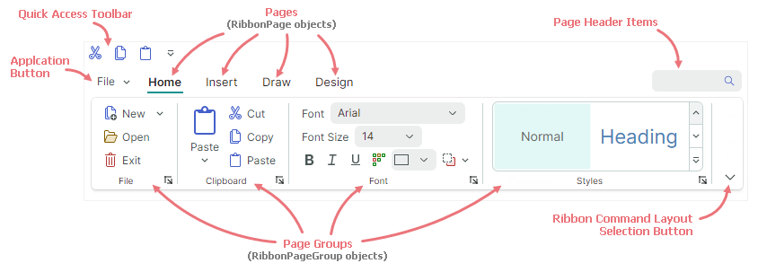
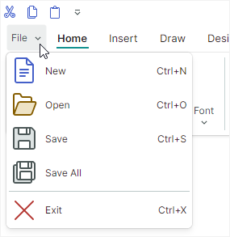

# Обзор Ribbon

Используйте `RibbonControl`, чтобы создать ленточное меню, подобное тому, что есть в приложениях Microsoft Office. `RibbonControl` — это панель инструментов, которая организует команды и другие элементы в серию страниц (вкладок). Страницы состоят из групп, которые, в свою очередь, отображают элементы Ribbon (команды, встроенные редакторы, надписи, галереи и так далее).




## Визуальные элементы Ribbon

`RibbonControl` состоит из следующих элементов:

- [Страницы](pages.md) — страницы Ribbon позволяют создавать вкладки. Вы можете добавить столько страниц, сколько нужно. Как минимум одна страница должна быть создана. 

    Каждая страница отображает одну или несколько групп элементов.

- [Группы страниц](page-groups.md) — группы Ribbon предоставляют логический способ объединять наборы элементов в пределах страниц. Группы разделены вертикальными линиями.

- [Application Button](application-button-and-main-menu.md) — эта кнопка вызывает выпадающее меню приложения, которое обычно содержит команды для работы с файлами.

  

    Application Button, если она включена, отображается перед заголовками страниц. 

- [Панель быстрого доступа](quick-access-toolbar.md) — эта панель предоставляет доступ к часто используемым командам. Пользователи могут добавить команду на эту панель с помощью контекстного меню.

  

  Панель быстрого доступа может отображаться над или под страницами Ribbon.

- [Элементы заголовка страницы](page-header-items.md) — вы можете отображать элементы Ribbon у правого края Ribbon, в одну линию с заголовками страниц. Коллекция, хранящая эти элементы, называется элементами заголовка страницы.

- [Кнопка выбора компоновки команд Ribbon](ribbon-command-layouts.md) — эта кнопка отображает меню, позволяющее пользователю переключаться между классической и упрощённой компоновками команд Ribbon.

  
  

  Классическая (`Classic`) компоновка команд располагает элементы Ribbon в три строки:

  


  Упрощённая (`Simplified`) компоновка использует одну строку элементов:

  

  Дополнительную информацию смотрите в разделе [Размещение команд Ribbon](ribbon-command-layouts.md).


## Демо 

Примеры, демонстрирующие возможности `RibbonControl` в действии, смотрите в приложении Eremex Controls Demo.

## Создание интерфейса Ribbon

Вкратце, создание интерфейса Ribbon состоит из следующих этапов:

1. Создайте `RibbonControl`.
2. Добавьте страницы Ribbon (вкладки) в Ribbon.
3. Добавьте группы страниц Ribbon на страницы.
4. Добавьте элементы Ribbon (команды, галереи и т. д.) в группы страниц.

Вы также можете добавлять элементы Ribbon в [область заголовков страниц](page-header-items.md), на [панель быстрого доступа](quick-access-toolbar.md), во всплывающие меню и подменю.

### Определение RibbonControl

`RibbonControl` — это функционально насыщенная панель инструментов. Как и [традиционные панели инструментов](../toolbars-and-menus/index.md), `RibbonControl` управляется компонентом `ToolbarManager`. 

!!! tip

    Компонент `ToolbarManager` может управлять не только `RibbonControl`. Вы можете использовать этот компонент для создания [традиционных панелей инструментов](../toolbars-and-menus/index.md) (например, строки состояния) и [контекстных меню](../toolbars-and-menus/popup-and-context-menus.md) для контролов.

Чтобы создать `RibbonControl`, определите его внутри компонента `ToolbarManager`.

``` xml
<mxb:ToolbarManager IsWindowManager="True">
    <mxr:RibbonControl Name="ribbon1">
      <!-- ... -->
    </mxr:RibbonControl>
</mxb:ToolbarManager>
```

### Определение страниц Ribbon и доступ к ним

[Страницы](pages.md) Ribbon (вкладки) инкапсулируются классом `RibbonPage`.

Чтобы добавить страницы Ribbon в XAML, определите объекты **&lt;RibbonPage&gt;** как содержимое тега **&lt;RibbonControl&gt;**. Чтобы добавлять страницы Ribbon и получать к ним доступ в code-behind, используйте коллекцию `RibbonControl.Pages`. 

``` xml
<mxb:ToolbarManager IsWindowManager="True">
    <mxr:RibbonControl>
      <mxr:RibbonPage Header="Home" KeyTip="H"> 
        <!-- ... -->
      </mxr:RibbonPage>
      <mxr:RibbonPage Header="View" KeyTip="V">
        <!-- ... -->
      </mxr:RibbonPage>
      <mxr:RibbonPage Header="Design" KeyTip="S">
        <!-- ... -->
      </mxr:RibbonPage>
    </mxr:RibbonControl>
</mxb:ToolbarManager>
```


### Определение групп страниц Ribbon и доступ к ним

[Группы страниц](page-groups.md) Ribbon инкапсулируются классом `RibbonPageGroup`. Они являются дочерними элементами страниц Ribbon. 

Чтобы создать группы страниц в XAML, определите объекты **&lt;RibbonPageGroup&gt;** как содержимое элементов **&lt;RibbonPage&gt;**. Чтобы добавлять группы страниц и получать к ним доступ в code-behind, используйте коллекцию `RibbonPage.Groups`. 

``` xml
<mxr:RibbonPage Header="Home" KeyTip="H" Name="pageHome">
  <mxr:RibbonPageGroup Header="File" IsHeaderButtonVisible="True">
    <!-- ... -->
  </mxr:RibbonPageGroup>
  <mxr:RibbonPageGroup Header="Clipboard" IsHeaderButtonVisible="True">
    <!-- ... -->
  </mxr:RibbonPageGroup>
  <mxr:RibbonPageGroup Header="Font" IsHeaderButtonVisible="True">
    <!-- ... -->
  </mxr:RibbonPageGroup>
</mxr:RibbonPage>
```

### Определение элементов Ribbon (команд, подменю, галерей и так далее)

Элементы Ribbon — это базовые элементы, которые вы можете добавлять в интерфейс Ribbon (в группы страниц Ribbon, на панель быстрого доступа и в коллекцию элементов заголовка страницы). Они включают:

- Кнопки (`ToolbarButtonItem`) — обычная кнопка или кнопка с выпадающим списком. 

  Обычная кнопка выполняет команду (`ToolbarButtonItem.Command`) и события (`Click` и `Press`) при щелчке. 
  
  

  Вы также можете связать с кнопкой выпадающий контрол. Этот контрол будет отображаться, когда пользователь щёлкнет по кнопке или по встроенной стрелке вниз.

  

  Контрол Ribbon позволяет задавать размер отображения кнопок. Вы можете использовать присоединённое свойство `RibbonControl.DisplayMode`, чтобы выбрать между большим размером, маленьким размером с текстом и маленьким размером без текста.

    

- Кнопки-флажки (`ToolbarCheckItem`) — кнопка, поддерживающая два состояния — обычное и нажатое. Состояние кнопки задаётся свойством `ToolbarCheckItem.IsChecked`. Событие `ToolbarCheckItem.CheckedChanged` возникает при изменении состояния нажатия.

  

- Подменю (`ToolbarMenuItem`) — отображает подменю при щелчке. 

  
  
- Встроенный редактор (`ToolbarEditorItem`) — отображает встроенный редактор, заданный свойством `ToolbarEditorItem.EditorProperties`. Например, вы можете встроить [SpinEditor](../editors/spineditor.md) или [TextEditor](../editors/texteditor.md) в интерфейс Ribbon.

  

- Текстовая надпись (`ToolbarTextItem`) — отображает статический текст, заданный свойством `ToolbarTextItem.Header`.

  

- Группа элементов (`ToolbarItemGroup`) — неразрывная группа элементов. 

  
 
  Функция адаптивной компоновки Ribbon автоматически сворачивает и восстанавливает элементы при изменении размера контрола. Группы функционируют как единое целое. При изменении размера Ribbon может сворачиваться только вся группа целиком, а не отдельные её элементы.

- Группа кнопок-флажков (`ToolbarCheckItemGroup`) — неразрывная группа кнопок-флажков (объектов `ToolbarCheckItem`). Класс `ToolbarCheckItemGroup` позволяет создать группу взаимоисключающих элементов (радиогруппу), а также группу, позволяющую отмечать несколько элементов одновременно.

  

- Разделитель (`ToolbarSeparatorItem`) — отображает разделитель между элементами Ribbon.

  

- Галерея (`RibbonGalleryItem`) — галерея элементов. Используйте свойство `RibbonGalleryItem.ItemsSource`, чтобы задать список объектов для отрисовки в виде элементов галереи.

  

  Встроенная в Ribbon галерея имеет кнопку выпадающего списка, которая активирует выпадающий вид галереи. Выпадающая галерея может отображать дополнительные команды внизу, заданные свойством `RibbonGalleryItem.DropDownItems`.

  
  

Все перечисленные выше элементы Ribbon являются потомками класса `ToolbarItem`. 
Их также можно добавлять на традиционные панели инструментов и в контекстные меню. 


Чтобы добавить элементы в группы страниц Ribbon, определите соответствующие элементы Ribbon между открывающим и закрывающим тегами **&lt;RibbonPageGroup&gt;**. Чтобы добавлять элементы Ribbon и получать к ним доступ в code-behind, используйте коллекцию `RibbonPageGroup.Items`. 

Следующий фрагмент кода добавляет четыре обычные кнопки (объекты `ToolbarButtonItem`) в группу _Clipboard_. Полный код можно найти в демо _WordPad Example_.


``` xml
<mxr:RibbonPageGroup Header="Clipboard" IsHeaderButtonVisible="True">
    <mxb:ToolbarButtonItem Header="Paste" KeyTip="PA" Glyph="{x:Static icons:Basic.Paste}"
                           mxr:RibbonControl.DisplayMode="Large"
                           DropDownArrowVisibility="ShowSplitArrow">
        <mxb:ToolbarButtonItem.DropDownControl>
            <mxb:PopupMenu>
                <mxb:ToolbarButtonItem Header="Paste Special" KeyTip="PS" 
                  Glyph="{x:Static icons:Basic.Paste}" 
                  Command="{Binding PasteSpecialCommand}"/>
                <mxb:ToolbarButtonItem Header="Set Default Paste..." KeyTip="SP" 
                  Command="{Binding SetDefaultPasteCommand}"
                />
            </mxb:PopupMenu>
        </mxb:ToolbarButtonItem.DropDownControl>
    </mxb:ToolbarButtonItem>
    <mxb:ToolbarButtonItem Header="Cut" KeyTip="CT"
                           Glyph="{x:Static icons:Basic.Cut}" Command="{Binding CutCommand}"/>
    <mxb:ToolbarButtonItem Header="Copy" KeyTip="CP"
                           Glyph="{x:Static icons:Basic.Copy}" Command="{Binding CopyCommand}"/>
    <mxb:ToolbarButtonItem Header="Paste" KeyTip="P"
                           Glyph="{x:Static icons:Basic.Paste}" Command="{Binding PasteCommand}"/>
</mxr:RibbonPageGroup>
```

Дополнительную информацию смотрите в следующих разделах:

- [Элементы Ribbon](ribbon-items.md)
- [Галереи](galleries.md)


## Поддержка паттерна проектирования MVVM

Контрол Ribbon поддерживает паттерн проектирования MVVM, позволяя создавать страницы, группы страниц и элементы (в группах страниц, на панели быстрого доступа и в области заголовков страниц) из коллекций бизнес-объектов, определённых во View Model. Следующие свойства поддерживают паттерн MVVM:

- `RibbonControl.PagesSource` — коллекция бизнес-объектов, используемых для заполнения страниц контрола Ribbon. Соответствующие шаблоны данных должны определять объекты `RibbonPage`.
- `RibbonPage.GroupsSource` — коллекция бизнес-объектов, используемых для заполнения групп на страницах Ribbon. Соответствующие шаблоны данных должны определять объекты `RibbonPageGroup`.
- `RibbonPageGroup.ItemsSource` — коллекция бизнес-объектов, используемых для создания элементов Ribbon в группах страниц. Соответствующие шаблоны данных должны определять [элементы Ribbon](ribbon-items.md).
- `RibbonControl.QuickAccessToolbarItemsSource` — коллекция бизнес-объектов, используемых для создания элементов Ribbon на [панели быстрого доступа](quick-access-toolbar.md). Соответствующие шаблоны данных должны определять [элементы Ribbon](ribbon-items.md).
- `RibbonControl.PageHeaderItemsSource` — коллекция бизнес-объектов, используемых для создания [элементов заголовка страницы](page-header-items.md). Соответствующие шаблоны данных должны определять [элементы Ribbon](ribbon-items.md).
- `ToolbarMenuItem.ItemsSource` — коллекция бизнес-объектов, используемых для заполнения подменю элементами. Соответствующие шаблоны данных должны определять элементы Ribbon.


<br>
<br>

<sup>*</sup> Эта страница переведена с использованием технологий машинного перевода.
