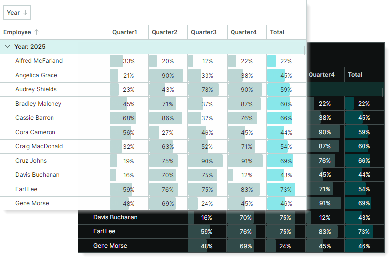

# Визуальные темы

В Avalonia UI визуальные темы определяют настройки внешнего вида, ресурсы и шаблоны для контролов. Библиотека контролов Eremex включает следующие визуальные темы для отрисовки контролов, поставляемых с библиотекой:

| Тема&nbsp;оформления | Описание | Пакет |
| --- | --- | --- |
| `DeltaDesign` | Содержит визуальные настройки для контролов Eremex (кроме `Graphics3DControl`) и набора стандартных контролов Avalonia UI. | пакет `Eremex.Avalonia.Themes.DeltaDesign` |
| `Controls3D` | Содержит визуальные настройки для `Graphics3DControl`. | пакет `Eremex.Avalonia.Controls3D` |

Вы должны [добавить и зарегистрировать](register-an-eremex-paint-theme.md) соответствующую тему (темы), чтобы контролы Eremex отрисовывались корректно. Без соответствующей темы контролы будут отображаться пустыми.

Визуальные темы Eremex поддерживают светлый и тёмный варианты:

Чтобы задать нужный вариант темы, используйте свойство `Application.RequestedThemeVariant`. Дополнительную информацию смотрите в следующем разделе: 

- [Регистрация визуальной темы Eremex](register-an-eremex-paint-theme.md)

Визуальная тема `DeltaDesign` также включает стили для распространённых стандартных контролов Avalonia. Если вы используете стандартные контролы Avalonia, не поддерживаемые темой `DeltaDesign`, вам также необходимо зарегистрировать тему `Fluent`. Инструкции смотрите в следующем разделе:

- [Регистрация темы 'FluentTheme' для стандартных контролов Avalonia](register-an-eremex-paint-theme.md#регистрация-темы-fluenttheme-для-стандартных-контролов-avalonia).

## Настройка темы

Чтобы изменить внешний вид контролов Eremex, вам следует настроить соответствующие параметры темы.
В следующем разделе объясняется, как изменять стили для отдельных контролов или для всех контролов Eremex в вашем проекте:

- [Изменение тем элементов управления](modify-control-themes.md)

## Смотрите также

- [Выбор светлого или тёмного варианта темы](register-an-eremex-paint-theme.md#выбор-светлого-или-тёмного-варианта-темы)

 
 

* Эта страница переведена с использованием технологий машинного перевода.
