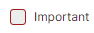
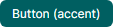
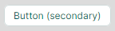
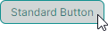
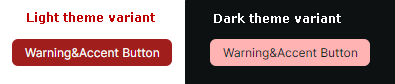
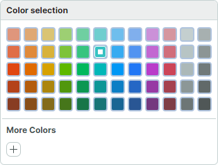

# Изменение тем элементов управления

Тема элемента управления (control theme) в Avalonia UI — это набор стилей, [тем элементов управления](https://docs.avaloniaui.net/docs/basics/user-interface/styling/control-themes) и ресурсов, которые определяют шаблоны и настройки внешнего вида контролов.

В этом разделе объясняется, как изменять настройки темы и стили для отдельных контролов Eremex или для всех контролов Eremex в вашем проекте.

## Тема по умолчанию

Тема _Eremex.Avalonia.Themes.DeltaDesign_ в настоящее время используется по умолчанию для контролов Eremex. Чтобы использовать библиотеку Eremex Controls, вам необходимо включить эту тему в ваш проект и [зарегистрировать](register-an-eremex-paint-theme.md) её в файле _App.axaml_. В противном случае контролы Eremex будут отображаться пустыми.

Чтобы изменить конкретные настройки темы (например, цвета или шаблоны элементов контролов), обратитесь к исходному коду темы. Вы можете найти и загрузить его на GitHub: [Eremex Controls Themes](https://github.com/Eremex/controlthemes).

Изменение настроек темы включает два шага:

- Определить целевую настройку темы (стиль, ресурс или шаблон), которую нужно переопределить.
- Изменить целевую настройку темы для всех или отдельных контролов.

<!-- To override a resource in your application, you must know the key of this resource. -->

## Концепции: нахождение целевого стиля, ресурса или шаблона

Вы можете изучить исходный код темы, чтобы определить настройки темы, которые вы хотите изменить.

Изображение ниже демонстрирует структуру исходного кода темы _DeltaDesign_:


- Папка _Controls_ — содержит файлы тем для контролов Eremex и стандартных контролов Avalonia UI.
- Папка _Charts_ — содержит файлы тем для контролов диаграмм Eremex.
- _Variants_ — содержит определения тем для вариантов `Light` и `Dark`.

Внутри этих файлов настройки темы (шаблоны, цвета, отступы и т. д.) определены как динамические или статические ресурсы. 

### Объявление динамических ресурсов в визуальной теме Eremex

Настройки темы, зависящие от варианта темы (Light или Dark), определяются как динамические ресурсы (`DynamicResource`). Эти настройки темы включают большинство цветов для контролов Eremex.

Следующий фрагмент кода показывает селектор стиля, который задаёт свойство `ColumnHeaderControl.Foreground` в контроле TreeList. Это свойство определяет цвет текста заголовков колонок TreeList. Значение свойства `ColumnHeaderControl.Foreground` привязано к динамическому ресурсу с ключом **Text/Neutral/Secondary**.

``` xml
<!-- Eremex.Avalonia.Themes.DeltaDesign\Controls\TreeListControl.axaml -->
<Styles ...>
    <Style Selector="mxdcv|ColumnHeaderControl">
        <Setter Property="Foreground" Value="{DynamicResource Text/Neutral/Secondary}" />
        <!-- ... -->
    </Style>
</Styles>
```

Ресурс **Text/Neutral/Secondary** имеет разные значения для вариантов Light и Dark:

``` xml
<!-- Eremex.Avalonia.Themes.DeltaDesign\Variants\Light\Colors.axaml file -->
<SolidColorBrush x:Key="Text/Neutral/Secondary" Color="#ff424d4d"/>

<!-- Eremex.Avalonia.Themes.DeltaDesign\Variants\Dark\Colors.axaml file -->
<SolidColorBrush x:Key="Text/Neutral/Secondary" Color="#ffc6d2d2"/>
```

Ресурс **Text/Neutral/Secondary** используется несколькими контролами. Вы можете выполнить поиск этого ключа в исходном коде темы, чтобы найти все его ссылки.

Визуальная тема организует ресурсы для вариантов Light и Dark в два словаря ресурсов:

- Словарь ресурсов с ключом **"Default"** — объединяет ресурсы, относящиеся к варианту темы Light. См. файл _Eremex.Avalonia.Themes.DeltaDesign\Variants\Light\Variant.axaml_.
- Словарь ресурсов с ключом **"Dark"** — объединяет ресурсы, относящиеся к варианту темы Dark. См. файл _Eremex.Avalonia.Themes.DeltaDesign\Variants\Dark\Variant.axaml_.

Чтобы переопределить динамические ресурсы для конкретного варианта темы в вашем проекте, вы должны знать ключ соответствующего словаря ("Default" или "Dark").

### Объявление статических ресурсов в визуальной теме Eremex

Многие настройки темы одинаковы для вариантов Light и Dark. Эти настройки определяются как статические ресурсы (`StaticResource`). Они включают:

- Настройки компоновки (например, размер и отступы элементов UI)
- Шаблоны, используемые для отрисовки внутренних элементов и контекстных меню


Например, файл _Eremex.Avalonia.Themes.DeltaDesign\Controls\TreeListControl.axaml_ содержит настройки темы для контрола TreeList. В этом файле размер шрифта заголовков колонок TreeList определён как статический ресурс с ключом **"ColumnHeaderFontSize"**.

``` xml
<!-- Eremex.Avalonia.Themes.DeltaDesign\Controls\TreeListControl.axaml file -->
<Styles ...>
    <Style Selector="mxdcv|ColumnHeaderControl">
        <Setter Property="FontSize" Value="{StaticResource ColumnHeaderFontSize}" />
        <!-- ... -->
    </Style>

    <Styles.Resources>
        <x:Double x:Key="ColumnHeaderFontSize">12</x:Double>
    </Styles.Resources>
</Styles>
```

### Стилизация с помощью классов стилей

Тема _DeltaDesign_ включает [темы элементов управления](https://docs.avaloniaui.net/docs/basics/user-interface/styling/control-themes) и селекторы стилей, нацеленные на конкретные [классы стилей](https://docs.avaloniaui.net/docs/basics/user-interface/styling/style-classes) для контролов Eremex и стандартных контролов Avalonia.
Когда вы назначаете конкретный _класс стиля_ контролу (используя свойство `Classes` контрола), тема применяет соответствующий селектор (селекторы) стиля.
 
Например, чтобы выделить CheckBox отличающимся цветом рамки, примените _класс стиля_ `warning`:

``` xml
<CheckBox Content="Important" Classes="warning"/>
```



В теме _DeltaDesign_ селектор стиля для CheckBox с _классом стиля_ `warning` определён следующим образом:

``` xml
<!-- Eremex.Avalonia.Themes.DeltaDesign\Controls\StandardControls\CheckBox.axaml -->

<ControlTheme x:Key="{x:Type CheckBox}" TargetType="CheckBox">
    <!-- Warning State -->
    <Style Selector="^.warning /template/ Border#NormalRectangle">
        <Setter Property="BorderBrush" Value="{DynamicResource CheckBoxWarningRectBorderBrush}" />
    </Style>
    <!-- ... -->
</ControlTheme>
```

Ниже приведены основные _классы стилей_, настраиваемые темой _DeltaDesign_:

- `accent` — акцентированные настройки внешнего вида. 

    - Целевые стандартные контролы Avalonia: Button и RepeatButton.

    

- `warning` — настройки внешнего вида для обозначения предупреждений и ошибок. 

    - Целевые стандартные контролы Avalonia: Button, RepeatButton, CheckBox и RadioButton.

    

    Вы можете комбинировать классы стилей `accent` и `warning`:

    

- `secondary` — настройки внешнего вида для контролов, отображаемых на сером фоне. 

    - Целевые контролы Eremex: редакторы со встроенным текстовым полем (TextEditor, ButtonEditor, ComboBoxEditor, SpinEditor, DateEditor и так далее) и SegmentedEditor. 
    
    - Целевые стандартные контролы Avalonia: TextBox, Button, RepeatButton, ToggleButton, CheckBox, ProgressBar, RadioButton и Slider.

    


## Изменение общего динамического ресурса

Несколько контролов могут использовать один и тот же динамический ресурс. 
Чтобы изменить общий ресурс для всех целевых контролов во всём приложении, переопределите его на уровне приложения с помощью свойства `Application.Resources`.
Чтобы применить изменение только в пределах конкретного окна, используйте свойство `Window.Resources`.

### Пример — изменение кисти рамки сфокусированной строки для контролов в вашем приложении для вариантов темы Light и Dark

Предположим, что вам нужно изменить кисть, используемую для отрисовки рамки сфокусированной строки в контролах DataGrid, TreeList и ListView во всём вашем приложении. Новая кисть должна иметь разные значения для вариантов темы Light и Dark.

Тема по умолчанию определяет кисть рамки сфокусированной строки как динамический ресурс с ключом **Outline/Accent/Focus**.

``` xml
<!-- Eremex.Avalonia.Themes.DeltaDesign\Controls\DataGridControl.axaml file -->
<Style Selector="mxdgv|DataGridRowControl:focusedState /template/ Border#FocusBorder, mxdgv|DataGridRowControl:focusedAndSelectedState /template/ Border#FocusBorder">
    <!-- ... -->
    <Setter Property="BorderBrush" Value="{DynamicResource Outline/Accent/Focus}" />
</Style>

<!-- Eremex.Avalonia.Themes.DeltaDesign\Controls\ListViewControl.axaml -->
<Style Selector="mxl|ListViewGroupControl:focus-visible/template/Rectangle#PART_Border">
    <Setter Property="Stroke" Value="{DynamicResource Outline/Accent/Focus}"/>
</Style>

<!-- Eremex.Avalonia.Themes.DeltaDesign\Controls\TreeListControl.axaml -->
<Style Selector="mxtlv|TreeListRowControl:focusedState /template/ Border#FocusBorder, mxtlv|TreeListRowControl:focusedAndSelectedState /template/ Border#FocusBorder">
	<Setter Property="BorderThickness" Value="1" />
	<Setter Property="BorderBrush" Value="{DynamicResource Outline/Accent/Focus}" />
</Style>
```

<!-- TODO
Update the declaration of style selectors above when DataGrid moves to ControlThemes 
 -->


В теме по умолчанию ресурс **Outline/Accent/Focus** имеет разные значения для вариантов темы Light и Dark:

``` xml
<!-- Eremex.Avalonia.Themes.DeltaDesign\Variants\Light\Colors.axaml file -->
<ResourceDictionary xmlns="https://github.com/avaloniaui" 
  xmlns:x="http://schemas.microsoft.com/winfx/2006/xaml">
    <!-- ... -->
    <SolidColorBrush x:Key="Outline/Accent/Focus" Color="#ff129190"/>
</ResourceDictionary>

<!-- Eremex.Avalonia.Themes.DeltaDesign\Variants\Dark\Colors.axaml file -->
<ResourceDictionary xmlns="https://github.com/avaloniaui" 
  xmlns:x="http://schemas.microsoft.com/winfx/2006/xaml">
    <!-- ... -->
    <SolidColorBrush x:Key="Outline/Accent/Focus" Color="#ff36afb0"/>
</ResourceDictionary>
```


Чтобы изменить этот ресурс для вариантов темы Light и Dark в вашем приложении, выполните следующие шаги:

1. В вашем проекте создайте файл "ModifiedResources.axaml" внутри папки "Resources".

2. В этом файле определите два словаря ресурсов с ключами **"Default"** и **"Dark"** (для вариантов темы Light и Dark соответственно).

``` xml
<ResourceDictionary xmlns="https://github.com/avaloniaui"
                    xmlns:x="http://schemas.microsoft.com/winfx/2006/xaml">
    <ResourceDictionary.ThemeDictionaries>

        <!-- Override resources for the Light theme variant -->
        <ResourceDictionary x:Key="Default">
            
        </ResourceDictionary>

        <!-- Override resources for the Dark theme variant -->
        <ResourceDictionary x:Key="Dark">
            
        </ResourceDictionary>
        
    </ResourceDictionary.ThemeDictionaries>   
</ResourceDictionary>
```

3. Определите новые значения для ресурса **Outline/Accent/Focus** в словарях ресурсов **"Default"** и **"Dark"**:

``` xml
<ResourceDictionary xmlns="https://github.com/avaloniaui"
                    xmlns:x="http://schemas.microsoft.com/winfx/2006/xaml">
    <ResourceDictionary.ThemeDictionaries>

        <!-- Override resources for the Light theme variant -->
        <ResourceDictionary x:Key="Default">
            <SolidColorBrush x:Key="Outline/Accent/Focus" Color="Blue"/>
        </ResourceDictionary>

        <!-- Override resources for the Dark theme variant -->
        <ResourceDictionary x:Key="Dark">
            <SolidColorBrush x:Key="Outline/Accent/Focus" Color="Orange"/>
        </ResourceDictionary>
        
    </ResourceDictionary.ThemeDictionaries>   
</ResourceDictionary>
```

4. В вашем файле `App.axaml` объедините ресурсы из файла "Resources/ModifiedResources.axaml" с ресурсами приложения.

``` xml
<Application ...>
    <Application.Resources>
        <ResourceDictionary>
            <ResourceDictionary.MergedDictionaries>
                <ResourceInclude Source="/Resources/ModifiedResources.axaml"/>
            </ResourceDictionary.MergedDictionaries>
        </ResourceDictionary>
    </Application.Resources>
</Application>
```

5. Запустите приложение, чтобы увидеть результат. 
Когда активен вариант светлой темы, рамка сфокусированной строки окрашивается в синий цвет.
Когда применён вариант тёмной темы, используется оранжевый цвет.


## Изменение ресурсов темы для конкретного контрола

Вы можете использовать свойство `Resources` контрола, чтобы изменить конкретные ресурсы только для этого контрола.
Это изменение не влияет на другие контролы.

### Пример — изменение цвета отдельной кнопки Button в нажатом и сфокусированном состояниях

Тема _DeltaDesign_ включает [темы элементов управления](https://docs.avaloniaui.net/docs/basics/user-interface/styling/control-themes) и селекторы стилей, которые подстраивают цвета стандартных контролов Avalonia UI под внешний вид контролов Eremex при размещении на одном окне.

Следующее изображение показывает внешний вид по умолчанию стандартного контрола Button в нажатом состоянии, отрисованного темой _DeltaDesign_:



В нажатом состоянии применяются следующие селекторы стилей:

``` xml
<!-- Eremex.Avalonia.Themes.DeltaDesign\Controls\StandardControls\Button.axaml -->
<ControlTheme x:Key="{x:Type Button}" TargetType="Button">
    <!-- Pressed State -->
    <Style Selector="^:pressed">
        <Style Selector="^ /template/ Border#PART_BackgroundBorder">
            <Setter Property="Background" Value="{DynamicResource ButtonBackgroundPressed}" />
        </Style>
        <Style Selector="^  /template/ ContentPresenter#PART_ContentPresenter">
            <Setter Property="Foreground" Value="{DynamicResource ButtonForegroundPressed}" />
            <Setter Property="Opacity" Value="0.8"/>
        </Style>
    </Style>
    <!--Focus Border-->
    <Style Selector="^:focus /template/ Border#PART_ButtonBorder">
        <Setter Property="BorderBrush" Value="{DynamicResource ButtonFocusBorderBrush}" />
        <Setter Property="BorderThickness" Value="{StaticResource EditorBorderThickness}"/>
    </Style>
    <!-- ... -->
</ControlTheme>
```

Чтобы изменить цвета отдельной кнопки Button в нажатом и сфокусированном состоянии, измените ресурсы `ButtonBackgroundPressed`, `ButtonForegroundPressed` и `ButtonFocusBorderBrush` из свойства `Button.Resources`.


``` xml
<Button Content="Simple Button" HorizontalAlignment="Center" >
    <Button.Resources>
        <SolidColorBrush x:Key="ButtonBackgroundPressed" Color="LightSeaGreen" />
        <SolidColorBrush x:Key="ButtonForegroundPressed" Color="Snow" />
        <SolidColorBrush x:Key="ButtonFocusBorderBrush" Color="SlateGray" />
    </Button.Resources>
</Button>
```


## Изменение ресурсов темы для контролов внутри окна

Вы можете изменить ресурсы темы из свойства `Window.Resources`, чтобы применить изменения темы к соответствующим контролам внутри этого окна.

### Пример — изменение акцентированных кнопок внутри окна для вариантов темы Light и Dark

Тема _DeltaDesign_ содержит специальные селекторы стилей, применяемые, когда вы задаёте классы стилей `accent` и/или `warning` для стандартного контрола Avalonia Button. Этот пример показывает, как переопределить настройки внешнего вида акцентированных кнопок в окне для вариантов темы Light и Dark.

Вы можете применить классы стилей `accent` и `warning`, чтобы выделить кнопку:

``` xml
<Button Content="Warning&amp;Accent Button" Classes="warning accent"/>
```



Обратитесь к файлу _Eremex.Avalonia.Themes.DeltaDesign\Controls\StandardControls\Button.axaml_, чтобы увидеть селекторы стилей, применяемые к акцентированным кнопкам в обычном состоянии, при наведении, нажатии и в отключённом состоянии. Фрагмент кода ниже демонстрирует два селектора стилей для обычного состояния акцентированной кнопки:

``` xml
<!-- Eremex.Avalonia.Themes.DeltaDesign\Controls\StandardControls\Button.axaml file -->
<ControlTheme x:Key="{x:Type Button}" TargetType="Button">
    <!-- WarningAccent style -->
    <Style Selector="^.warning.accent">
        <Style Selector="^ /template/ Border#PART_BackgroundBorder">
            <Setter Property="Background" Value="{DynamicResource ButtonWarningAccentBackground}" />
        </Style>
        <Style Selector="^ /template/ ContentPresenter#PART_ContentPresenter">
            <Setter Property="Foreground" Value="{DynamicResource ButtonWarningAccentForeground}" />
        </Style>
        <!-- ... -->
    </Style>
    <!-- ... -->
</ControlTheme>
```

Используйте свойство `Window.Resources`, чтобы переопределить цвета фона для акцентированных кнопок для вариантов темы Light и Dark на уровне окна. Код ниже переопределяет соответствующие ресурсы темы в словарях ресурсов `Default` (Light) и `Dark`:

``` xml
<mx:MxWindow 
    xmlns:mx="https://schemas.eremexcontrols.net/avalonia">

    <mx:MxWindow.Resources>
        <ResourceDictionary>
            <ResourceDictionary.ThemeDictionaries>
                <!--Resources for the Light theme variant-->
                <ResourceDictionary x:Key="Default">
                    <SolidColorBrush x:Key="ButtonWarningAccentBackground" Color="Purple" />
                </ResourceDictionary>

                <!--Resources for the Dark theme variant-->
                <ResourceDictionary x:Key="Dark">
                    <SolidColorBrush x:Key="ButtonWarningAccentBackground" Color="LightYellow" />
                </ResourceDictionary>
            </ResourceDictionary.ThemeDictionaries>
        </ResourceDictionary>
    </mx:MxWindow.Resources>
    <!-- ... -->
</mx:MxWindow>
```


Вы также можете изменить кисти для других состояний кнопки:

- При наведении — `ButtonWarningAccentBackgroundPointerOver` и `ButtonWarningAccentForegroundPointerOver`
- Нажатое — `ButtonWarningAccentBackgroundPressed` и `ButtonWarningAccentForegroundPressed`
- Отключённое — `ButtonWarningAccentBackgroundDisabled` и `ButtonWarningAccentForegroundDisabled`.


## Изменение стилей контролов, определённых в визуальной теме Eremex

Когда вы изучаете исходный код визуальной темы _DeltaDesign_, вы найдёте селекторы стилей, которые изменяют не только цвета и кисти, но и другие настройки внешнего вида контролов. К ним относятся размер внутренних элементов и шаблоны контролов, определяющие компоновку и содержимое.

Вы можете переопределить эти селекторы стилей в вашем приложении с помощью следующих свойств:

- `Application.Styles` — коллекция стилей, применяемых к контролам во всём приложении.
- `Window.Styles` — коллекция стилей, применяемых к контролам внутри окна.
- `Control.Styles` — коллекция стилей, применяемых к конкретному контролу.


### Пример — изменение стиля кнопки-переключателя цвета в контроле ColorEditor на уровне приложения

Этот пример показывает, как изменить внешний вид и шаблон кнопок-переключателей цвета в контролах `ColorEditor` и [PopupColorEditor](../editors/popupcoloreditor.md). Новые стили применяются ко всем контролам `ColorEditor` и `PopupColorEditor` в приложении.


Сначала найдите стиль по умолчанию для кнопок-переключателей цвета в исходном коде темы _DeltaDesign_. 

``` xml
<!-- Eremex.Avalonia.Themes.DeltaDesign\Controls\Editors\ColorEditor.axaml -->
<!--Color Toggle Button-->
<ControlTheme x:Key="{x:Type mxev:ColorToggleButton}" TargetType="mxev:ColorToggleButton">
    <Setter Property="CornerRadius" Value="{StaticResource EditorCornerRadius}"/>
    <Setter Property="BorderThickness" Value="{StaticResource EditorBorderThickness}"/>
    <Setter Property="Width" Value="{StaticResource ColorButtonDefaultSize}"/>
    <!-- ... -->
    <Setter Property="Template">
        <ControlTemplate>
            <Border x:Name="PART_ExternalBorder"
                    CornerRadius="{TemplateBinding CornerRadius}"
                    BorderThickness="{TemplateBinding BorderThickness}"
                    ...>
                <Border x:Name="PART_InternalBorder"
                        CornerRadius="{TemplateBinding CornerRadius}"
                        BorderThickness="{TemplateBinding BorderThickness}"
                        ...>
                    <Path x:Name="PART_CheckGlyph"
                            Stretch="None"
                            Fill="{Binding $parent[mxev:ColorToggleButton].BorderBrush}"
                            Data="{StaticResource CheckBoxCheckIcon}"
                            .../>
                </Border>
            </Border>
        </ControlTemplate>
    </Setter>
</ControlTheme>
```

Выполните шаги ниже, чтобы изменить внешний вид кнопок-переключателей цвета на уровне приложения:

1. Создайте файл "ModifiedStyles.axaml" внутри папки "Resources" вашего проекта.

2. Добавьте следующий код в файл "ModifiedStyles.axaml". Этот код переопределяет стили для класса `ColorToggleButton` 

``` xml
<Styles xmlns="https://github.com/avaloniaui"
        xmlns:x="http://schemas.microsoft.com/winfx/2006/xaml"
        xmlns:mxev="clr-namespace:Eremex.AvaloniaUI.Controls.Editors.Visuals;assembly=Eremex.Avalonia.Controls">
    <Styles.Resources>
        <RectangleGeometry x:Key="ColorCheckedIcon" Rect="0,0,7,7" />
    </Styles.Resources>
    
    <Style Selector="mxev|ColorToggleButton">
        <Setter Property="CornerRadius" Value="3"/>
        <Setter Property="Template">
            <ControlTemplate>
                <Border x:Name="PART_ExternalBorder"
                                CornerRadius="{TemplateBinding CornerRadius}"
                                BorderThickness="2"
                                BorderBrush="LightSteelBlue"
                                Background="{TemplateBinding Background}">
                    <Border x:Name="PART_InternalBorder"
                                    CornerRadius="{TemplateBinding CornerRadius}"
                                    BorderThickness="{TemplateBinding BorderThickness}"
                                    BorderBrush="{TemplateBinding BorderBrush}"
                                    Background="{TemplateBinding Background}">
                        <Path x:Name="PART_CheckGlyph"
                                    Stretch="None"
                                    VerticalAlignment="Center"
                                    HorizontalAlignment="Center"
                                    Data="{StaticResource ColorCheckedIcon}"
                                    Margin="0"
                                    Width = "7"
                                    Height="7"
                        />
                    </Border>
                </Border>
            </ControlTemplate>
        </Setter>
    </Style>
</Styles>
```

3. В файле `App.axaml` объедините стили из файла "Resources/ModifiedStyles.axaml" с коллекцией `Application.Styles`.

``` xml
<Application ...>
    <Application.Styles>
        <theme:DeltaDesignTheme/>
        <StyleInclude Source="/Resources/ModifiedStyles.axaml"/>
    </Application.Styles>
</Application>
```

4. Запустите приложение, чтобы увидеть результат. 




<br>
<br>

<sup>*</sup> Эта страница переведена с использованием технологий машинного перевода.
