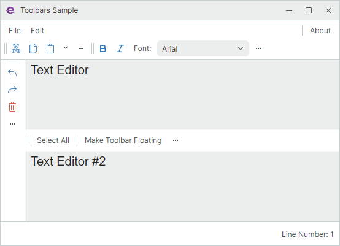
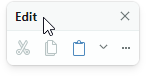
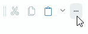
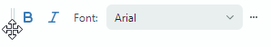
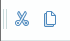
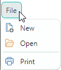
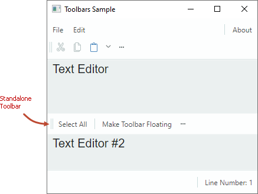
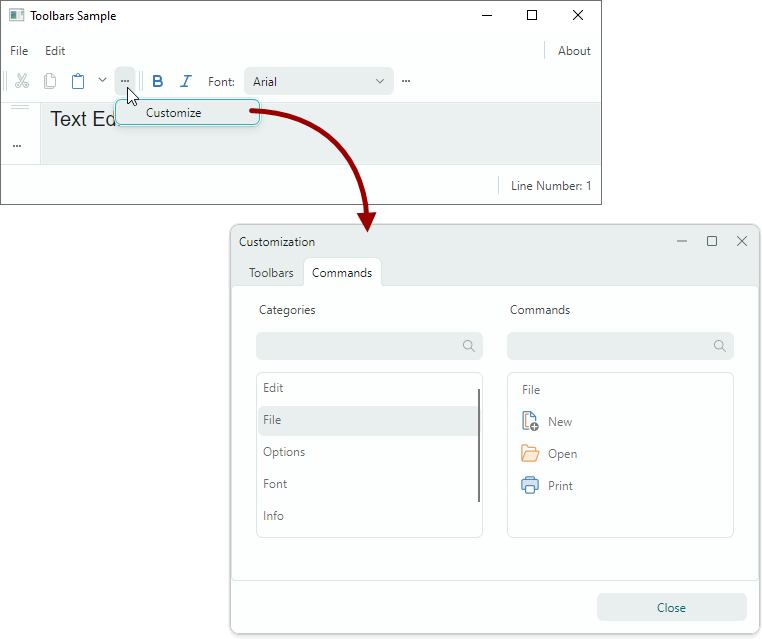

# Начало работы с панелями инструментов

Это руководство показывает, как использовать библиотеку панелей инструментов Eremex для создания интерфейса панелей инструментов с нуля. В нём представлены контролы для реализации интерфейса панелей инструментов и продемонстрированы основные настройки панелей.



Руководство создаёт интерфейс панелей инструментов для двух текстовых редакторов, размещённых в центре окна. Интерфейс панелей состоит из главного меню, строки состояния и обычных панелей инструментов, отображающих различные элементы: кнопки, кнопки-флажки, встроенные редакторы, подменю и текстовые элементы. 

Все панели инструментов, кроме одной, закреплены у краёв окна. Эти панели содержат команды, работающие с первым текстовым редактором. Одна панель (автономная панель) размещена между текстовыми редакторами. Она предоставляет команды для второго текстового редактора.

Руководство также показывает, как связать текстовый редактор с контекстным меню из библиотеки панелей инструментов и меню.

## 1. Создание нового проекта

Убедитесь, что вы установили [шаблоны Eremex Avalonia](../../whats-included/project-templates.md), которые упрощают создание проектов Avalonia UI с контролами Eremex. Создайте новый проект по шаблону `Eremex Avalonia .NET MVVM App` и назовите его "Bars-sample".


Этот шаблон добавляет в созданный проект сборки с контролами Eremex и [визуальной темой](../themes/index.md) DeltaDesign и [регистрирует](../themes/register-an-eremex-paint-theme.md) визуальную тему для использования.

## 2. Добавление компонента ToolbarManager

Начните с определения компонента `ToolbarManager` в XAML. 

``` xml
<mx:MxWindow ...
    xmlns:mx="https://schemas.eremexcontrols.net/avalonia"
    xmlns:mxb="https://schemas.eremexcontrols.net/avalonia/bars"
    xmlns:mxe="https://schemas.eremexcontrols.net/avalonia/editors"
    xmlns:vm="using:Bars_sample.ViewModels"
    xmlns:view="clr-namespace:Bars_sample.Views"
    Title="Toolbars Sample"
    >

    <mx:MxWindow.DataContext>
        <vm:MainWindowViewModel/>
    </mx:MxWindow.DataContext>

    <mxb:ToolbarManager IsWindowManager="True">
        <Grid RowDefinitions="Auto, *, Auto, *, Auto" ColumnDefinitions="Auto, *, Auto">
            <TextBox Grid.Row="1" Grid.Column="1" x:Name="textBox1"  
            Text="Text Editor" AcceptsReturn="True"/>
            <TextBox x:Name="textBox2"  Grid.Row="3" Grid.Column="1" 
            Text="Text Editor #2" AcceptsReturn="True"/>
        </Grid>
    </mxb:ToolbarManager>            
</mx:MxWindow>
```

`ToolbarManager` — это основной компонент, управляющий панелями инструментов, контекстными меню и элементами меню. Компонент обрабатывает сочетания клавиш, вызывает команды, связанные с соответствующими элементами, поддерживает настройку панелей во время работы и выполняет сериализацию и десериализацию интерфейса панелей.

Компонент `ToolbarManager` должен оборачивать клиентский контрол (контролы), для которого создаётся интерфейс панелей инструментов.


## 3. Создание контейнеров панелей инструментов

Чтобы позволить закреплять панель инструментов в определённой позиции в окне/UserControl, сначала создайте контейнер панелей инструментов (`ToolbarContainerControl`). Контейнер панелей — это контрол, отображающий панели в закреплённом состоянии и поддерживающий операции перетаскивания панелей.

В XAML создайте четыре контейнера панелей (объекта `ToolbarContainerControl`) вдоль верхнего, нижнего, левого и правого краёв окна. После этого вы сможете закреплять панели в этих позициях.  


``` xml
xmlns:mxb="https://schemas.eremexcontrols.net/avalonia/bars"

<mxb:ToolbarManager IsWindowManager="True">
    <Grid RowDefinitions="Auto, *, Auto, *, Auto" ColumnDefinitions="Auto, *, Auto">
        <mxb:ToolbarContainerControl DockType="Top" Grid.ColumnSpan="3"/>

        <mxb:ToolbarContainerControl DockType="Left" Grid.Row="1" 
         Grid.Column="0" Grid.RowSpan="3" />

        <TextBox Grid.Row="1" Grid.Column="1" x:Name="textBox1"  
         Text="Text Editor" AcceptsReturn="True"/>
        <TextBox x:Name="textBox2"  Grid.Row="3" Grid.Column="1" 
         Text="Text Editor #2" AcceptsReturn="True"/>

        <mxb:ToolbarContainerControl DockType="Right" Grid.Row="1" 
         Grid.Column="2" Grid.RowSpan="3"/>

        <mxb:ToolbarContainerControl DockType="Bottom" 
         Grid.Row="4" Grid.ColumnSpan="3"/>
    </Grid>
</mxb:ToolbarManager>
```

### Опции контейнера панелей инструментов

Основная настройка `ToolbarContainerControl` — `ToolbarContainerControl.DockType`, которая задаёт, как контейнер закрепляется к своему родителю. Вы можете установить свойство `DockType` в `Left`, `Right`, `Top`, `Bottom` и `Standalone`. 

Настройка `DockType` определяет видимость рамки контейнера и выравнивание вложенных панелей по умолчанию. Например, если опция `DockType` контейнера — `Left`, контейнер рисует рамку у правого края и располагает вложенные панели вертикально. Изображение ниже демонстрирует контейнер панелей, у которого опция `DockType` установлена в `Left`. Дочерние панели ориентированы вертикально в соответствии с настройкой `DockType`.


## 4. Создание панелей инструментов

Добавьте панели инструментов (объекты `Toolbar`) в нужные контейнеры панелей. 


``` xml
xmlns:mxb="https://schemas.eremexcontrols.net/avalonia/bars"

<mxb:ToolbarManager IsWindowManager="True">
    <Grid RowDefinitions="Auto, *, Auto, *, Auto" ColumnDefinitions="Auto, *, Auto">
        <mxb:ToolbarContainerControl DockType="Top" Grid.ColumnSpan="3">
            <mxb:Toolbar x:Name="MainMenu" ToolbarName="Main Menu" DisplayMode="MainMenu">
            </mxb:Toolbar>

            <mxb:Toolbar x:Name="EditToolbar" ToolbarName="Edit" 
             ShowCustomizationButton="True">
            </mxb:Toolbar>

            <mxb:Toolbar x:Name="FontToolbar" ToolbarName="Font" 
             ShowCustomizationButton="True">
            </mxb:Toolbar>
        </mxb:ToolbarContainerControl>

        <mxb:ToolbarContainerControl DockType="Left" Grid.Row="1" 
         Grid.Column="0" Grid.RowSpan="3">
            <mxb:Toolbar x:Name="TextEditingToolbar" ToolbarName="Text Editing" 
             ShowCustomizationButton="True" >
            </mxb:Toolbar>
        </mxb:ToolbarContainerControl>
                
        <TextBox Grid.Row="1" Grid.Column="1" x:Name="textBox1"  Text="Text Editor" 
         AcceptsReturn="True" CornerRadius="0" FontFamily="Arial" FontSize="20"/>
        <TextBox x:Name="textBox2"  Grid.Row="3" Grid.Column="1" Text="Text Editor #2" 
         AcceptsReturn="True" CornerRadius="0" FontFamily="Arial" FontSize="20"/>

        <mxb:ToolbarContainerControl DockType="Right" Grid.Row="1" 
         Grid.Column="2" Grid.RowSpan="3"/>

        <mxb:ToolbarContainerControl DockType="Bottom" Grid.Row="4" Grid.ColumnSpan="3">
            <mxb:Toolbar DisplayMode="StatusBar" ToolbarName="Status Bar" x:Name="StatusBar">
            </mxb:Toolbar>
        </mxb:ToolbarContainerControl>
    </Grid>
</mxb:ToolbarManager>
```

Приведённый выше фрагмент заполняет три контейнера панелями инструментов и оставляет один контейнер пустым. Пользователи смогут перетаскивать панели в любой из четырёх контейнеров во время работы.

### Задание главного меню и строки состояния

Чтобы указать, что панель является главным меню или строкой состояния, установите её свойство `Toolbar.DisplayMode` в `MainMenu` и `StatusBar` соответственно.

``` xml
<mxb:Toolbar x:Name="MainMenu" ToolbarName="Main Menu" DisplayMode="MainMenu">
</mxb:Toolbar>
```

Главное меню и строка состояния имеют характерные настройки внешнего вида и поведения. Например, они не содержат маркер перетаскивания, поэтому их нельзя перетаскивать. Пользователь не может скрыть главное меню и строку состояния во время работы.


### Опции панели инструментов

Объекты `Toolbar` предоставляют множество опций для настройки их отображения, компоновки и поведения. Некоторые из этих опций:

- `ToolbarName` — отображаемое имя панели. Имена панелей отображаются в окне настройки, а также когда панель находится в плавающем состоянии.
    
    
    
- `ShowCustomizationButton` — задаёт видимость кнопки настройки, используемой для активации режима настройки и открытия окна настройки.
    
    

- `AllowDragToolbar` — задаёт видимость маркера перетаскивания, позволяющего пользователям перетаскивать панель.
    
    

- `DockType` — это свойство позволяет переместить панель в конкретный контейнер в code-behind или сделать панель плавающей.
- `StretchToolbar` — включает растягивание панели. В этом режиме никакая другая панель не может отображаться в той же строке.
- `WrapItems` — включает многострочную компоновку панели.


## 5. Создание элементов панели инструментов

Следующий шаг — заполнить панели элементами: обычными кнопками, кнопками-флажками, встроенными редакторами, подменю и текстовыми элементами. Элементы панели инкапсулируются классами, производными от класса `ToolbarItem`, который предоставляет общие опции элементов панели.

Это руководство создаёт следующие элементы панели:

### ToolbarButtonItem

Обычная кнопка, вызывающая команду, заданную свойством `Command`. 



``` xml
<mxb:Toolbar x:Name="EditToolbar" ToolbarName="Edit" ShowCustomizationButton="True"  >
    <mxb:ToolbarButtonItem Header="Cut" Command="{Binding #textBox1.Cut}" 
     IsEnabled="{Binding #textBox1.CanCut}" 
     Glyph="{SvgImage 'avares://Bars-sample/Images/Toolbars/EditCut.svg'}" 
     Category="Edit"/>
    <mxb:ToolbarButtonItem Header="Copy" Command="{Binding #textBox1.Copy}" 
     IsEnabled="{Binding #textBox1.CanCopy}" 
     Glyph="{SvgImage 'avares://Bars-sample/Images/Toolbars/EditCopy.svg'}" 
     Category="Edit"/>
</mxb:Toolbar>
```

#### Общие опции элементов панели инструментов

Базовый класс `ToolbarItem` предоставляет общие опции, наследуемые всеми элементами панели. Некоторые из этих опций:

- `Alignment` — выравнивание элемента внутри панели.        
- `Category` — категория, к которой относится элемент. Категории используются для организации элементов в логические группы в окне настройки.
- `Command` — команда, выполняемая при щелчке по кнопке.
- `CommandParameter` — параметр команды, передаваемый заданной команде.
- `DisplayMode` — возвращает, отображать ли только глиф, только заголовок или оба.
- `Header` — отображаемый текст элемента. 
- `Glyph` — изображение элемента.
- `GlyphAlignment` — выравнивание глифа относительно заголовка элемента.
- `GlyphSize` — размер отображения глифа.
- `ShowSeparator` — позволяет отображать разделитель перед элементом.

#### Назначение выпадающего контрола/меню элементу ToolbarButtonItem

Вы можете связать выпадающий контрол/меню с объектом `ToolbarButtonItem`. Выпадающий элемент активируется щелчком по встроенной стрелке выпадающего списка или по самому элементу (подробнее см. опцию `DropDownArrowVisibility` ниже).

Свяжем кнопку _Paste_ (`ToolbarButtonItem`) с выпадающим меню. Выпадающее меню будет отображать команды _Paste_ и _Paste As_.


``` xml
<mxb:ToolbarButtonItem Header="Paste" Command="{Binding #textBox1.Paste}" 
 IsEnabled="{Binding #textBox1.CanPaste}" 
 Glyph="{SvgImage 'avares://Bars-sample/Images/Toolbars/EditPaste.svg'}" 
 Category="Edit">
    <mxb:ToolbarButtonItem.DropDownControl>
        <mxb:PopupMenu>
            <mxb:ToolbarButtonItem Header="Paste" Command="{Binding #textBox1.Paste}" 
             IsEnabled="{Binding #textBox1.CanPaste}" 
             Glyph="{SvgImage 'avares://Bars-sample/Images/Toolbars/EditPaste.svg'}"/>
            <mxb:ToolbarButtonItem Header="Paste As" 
             Command="{Binding PasteAsCommand}" 
             IsEnabled="{Binding #textBox1.CanPaste}"/>
        </mxb:PopupMenu>
    </mxb:ToolbarButtonItem.DropDownControl>
</mxb:ToolbarButtonItem>
```

Следующие свойства используются для задания выпадающего контрола и способа его отображения:

- `DropDownControl` — возвращает или задаёт выпадающий контрол/меню, связанный с элементом. Это свойство принимает объекты `PopupContainer` и `PopupMenu`.

- `DropDownArrowVisibility` — задаёт, отображает ли элемент стрелку выпадающего списка, используемую для вызова связанного выпадающего контрола. Поддерживаемые опции:
    - `ShowArrow` — стрелка выпадающего списка видима. Элемент и стрелка действуют как единая кнопка. Щелчок по ним отображает связанный выпадающий контрол.

    - `ShowSplitArrow` или `Default` — стрелка выпадающего списка видима. Она действует как отдельная кнопка, встроенная в элемент. Щелчок по стрелке вызывает связанный выпадающий контрол. Щелчок по элементу вызывает его команду.

    - `Hide` — стрелка выпадающего списка скрыта. Щелчок по элементу вызывает выпадающий контрол.


### ToolbarMenuItem

Кнопка, вызывающая подменю. Чтобы добавить элементы в подменю, определите их между открывающим и закрывающим тегами `<ToolbarMenuItem>` в разметке XAML или добавьте их в коллекцию `Items`.



``` xml
<mxb:Toolbar x:Name="MainMenu" ToolbarName="Main Menu" DisplayMode="MainMenu">
    <mxb:ToolbarMenuItem Header="File" Category="File">
        <mxb:ToolbarButtonItem Header="New" 
         Glyph="{SvgImage 'avares://Bars-sample/Images/Toolbars/FileNew.svg'}" 
         Category="File" Command="{Binding NewFileCommand}"/>
        <mxb:ToolbarButtonItem Header="Open" 
         Glyph="{SvgImage 'avares://Bars-sample/Images/Toolbars/FileOpen.svg'}" 
         Category="File" Command="{Binding OpenFileCommand}"/>
        <mxb:ToolbarButtonItem Header="Print" 
         Glyph="{SvgImage 'avares://Bars-sample/Images/Toolbars/FilePrint.svg'}" 
         Category="File" Command="{Binding PrintCommand}" ShowSeparator="True"/>
    </mxb:ToolbarMenuItem>
</mxb:Toolbar>
```

Вы можете добавлять в подменю все поддерживаемые типы элементов.

    

### ToolbarCheckItem

Кнопка-флажок, которая может находиться в обычном или нажатом состоянии. 


``` xml
<mxb:Toolbar x:Name="FontToolbar" ToolbarName="Font" ShowCustomizationButton="False">
    <mxb:ToolbarCheckItem Header="Bold" 
     IsChecked="{Binding #textBox1.FontWeight, 
      Converter={view:BoolToFontWeightConverter}, Mode=TwoWay}" 
     Glyph="{SvgImage 'avares://Bars-sample/Images/Toolbars/FontBold.svg'}" 
     Category="Font"/>
    ...
</mxb:Toolbar>
```

#### Опции ToolbarCheckItem

- `IsChecked` — возвращает или задаёт состояние нажатия кнопки.
- `CheckedChanged` — событие, возникающее при изменении состояния нажатия.

### ToolbarEditorItem

Элемент, позволяющий встраивать редактор Eremex в панель или меню.


``` xml
<mxb:Toolbar x:Name="FontToolbar" ToolbarName="Font" ShowCustomizationButton="False">
    <mxb:ToolbarEditorItem Header="Font:" EditorWidth="150" Category="Font" 
     EditorValue="{Binding #textBox1.FontFamily, 
      Converter={view:FontNameToFontFamilyConverter}}">
        <mxb:ToolbarEditorItem.EditorProperties>
            <mxe:ComboBoxEditorProperties 
             ItemsSource="{Binding $parent[view:MainWindow].Fonts}" 
             IsTextEditable="False"/>
        </mxb:ToolbarEditorItem.EditorProperties>
    </mxb:ToolbarEditorItem>
    ...
</mxb:Toolbar>
```

#### Опции ToolbarEditorItem

- `EditorValue` — позволяет задавать и читать значение встроенного редактора.
- `EditorProperties` — задаёт тип редактора, встраиваемого в панель/меню. В приведённом выше фрагменте кода свойство `EditorProperties` установлено в объект `ComboBoxEditorProperties`. Этот объект содержит настройки, специфичные для контрола `ComboBoxEditor`. Панель автоматически создаст контрол `ComboBoxEditor` во время работы из заданного объекта `ComboBoxEditorProperties`.

### ToolbarTextItem

Текстовая надпись. Щелчок по текстовой надписи не вызывает никакого действия (команды).


``` xml
<mxb:Toolbar DisplayMode="StatusBar" ToolbarName="Status Bar" 
 x:Name="StatusBar" ShowCustomizationButton="False">
    <mxb:ToolbarTextItem  Name="tbTextItem1" Alignment="Far" 
     ShowSeparator="True" ShowBorder="False" Category="Info" 
     CustomizationName="Position Info" 
     Header="{Binding $parent[view:MainWindow].LineNumber}"/>
</mxb:Toolbar>
```

#### Опции ToolbarTextItem

- `SizeMode` — возвращает или задаёт, автоматически ли размер элемента подстраивается под его содержимое или растягивается, чтобы занять доступное пространство в панели.
- `ShowBorder` — возвращает или задаёт, отображать ли рамку вокруг элемента.

### Другие типы элементов панели инструментов

Библиотека панелей инструментов также поддерживает другие типы элементов, не продемонстрированные в этом руководстве:

- `ToolbarItemGroup` — группа элементов панели.
- `ToolbarCheckItemGroup` — группа кнопок-флажков. Используйте её для создания группы взаимоисключающих флажков или группы, поддерживающей выбор нескольких элементов одновременно.

Дополнительную информацию смотрите в следующем разделе: [Элементы панели инструментов](toolbar-items.md).

## 6. Создание автономной панели инструментов

Вы можете размещать панели инструментов в любом месте окна, а не только вдоль его краёв. Например, вы можете разместить панели с командами рядом с целевым контролом. Такие панели называются «автономными», поскольку находятся в «автономных» контейнерах панелей.



Чтобы создать автономную панель, сделайте следующее:
1. Создайте контейнер панелей (`ToolbarContainerControl`) в нужной позиции. Установите его свойство `DockType` в `Standalone`. 
   
   Автономные контейнеры панелей не имеют рамок.

2. Добавьте в этот контейнер панель с командами.

Код ниже отображает автономную панель между двумя текстовыми редакторами. Команда _Select All_ панели выделяет текст во втором текстовом редакторе.

``` xml
<mxb:ToolbarManager Name="toolbarManager1" IsWindowManager="True" >
    <Grid RowDefinitions="Auto, *, Auto, *, Auto" ColumnDefinitions="Auto, *, Auto">
        ...
        <TextBox Grid.Row="1" Grid.Column="1" x:Name="textBox1" Text="Text Editor" 
         AcceptsReturn="True"/>

        <mxb:ToolbarContainerControl DockType="Standalone" Grid.Row="2" Grid.Column="1">
            <mxb:Toolbar x:Name="TextEditor2Toolbar" ToolbarName="Standalone Toolbar" 
             ShowCustomizationButton="True" AllowDragToolbar="true"  >
                <mxb:ToolbarButtonItem Header="Select All" 
                 Command="{Binding #textBox2.SelectAll}" Category="TextEditor2 Toolbar" />
                <mxb:ToolbarButtonItem Header="Make Toolbar Floating" 
                 Command="{Binding $parent[view:MainWindow].MakeToolbar2Floating}" 
                 ShowSeparator="True"
                 Category="TextEditor2 Toolbar"/>
            </mxb:Toolbar>
        </mxb:ToolbarContainerControl>

        <TextBox x:Name="textBox2"  Grid.Row="3" Grid.Column="1" Text="Text Editor #2" 
         AcceptsReturn="True"/>
    </Grid>
</mxb:ToolbarManager>
```

## 7. Назначение контекстного меню текстовому редактору

Чтобы задать контекстное меню для контрола, создайте объект `PopupMenu` и назначьте его целевому контролу с помощью присоединённого свойства `ToolbarManager.ContextPopup`. Во всплывающие меню можно добавлять элементы панели любого типа.


``` xml
<TextBox Grid.Row="1" Grid.Column="1" x:Name="textBox1"  Text="Text Editor" 
 AcceptsReturn="True" CornerRadius="0" FontFamily="Arial" FontSize="20" >
    <mxb:ToolbarManager.ContextPopup>
        <mxb:PopupMenu ShowIconStrip="True" Header="Text Box Menu" ShowHeader="True">
            <mxb:ToolbarButtonItem Header="Undo" HotKeyDisplayString="Ctrl+Z" 
             Command="{Binding #textBox1.Undo}" IsEnabled="{Binding #textBox1.CanUndo}"
             Glyph="{SvgImage 'avares://Bars-sample/Images/Toolbars/EditUndo.svg'}"  
             Category="Edit"/>
            <mxb:ToolbarButtonItem Header="Redo" HotKeyDisplayString="Ctrl+Y"  
             Command="{Binding #textBox1.Redo}" IsEnabled="{Binding #textBox1.CanRedo}"
             Glyph="{SvgImage 'avares://Bars-sample/Images/Toolbars/EditRedo.svg'}"  
             Category="Edit"/>
            <mxb:ToolbarSeparatorItem/>
            <mxb:ToolbarButtonItem Header="Clear" Command="{Binding #textBox1.Clear}" 
             HotKeyDisplayString="Ctrl+Q"  Category="Edit"
             Glyph="{SvgImage 'avares://Bars-sample/Images/Toolbars/EditDelete.svg'}"/>
        </mxb:PopupMenu>
    </mxb:ToolbarManager.ContextPopup>
</TextBox>
```

### Опции всплывающего меню

- `ContentRightIndent` — задаёт ширину пустого пространства справа от текста элементов меню.

  

- `Header` — позволяет задать заголовок меню.
- `ShowHeader` — возвращает или задаёт, виден ли заголовок меню.
- `ShowIconStrip` — возвращает или задаёт, отображать ли вертикальную полосу значков для элементов меню. Значок элемента меню задаётся свойством элемента `Glyph`.


## 8. Назначение горячих клавиш для элементов панели инструментов

Используйте свойство `ToolbarItem.HotKey`, чтобы назначать элементам сочетания клавиш. 

``` xml
<mxb:ToolbarButtonItem
    Header="Clear" Command="{Binding #textBox1.Clear}" HotKey="Ctrl+Q"
    Glyph="{SvgImage 'avares://Bars-sample/Images/Toolbars/EditDelete.svg'}"  Category="Edit"/>
```

Границы компонента `ToolbarManager` определяют область действия горячих клавиш по умолчанию. Если фокус находится в пределах области действия горячих клавиш, `ToolbarManager` может перехватывать и обрабатывать горячие клавиши. 
Вы можете установить свойство `ToolbarManager.IsWindowManager` в `true`, чтобы расширить область действия горячих клавиш на всё окно. В этом случае `ToolbarManager` регистрирует горячие клавиши в окне и может обрабатывать их, даже если фокус находится за пределами границ `ToolbarManager`.

Дополнительную информацию смотрите в следующем разделе: [Горячие клавиши элементов панели инструментов](toolbar-items.md#горячие-клавиши).


## 9. Назначение всплывающих подсказок элементам панели инструментов

Свойство `ToolTip` позволяет задавать всплывающие подсказки для элементов панели.


``` xml
<mxb:ToolbarButtonItem Header="Cut" Command="{Binding #textBox1.Cut}" 
 IsEnabled="{Binding #textBox1.CanCut}"
 Glyph="{SvgImage 'avares://Bars-sample/Images/Toolbars/EditCut.svg'}"
 Category="Edit"
 ToolTip.Tip="Cut Selection"/>
```


## 10. Плавающая панель инструментов

Сделаем панель плавающей в code-behind. Убедитесь, что у целевой панели есть имя, чтобы к ней можно было обратиться. После получения объекта панели установите его свойство `Toolbar.DockType` в `Floating`. Используйте свойство `Toolbar.FloatingPosition`, чтобы задать местоположение плавающей панели.

``` csharp
EditToolbar.DockType = Eremex.AvaloniaUI.Controls.Bars.MxToolbarDockType.Floating;
EditToolbar.FloatingPosition = new PixelPoint(200, 200);
```

Чтобы создать плавающую панель в XAML, определите объект `Toolbar` в коллекции `ToolbarManager.Toolbars` и установите свойство `Toolbar.DockType` в `Floating`. 

Дополнительную информацию смотрите в следующем разделе: [Плавающие панели инструментов](toolbars.md#плавающие-панели-инструментов).

<!--TODO ## 10. Save and Restore a Toolbars Layout

 -->

## 11. Время выполнения

Библиотека панелей инструментов поддерживает настройку панелей пользователями во время работы. Запустите приложение, чтобы увидеть эти возможности в действии:

- Перетаскивание панелей — панели отображают маркеры перетаскивания, позволяющие переупорядочивать панели.


- Быстрая настройка панелей — вы можете быстро перемещать элементы внутри панелей и между ними с помощью перетаскивания, удерживая клавишу Alt.


- Режим настройки и окно настройки — щёлкните по кнопке настройки панели («...»), а затем выберите команду «Customize». Активация режима настройки отображает окно настройки:



В режиме настройки вы можете делать следующее:

- Скрывать и восстанавливать панели.
- Создавать пользовательские панели и управлять ими.
- Скрывать, восстанавливать и переупорядочивать элементы панелей между панелями и подменю.


## 12. Полный код

Ниже приведён полный код этого руководства. 

SVG-изображения, используемые в этом примере, размещены в папке `Bars-sample/Images/Toolbars`. У них свойство `Build Action` установлено в `AvaloniaResource`.

_MainWindow.axaml_:

``` xml
<mx:MxWindow xmlns="https://github.com/avaloniaui"
        xmlns:x="http://schemas.microsoft.com/winfx/2006/xaml"
        xmlns:vm="using:Bars_sample.ViewModels"
        xmlns:d="http://schemas.microsoft.com/expression/blend/2008"
        xmlns:mc="http://schemas.openxmlformats.org/markup-compatibility/2006"
        xmlns:mx="https://schemas.eremexcontrols.net/avalonia"
        xmlns:mxe="https://schemas.eremexcontrols.net/avalonia/editors"
        xmlns:mxb="https://schemas.eremexcontrols.net/avalonia/bars"
        xmlns:view="clr-namespace:Bars_sample.Views"
        mc:Ignorable="d" d:DesignWidth="800" d:DesignHeight="450"
        x:Class="Bars_sample.Views.MainWindow"
        x:DataType="vm:MainWindowViewModel"
        Icon="/Assets/EMXControls.ico"
        Title="Toolbars Sample"
        Width="800" Height="600">

    <mx:MxWindow.DataContext>
        <vm:MainWindowViewModel/>
    </mx:MxWindow.DataContext>

    <mxb:ToolbarManager Name="toolbarManager1" IsWindowManager="True" >
        <Grid RowDefinitions="Auto, *, Auto, *, Auto" ColumnDefinitions="Auto, *, Auto">
            <mxb:ToolbarContainerControl DockType="Top" Grid.ColumnSpan="3">
                <mxb:Toolbar x:Name="MainMenu" ToolbarName="Main Menu" DisplayMode="MainMenu" >
                    <mxb:ToolbarMenuItem Header="File" Category="File">
                        <mxb:ToolbarButtonItem Header="New"
                         Glyph="{SvgImage 'avares://Bars-sample/Images/Toolbars/FileNew.svg'}"
                         Category="File"
                         Command="{Binding NewFileCommand}"/>
                        <mxb:ToolbarButtonItem Header="Open"
                         Glyph="{SvgImage 'avares://Bars-sample/Images/Toolbars/FileOpen.svg'}"
                         Category="File"
                         Command="{Binding OpenFileCommand}"/>
                        <mxb:ToolbarButtonItem Header="Print"
                         Glyph="{SvgImage 'avares://Bars-sample/Images/Toolbars/FilePrint.svg'}"
                         Category="File"
                         Command="{Binding PrintCommand}" ShowSeparator="True"/>
                    </mxb:ToolbarMenuItem>

                    <mxb:ToolbarMenuItem Header="Edit" Category="Edit" >
                        <mxb:ToolbarButtonItem Header="Cut"
                         Glyph="{SvgImage 'avares://Bars-sample/Images/Toolbars/EditCut.svg'}"
                         Category="Edit"
                         Command="{Binding #textBox1.Cut}" IsEnabled="{Binding #textBox1.CanCut}"/>
                        <mxb:ToolbarButtonItem Header="Copy"
                         Glyph="{SvgImage 'avares://Bars-sample/Images/Toolbars/EditCopy.svg'}"
                         Category="Edit"
                         Command="{Binding #textBox1.Copy}" IsEnabled="{Binding #textBox1.CanCopy}"/>
                        <mxb:ToolbarButtonItem Header="Paste"
                         Glyph="{SvgImage 'avares://Bars-sample/Images/Toolbars/EditPaste.svg'}"
                         Category="Edit"
                         Command="{Binding #textBox1.Paste}" IsEnabled="{Binding #textBox1.CanPaste}"/>
                    </mxb:ToolbarMenuItem>
                    <mxb:ToolbarButtonItem Header="About" Category="Options" ShowSeparator="True"
                     Alignment="Far" Command="{Binding AboutCommand}"/>
                </mxb:Toolbar>

                <mxb:Toolbar x:Name="EditToolbar" ToolbarName="Edit" ShowCustomizationButton="True"  >
                    <mxb:ToolbarButtonItem Header="Cut" Command="{Binding #textBox1.Cut}"
                     IsEnabled="{Binding #textBox1.CanCut}"
                     Glyph="{SvgImage 'avares://Bars-sample/Images/Toolbars/EditCut.svg'}"
                     Category="Edit" ToolTip.Tip="Cut Selection"/>
                    <mxb:ToolbarButtonItem Header="Copy" Command="{Binding #textBox1.Copy}"
                     IsEnabled="{Binding #textBox1.CanCopy}"
                     Glyph="{SvgImage 'avares://Bars-sample/Images/Toolbars/EditCopy.svg'}"
                     Category="Edit"/>
                    <mxb:ToolbarButtonItem Header="Paste"
                     Command="{Binding #textBox1.Paste}"
                     IsEnabled="{Binding #textBox1.CanPaste}"
                     Glyph="{SvgImage 'avares://Bars-sample/Images/Toolbars/EditPaste.svg'}"
                     Category="Edit"
                     DropDownArrowVisibility="ShowArrow" DropDownArrowAlignment="Default">
                        <mxb:ToolbarButtonItem.DropDownControl>
                            <mxb:PopupMenu>
                                <mxb:ToolbarButtonItem Header="Paste"
                                 Command="{Binding #textBox1.Paste}"
                                 IsEnabled="{Binding #textBox1.CanPaste}"/>
                                <mxb:ToolbarButtonItem Header="Paste As"
                                 Command="{Binding PasteAsCommand}"
                                 IsEnabled="{Binding #textBox1.CanPaste}"/>
                            </mxb:PopupMenu>
                        </mxb:ToolbarButtonItem.DropDownControl>
                    </mxb:ToolbarButtonItem>
                </mxb:Toolbar>

                <mxb:Toolbar x:Name="FontToolbar" ToolbarName="Font" ShowCustomizationButton="True" >
                    <mxb:ToolbarCheckItem Header="Bold"
                     IsChecked="{Binding #textBox1.FontWeight, 
                      Converter={view:BoolToFontWeightConverter}, Mode=TwoWay}"
                     Glyph="{SvgImage 'avares://Bars-sample/Images/Toolbars/FontBold.svg'}"
                     Category="Font"/>
                    <mxb:ToolbarCheckItem Header="Italic"
                     IsChecked="{Binding #textBox1.FontStyle, 
                      Converter={view:BoolToFontStyleConverter}, Mode=TwoWay}"
                     Glyph="{SvgImage 'avares://Bars-sample/Images/Toolbars/FontItalic.svg'}"
                     Category="Font"/>
                    <mxb:ToolbarEditorItem Header="Font:" IsVisible="" EditorWidth="150" Category="Font"
                    EditorValue="{Binding #textBox1.FontFamily, 
                     Converter={view:FontNameToFontFamilyConverter}}">
                        <mxb:ToolbarEditorItem.EditorProperties>
                            <mxe:ComboBoxEditorProperties
                             ItemsSource="{Binding $parent[view:MainWindow].Fonts}"
                             IsTextEditable="False" PopupMaxHeight="145"/>
                        </mxb:ToolbarEditorItem.EditorProperties>
                    </mxb:ToolbarEditorItem>
                </mxb:Toolbar>
            </mxb:ToolbarContainerControl>

            <mxb:ToolbarContainerControl DockType="Left" Grid.Row="1" Grid.Column="0"
             Grid.RowSpan="3">
                <mxb:Toolbar x:Name="TextEditingToolbar" ToolbarName="Text Editing"
                 ShowCustomizationButton="True" >
                    <mxb:ToolbarButtonItem Header="Undo" HotKeyDisplayString="Ctrl+Z"
                     Command="{Binding #textBox1.Undo}" IsEnabled="{Binding #textBox1.CanUndo}"
                     Glyph="{SvgImage 'avares://Bars-sample/Images/Toolbars/EditUndo.svg'}"
                     Category="Edit"/>
                    <mxb:ToolbarButtonItem Header="Redo" HotKeyDisplayString="Ctrl+Y"
                     Command="{Binding #textBox1.Redo}" IsEnabled="{Binding #textBox1.CanRedo}"
                     Glyph="{SvgImage 'avares://Bars-sample/Images/Toolbars/EditRedo.svg'}"
                     Category="Edit"/>
                    <mxb:ToolbarButtonItem Header="Clear" Command="{Binding #textBox1.Clear}"
                     HotKey="Ctrl+Q"
                     Glyph="{SvgImage 'avares://Bars-sample/Images/Toolbars/EditDelete.svg'}"
                     Category="Edit"/>
                </mxb:Toolbar>
            </mxb:ToolbarContainerControl>

            <TextBox Grid.Row="1" Grid.Column="1" x:Name="textBox1"  Text="Text Editor"
            AcceptsReturn="True" CornerRadius="0" FontFamily="Arial" FontSize="20">
                <mxb:ToolbarManager.ContextPopup>
                    <mxb:PopupMenu ShowIconStrip="True" Header="Text Box Menu" ShowHeader="True">
                        <mxb:ToolbarButtonItem Header="Undo" HotKeyDisplayString="Ctrl+Z"
                         Command="{Binding #textBox1.Undo}" IsEnabled="{Binding #textBox1.CanUndo}"
                         Glyph="{SvgImage 'avares://Bars-sample/Images/Toolbars/EditUndo.svg'}"
                         Category="Edit"/>
                        <mxb:ToolbarButtonItem Header="Redo" HotKeyDisplayString="Ctrl+Y"
                         Command="{Binding #textBox1.Redo}" IsEnabled="{Binding #textBox1.CanRedo}"
                         Glyph="{SvgImage 'avares://Bars-sample/Images/Toolbars/EditRedo.svg'}"
                         Category="Edit"/>
                        <mxb:ToolbarSeparatorItem/>
                        <mxb:ToolbarButtonItem Header="Clear" Command="{Binding #textBox1.Clear}"
                         HotKeyDisplayString="Ctrl+Q"  Category="Edit"
                         Glyph="{SvgImage 'avares://Bars-sample/Images/Toolbars/EditDelete.svg'}"/>
                    </mxb:PopupMenu>
                </mxb:ToolbarManager.ContextPopup>
            </TextBox>

            <mxb:ToolbarContainerControl DockType="Standalone" Grid.Row="2" Grid.Column="1">
                <mxb:Toolbar x:Name="TextEditor2Toolbar" ToolbarName="Standalone Toolbar"
                 ShowCustomizationButton="True" AllowDragToolbar="true"  >
                    <mxb:ToolbarButtonItem Header="Select All"
                     Command="{Binding #textBox2.SelectAll}" Category="TextEditor2 Toolbar"/>
                    <mxb:ToolbarButtonItem Header="Make Toolbar Floating"
                     Command="{Binding $parent[view:MainWindow].MakeToolbar2Floating}"
                     ShowSeparator="True"
                     Category="TextEditor2 Toolbar"/>
                </mxb:Toolbar>
            </mxb:ToolbarContainerControl>

            <TextBox x:Name="textBox2"  Grid.Row="3" Grid.Column="1" Text="Text Editor #2"
             AcceptsReturn="True" CornerRadius="0" FontFamily="Arial" FontSize="20"/>

            <mxb:ToolbarContainerControl DockType="Right" Grid.Row="1" Grid.Column="2"
             Grid.RowSpan="3"/>

            <mxb:ToolbarContainerControl DockType="Bottom" Grid.Row="4" Grid.ColumnSpan="3">
                <mxb:Toolbar DisplayMode="StatusBar" ToolbarName="Status Bar" x:Name="StatusBar">
                    <mxb:ToolbarTextItem  Name="tbTextItem1" Alignment="Far"
                     ShowSeparator="True" ShowBorder="False" Category="Info"
                     CustomizationName="Position Info"
                     Header="{Binding $parent[view:MainWindow].LineNumber}"/>
                </mxb:Toolbar>
            </mxb:ToolbarContainerControl>
        </Grid>
    </mxb:ToolbarManager>

</mx:MxWindow>
```

_App.axaml_:

``` xml
<Application xmlns="https://github.com/avaloniaui"
             xmlns:x="http://schemas.microsoft.com/winfx/2006/xaml"
             x:Class="Bars_sample.App"
             xmlns:theme="clr-namespace:Eremex.AvaloniaUI.Themes.DeltaDesign;assembly=Eremex.Avalonia.Themes.DeltaDesign"
             RequestedThemeVariant="Default">
             <!-- "Default" ThemeVariant follows system theme variant. "Dark" or "Light" are other available options. -->
    <Application.Styles>
        <theme:DeltaDesignTheme/>
    </Application.Styles>
</Application>
```

_MainWindow.axaml.cs_:

``` csharp
using Avalonia;
using Avalonia.Controls;
using Eremex.AvaloniaUI.Controls.Common;
using System;
using System.Collections.Generic;
using System.ComponentModel;
using System.Globalization;
using System.Runtime.CompilerServices;

using Avalonia.Data.Converters;
using Avalonia.Markup.Xaml;
using Avalonia.Media;
using System.Linq;
using CommunityToolkit.Mvvm.Input;

namespace Bars_sample.Views;

public partial class MainWindow : MxWindow, INotifyPropertyChanged
{
    public MainWindow()
    {
        InitializeComponent();
        textBox1.PropertyChanged += TextBox_PropertyChanged;
    }

    private void TextBox_PropertyChanged(object? sender, AvaloniaPropertyChangedEventArgs e)
    {
        if (e.Property == TextBox.CaretIndexProperty)
        {
            NotifyPropertyChanged("LineNumber");
        }
    }

    public event PropertyChangedEventHandler PropertyChanged;
    private void NotifyPropertyChanged([CallerMemberName] string propertyName = "")
    {
        PropertyChanged?.Invoke(this, new PropertyChangedEventArgs(propertyName));
    }

    IReadOnlyList<string> fonts;
    public IReadOnlyList<string> Fonts => fonts ??
    (
        fonts = FontManager.Current.SystemFonts.Select(x => x.Name).OrderBy(x => x).ToList()
    );

    [RelayCommand]
    public void MakeToolbar2Floating()
    {
        TextEditor2Toolbar.DockType = Eremex.AvaloniaUI.Controls.Bars.MxToolbarDockType.Floating;
        TextEditor2Toolbar.FloatingPosition = new PixelPoint(200, 200);
    }

    public string LineNumber
    {
        get
        {
            TextBox textBox = this.textBox1;
            string text = textBox.Text;
            string newLine = textBox.NewLine;

            int currentIndex = 0;
            int lineNumber = 0;
            while (currentIndex <= textBox.CaretIndex)
            {
                lineNumber++;
                int newLineIndex = 1;
                if(text!=null) newLineIndex = text.IndexOf(newLine, currentIndex);
                if (newLineIndex >= 0)
                    currentIndex = newLineIndex + newLine.Length;
                else
                    break;
            }
            return "Line Number: " + lineNumber;
        }
    }
}

public class BoolToFontWeightConverter : MarkupExtension, IValueConverter
{
    public override object ProvideValue(IServiceProvider serviceProvider)
    {
        return this;
    }

    public object Convert(object value, Type targetType, object parameter, CultureInfo culture)
    {
        return ((FontWeight)value) == FontWeight.Bold;
    }

    public object ConvertBack(object value, Type targetType, object parameter, CultureInfo culture)
    {
        return (bool)value ? FontWeight.Bold : FontWeight.Normal;
    }
}

public class BoolToFontStyleConverter : MarkupExtension, IValueConverter
{
    public override object ProvideValue(IServiceProvider serviceProvider)
    {
        return this;
    }

    public object Convert(object value, Type targetType, object parameter, CultureInfo culture)
    {
        return (FontStyle)value == FontStyle.Italic;
    }

    public object ConvertBack(object value, Type targetType, object parameter, CultureInfo culture)
    {
        return (bool)value ? FontStyle.Italic : FontStyle.Normal;
    }
}

public class FontNameToFontFamilyConverter : MarkupExtension, IValueConverter
{
    public override object ProvideValue(IServiceProvider serviceProvider)
    {
        return this;
    }

    public object Convert(object value, Type targetType, object parameter, CultureInfo culture)
    {
        return ((FontFamily)value).Name;
    }

    public object ConvertBack(object value, Type targetType, object parameter, CultureInfo culture)
    {
        return new FontFamily((string)value);
    }
}
```

_MainWindowViewModel.cs_:
``` csharp
using CommunityToolkit.Mvvm.Input;

namespace Bars_sample.ViewModels;

public partial class MainWindowViewModel : ViewModelBase
{
    [RelayCommand]
    void About()
    {

    }

    [RelayCommand]
    void NewFile()
    {

    }

    [RelayCommand]
    void OpenFile()
    {

    }

    [RelayCommand]
    void Print()
    {

    }
}
```

## Смотрите также

- [Панели инструментов](toolbars.md)
- [Всплывающие и контекстные меню](popup-and-context-menus.md)
- [Элементы панели инструментов](toolbar-items.md)
- [Сериализация и десериализация панелей инструментов](toolbar-serialization-and-deserialization.md)


<br>
<br>

<sup>*</sup> Эта страница переведена с использованием технологий машинного перевода.
