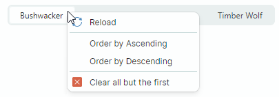

# Всплывающие и контекстные меню

Библиотека панелей инструментов и меню содержит компонент `PopupMenu`, который позволяет создавать всплывающие и контекстные меню для контролов.

## Контекстные меню

Чтобы задать контекстное меню, установите присоединённое свойство `ToolbarManager.ContextPopup` целевого контрола в объект `PopupMenu`.



Вы можете добавлять в контекстное меню все типы [элементов панели инструментов](toolbar-items.md). Определяйте элементы между открывающим и закрывающим тегами `<PopupMenu>` в XAML или добавляйте элементы в коллекцию `PopupMenu.Items` в code-behind.

``` xml
xmlns:mxb="https://schemas.eremexcontrols.net/avalonia/bars"

<TextBox x:Name="textBox"  Text="Text Editor" AcceptsReturn="True" 
 CornerRadius="0" FontFamily="Arial" FontSize="20" Height="200">
    <mxb:ToolbarManager.ContextPopup>
        <mxb:PopupMenu ShowIconStrip="True">
            <mxb:ToolbarButtonItem Header="Undo" HotKeyDisplayString="Ctrl+Z" 
             Command="{Binding $parent[TextBox].Undo}" 
             IsEnabled="{Binding $parent[TextBox].CanUndo}"
             Glyph="{SvgImage 'avares://bars_sample/Images/Toolbars/EditUndo.svg'}"/>
            <mxb:ToolbarButtonItem Header="Redo" HotKeyDisplayString="Ctrl+Y"  
             Command="{Binding $parent[TextBox].Redo}" 
             IsEnabled="{Binding $parent[TextBox].CanRedo}"
             Glyph="{SvgImage 'avares://bars_sample/Images/Toolbars/EditRedo.svg'}"/>
            <mxb:ToolbarSeparatorItem/>
            <mxb:ToolbarButtonItem Header="Clear" 
             Command="{Binding $parent[TextBox].Clear}" HotKey="Ctrl+Q"
             Glyph="{SvgImage 'avares://bars_sample/Images/Toolbars/EditDelete.svg'}"/>
        </mxb:PopupMenu>
    </mxb:ToolbarManager.ContextPopup>
</TextBox>
```

## Основные свойства и события всплывающего меню

- `ShowIconStrip` — возвращает или задаёт, отображать ли вертикальную полосу значков для элементов меню.
- `Header` — позволяет задать заголовок меню.
- `ShowHeader` — возвращает или задаёт, виден ли заголовок меню.
- `ContentRightIndent` — задаёт ширину пустого пространства справа от текста элементов меню.

**События**

- `Opening` — возникает, когда меню собирается отобразиться. Это событие позволяет отменить отображение меню.
- `Opened` — возникает после отображения меню.
- `Closing` — возникает, когда меню собирается закрыться. Это событие позволяет отменить закрытие меню.
- `Closed` — возникает после закрытия меню.

## Пример - Как назначить контекстные меню контролам определённого типа

Вы можете определить меню в коллекции `Styles`, если вам нужно задать одно контекстное меню для нескольких контролов одного типа. Следующий пример устанавливает присоединённое свойство `ToolbarManager.ContextPopup` для контролов `TextBox`, находящихся внутри UserControl.


``` xml
xmlns:mxb="https://schemas.eremexcontrols.net/avalonia/bars"

<UserControl.Styles>
    <Style Selector="TextBox">
        <Setter Property="mxb:ToolbarManager.ContextPopup">
            <Setter.Value>
                <Template>
                    <mxb:PopupMenu Focusable="False">
                        <mxb:ToolbarButtonItem Header="Cut" HotKeyDisplayString="Ctrl+X" 
                         Command="{Binding $parent[TextBox].Cut}" 
                         IsEnabled="{Binding $parent[TextBox].CanCut}"
                         Glyph="{SvgImage 
                         'avares://DemoCenter/Images/Group=Context Menu, Icon=Cut.svg'}"/>
                        <mxb:ToolbarButtonItem Header="Copy" HotKeyDisplayString="Ctrl+C" 
                         Command="{Binding $parent[TextBox].Copy}" 
                         IsEnabled="{Binding $parent[TextBox].CanCopy}"
                         Glyph="{SvgImage 
                         'avares://DemoCenter/Images/Group=Context Menu, Icon=Copy.svg'}"/>
                        <mxb:ToolbarButtonItem Header="Paste" HotKeyDisplayString="Ctrl+V" 
                         Command="{Binding $parent[TextBox].Paste}" 
                         IsEnabled="{Binding $parent[TextBox].CanPaste}"
                         Glyph="{SvgImage 
                         'avares://DemoCenter/Images/Group=Context Menu, Icon=Paste.svg'}"/>
                        <mxb:ToolbarSeparatorItem/>
                        <mxb:ToolbarButtonItem Header="Undo" HotKeyDisplayString="Ctrl+Z" 
                         Command="{Binding $parent[TextBox].Undo}" 
                         IsEnabled="{Binding $parent[TextBox].CanUndo}"
                         Glyph="{SvgImage 
                         'avares://DemoCenter/Images/Group=Basic, Icon=Undo.svg'}"/>
                        <mxb:ToolbarButtonItem Header="Redo" HotKeyDisplayString="Ctrl+Y" 
                         Command="{Binding $parent[TextBox].Redo}" 
                         IsEnabled="{Binding $parent[TextBox].CanRedo}"
                         Glyph="{SvgImage 
                         'avares://DemoCenter/Images/Group=Basic, Icon=Redo.svg'}"/>
                        <mxb:ToolbarSeparatorItem/>
                        <mxb:ToolbarButtonItem Header="Select All" HotKeyDisplayString="Ctrl+A" 
                         Command="{Binding $parent[TextBox].SelectAll}"/>
                        <mxb:ToolbarButtonItem Header="Clear" 
                         Command="{Binding $parent[TextBox].Clear}"
                         Glyph="{SvgImage 
                         'avares://DemoCenter/Images/Group=Context Menu, Icon=Delete.svg'}"/>
                    </mxb:PopupMenu>
                </Template>
            </Setter.Value>
        </Setter>
    </Style>
</UserControl.Styles>
```


<br>
<br>

<sup>*</sup> Эта страница переведена с использованием технологий машинного перевода.
