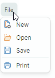
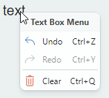

# Элементы панели инструментов

Элементы панели используются для отображения кнопок, кнопок-флажков, текстовых надписей, подменю и встроенных редакторов на панелях инструментов и в меню. Вы можете добавлять любое число элементов на каждую панель/в меню и создавать несколько уровней иерархии с помощью подменю.


## Добавление элементов панели в панель и контекстное меню

Используйте коллекции `Toolbar.Items` и `PopupMenu.Items`, чтобы заполнять панели и меню элементами. В XAML вы можете определять элементы непосредственно между открывающим и закрывающим тегами `<Toolbar>`/`<PopupMenu>`.

Следующий пример отображает три элемента в панели.

``` xml
xmlns:mxb="https://schemas.eremexcontrols.net/avalonia/bars"

<mxb:Toolbar x:Name="EditToolbar" ToolbarName="Edit" ShowCustomizationButton="False">
    <mxb:ToolbarButtonItem Header="Cut" Command="{Binding #textBox.Cut}" 
     IsEnabled="{Binding #textBox.CanCut}" 
     Glyph="{SvgImage 'avares://DemoCenter/Images/Group=Context Menu, Icon=Cut.svg'}" 
     Category="Edit"/>
    <mxb:ToolbarButtonItem Header="Copy" Command="{Binding #textBox.Copy}" 
     IsEnabled="{Binding #textBox.CanCopy}" 
     Glyph="{SvgImage 'avares://DemoCenter/Images/Group=Context Menu, Icon=Copy.svg'}" 
     Category="Edit"/>
    <mxb:ToolbarButtonItem Header="Paste" Command="{Binding #textBox.Paste}" 
     IsEnabled="{Binding #textBox.CanPaste}" 
     Glyph="{SvgImage 'avares://DemoCenter/Images/Group=Context Menu, Icon=Paste.svg'}" 
     Category="Edit"/>
</mxb:Toolbar>
```
## Типы элементов панели инструментов

Библиотека панелей поддерживает несколько типов элементов. Все они являются потомками класса `ToolbarItem`, содержащего настройки, общие для всех элементов панели.

### Общие свойства элементов панели инструментов

- `Alignment` — выравнивание элемента внутри панели.
- `Category` — категория, к которой относится элемент. Категории используются для организации элементов в логические группы в окне настройки. Дополнительную информацию смотрите в следующем разделе: [Категории элементов панели инструментов](#категории-элементов-панели-инструментов).
- `Command` — команда, выполняемая при щелчке по кнопке.
- `CommandParameter` — параметр команды, передаваемый заданной команде.
- `DisplayMode` — возвращает или задаёт, отображать ли только глиф, только заголовок или оба.
- `Glyph` — изображение элемента.
- `GlyphAlignment` — выравнивание глифа относительно заголовка элемента.
- `GlyphSize` — размер отображения глифа.
- `Header` — отображаемый текст элемента.
- `ShowSeparator` — возвращает или задаёт, отображать ли разделитель перед элементом. Вы также можете использовать элемент `ToolbarSeparatorItem`, чтобы вставить разделитель.

**События**

- `Click` — возникает при щелчке левой кнопкой мыши по элементу (после нажатия и отпускания левой кнопки мыши).
- `Press` — возникает при нажатии любой кнопки мыши над элементом.

### Обычные кнопки и кнопки с выпадающим списком (ToolbarButtonItem)

Используйте `ToolbarButtonItem` для создания обычных кнопок. Щелчок по обычной кнопке вызывает связанную команду (`Command`) и события (`Click` и `Press`). 


``` xml
xmlns:mxb="https://schemas.eremexcontrols.net/avalonia/bars"

<mxb:ToolbarButtonItem Header="Open" 
 Glyph="{SvgImage 'avares://bars_sample/Images/Toolbars/FileOpen.svg'}" 
 Category="File" Command="{Binding OpenFileCommand}"/>
```

Вы можете связать выпадающий контрол или меню с объектом `ToolbarButtonItem`. В этом случае `ToolbarButtonItem` может действовать как кнопка с выпадающим списком, вызывая заданный выпадающий контрол/меню при щелчке по элементу или по встроенной стрелке вниз.


``` xml
xmlns:mxb="https://schemas.eremexcontrols.net/avalonia/bars"

<mxb:ToolbarButtonItem Header="Paste"
                       Command="{Binding #textBox.Paste}"
                       IsEnabled="{Binding #textBox.CanPaste}"
                       Glyph="{SvgImage 'avares://bars_sample/Images/Toolbars/EditPaste.svg'}"
                       Category="Edit"
                       DropDownArrowVisibility="ShowArrow" DropDownArrowAlignment="Default"
                       >
    <mxb:ToolbarButtonItem.DropDownControl>
        <mxb:PopupMenu>
            <mxb:ToolbarButtonItem Header="Paste" Command="{Binding #textBox.Paste}" 
             IsEnabled="{Binding #textBox.CanPaste}"/>
            <mxb:ToolbarButtonItem Header="Paste As" Command="{Binding PasteAsCommand}" 
             IsEnabled="{Binding #textBox.CanPaste}"/>
        </mxb:PopupMenu>
    </mxb:ToolbarButtonItem.DropDownControl>
</mxb:ToolbarButtonItem>
```

#### Основные свойства ToolbarButtonItem

- `DropDownControl` — возвращает или задаёт выпадающий контрол (объект `Eremex.AvaloniaUI.Controls.Bars.IPopup`), связанный с элементом. Контрол всплывает, когда пользователь щёлкает по элементу или по встроенной кнопке-стрелке вниз (см. `DropDownArrowVisibility`). Следующие объекты реализуют интерфейс `Eremex.AvaloniaUI.Controls.Bars.IPopup` и потому могут отображаться как выпадающие контролы:

    - `Eremex.AvaloniaUI.Controls.Bars.PopupMenu` — [всплывающее меню](../toolbars-and-menus/popup-and-context-menus.md). Вы можете добавлять в меню все типы элементов панели, чтобы заполнить его содержимым.
    - `Eremex.AvaloniaUI.Controls.Bars.PopupContainer` — контейнер контролов. Используйте `PopupContainer`, чтобы отображать пользовательские контролы в выпадающем списке.
    
- `DropDownArrowVisibility` — возвращает или задаёт, отображает ли элемент стрелку выпадающего списка, используемую для вызова связанного выпадающего контрола. 

    

    - `ShowArrow` — стрелка выпадающего списка видима. Элемент и стрелка действуют как единая кнопка. Щелчок по ним отображает связанный выпадающий контрол.

    - `ShowSplitArrow` или `Default` — стрелка выпадающего списка видима. Она действует как отдельная кнопка, встроенная в элемент. Щелчок по элементу вызывает его команду (`Command`) и события (`Click` и `Press`). 

    - `Hide` — стрелка выпадающего списка скрыта. Щелчок по элементу вызывает выпадающий контрол.

- `DropDownArrowAlignment` — возвращает или задаёт положение стрелки выпадающего списка.
- `DropDownOpenMode` — возвращает или задаёт, вызывается ли выпадающий контрол и когда, при взаимодействии пользователя с элементом/стрелкой выпадающего списка. Поддерживаемые опции:
    - `Press` или `Default` — выпадающий список отображается по событию нажатия мыши.
    - `Click` — выпадающий список отображается после нажатия и отпускания мыши над элементом.
    - `Never` — выпадающий список не отображается.
- `DropDownPress` — событие, возникающее при нажатии стрелки выпадающего списка.

Смотрите также: [Общие свойства элементов панели инструментов](#общие-свойства-элементов-панели-инструментов).

### Кнопки-флажки (ToolbarCheckItem)

`ToolbarCheckItem` инкапсулирует кнопку-флажок, поддерживающую два состояния — обычное и нажатое. 


``` xml
xmlns:mxb="https://schemas.eremexcontrols.net/avalonia/bars"

<mxb:ToolbarCheckItem Header="Bold" 
 IsChecked="{Binding #textBox.FontWeight, 
  Converter={helpers:BoolToFontWeightConverter}, Mode=TwoWay}" 
 Glyph="{SvgImage 'avares://DemoCenter/Images/FontBold.svg'}" Category="Font"/>
```

#### Основные свойства и события кнопки-флажка

- `IsChecked` — возвращает или задаёт состояние нажатия кнопки.
- `CheckedChanged` — событие, возникающее при изменении состояния нажатия.

- `CheckBoxStyle` — возвращает или задаёт режим отображения объекта `ToolbarCheckItem`. Доступные опции:

  - `CheckBoxStyle.CheckButton` — элемент отрисовывается как кнопка-флажок. Когда `IsChecked` равно `true`, кнопка отображается в нажатом состоянии.

    

  - `CheckBoxStyle.CheckBox` — элемент отображает переключаемый флажок перед своим текстом и глифом. Когда `IsChecked` равно `true`, флажок имеет отметку.

    
    
  - `CheckBoxStyle.RadioButton` — элемент отображает радиокнопку перед своим текстом и глифом. Когда `IsChecked` равно `true`, радиокнопка отрисовывается как заполненный круг.

    Вы можете применить стиль RadioButton к объектам `ToolbarCheckItem`, объединённым в группу флажков (`ToolbarCheckItemGroup`). В этом случае группа выглядит как обычная радиогруппа.

    ``` xml
    <mxb:ToolbarCheckItemGroup CheckType="Radio">
        <mxb:ToolbarCheckItem Header="E-mail" CheckBoxStyle="RadioButton" />
        <mxb:ToolbarCheckItem Header="Phone" CheckBoxStyle="RadioButton" />
    </mxb:ToolbarCheckItemGroup>
    ```
    
    

- `CheckBoxAlignment` — возвращает или задаёт, отображаются ли флажок (или радиокнопка) до или после глифа и текста элемента. Эта опция действует, когда свойство `CheckBoxStyle` установлено в `CheckBoxStyle.CheckBox` или `CheckBoxStyle.RadioButton`.

    ```xml
    <mxb:ToolbarCheckItem Header="Status bar" CheckBoxAlignment="After"
                        CheckBoxStyle="CheckBox"
                        Hint="Show and hide the status bar"/>
    <mxb:ToolbarSeparatorItem/>
    ```
    
    

Смотрите также: [Общие свойства элементов панели инструментов](#общие-свойства-элементов-панели-инструментов).

### Подменю (ToolbarMenuItem)

`ToolbarMenuItem` — это элемент, отображающий подменю при щелчке. 



Чтобы задать содержимое подменю, определите элементы между открывающим и закрывающим тегами `<ToolbarMenuItem>` в XAML или добавьте элементы в коллекцию `ToolbarMenuItem.Items` в code-behind.

``` xml
xmlns:mxb="https://schemas.eremexcontrols.net/avalonia/bars"

<mxb:ToolbarMenuItem Header="File" Category="File">
    <mxb:ToolbarButtonItem Header="New" 
     Glyph="{SvgImage 'avares://DemoCenter/Images/Group=Context Menu, Icon=NewDraftAction.svg'}" 
     Category="File" Command="{Binding NewFileCommand}"/>
    <mxb:ToolbarButtonItem Header="Open" 
     Glyph="{SvgImage 'avares://DemoCenter/Images/Group=Basic, Icon=Folder Open.svg'}" 
     Category="File" Command="{Binding OpenFileCommand}"/>
    <mxb:ToolbarButtonItem Header="Save" 
     Glyph="{SvgImage 'avares://DemoCenter/Images/Group=Basic, Icon=Save.svg'}" 
     Category="File" Command="{Binding SaveFileCommand}"/>
    <mxb:ToolbarButtonItem Header="Print" 
     Glyph="{SvgImage 'avares://DemoCenter/Images/Group=Basic, Icon=Print.svg'}" 
     ShowSeparator="True"  Category="File" Command="{Binding PrintFileCommand}"/>
</mxb:ToolbarMenuItem>
```

#### Основные свойства и события подменю

- `DropDownOpenMode` — возвращает или задаёт, вызывается ли подменю и как, при взаимодействии пользователя с элементом. Поддерживаемые опции:
    - `Press` или `Default` — меню отображается по событию нажатия мыши.
    - `Click` — меню отображается после нажатия и отпускания мыши над элементом.
    - `Never` — меню не отображается.
- `Items` — коллекция элементов, отображаемых в подменю.
- `ItemsSource` — коллекция бизнес-объектов во View Model, из которых создаются элементы подменю. Соответствующие шаблоны данных должны определять элементы панели и инициализировать их настройки из базовых бизнес-объектов.

**События**

- `Opening` — возникает, когда меню собирается отобразиться. Это событие позволяет отменить отображение меню.
- `Opened` — возникает после отображения меню.
- `Closing` — возникает, когда меню собирается закрыться. Это событие позволяет отменить закрытие меню.
- `Closed` — возникает после закрытия меню.

Смотрите также: [Общие свойства элементов панели инструментов](#общие-свойства-элементов-панели-инструментов).

### Встроенные редакторы (ToolbarEditorItem)

`ToolbarEditorItem` позволяет отображать встроенный редактор. 


Чтобы задать тип и настройки встроенного редактора, используйте свойство `ToolbarEditorItem.EditorProperties`. Вы можете установить `ToolbarEditorItem.EditorProperties` в один из следующих объектов:

- `ButtonEditorProperties` — соответствует встроенному редактору `ButtonEditor`.
- `CheckEditorProperties` — соответствует встроенному редактору `CheckEditor`.
- `ColorEditorProperties` — соответствует встроенному редактору `ColorEditor`.
- `ComboBoxEditorProperties` — соответствует встроенному редактору `ComboBoxEditor`.
- `HyperlinkEditorProperties` — соответствует встроенному редактору `HyperlinkEditor`.
- `PopupColorEditorProperties` — соответствует встроенному редактору `PopupColorEditor`.
- `PopupEditorProperties` — соответствует встроенному редактору `PopupEditor`.
- `SegmentedEditorProperties` — соответствует встроенному редактору `SegmentedEditor`.
- `SpinEditorProperties` — соответствует встроенному редактору `SpinEditor`.
- `TextEditorProperties` — соответствует встроенному редактору `TextEditor`.
- `MemoEditorProperties` — соответствует встроенному редактору `MemoEditor`.

В следующем примере объект _Font_ `ToolbarEditorItem` отображает список шрифтов с помощью встроенного редактора combobox. Свойство `ToolbarEditorItem.EditorProperties` установлено в `ComboBoxEditorProperties`, что соответствует контролу `ComboBoxEditor`.

``` xml
<mxb:ToolbarEditorItem Header="Font:" EditorWidth="150" Category="Font" 
 EditorValue="{Binding #textBox.FontFamily, Converter={helpers:FontNameToFontFamilyConverter}}">
    <mxb:ToolbarEditorItem.EditorProperties>
        <mxe:ComboBoxEditorProperties 
         ItemsSource="{Binding $parent[view:ToolbarAndMenuPageView].Fonts}"
         IsTextEditable="False" PopupMaxHeight="300"/>
    </mxb:ToolbarEditorItem.EditorProperties>
</mxb:ToolbarEditorItem>      
```

#### Основные свойства и события встроенного редактора

- `ToolbarEditorItem.EditorProperties` — возвращает или задаёт объект, определяющий тип и настройки встроенного редактора.
- `ToolbarEditorItem.EditorValue` — возвращает или задаёт значение встроенного редактора. Используйте это свойство для привязки данных.
- `ToolbarEditorItem.SizeMode` — возвращает или задаёт режим размера элемента. Это свойство позволяет растянуть элемент панели, чтобы он занял всё доступное пустое пространство в панели.
- `ToolbarEditorItem.EditorWidth` — возвращает или задаёт ширину встроенного редактора.
- `ToolbarEditorItem.EditorHeight` — возвращает или задаёт высоту встроенного редактора.
- `ToolbarEditorItem.EditorAlignment` — возвращает или задаёт выравнивание редактора относительно заголовка элемента.

- `ToolbarEditorItem.EditorValueChanged` — событие, возникающее после изменения значения редактора.

<!--TODO - `ToolbarEditorItem.Editor` -  

-->

Смотрите также: [Общие свойства элементов панели инструментов](#общие-свойства-элементов-панели-инструментов).


### Текстовые надписи (ToolbarTextItem)

`ToolbarTextItem` отображает текстовую надпись, заданную свойством `ToolbarTextItem.Header`. Используйте этот элемент для отрисовки текста, который не редактируется пользователями.


``` xml
<mxb:ToolbarTextItem 
 Header="{Binding #scaleDecorator.Scale, StringFormat={}Zoom: {0:P0}}" 
 ShowBorder="True" Alignment="Far" ShowSeparator="True" Category="Info" 
 CustomizationName="Zoom Info"/>
```

#### Основные свойства и события текстовой надписи

- `ToolbarTextItem.SizeMode` — возвращает или задаёт режим размера элемента. Это свойство позволяет растянуть элемент, чтобы он занял всё доступное пустое пространство в панели.
- `ToolbarTextItem.ShowBorder` — возвращает или задаёт, видима ли рамка элемента. Вы можете использовать свойство `ToolbarTextItem.BorderTemplate`, чтобы задать пользовательский шаблон для отрисовки рамки.
- `ToolbarTextItem.BorderTemplate` — возвращает или задаёт пользовательский шаблон для отрисовки рамки элемента. Этот шаблон действует, если включена опция `ToolbarTextItem.ShowBorder`.

Смотрите также: [Общие свойства элементов панели инструментов](#общие-свойства-элементов-панели-инструментов).

### Неразрывные группы элементов (ToolbarItemGroup)

Используйте `ToolbarItemGroup` для создания неразрывной группы элементов панели. Неразрывная группа — это контейнер элементов, действующий как единое целое при изменении размера родителя (содержимое группы не может быть частично скрыто; элементы всегда отображаются в одну линию и не поддерживают перенос).


Чтобы задать содержимое группы, определите элементы между открывающим и закрывающим тегами `<ToolbarItemGroup>` или добавьте элементы в коллекцию `ToolbarItemGroup.Items` в code-behind.

``` xml
<mxb:ToolbarItemGroup CustomizationName="Clipboard" >
    <mxb:ToolbarButtonItem Header="Cut" Command="{Binding #textBox.Cut}" 
     IsEnabled="{Binding #textBox.CanCut}" 
     Glyph="{SvgImage 'avares://DemoCenter/Images/Group=Context Menu, Icon=Cut.svg'}" 
     Category="Edit"/>
    <mxb:ToolbarButtonItem Header="Copy" Command="{Binding #textBox.Copy}" 
     IsEnabled="{Binding #textBox.CanCopy}" 
     Glyph="{SvgImage 'avares://DemoCenter/Images/Group=Context Menu, Icon=Copy.svg'}" 
     Category="Edit"/>
    <mxb:ToolbarButtonItem Header="Paste" Command="{Binding #textBox.Paste}" 
     IsEnabled="{Binding #textBox.CanPaste}" 
     Glyph="{SvgImage 'avares://DemoCenter/Images/Group=Context Menu, Icon=Paste.svg'}" 
     Category="Edit"/>
</mxb:ToolbarItemGroup>
```

#### Основные свойства и события группы

- `ToolbarItemGroup.Items` — позволяет обращаться к дочерним элементам группы.

### Неразрывные группы флажков (ToolbarCheckItemGroup)

Используйте `ToolbarCheckItemGroup` для создания неразрывной группы флажков. Неразрывная группа — это контейнер элементов, действующий как единое целое при изменении размера родителя (содержимое группы не может быть частично скрыто; элементы всегда отображаются в одну линию и не поддерживают перенос).


Контейнер `ToolbarCheckItemGroup` может управлять состоянием нажатия своих дочерних элементов ([объектов `ToolbarCheckItem`](#кнопки-флажки-toolbarcheckitem)). Вы можете использовать `ToolbarCheckItemGroup` для создания следующих типов групп:

- Группа взаимоисключающих элементов (радиогруппа).
- Группа, позволяющая отмечать несколько элементов одновременно.


Чтобы задать содержимое группы, добавьте элементы `ToolbarCheckItem` между открывающим и закрывающим тегами `<ToolbarCheckItemGroup>` в XAML или добавьте элементы в коллекцию `ToolbarCheckItemGroup.Items` в code-behind.

``` xml
<mxb:ToolbarCheckItemGroup CustomizationName="Check group" CheckType="Radio" >
    <mxb:ToolbarCheckItem Header="1" IsChecked="{Binding Option1}"  
     Category="Settings"/>
    <mxb:ToolbarCheckItem Header="2" IsChecked="{Binding Option2}" 
     Category="Settings"/>
    <mxb:ToolbarCheckItem Header="3" IsChecked="{Binding Option3}" 
     Category="Settings"/>
</mxb:ToolbarCheckItemGroup>
```

Объект `ToolbarCheckItemGroup` принимает дочерние элементы всех поддерживаемых типов элементов панели. Однако группа управляет только состояниями нажатия вложенных объектов `ToolbarCheckItem`.

#### Основные свойства и события группы флажков

- `ToolbarCheckItemGroup.CheckType` — возвращает или задаёт, можно ли отмечать один или несколько элементов в группе одновременно. Поддерживаются следующие опции:

    - `Default` или `Multiple` — можно отмечать несколько элементов одновременно.
    - `Radio` — группа взаимоисключающих элементов. Пользователь не может снять отметку с элемента иначе как отметив другой.
    - `Single` — группа взаимоисключающих элементов. Пользователь может снять отметку со всех элементов в группе.

- `ToolbarCheckItemGroup.Items` — позволяет обращаться к дочерним элементам группы.

Смотрите также: [Общие свойства элементов панели инструментов](#общие-свойства-элементов-панели-инструментов).

### Разделители (ToolbarSeparatorItem)

`ToolbarSeparatorItem` рисует разделитель.


``` xml
<mxb:ToolbarMenuItem Header="File" Category="File">
    <mxb:ToolbarButtonItem Header="New" 
     Glyph="{SvgImage 'avares://DemoCenter/Images/Group=Context Menu, Icon=NewDraftAction.svg'}" 
     Category="File"/>
    <mxb:ToolbarButtonItem Header="Open" 
     Glyph="{SvgImage 'avares://DemoCenter/Images/Group=Basic, Icon=Folder Open.svg'}" 
     Category="File"/>
    <mxb:ToolbarButtonItem Header="Save" 
     Glyph="{SvgImage 'avares://DemoCenter/Images/Group=Basic, Icon=Save.svg'}" 
     Category="File"/>
    <mxb:ToolbarSeparatorItem/>
    <mxb:ToolbarButtonItem Header="Print" 
     Glyph="{SvgImage 'avares://DemoCenter/Images/Group=Basic, Icon=Print.svg'}" 
     Category="File"/>
</mxb:ToolbarMenuItem>
```


## Категории элементов панели инструментов

Вы можете классифицировать элементы панели по категориям, чтобы включить группировку элементов в окне настройки. Пользователь может выбрать категорию в окне настройки, чтобы получить доступ к связанным элементам.


Используйте свойство `ToolbarItem.Category`, чтобы назначить элемент категории. Это свойство задаёт имя категории. Чтобы назначить группу элементов одной категории, установите их свойство `ToolbarItem.Category` в одно и то же имя категории.

``` xml
<mxb:ToolbarMenuItem Header="Edit" Category="Edit">
    <mxb:ToolbarButtonItem Header="Cut" 
     Glyph="{SvgImage 'avares://DemoCenter/Images/Group=Context Menu, Icon=Cut.svg'}" 
     Category="Edit"/>
    <mxb:ToolbarButtonItem Header="Copy" 
     Glyph="{SvgImage 'avares://DemoCenter/Images/Group=Context Menu, Icon=Copy.svg'}" 
     Category="Edit"/>
    <mxb:ToolbarButtonItem Header="Paste" 
     Glyph="{SvgImage 'avares://DemoCenter/Images/Group=Context Menu, Icon=Paste.svg'}" 
     Category="Edit"/>
    <mxb:ToolbarButtonItem Header="Select All" 
     Command="{Binding #textBox.SelectAll}" Category="Edit" ShowSeparator="True"/>
    <mxb:ToolbarButtonItem Header="Clear all" 
     Command="{Binding #textBox.Clear}" 
     Glyph="{SvgImage 'avares://DemoCenter/Images/Group=Basic, Icon=Clear.svg'}" 
     Category="Edit"/>
</mxb:ToolbarMenuItem>       
```

## Горячие клавиши

Вы можете использовать свойство `ToolbarItem.HotKey`, чтобы назначать элементам горячие клавиши. 

``` xml
<mxb:ToolbarButtonItem 
    Header="Clear" Command="{Binding #textBox.Clear}" HotKey="Ctrl+Q"
    Glyph="{SvgImage 'avares://bars_sample/Images/Toolbars/EditDelete.svg'}"/>
```

Нажатие горячей клавиши активирует команду элемента при условии, что фокус находится в пределах области действия горячих клавиш. Область действия горячих клавиш по умолчанию — область UI в границах компонента `ToolbarManager`. Когда фокус ввода находится за пределами области действия горячих клавиш, `ToolbarManager` не может перехватывать горячие клавиши.

Свойство `ToolbarManager.IsWindowManager` позволяет расширить область действия горячих клавиш на всё окно. Когда вы устанавливаете это свойство в `true`, компонент `ToolbarManager` регистрирует горячие клавиши элементов в окне. Он сможет перехватывать и обрабатывать горячие клавиши, даже если фокус находится за пределами его клиентской области.

### Отображение горячих клавиш

Горячие клавиши, назначенные элементам панели, отображаются в следующих случаях:

- В элементах, когда они находятся в подменю или всплывающих меню.
- Во всплывающих подсказках элементов.


Вы можете использовать свойство `ToolbarItem.HotKeyDisplayString`, чтобы задать текст отображения горячей клавиши. Этот текст отображается, даже если элементу не назначена горячая клавиша. Это полезно, если целевая горячая клавиша уже зарегистрирована другим объектом для выполнения определённой операции, а вы хотите указать, что та же горячая клавиша связана с элементом панели.

Например, TextBox регистрирует сочетание _Ctrl+Z_ для выполнения операции отмены. Если элемент панели выполняет ту же операцию отмены над TextBox, не назначайте элементу горячую клавишу _Ctrl+Z_. Вместо этого установите `ToolbarItem.HotKeyDisplayString` элемента в "_Ctrl+Z_", чтобы отображать это сочетание пользователям во всплывающих подсказках и подменю/всплывающих меню.

``` xml
<mxb:ToolbarButtonItem Header="Undo" HotKeyDisplayString="Ctrl+Z" 
    Command="{Binding $parent[TextBox].Undo}" 
    IsEnabled="{Binding $parent[TextBox].CanUndo}" 
    Glyph="{SvgImage 'avares://bars_sample/Images/Toolbars/EditUndo.svg'}"/>
```




<br>
<br>

<sup>*</sup> Эта страница переведена с использованием технологий машинного перевода.
