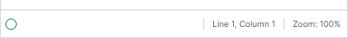
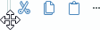

# Панели инструментов

`ToolbarManager` — это компонент, который может управлять традиционными панелями инструментов, [всплывающими и контекстными меню](popup-and-context-menus.md) и [Ribbon UI](../ribbon/index.md) в вашем приложении. Вы можете закреплять традиционные панели инструментов у краёв окна/UserControl и создавать плавающие панели. Библиотека панелей инструментов Eremex также позволяет размещать панели в любом месте вашего окна/UserControl.


Когда вы используете компонент `ToolbarManager` для реализации традиционных панелей, вам нужно создать контейнеры панелей для их закрепления. Контейнер панелей — это визуальный контейнер, используемый для отображения закреплённых панелей. Контейнеры панелей являются дочерними элементами компонента `ToolbarManager`.

## Создание панелей инструментов

Контрол `Toolbar` реализует панель инструментов. Используйте его, чтобы добавить обычную панель, главное меню и строку состояния в ваше приложение.

Выполните следующие шаги, чтобы создать панели:

- Создайте компонент `ToolbarManager`.
- Создайте контейнеры панелей.
- Создайте панели.
- Заполните панели элементами. 

### Создание ToolbarManager

Чтобы создать панели, сначала определите компонент `ToolbarManager` (потомок класса `Avalonia.Controls.Border`). Клиентский контрол, для которого создаётся интерфейс панелей, нужно поместить внутрь компонента `ToolbarManager`. Объект `ToolbarManager` определяет область, в которой функционируют панели и всплывающие меню.

``` xml
xmlns:mxb="https://schemas.eremexcontrols.net/avalonia/bars"

<mxb:ToolbarManager IsWindowManager="True">
    <Grid RowDefinitions="Auto, *, Auto" ColumnDefinitions="Auto, *, Auto">

        <TextBox x:Name="textBox" Text="Text Editor" AcceptsReturn="True" 
         CornerRadius="0" FontFamily="Arial" FontSize="20" 
         helpers:TextBoxHelper.IsEnabled="True"/>

    </Grid>
</mxb:ToolbarManager>        
```

!!! tip

    Вы можете назначать горячие клавиши элементам панели. Чтобы позволить объекту `ToolbarManager` обрабатывать эти горячие клавиши, когда фокус клавиатуры находится за пределами клиентской области `ToolbarManager`, включите опцию `ToolbarManager.IsWindowManager`. Информацию об области действия горячих клавиш элементов панели смотрите в следующем разделе: [Горячие клавиши](#область-действия-горячих-клавиш).

### Создание контейнеров панелей инструментов

Добавьте контейнеры панелей (`ToolbarContainerControl`) в компонент `ToolbarManager`, чтобы позволить закреплять панели в определённой позиции внутри окна/UserControl. Контейнер панелей задаёт область, в которой панели могут закрепляться и перетаскиваться.

Следующий пример создаёт четыре контейнера панелей у краёв контрола Grid, позволяя вам позже закреплять панели в этих позициях.

``` xml
xmlns:mxb="https://schemas.eremexcontrols.net/avalonia/bars"

<mxb:ToolbarManager IsWindowManager="True">
    <Grid RowDefinitions="Auto, *, Auto" ColumnDefinitions="Auto, *, Auto">
        <mxb:ToolbarContainerControl Grid.ColumnSpan="3" DockType="Top">
        </mxb:ToolbarContainerControl>

        <mxb:ToolbarContainerControl DockType="Left" Grid.Row="1"/>

        <TextBox x:Name="textBox" Text="Text Editor" AcceptsReturn="True" 
         CornerRadius="0" FontFamily="Arial" FontSize="20" 
         helpers:TextBoxHelper.IsEnabled="True"/>

        <mxb:ToolbarContainerControl DockType="Right" Grid.Row="1" Grid.Column="2"/>

        <mxb:ToolbarContainerControl Grid.Row="2" Grid.ColumnSpan="3" DockType="Bottom">
        </mxb:ToolbarContainerControl>
    </Grid>
</mxb:ToolbarManager>        
```
Инициализируйте свойство `ToolbarContainerControl.DockType` для созданных контейнеров, чтобы задать, как они закрепляются. Тип закрепления контейнера определяет выравнивание вложенных панелей по умолчанию и настройки внешнего вида, применяемые к контейнеру. Доступные типы закрепления:

- `Left`, `Right`, `Top`, `Bottom` — контейнер закрепляется у соответствующей стороны родительского контрола. Контейнеры с этими типами закрепления рисуют линии рамки, отделяющие их от остальной клиентской области. Например, контейнер, закреплённый сверху, рисует линию рамки снизу.
- `Standalone` — этот режим следует применять к [автономным контейнерам панелей](#автономные-панели-инструментов). Автономный контейнер панелей предназначен для отображения панелей в произвольной позиции внутри окна/UserControl. Автономные контейнеры панелей не имеют рамок.

Вы можете определить пустой `ToolbarContainerControl`, чтобы позволить добавить панель в этот контейнер позже (пользователем или в коде).

### Добавление панелей инструментов
Добавляйте контролы `Toolbar` в контейнеры панелей, чтобы закреплять панели в соответствующих позициях.

``` xml
xmlns:mxb="https://schemas.eremexcontrols.net/avalonia/bars"

<mxb:ToolbarContainerControl Grid.ColumnSpan="3" DockType="Top">
    <mxb:Toolbar x:Name="MainMenu" ToolbarName="Main Menu" DisplayMode="MainMenu">
    </mxb:Toolbar>

    <mxb:Toolbar x:Name="EditToolbar" ToolbarName="Edit" ShowCustomizationButton="False">
    </mxb:Toolbar>
</mxb:ToolbarContainerControl>        

<mxb:ToolbarContainerControl Grid.Row="2" Grid.ColumnSpan="3" DockType="Bottom">
    <mxb:Toolbar DisplayMode="StatusBar" ToolbarName="Status Bar" x:Name="StatusBar">
    </mxb:Toolbar>
</mxb:ToolbarContainerControl>
```


Дополнительную информацию смотрите в следующих разделах:

- [Плавающие панели инструментов](#плавающие-панели-инструментов)
- [Автономные панели инструментов](#автономные-панели-инструментов)

### Добавление элементов панелей инструментов

Панели могут отображать различные типы элементов, продемонстрированные ниже:

- `ToolbarButtonItem` — элемент, который может действовать как обычная кнопка или кнопка с выпадающим списком (если связать с ним выпадающий контрол/меню).
- `ToolbarCheckItem` — кнопка-флажок.
- `ToolbarMenuItem` — элемент, отображающий подменю.
- `ToolbarEditorItem` — элемент, отображающий встроенный редактор.
- `ToolbarTextItem` — текстовая надпись.
- `ToolbarItemGroup` — группа элементов панели.
- `ToolbarCheckItemGroup` — группа кнопок-флажков. Используйте её для создания группы взаимоисключающих флажков или группы, поддерживающей выбор нескольких элементов одновременно.
- `ToolbarSeparatorItem` — рисует разделитель между соседними элементами.

Чтобы добавить элементы панели, определите их как дочерние элементы контрола `Toolbar` в XAML или добавьте их в коллекцию `Toolbar.Items` в code-behind.

``` xml
xmlns:mxb="https://schemas.eremexcontrols.net/avalonia/bars"

<mxb:Toolbar x:Name="EditToolbar" ToolbarName="Edit" ShowCustomizationButton="False">
    <mxb:ToolbarButtonItem Header="Cut" Command="{Binding #textBox.Cut}" 
     IsEnabled="{Binding #textBox.CanCut}" 
     Glyph="{SvgImage 'avares://DemoCenter/Images/Group=Context Menu, Icon=Cut.svg'}" 
     Category="Edit"/>
    <mxb:ToolbarButtonItem Header="Copy" Command="{Binding #textBox.Copy}" 
     IsEnabled="{Binding #textBox.CanCopy}" 
     Glyph="{SvgImage 'avares://DemoCenter/Images/Group=Context Menu, Icon=Copy.svg'}" 
     Category="Edit"/>
    <mxb:ToolbarButtonItem Header="Paste" Command="{Binding #textBox.Paste}" 
     IsEnabled="{Binding #textBox.CanPaste}" 
     Glyph="{SvgImage 'avares://DemoCenter/Images/Group=Context Menu, Icon=Paste.svg'}" 
     Category="Edit"/>
</mxb:Toolbar>
```

Дополнительную информацию смотрите в разделе [Элементы панели инструментов](toolbar-items.md).

## Выбор типа панели — обычная панель, главное меню или строка состояния

Свойство `Toolbar.DisplayMode` позволяет задать тип панели.

### Обычные панели инструментов

Объекты `Toolbar` отрисовываются как обычные панели, если свойство `Toolbar.DisplayMode` не задано или установлено в `ToolbarDisplayMode.Default`.


Обычные панели имеют маркеры перетаскивания, используемые для переупорядочивания панелей с помощью перетаскивания.

### Главное меню

Установите `Toolbar.DisplayMode` в `ToolbarDisplayMode.MainMenu`, чтобы отобразить панель как главное меню. 


Возможности главного меню включают:

- Пользователь не может скрыть его во время работы. 
- Главное меню получает фокус, когда пользователь нажимает клавишу ALT.
- Главное меню растягивается по горизонтали, чтобы заполнить ширину контейнера.
- Главное меню не поддерживает многострочное расположение элементов, плавающий режим и операции перетаскивания.

### Строка состояния

Установите `Toolbar.DisplayMode` в `ToolbarDisplayMode.StatusBar`, чтобы отрисовать панель как строку состояния приложения. 



Возможности строки состояния включают:

- Пользователь не может скрыть её во время работы. 
- Строка состояния растягивается по горизонтали, чтобы заполнить ширину контейнера.
- Строка состояния не поддерживает многострочное расположение элементов, плавающий режим и операции перетаскивания.

Следующий пример создаёт строку состояния с двумя элементами. Строка состояния размещена в контейнере панелей, отображаемом внизу родительского контрола Grid.

``` xml
xmlns:mxb="https://schemas.eremexcontrols.net/avalonia/bars"

<mxb:ToolbarContainerControl Grid.Row="2" Grid.ColumnSpan="3" DockType="Bottom">
    <mxb:Toolbar DisplayMode="StatusBar" ToolbarName="Status Bar" x:Name="StatusBar" 
     ShowCustomizationButton="False">
        <mxb:ToolbarTextItem Alignment="Far" ShowSeparator="True" ShowBorder="False" 
         Category="Info" CustomizationName="Position Info">
            <mxb:ToolbarTextItem.Header>
                <MultiBinding Converter="{helpers:LineAndColumnToTextConverter}">
                    <Binding ElementName="textBox" Path="(helpers:TextBoxHelper.Line)"/>
                    <Binding ElementName="textBox" Path="(helpers:TextBoxHelper.Column)"/>
                </MultiBinding>
            </mxb:ToolbarTextItem.Header>
        </mxb:ToolbarTextItem>
        <mxb:ToolbarTextItem 
         Header="{Binding #scaleDecorator.Scale, StringFormat={}Zoom: {0:P0}}" 
         ShowBorder="False" Alignment="Far" ShowSeparator="True" Category="Info" 
         CustomizationName="Zoom Info"/>
    </mxb:Toolbar>
</mxb:ToolbarContainerControl>
```

## Размещение и позиция панелей инструментов

Когда панели находятся внутри контейнеров, они выравниваются в соответствии с типом закрепления контейнера (настройка `ToolbarContainerControl.DockType`):

- Панели ориентированы горизонтально, если свойство `ToolbarContainerControl.DockType` установлено в `Top`, `Bottom` или `Standalone`.
- Панели ориентированы вертикально, если свойство `ToolbarContainerControl.DockType` установлено в `Left` или `Right`.

Объект `Toolbar` имеет собственную настройку типа закрепления, заданную свойством `Toolbar.DockType`. Вы можете использовать свойство `Toolbar.DockType`, чтобы переместить панель в конкретный контейнер в code-behind. Когда вы устанавливаете свойство `Toolbar.DockType` в `Left`, `Right`, `Top` или `Bottom`, панель перемещается в контейнер, у которого опция `ToolbarContainerControl.DockType` установлена в соответствующее значение.

Панели могут располагаться в несколько строк внутри своего родительского контейнера. Вы можете использовать следующие свойства, чтобы отобразить панель в определённой строке и переместить панель внутри строки:

- `Toolbar.Row` — возвращает или задаёт индекс (начиная с нуля) строки, в которой отображается панель. Индексы строк начинаются с `0`. Свойство действует только для обычных панелей. Изменить индекс строки для главного меню невозможно, как и разместить обычную панель перед главным меню.
- `Toolbar.Column` — возвращает или задаёт порядковый номер (начиная с нуля) панели в строке.
- `Toolbar.Position` — возвращает или задаёт минимальное смещение панели внутри строки.


## Размещение элементов на панелях инструментов

### Адаптивное размещение

Панели автоматически скрывают и восстанавливают свои элементы при изменении размера родительского контейнера.
Отключите опцию `Toolbar.AllowShrinkToolbar`, чтобы предотвратить сворачивание конкретной панели при уменьшении размера контейнера.

### Растягивание панели инструментов

Панель можно растянуть, чтобы заполнить ширину контейнера. Установите опцию `Toolbar.StretchToolbar` в `true`, чтобы включить растягивание панели. В этом режиме никакая другая панель не может отображаться в той же строке.

Главное меню и строка состояния всегда занимают целые строки. Опция `Toolbar.StretchToolbar` не действует для этих панелей.

### Расположение элементов в несколько рядов

Панель может отображать свои элементы в несколько строк, когда ширины родительского контейнера недостаточно для отображения элементов в одну строку. Установите свойство `Toolbar.WrapItems` в `true`, чтобы включить многострочную компоновку.


## Плавающие панели инструментов

Чтобы создать плавающую панель в XAML, добавьте объект `Toolbar` в коллекцию `ToolbarManager.Toolbars` и установите свойство `Toolbar.DockType` в `Floating`. Используйте свойство `Toolbar.FloatingPosition`, чтобы задать местоположение плавающей панели.

``` xml
xmlns:mxb="https://schemas.eremexcontrols.net/avalonia/bars"

<mxb:ToolbarManager.Toolbars>
    <mxb:Toolbar x:Name="bar1" DockType="Floating" FloatingPosition="200,200" 
                        ToolbarName="Toolbar 1"  >
        <mxb:ToolbarButtonItem Header="Script" 
         Glyph="{SvgImage 'avares://DemoCenter/Images/Group=Script, Icon=CSharpFile.svg'}" 
         Category="UserCommands"/>
        <mxb:ToolbarButtonItem Header="Settings" 
         Glyph="{SvgImage 'avares://DemoCenter/Images/Group=Basic, Icon=List of Bugs.svg'}" 
         Category="UserCommands"/>
    </mxb:Toolbar>
</mxb:ToolbarManager.Toolbars>
```

Следующий фрагмент показывает, как сделать панель плавающей в code-behind.

``` csharp
toolBar1.DockType = Eremex.AvaloniaUI.Controls.Bars.MxToolbarDockType.Floating;
toolBar1.FloatingPosition = new PixelPoint(200, 200);
```

## Настройка панели инструментов во время выполнения 

### Изменение порядка панелей инструментов

Если опция `Toolbar.AllowDragToolbar` включена, панель отображает маркер перетаскивания. Пользователь может нажать эту кнопку и перетащить панель в другую позицию или сделать панель плавающей.



### Перестановка элементов с помощью быстрой настройки

Пользователи могут переупорядочивать элементы панели без активации режима настройки. Им нужно нажать клавишу ALT, а затем перетащить элемент в нужную позицию. Вместо клавиши ALT нажмите сочетание CTRL+ALT, чтобы скопировать перетаскиваемый элемент.

### Режим настройки и окно настройки

Панели поддерживают режим настройки, в котором пользователи могут выполнять следующие операции:

- Обращаться к видимым и скрытым панелям, показывать и скрывать их.
- Обращаться ко всем элементам и управлять их видимостью и позицией в панелях с помощью перетаскивания.
- Создавать и удалять пользовательские панели.

Чтобы активировать режим настройки панелей, пользователь может щёлкнуть по кнопке настройки панели («...») и выбрать команду «Customize». Активация режима настройки отображает окно настройки:


!!! tip

    Включите опцию `Toolbar.ShowCustomizationButton`, чтобы отобразить кнопку настройки («...») в панели.

    Вызовите метод `ToolbarManager.ShowCustomizationWindow`, чтобы активировать режим настройки и отобразить окно настройки в коде.

В режиме настройки пользователь может использовать перетаскивание, чтобы скрывать, показывать и перемещать элементы панели:

- Перетаскивайте элементы из панелей/подменю на вкладку «Commands» окна настройки, чтобы скрыть эти элементы.
- Перетаскивайте элементы со вкладки «Commands» окна настройки в панели/подменю, чтобы отобразить эти элементы.
- Перетаскивайте элементы между панелями и подменю, чтобы переупорядочить их.

Окно настройки также позволяет пользователю скрывать/показывать панели и создавать пользовательские. Дополнительную информацию смотрите в следующем разделе: [Пользовательские панели инструментов](#пользовательские-панели-инструментов).


## Опции настройки панелей инструментов

Панели содержат следующие опции, позволяющие настраивать их отображение и поведение:

- `Toolbar.ToolbarName` — возвращает или задаёт заголовок панели. Заголовок панели отображается в окне настройки и когда панель находится в плавающем состоянии.
- `Toolbar.AllowDragToolbar` — возвращает или задаёт, отображает ли панель маркер перетаскивания. Эта кнопка позволяет пользователю перетащить панель в другую позицию закрепления или сделать её плавающей.
- `Toolbar.ShowCustomizationButton` — возвращает или задаёт, отображает ли панель кнопку настройки («...»). Щелчок по этой кнопке вызывает меню, позволяющее пользователю вызвать окно настройки.


## Автономные панели инструментов

Вы можете отображать панели в любой позиции внутри вашего окна/UserControl. Для этого создайте `ToolbarContainerControl` в этой позиции и добавьте в него панели.

Установите свойство `ToolbarContainerControl.DockType` в `Standalone`. Этот тип закрепления применяет настройки внешнего вида, специфичные для автономных контейнеров панелей. Например, автономные контейнеры не имеют рамок в светлой и тёмной темах Eremex.

Ориентация панелей внутри автономных контейнеров по умолчанию горизонтальная. Вы можете использовать свойство `ToolbarContainerControl.Orientation`, чтобы выровнять автономные панели вертикально.

Следующий пример отображает автономную панель между двумя текстовыми полями. Панель содержит команды, выполняющие действия над вторым текстовым полем.


``` xml
xmlns:mxb="https://schemas.eremexcontrols.net/avalonia/bars"

<StackPanel Grid.Row="1" Grid.Column="1">
    <TextBox x:Name="textBox" Text="Text Editor 1" AcceptsReturn="True" 
    FontSize="14" Height="70"/>
                
    <mxb:ToolbarContainerControl DockType="Standalone" Orientation="Horizontal"  >
        <mxb:Toolbar x:Name="EditToolbar2" ToolbarName="Edit (textBox2)" 
         AllowDragToolbar="False" ShowCustomizationButton="False" >
            <mxb:ToolbarCheckItemGroup>
                <mxb:ToolbarCheckItem Header="Bold" 
                 IsChecked="{Binding #textBox2.FontWeight, 
                  Converter={local:BoolToFontWeightConverter}, Mode=TwoWay}" 
                 Glyph="{SvgImage 'avares://bars_sample/Images/Toolbars/FontBold.svg'}" Category="Font"/>
                <mxb:ToolbarCheckItem Header="Italic" 
                 IsChecked="{Binding #textBox2.FontStyle, 
                  Converter={local:BoolToFontStyleConverter}, Mode=TwoWay}" 
                 Glyph="{SvgImage 'avares://bars_sample/Images/Toolbars/FontItalic.svg'}" Category="Font"/>
            </mxb:ToolbarCheckItemGroup>
            <mxb:ToolbarButtonItem Header="Copy" Command="{Binding #textBox2.Copy}" 
             IsEnabled="{Binding #textBox2.CanCopy}" 
             Glyph="{SvgImage 'avares://bars_sample/Images/Toolbars/EditCopy.svg'}" Category="Edit"/>
            <mxb:ToolbarButtonItem Header="Paste"
                                    Command="{Binding #textBox2.Paste}"
                                    IsEnabled="{Binding #textBox2.CanPaste}"
                                    Glyph="{SvgImage 'avares://bars_sample/Images/Toolbars/EditPaste.svg'}"
                                    Category="Edit"
                                />
        </mxb:Toolbar>
    </mxb:ToolbarContainerControl>
    <TextBox x:Name="textBox2" Text="Text Editor 2" AcceptsReturn="True" FontSize="14" Height="70"/>
</StackPanel>
```

## Пользовательские панели инструментов

Пользователь может создавать панели в окне настройки во время работы. Такие панели называются «пользовательскими» и имеют опцию `Toolbar.UserToolbar`, установленную в `true`. 


В отличие от других панелей, пользовательские панели можно переименовывать и удалять в окне настройки.

При необходимости вы можете вручную установить свойство `Toolbar.UserToolbar` в `true`, чтобы создать пользовательскую панель в коде. Пользователи также могут переименовывать и удалять эту панель в окне настройки.

После создания пользовательской панели пользователь может заполнить её командами с помощью перетаскивания.

## Область действия горячих клавиш

Свойство `ToolbarItem.HotKey` позволяет назначать элементам горячие клавиши. Компонент `ToolbarManager` может перехватывать горячие клавиши, если фокус находится в пределах области их действия.

Область действия горячих клавиш по умолчанию — клиентская область `ToolbarManager`. Установите свойство `ToolbarManager.IsWindowManager` в `true`, чтобы расширить область действия горячих клавиш на всё окно. В этом случае компонент `ToolbarManager` регистрирует горячие клавиши элементов в окне. Он сможет перехватывать и обрабатывать горячие клавиши, даже если фокус находится за пределами его клиентской области.

Дополнительную информацию смотрите в следующем разделе: [Горячие клавиши элементов панели инструментов](toolbar-items.md#горячие-клавиши).


<br>
<br>

<sup>*</sup> Эта страница переведена с использованием технологий машинного перевода.
