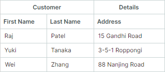

# Группы

Вы можете использовать группы, чтобы визуально объединять колонки. `TreeListControl` отображает группы как дополнительные заголовки над заголовками колонок. Как заголовки групп, так и заголовки колонок могут содержать текст, изображения или пользовательское содержимое. Вы также можете создавать иерархические группы с неограниченным количеством уровней вложенности.

Следующее изображение демонстрирует контрол TreeList с четырьмя группами: 'Employee', 'Details', 'Contact' и 'Address':


Следующие подходы позволяют создавать группы колонок:

- [Создание групп вручную](#создание-групп-вручную)
- [Создание групп из источника групп](#создание-групп-из-источника-групп)
- [Создание групп на основе атрибутов DataAnnotation (для автоматически создаваемых колонок)](#создание-групп-на-основе-атрибутов-dataannotation-для-автоматически-создаваемых-колонок)


## Создание групп вручную

Выполните следующие шаги, чтобы вручную создать группы:

1. Создайте объекты групп (экземпляры класса `TreeListBand`) и добавьте их в коллекцию `TreeListControl.Bands`.

    Присвойте созданным группам уникальные имена с помощью свойства `TreeListBand.BandName`.

    ``` xml
    <mxtl:TreeListControl.Bands>
        <mxtl:TreeListBand BandName="Employee" HeaderHorizontalAlignment="Center"/>
        <mxtl:TreeListBand BandName="Details" HeaderHorizontalAlignment="Center"/>
    </mxtl:TreeListControl.Bands>
    ```

    Вы можете создать иерархическую структуру групп. Чтобы создать вложенные группы:
        
    - В code-behind: добавьте группы в коллекцию `TreeListBand.Bands`.
    - В XAML: определите вложенные группы непосредственно между открывающим и закрывающим тегами `TreeListBand`.


    ``` xml
    <mxtl:TreeListBand BandName="Details" HeaderHorizontalAlignment="Center">
        <mxtl:TreeListBand BandName="DetailsAddress" Header="Address" HeaderHorizontalAlignment="Center"/>
        <mxtl:TreeListBand BandName="DetailsContact" Header="Contact" HeaderHorizontalAlignment="Center"/>
    </mxtl:TreeListBand>
    ```

    Свойство `TreeListBand.Header` позволяет задать пользовательское содержимое (например, пользовательский текст) для группы. Если это свойство не задано, заголовок группы отображает значение свойства `TreeListBand.BandName`.

2. Свяжите колонки с определёнными группами, установив свойство `TreeListColumn.BandName` каждой колонки в соответствующее имя группы (`TreeListBand.BandName`).

    ``` xml
    <mxtl:TreeListControl.Columns>
        <mxtl:TreeListColumn Width="150" FieldName="Name" BandName="Employee"/>
        <mxtl:TreeListColumn Width="*" FieldName="City" BandName="DetailsAddress"/>
        <mxtl:TreeListColumn Width="*" FieldName="Phone" BandName="DetailsContact"/>
        <!-- ... -->
    </mxtl:TreeListControl.Columns>
    ```

Колонки располагаются в `TreeListControl` согласно их свойствам `TreeListColumn.VisibleIndex`. Контрол не переупорядочивает колонки автоматически, чтобы сгруппировать их по группам.

<!-- TODO

image

 -->

Смотрите [Порядок колонок и групп](#порядок-колонок-и-групп)

### Связанный API

- Класс `TreeListBand` — Инкапсулирует группу колонок.
- `TreeListBand.BandName` — Уникальное имя, используемое для идентификации группы и её связи с колонками.
- `TreeListColumn.BandName` — Имя группы, связанной с колонкой. Это значение совпадает со значением свойства `TreeListBand.BandName`.
- `TreeListControl.Bands` — Коллекция корневых групп.
- `TreeListBand.Bands` — Коллекция дочерних групп для этой группы.

### Пример - Создание групп колонок в контроле TreeList

Следующий пример создаёт группы и назначает их колонкам TreeList, как показано на изображении ниже:

[](../../images/treelist-bands-example.png)

- Группы "Employee", "Job", "Personal", "Address" и "Contact" связаны с колонками TreeList.
- Группа "Details" содержит две вложенные группы ("Address" и "Contact"). Эта группа напрямую не связана с колонками.

Каждой группе присваивается уникальное имя с помощью свойства `TreeListBand.BandName`. Чтобы связать колонки с определённой группой, свойству `TreeListColumn.BandName` присваивается значение `BandName` целевой группы.

Свойство `TreeListControl.Bands` определяет структуру групп. Чтобы создать вложенные группы, определите их как дочерние элементы родительской группы.

``` xml
<!-- MainWindow.axaml file -->
<mx:MxWindow xmlns="https://github.com/avaloniaui"
        xmlns:x="http://schemas.microsoft.com/winfx/2006/xaml"
        xmlns:vm="using:TreeListColumnBands.ViewModels"
        xmlns:d="http://schemas.microsoft.com/expression/blend/2008"
        xmlns:mc="http://schemas.openxmlformats.org/markup-compatibility/2006"
        xmlns:mx="https://schemas.eremexcontrols.net/avalonia"
        xmlns:mxtl="https://schemas.eremexcontrols.net/avalonia/treelist"
        xmlns:mxe="https://schemas.eremexcontrols.net/avalonia/editors"
        mc:Ignorable="d" d:DesignWidth="800" d:DesignHeight="450"
        x:Class="TreeListColumnBands.Views.MainWindow"
        x:DataType="vm:MainWindowViewModel"
        Icon="/Assets/EMXControls.ico"
        Title="TreeListColumnBands">

    <Design.DataContext>
        <!-- This only sets the DataContext for the previewer in an IDE-->
        <vm:MainWindowViewModel/>
    </Design.DataContext>

    <mxtl:TreeListControl Name="employeeTreeList" AutoGenerateColumns="False"
                          ItemsSource="{Binding Employees}"
                          ChildrenFieldName="Subordinates"
                          HasChildrenFieldName="HasSubordinates"
                          >

        <mxtl:TreeListControl.Bands>
            <mxtl:TreeListBand BandName="Employee" HeaderHorizontalAlignment="Center"/>
            <mxtl:TreeListBand BandName="Job" HeaderHorizontalAlignment="Center"/>
            <mxtl:TreeListBand BandName="Personal" HeaderHorizontalAlignment="Center"/>
            <mxtl:TreeListBand BandName="Details" HeaderHorizontalAlignment="Center" HeaderToolTip="Contact and location information">
                <mxtl:TreeListBand BandName="DetailsAddress" Header="Address" HeaderHorizontalAlignment="Center"/>
                <mxtl:TreeListBand BandName="DetailsContact" Header="Contact" HeaderHorizontalAlignment="Center"/>
            </mxtl:TreeListBand>
        </mxtl:TreeListControl.Bands>
        
        <mxtl:TreeListControl.Columns>
            <mxtl:TreeListColumn Width="150" FieldName="Name" BandName="Employee"/>
            <mxtl:TreeListColumn Width="*" FieldName="Position" BandName="Job"/>
            <mxtl:TreeListColumn Width="*" FieldName="Salary" BandName="Job">
                <mxtl:TreeListColumn.EditorProperties>
                    <mxe:TextEditorProperties DisplayFormatString="c"/>
                </mxtl:TreeListColumn.EditorProperties>
            </mxtl:TreeListColumn>
            <mxtl:TreeListColumn Width="*" FieldName="HireDate" BandName="Job"/>
            <mxtl:TreeListColumn Width="*" FieldName="BirthDate" BandName="Personal"/>
            <mxtl:TreeListColumn Width="*" FieldName="Email" BandName="DetailsContact"/>
            <mxtl:TreeListColumn Width="*" FieldName="Phone" BandName="DetailsContact"/>
            <mxtl:TreeListColumn Width="*" FieldName="Address" BandName="DetailsAddress"/>
            <mxtl:TreeListColumn Width="*" FieldName="City" BandName="DetailsAddress"/>
            <mxtl:TreeListColumn Width="*" FieldName="Country" BandName="DetailsAddress"/>
        </mxtl:TreeListControl.Columns>
    </mxtl:TreeListControl>
</mx:MxWindow>
```

``` cs
//MainWindow.axaml.cs file
using Avalonia.Controls;
using Eremex.AvaloniaUI.Controls.Common;
using TreeListColumnBands.ViewModels;

namespace TreeListColumnBands.Views;
public partial class MainWindow : MxWindow
{
    public MainWindow()
    {
        this.DataContext = new MainWindowViewModel();
        InitializeComponent();
        employeeTreeList.Loaded += EmployeeTreeList_Loaded;
    }

    private void EmployeeTreeList_Loaded(object? sender, Avalonia.Interactivity.RoutedEventArgs e)
    {
        employeeTreeList.ExpandAllNodes();
    }
}
```

``` cs
//MainWindowViewModel.cs file
using System.Collections.Generic;
using System;
using CommunityToolkit.Mvvm.ComponentModel;
using System.Collections.ObjectModel;

namespace TreeListColumnBands.ViewModels;
public partial class MainWindowViewModel : ViewModelBase
{
    public MainWindowViewModel()
    {            
        Employees = EmployeeDataGenerator.GenerateData();
    }
    [ObservableProperty]
    public ObservableCollection<Employee> employees = new();
}
public partial class Employee : ObservableObject
{
    [ObservableProperty]
    public string name;

    [ObservableProperty]
    public string position;

    [ObservableProperty]
    public DateTime birthDate;

    [ObservableProperty]
    public string address;

    [ObservableProperty]
    public string city;

    [ObservableProperty]
    public string country;

    [ObservableProperty]
    public string phone;

    [ObservableProperty]
    public string email;

    [ObservableProperty]
    public DateTime hireDate;

    [ObservableProperty]
    public decimal salary;

    [ObservableProperty]
    public ObservableCollection<Employee> subordinates;

    public Employee(string name, string position, DateTime birthDate,
                   string address, string city, string country,
                   string phone, string email, DateTime hireDate,
                   decimal salary)
    {
        Name = name;
        Position = position;
        BirthDate = birthDate;
        Address = address;
        City = city;
        Country = country;
        Phone = phone;
        Email = email;
        HireDate = hireDate;
        Salary = salary;
        Subordinates = null;
    }
    public void AddSubordinate(Employee subordinate)
    {
        if (Subordinates == null)
            Subordinates = new();
        Subordinates.Add(subordinate);
    }
    public bool HasSubordinates => Subordinates?.Count > 0;
}
public static class EmployeeDataGenerator
{
    public static ObservableCollection<Employee> GenerateData()
    {
        var ceo = new Employee(
            "John Smith", "CEO", new DateTime(1972, 8, 10), "1 Financial District",
            "Riyadh", "Saudi Arabia", "+966 11 123 4567", "j.smith@company.sa", 
            new DateTime(2011, 3, 15), 320000m);
        var vpTech = new Employee(
            "Wei Chen", "VP of Technology", new DateTime(1980, 5, 22), "22 Innovation Park",
            "Shanghai", "China", "+86 21 8765 4321", "w.chen@company.cn", 
            new DateTime(2013, 6, 20), 240000m);
        var devManager = new Employee(
            "Raj Pat", "Development Manager", new DateTime(1985, 11, 30), "33 Tech Corridor",
            "Bangalore", "India", "+91 80 2345 6789", "r.pat@company.in", 
            new DateTime(2016, 4, 10), 160000m);
        var seniorDev = new Employee(
            "Hannah Zhang", "Senior Developer", new DateTime(1990, 3, 12), "44 Code Avenue",
            "Casablanca", "Morocco", "+212 522 987 654", "h.zhang@company.ma", 
            new DateTime(2018, 7, 15), 95000m);
        var juniorDev = new Employee(
            "Lillian Oni", "Junior Developer", new DateTime(1994, 9, 25), "55 Debug Street",
            "Lagos", "Nigeria", "+234 1 345 6789", "l.oni@company.ng", 
            new DateTime(2020, 2, 20), 65000m);
        var cfo = new Employee(
            "Marianne Lockwood", "CFO", new DateTime(1978, 4, 18), "66 Finance Plaza",
            "Ho Chi Minh City", "Vietnam", "+84 28 7654 3210", "m.lock@company.vn", 
            new DateTime(2014, 9, 12), 280000m);
        var financeManager = new Employee(
            "Joanna Bennett", "Finance Manager", new DateTime(1983, 7, 8), "77 Capital Road",
            "Kuala Lumpur", "Malaysia", "+60 3 4567 8901", "j.ben@company.my", 
            new DateTime(2017, 1, 5), 140000m);
        ceo.AddSubordinate(vpTech);
        vpTech.AddSubordinate(devManager);
        devManager.AddSubordinate(seniorDev);
        seniorDev.AddSubordinate(juniorDev);
        ceo.AddSubordinate(cfo); 
        cfo.AddSubordinate(financeManager);
        ObservableCollection<Employee> employees = new ObservableCollection<Employee>();
        employees.Add(ceo);
        return employees;
    }
}
```

## Создание групп из источника групп

Вы можете заполнить группы колонок из источника групп, определённого во View Model. Используйте свойства `TreeListControl.BandsSource` и `TreeListControl.BandTemplate`, чтобы создавать группы из коллекции бизнес-объектов.

В качестве альтернативы указанию свойства `BandTemplate` вы можете использовать свойство `Styles`, чтобы инициализировать объекты `TreeListBand` из бизнес-объектов. Смотрите пример в разделе [Инициализация групп с помощью стиля](#инициализация-групп-с-помощью-стиля).

Чтобы связать колонки с группами, установите свойство `TreeListColumn.BandName` каждой колонки в соответствующее имя группы (`TreeListBand.BandName`).

### Связанный API

- `TreeListControl.BandsSource` — Коллекция бизнес-объектов, используемая для создания корневых групп.
- `TreeListControl.BandTemplate` — Шаблон, создающий экземпляры `TreeListBand` из бизнес-объектов.
- `TreeListBand.BandsSource` — Коллекция бизнес-объектов, используемая для создания дочерних групп.
- `TreeListBand.BandName` — Уникальное имя, используемое для идентификации группы и её связи с колонками.
- `TreeListColumn.BandName` — Имя группы, связанной с колонкой. Это значение совпадает со значением свойства `TreeListBand.BandName`.

<!-- TODO
Example
 -->

### Инициализация групп с помощью стиля

В качестве альтернативы указанию свойства `BandTemplate` вы можете использовать свойство `Styles`, чтобы инициализировать объекты `TreeListBand` из бизнес-объектов.

``` xml
<mxtl:TreeListControl.Styles>
    <Style Selector="mxtl|TreeListBand">
        <Setter Property="BandName" Value="{Binding Name}"/>
        <Setter Property="Header" Value="{Binding DisplayName}"/>
        <Setter Property="HeaderHorizontalAlignment" Value="Center"/>
    </Style>
</mxtl:TreeListControl.Styles>
```

Пример использования свойств `BandsSource` и `Styles` смотрите в демонстрации "Column Bands".

## Создание групп на основе атрибутов DataAnnotation (для автоматически создаваемых колонок)

Этот подход позволяет использовать атрибуты для связи [автоматически создаваемых колонок](columns.md#автоматическое-создание-колонок) с группами.

Когда автоматическое создание колонок включено (см. `TreeListControl.AutoGenerateColumns`), контрол TreeList может инициализировать параметры колонок из [специальных атрибутов](columns.md#использование-атрибутов-для-настройки-параметров-автоматически-создаваемых-колонок), применённых к свойствам бизнес-объекта.
Атрибут `System.ComponentModel.DataAnnotations.DisplayAttribute` позволяет связывать автоматически создаваемые колонки с группами. Укажите параметр `DisplayAttribute.GroupName`, чтобы определить имя группы для соответствующей колонки.

``` cs
public partial class Order : ObservableObject
{
    [ObservableProperty]
    [property: Display(Order = 0, GroupName = "Order")]
    private int orderId;
    //...
}
```

Когда TreeList встречает `DisplayAttribute.GroupName`, он проверяет наличие существующей группы с совпадающим именем (`TreeListBand.BandName`). Если такая группа не найдена, она создаётся и инициализируется следующим образом:

- Контрол автоматически создаёт группу и устанавливает её свойство `TreeListBand.BandName` в значение `DisplayAttribute.GroupName`.
- Группа добавляется в коллекцию `TreeListControl.Bands` контрола. Вложенные группы добавляются в соответствующие коллекции `TreeListBand.Bands`.
- Созданная группа связывается с автоматически создаваемой колонкой с помощью свойства `TreeListColumn.BandName`.

Параметр `DisplayAttribute.GroupName` поддерживает вложенные группы. Используйте символ '/' для разделения родительской и дочерней групп (например, "ParentBandName/ChildBandName"). Чтобы включить '/' как буквальный символ, используйте нотацию двойной косой черты ("//").

!!! note

    Имена отдельных дочерних групп должны быть уникальными в пределах контрола TreeList.

``` cs
public partial class Order : ObservableObject
{
    [ObservableProperty]
    [property: Display(Order = 20, GroupName = "Shipping Info/Address")]
    private string shipCountry = string.Empty;
    //...
}
```

### Связанный API

- `TreeListControl.AutoGenerateBands` (по умолчанию `true`) — Получает или задаёт, следует ли автоматически создавать группы из атрибутов `DisplayAttribute.GroupName`, применённых к свойствам базового бизнес-объекта. Эти группы затем автоматически связываются с соответствующими автоматически создаваемыми колонками.

    Автоматическое создание групп (и их связывание с автоматически создаваемыми колонками) принудительно отключается, если `TreeListControl.AutoGenerateColumns` установлено в `false`.

- `TreeListControl.Bands` и `TreeListBand.Bands` — Вы можете использовать эти коллекции для доступа к автоматически созданным группам.

<!-- TODO
Example - Generate bands based on the DisplayAttribute.GroupName parameter
 -->

### Порядок колонок и групп

`TreeListControl` располагает колонки согласно их свойствам `TreeListColumn.VisibleIndex`.

Порядок заголовков групп определяется визуальным порядком колонок.
Если колонки, связанные с одной и той же группой, расположены рядом друг с другом, их заголовки групп объединяются.

``` xml
<mxtl:TreeListControl.Columns>
    <mxtl:TreeListColumn Width="*" FieldName="FirstName" BandName="Customer"/>
    <mxtl:TreeListColumn Width="*" FieldName="LastName" BandName="Customer"/>
    <mxtl:TreeListColumn Width="*" FieldName="Address" BandName="Details"/>
</mxtl:TreeListControl.Columns>
```



Контрол не переупорядочивает колонки автоматически, чтобы сгруппировать их по группам.
Если колонки, связанные с одной и той же группой, расположены не рядом друг с другом (разделены колонками, связанными с другой группой (группами)), контрол TreeList создаёт несколько заголовков групп с одинаковым именем над заголовками колонок.

В следующем фрагменте кода колонки, связанные с группой _Customer_, разделены колонкой _Address_, который связан с группой _Details_. Контрол не переупорядочивает колонки автоматически, чтобы объединить их в единую группу _Customer_:

``` xml
<mxtl:TreeListControl.Columns>
    <mxtl:TreeListColumn Width="*" FieldName="FirstName" BandName="Customer"/>
    <mxtl:TreeListColumn Width="*" FieldName="LastName" BandName="Customer"/>
    <mxtl:TreeListColumn Width="*" FieldName="Address" BandName="Details"/>
    <mxtl:TreeListColumn Width="*" FieldName="Title" BandName="Customer"/>
</mxtl:TreeListControl.Columns>
```


## Операции перетаскивания

### Перетаскивание колонок

Пользователи могут свободно перетаскивать колонки в пределах контрола, если `TreeListControl.AllowColumnMoving` установлено в `true` (по умолчанию). Если они перетаскивают колонку в другую группу, контрол отрисовывает соответствующий заголовок группы (`TreeListColumn.BandHeader`) над этой колонкой на её новой позиции. Смотрите [Порядок колонок и групп](#порядок-колонок-и-групп).

#### Связанный API

- `TreeListControl.AllowColumnMoving` — Получает или задаёт, включены ли операции перетаскивания колонок.

### Перетаскивание групп

Контрол TreeList не поддерживает операции перетаскивания над группами.


## Отображение и скрытие панели групп

Панель групп отображает заголовки групп. Панель видима, когда любая колонка связана с существующей группой. Используйте следующее свойство, чтобы принудительно скрыть панель групп, когда это необходимо:

- `TreeListControl.ShowBands` — Получает или задаёт, видима ли панель групп.

## Указание содержимого заголовка группы

- `Header` — Получает или задаёт содержимое заголовка группы. Если это свойство не задано, группа отображает значение свойства `TreeListBand.BandName`.
- `HeaderTemplate` — Получает или задаёт шаблон, используемый для отрисовки объекта `Header`. Шаблон позволяет отображать изображения и пользовательские контролы, а также отображать текст особым образом.

### Пример - Отображение изображения в заголовке группы
Следующий пример отображает SVG-изображение, за которым следует текстовая подпись, в заголовке группы. SVG-изображение (файл `address-location-icon.svg`) находится в папке `Assets` проекта, со свойством `Build Action`, установленным в значение `AvaloniaResource`.


``` xml
xmlns:svg="using:Avalonia.Svg.Skia"

<mxtl:TreeListControl.Bands>
    <mxtl:TreeListBand BandName="Customer" HeaderHorizontalAlignment="Center">
        <mxtl:TreeListBand.HeaderTemplate>
            <DataTemplate>
                <StackPanel Orientation="Horizontal">
                    <svg:Svg Path="/Assets/address-location-icon.svg" Width="16" Height="16" Margin="5" />
                    <TextBlock Text="{Binding}" VerticalAlignment="Center"/>
                </StackPanel>
            </DataTemplate>
        </mxtl:TreeListBand.HeaderTemplate>
</mxtl:TreeListControl.Bands>
```

## Пустой заголовок группы

Колонки, не связанные с существующими группами, отображаются под пустым заголовком группы.

<!-- TODO
example + image
 -->

## Разделители групп

- `TreeListControl.ShowBandSeparators` — Включает толстые разделители между соседними группами. Используйте это свойство, чтобы подчеркнуть разделение между группами. Если `ShowBandSeparators` отключено, TreeList отрисовывает обычные разделители колонок (тонкие линии) между группами.

<!-- TODO
The following image demonstrates thick band separators.

image
 -->

## Скрытие групп

У объектов групп нет свойства 'Visible'. Чтобы скрыть группу, вам следует скрыть колонки, связанные с этой группой.

Группы без связанных колонок никогда не отображаются.


## Всплывающие подсказки заголовков групп

Используйте свойство `HeaderToolTip`, чтобы задать пользовательские всплывающие подсказки для заголовков групп. Пользовательские подсказки отображаются при наведении на заголовки групп независимо от того, обрезан ли текст заголовка группы.

``` xml
<mxtl:TreeListBand BandName="Details" HeaderHorizontalAlignment="Center" HeaderToolTip="Contact and location information">
```


Если пользовательская подсказка не назначена группе, отображается стандартная подсказка для заголовка группы, если текст заголовка обрезан. Стандартная подсказка отображает полный, необрезанный текст заголовка.

<br>
<br>

<sup>*</sup> Эта страница переведена с использованием технологий машинного перевода.
