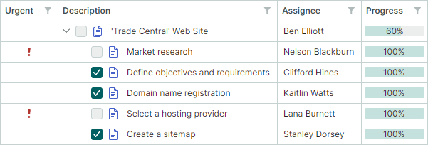
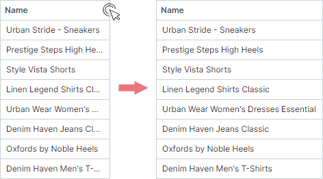
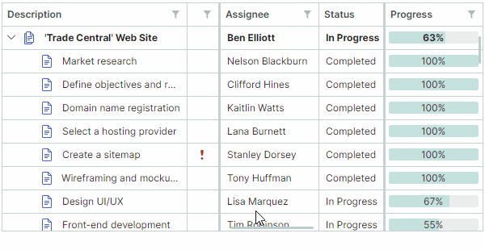
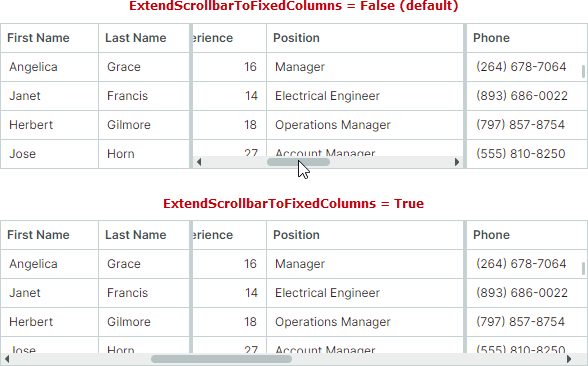

# Колонки

Контрол TreeList поддерживает несколько колонок данных, тогда как TreeView отображает значения в одной колонке.


## Колонка в контроле TreeView

Контрол TreeView отображает данные в одной колонке. Эта колонка нельзя удалить. Значения, отображаемые в колонке TreeView, извлекаются из поля/свойства, указанного членом `TreeViewControl.DataFieldName`.

Свойство `TreeViewControl.CellWidth` позволяет настраивать ширину этой колонки. Дополнительную информацию смотрите по следующей ссылке: [Ширина колонки](#ширина-колонки).

## Создание колонок TreeList

Колонки TreeList инкапсулируются классом `TreeListColumn`, который является потомком класса `ColumnBase`. Класс `GridColumn` (колонка в `DataGridControl`) также является потомком `ColumnBase`. Таким образом, колонки в контролах DataGrid и TreeList имеют много общих членов API.

Контрол TreeList не создаёт колонки автоматически после привязки контрола к источнику данных. Существует четыре подхода к созданию колонок:

- **Ручное создание колонок**
    
    Вы можете определить все колонки TreeList вручную в коллекции `TreeList.Columns` (в XAML или code-behind). При таком подходе у вас есть доступ к созданным объектам колонок по имени в коде.

    Следующий пример создаёт две колонки TreeList и настраивает формат отображения значений второй колонки:

    ``` xml
    xmlns:mxtl="https://schemas.eremexcontrols.net/avalonia/treelist"

    <mxtl:TreeListControl Name="treeList1" >                
        <mxtl:TreeListControl.Columns>
            <mxtl:TreeListColumn Name="colName" FieldName="Name" />
            <mxtl:TreeListColumn Name="colBirthdate" FieldName="Birthdate" >
                <mxtl:TreeListColumn.EditorProperties>
                    <mxe:TextEditorProperties DisplayFormatString="yyyy-MM-dd"/>
                </mxtl:TreeListColumn.EditorProperties>
            </mxtl:TreeListColumn>
        </mxtl:TreeListControl.Columns>
    </mxtl:TreeListControl>
    ```


- **Автоматическое создание колонок**

    Включите параметр `TreeListControl.AutoGenerateColumns`, чтобы автоматически создавать недостающие колонки после привязки контрола к источнику данных. Вы можете применять определённые атрибуты (из пространств имён `System.ComponentModel` и `System.ComponentModel.DataAnnotations`) к свойствам бизнес-объекта, чтобы управлять автоматическим созданием колонок и настраивать параметры автоматически создаваемых колонок (например, отображаемое имя и порядок колонки). Смотрите [Автоматическое создание колонок](#автоматическое-создание-колонок).

- **Сочетание ручного создания колонок и автоматической генерации**

    Вы можете сочетать оба вышеописанных подхода: создать необходимые колонки вручную в коллекции `TreeList.Columns`, а затем включить параметр `TreeListControl.AutoGenerateColumns`, чтобы делегировать создание остальных колонок контролу TreeList.

- **Создание колонок из View Model**

    TreeList может создавать колонки из источника колонок, определённого во View Model. В этом сценарии используйте свойства `ColumnsSource` и `ColumnTemplate`. Смотрите [Создание колонок из View Model](#создание-колонок-из-view-model).


## Привязка колонок к данным

Свойство `TreeListColumn.FieldName` позволяет привязать колонку к полю в базовой таблице данных или к публичному свойству бизнес-объекта. После привязки колонка получает значения из источника данных.

TreeList также позволяет создавать несвязанные колонки, значения которых должны предоставляться вручную, через событие `TreeListControl.CustomUnboundColumnData`. Дополнительную информацию смотрите в разделе [Несвязанные колонки](data-binding/unbound-columns.md).

Не рекомендуется привязывать несколько колонок TreeList к одному и тому же полю/свойству данных.

Следующий пример создаёт колонки TreeList и привязывает их к данным.

``` xml
xmlns:mxtl="https://schemas.eremexcontrols.net/avalonia/treelist"

<mxtl:TreeListControl Grid.Column="3" Width="200" Name="treeListUnbound" 
 HorizontalAlignment="Stretch">
    <mxtl:TreeListControl.Columns>
        <mxtl:TreeListColumn Name="colFirstName" FieldName="FirstName" 
         Header="First Name" Width="*"  AllowSorting="False"  />
        <mxtl:TreeListColumn Name="colLastName" FieldName="LastName" 
         Header="Last Name" Width="*"/>
        <mxtl:TreeListColumn Name="colCity" FieldName="City" 
         Header="City" Width="*" ReadOnly="True" />
        <mxtl:TreeListColumn Name="colPhone" FieldName="Phone" 
         Header="Phone" Width="*"/>
    </mxtl:TreeListControl.Columns>
</mxtl:TreeListControl>
```

``` csharp
using Eremex.AvaloniaUI.Controls.TreeList;

TreeListColumn colFirstName = new TreeListColumn() 
{ 
    FieldName = "FirstName", Header = "First Name", AllowSorting = false, 
    Width= new GridLength(1, GridUnitType.Star) 
};
treeList1.Columns.Add(colFirstName);
```

## Автоматическое создание колонок

Установите свойство `AutoGenerateColumns` в значение `true` (значение по умолчанию — `false`), чтобы включить автоматическое создание колонок для свойств в источнике данных. Когда `AutoGenerateColumns` установлено в `true`, контрол TreeList получает публичные свойства из источника данных, создаёт колонки и привязывает их к этим свойствам. Если коллекция `Columns` контрола уже содержит колонку, привязанную к определённому свойству/полю, дополнительная колонка, привязанная к тому же свойству/полю, не создаётся автоматически.

События `AutoGeneratingColumn` и `AutoGeneratedColumns` позволяют настраивать автоматически создаваемые колонки. Событие `AutoGeneratingColumn` возникает, когда автоматически создаваемая колонка вот-вот будет добавлена в коллекцию `Columns`. Событие позволяет предотвратить добавление колонки в коллекцию.

Событие `AutoGeneratedColumns` возникает после того, как все колонки были автоматически созданы.

Когда вы назначаете контролу другой источник данных, TreeList сначала удаляет колонки, которые были ранее созданы автоматически, а затем автоматически создаёт колонки для нового источника данных.

### Использование атрибутов для настройки параметров автоматически создаваемых колонок

Вы можете применять определённые атрибуты (из пространств имён `System.ComponentModel` и `System.ComponentModel.DataAnnotations`) к свойствам бизнес-объекта (записи источника данных), чтобы настраивать статус видимости, параметры отображения и поведения для соответствующих автоматически создаваемых колонок TreeList. Поддерживаются следующие атрибуты:

#### Атрибут `Browsable`

Атрибут `System.ComponentModel.BrowsableAttribute` управляет автоматическим созданием колонок. Примените атрибут **Browsable(false)** к определённым свойствам, чтобы предотвратить автоматическое создание соответствующих колонок.

``` csharp
using CommunityToolkit.Mvvm.ComponentModel;
using System.ComponentModel;

public partial class MyBusinessObject : ObservableObject
{
    [ObservableProperty]
    [property: Browsable(false)]
    public int serviceId = "";
}
```

Атрибут `System.ComponentModel.BrowsableAttribute` эквивалентен использованию атрибута `System.ComponentModel.DataAnnotations.DisplayAttribute` с параметром `AutoGenerateField`.

#### Атрибут `Display`
Атрибут `System.ComponentModel.DataAnnotations.DisplayAttribute` — это атрибут общего назначения, который управляет автоматическим созданием колонок и параметрами отображения автоматически создаваемых колонок. Атрибут имеет следующие параметры, поддерживаемые контролом TreeList:

- `AutoGenerateField` — Определяет, следует ли автоматически создавать соответствующую колонку.

- `Order` — Определяет видимую позицию автоматически создаваемой колонки (`ColumnBase.VisibleIndex`).

- `Name` — Определяет заголовок автоматически создаваемой колонки (`ColumnBase.Header`).

- `ShortName` — Эквивалентен параметру `Name`.
 
- `GroupName` — Определяет имя группы, связываемой с автоматически создаваемой колонкой.
Это значение атрибута используется для инициализации свойства `TreeListColumn.BandName`, если параметр `TreeListControl.AutoGenerateBands` установлен в значение `true` (по умолчанию).

    Когда TreeList встречает `DisplayAttribute.GroupName`, он проверяет наличие существующей группы с совпадающим именем (`TreeListBand.BandName`). Если такой группы нет, контрол автоматически создаёт группу и инициализирует её свойство `TreeListBand.BandName` значением `DisplayAttribute.GroupName`.

    Параметр `DisplayAttribute.GroupName` также поддерживает вложенные группы. Используйте символ '/' для разделения родительской и дочерней групп (например, "ParentBandName/ChildBandName").
    Чтобы включить '/' как буквальный символ, используйте "//".

 
``` csharp
using CommunityToolkit.Mvvm.ComponentModel;
using System.ComponentModel.DataAnnotations;

public partial class MyBusinessObject : ObservableObject
{
    [ObservableProperty]
    [property: Display(Name = "Birth date", Order=2, GroupName="General")]
    public DateTime? birthdate = null;

    [ObservableProperty]
    [property: Display(GroupName = "Details/Address")]
    public string country { get; set; }

    [ObservableProperty]
    [property: Display(GroupName = "Details/Contact")]
    public string phone { get; set; }
}
```


#### Атрибут `DisplayName`

Атрибут `System.ComponentModel.DisplayNameAttribute` позволяет инициализировать заголовок автоматически создаваемой колонки (`ColumnBase.Header`).

``` csharp
using CommunityToolkit.Mvvm.ComponentModel;
using System.ComponentModel;

public partial class MyBusinessObject : ObservableObject
{
    [ObservableProperty]
    [property: DisplayName("Birth date")]
    public DateTime? birthdate = null;
}
```

Атрибут `System.ComponentModel.DisplayNameAttribute` эквивалентен использованию атрибута `System.ComponentModel.DataAnnotations.DisplayAttribute` с параметром `Name` или `ShortName`.

#### Атрибут `Editable`

Атрибут `System.ComponentModel.EditableAttribute`, применённый к свойству, создаёт нередактируемую колонку. Пользователи не могут открывать встраиваемые редакторы, а следовательно, выделять и копировать текст.

``` csharp
using CommunityToolkit.Mvvm.ComponentModel;
using System.ComponentModel;

public partial class MyBusinessObject : ObservableObject
{
    [ObservableProperty]
    [property: Editable(false)]
    public int parentId = -1;
}
```

#### Атрибут `Readonly`

Атрибут `System.ComponentModel.ReadonlyAttribute`, применённый к свойству, создаёт колонку только для чтения. Пользователи могут выделять и копировать текст в колонках только для чтения, но не могут редактировать значения.

``` csharp
using CommunityToolkit.Mvvm.ComponentModel;
using System.ComponentModel;

public partial class MyBusinessObject : ObservableObject
{
    [ObservableProperty]
    [property: ReadOnly(true)]
    public int id = -1;
}
```

## Создание колонок из View Model

Вы можете заполнить контрол TreeList колонками из источника колонок, определённого во View Model. Источник колонок — это коллекция бизнес-объектов, из которой создаются объекты `TreeListColumn` согласно указанному шаблону. Создание колонок из View Model обеспечивают следующие члены API:

- `TreeListControl.ColumnsSource` — Коллекция бизнес-объектов, используемая для создания колонок treelist согласно шаблону `ColumnTemplate`.

- `TreeListControl.ColumnTemplate` — Шаблон, инициализирующий объект `TreeListColumn` из бизнес-объектов, хранящихся в источнике колонок.

<!-- TODO
пример
 -->


## Перемещение колонок

Используйте свойство `TreeListColumn.VisibleIndex`, чтобы задать визуальную позицию колонки. Чтобы скрыть колонку, установите её свойство `TreeListColumn.VisibleIndex` в значение **-1**, либо установите свойство `IsVisible` в значение `false`.

Поведение контрола по умолчанию позволяет пользователю переупорядочивать колонки. Используйте следующие свойства, чтобы запретить перемещение колонок:

- `TreeListControl.AllowColumnMoving` — Определяет, может ли пользователь перемещать любую колонку.
- `TreeListColumn.AllowMoving` — Определяет, может ли пользователь перемещать конкретную колонку.

## Ширина колонки

Вы можете использовать следующие свойства для управления шириной колонок в контролах TreeList и TreeView:

**Параметры TreeList:**

- `TreeListColumn.Width` — Ширина колонки, заданная значением типа `GridLength`.
- `TreeListColumn.MinWidth` — Минимальная ширина колонки.
- `TreeListColumn.MaxWidth` — Максимальная ширина колонки.

**Параметры TreeView:**

- `TreeViewControl.CellWidth` — Ширина ячеек контрола, заданная значением типа `GridLength`.

Свойства `TreeListColumn.Width` и `TreeViewControl.CellWidth` имеют тип `GridLength`. Тип `GridLength` позволяет задавать ширину колонки следующим образом:

- Фиксированная ширина (количество пикселей).
- Взвешенная доля доступного пространства (нотация _star_).
- Значение `Auto` — Активирует автоматический расчёт ширины колонки для соответствия содержимому ячеек. При вертикальной прокрутке контрола он может увеличивать ширину колонки, чтобы вместить новые значения ячеек, появившиеся во время прокрутки.

``` xml
xmlns:mxtl="https://schemas.eremexcontrols.net/avalonia/treelist"

<mxtl:TreeListControl Name="treeList1">
    <mxtl:TreeListControl.Columns>
        <mxtl:TreeListColumn Name="colFirstName" 
         FieldName="FirstName" Header="First Name" Width="*"/>
        <mxtl:TreeListColumn Name="colLastName" 
         FieldName="LastName" Header="Last Name" Width="2*"/>
        <mxtl:TreeListColumn Name="colPhone" 
         FieldName="Phone" Header="Phone" Width="*"/>
    </mxtl:TreeListControl.Columns>
</mxtl:TreeListControl>
```

Следующие свойства управляют операциями изменения размера колонок, выполняемыми пользователями.

- `TreeListControl.AllowColumnResizing` — Определяет, может ли пользователь изменять размер любой колонки.
- `TreeListColumn.AllowResizing` — Определяет, может ли пользователь изменять размер конкретной колонки.


## Колонка иерархии

Колонка иерархии в контроле TreeList отображает иерархию узлов, а также [иконки узлов](nodes.md#иконки-узлов) и [встроенные флажки](nodes.md#встроенные-флажки).


По умолчанию колонка иерархии — это первая видимая колонка в TreeList. Если вы перетащите другую колонку на первую позицию, эта колонка станет новой колонкой иерархии.


Свойство `TreeListControl.TreeColumnFieldName` позволяет назначить любую колонку в качестве колонки иерархии. Это свойство указывает имя поля (`ColumnBase.FieldName`) колонки, которая должна отображать иерархию узлов.

Затем с помощью свойства `ColumnBase.VisibleIndex` вы можете изменить положение этой колонки среди других колонок (а значит, и положение иерархии узлов).

Следующий пример назначает колонку _colDescription_ в качестве колонки иерархии и размещает её на второй позиции:

``` xml
<mxtl:TreeListControl x:Name="treeList" TreeColumnFieldName="Description">
    <mxtl:TreeListColumn FieldName="IsUrgent" Header="Urgent" VisibleIndex="0" />
    <mxtl:TreeListColumn Name="colDescription" FieldName="Description" Width="*" VisibleIndex=1 />
    <!-- ... -->
</mxtl:TreeListControl>
```



## Best Fit

Функция Best Fit изменяет размер колонок до их оптимальной ширины — минимальной ширины, необходимой для полного отображения содержимого колонки (значений и заголовков) без обрезки.



Best Fit рассчитывает оптимальную ширину колонок **в пикселях** и присваивает эти значения свойствам `TreeListColumn.Width`, заменяя ранее установленные значения ширины.

!!! Note

    Best Fit заменяет исходную ширину колонок рассчитанными абсолютными значениями в пикселях. Если ширина колонки ранее была установлена в значение `Auto` или значение звёздочки (`*`), она также заменяется на абсолютную ширину в пикселях. Исходную ширину можно восстановить с помощью [команды сброса ширины колонки](#сброс-пользовательских-изменений-ширины-колонки).

Пользователи могут вызывать функциональность Best Fit следующими способами:

- Дважды щёлкнуть по правому краю заголовка колонки.

    

- Щёлкнуть правой кнопкой мыши по заголовку колонки и выбрать команду _Best Fit_ или _Best Fit All Columns_ в контекстном меню.

    

    - Команда _Best Fit_ — Изменяет размер выбранной колонки до её оптимальной ширины.
    - Команда _Best Fit All Columns_ — Изменяет размер всех колонок до их оптимальной ширины.


### Включение и отключение операций Best Fit

Функциональность Best Fit включена по умолчанию. Вы можете использовать следующие свойства для управления операциями Best Fit для всех колонок и отдельных колонок.

- `TreeListControl.AllowBestFit` (по умолчанию `true`) — Определяет, включены ли операции Best Fit для всех колонок TreeList. Вы можете переопределить этот глобальный параметр для отдельных колонок с помощью свойства `TreeListColumn.AllowBestFit`.
- `TreeListColumn.AllowBestFit` (по умолчанию `null`) — Определяет, включены ли операции Best Fit для конкретной колонки. Если свойство `TreeListColumn.AllowBestFit` установлено в значение `null`, фактический параметр определяется глобальным свойством `TreeListControl.AllowBestFit`.

### Режим Best Fit

Вы можете использовать свойства `TreeListControl.BestFitMode` и `TreeListColumn.BestFitMode`, чтобы управлять областью обрабатываемых значений строк для операций Best Fit.

``` xaml
<mxtl:TreeListControl BestFitMode="Full" >
```

#### Доступные режимы расчёта Best Fit

- Режим `BestFitMode.Fast` — Измеряет ширину уникальных значений строк, что значительно повышает производительность Best Fit в большинстве сценариев.

    !!! Note

        - Режим `Fast` неприменим, если отображаемый текст целевых ячеек зависит от других ячеек. В этом случае вам нужно переключиться на режим `Full`.

        - Режим `Fast` может неправильно рассчитывать ширину колонок, если используются шаблоны ячеек (`TreeListColumn.CellTemplate`) для назначения пользовательских редакторов, либо если ячейки отображают ошибки проверки, вызванные источником данных (см. `ShowItemsSourceErrors`).

- Режим `BestFitMode.Full` — Измеряет ширину всех значений строк, включая дубликаты. Хотя этот режим медленнее, чем `Fast`, он корректно рассчитывает ширину колонок, если используются шаблоны ячеек или ошибки проверки.

#### Автоматический (по умолчанию) режим расчёта Best Fit

- `Fast` — режим по умолчанию в большинстве случаев.
- `Full` автоматически активируется в качестве режима по умолчанию в следующих сценариях:
    - Шаблоны ячеек (`TreeListColumn.CellTemplate`) используются для назначения редакторов колонкам.
    - Свойство контрола `DataControlBase.ShowItemsSourceErrors` установлено в значение `true`, и ошибки проверки применяются к колонкам на уровне источника данных (с использованием атрибутов проверки, интерфейса `IDataErrorInfo` или интерфейса `INotifyDataErrorInfo`).

#### Выбор режима расчёта Best Fit

Используйте следующие свойства, чтобы указать режим расчёта Best Fit для всех или отдельных колонок:

- `TreeListControl.BestFitMode` — Определяет глобальный режим расчёта Best Fit для всех колонок TreeList.
Когда `TreeListControl.BestFitMode` установлено в значение `null` (исходное значение), режим расчёта Best Fit определяется [автоматически](#автоматический-по-умолчанию-режим-расчёта-best-fit). Используйте свойство `TreeListColumn.BestFitMode`, чтобы переопределить этот глобальный параметр для конкретных колонок.

- `TreeListColumn.BestFitMode` — Позволяет задать режим расчёта Best Fit для отдельных колонок, переопределяя свойство `TreeListControl.BestFitMode`. Если свойство `TreeListColumn.BestFitMode` имеет значение `null` (исходное значение), фактический параметр определяется свойством контрола `TreeListControl.BestFitMode`.

### Вызов операций Best Fit в коде

Используйте следующие методы, чтобы изменить размер колонок TreeList до их оптимальной ширины:

- `TreeListControl.BestFit(TreeListColumn column)` — Изменяет размер указанной колонки до ширины, необходимой для полного отображения её содержимого.
- `TreeListControl.BestFitAllColumns()` — Изменяет размер всех колонок до ширины, необходимой для полного отображения их содержимого.

Чтобы выполнить операции Best-Fit при инициализации контрола TreeList, вызовите метод `BestFit` или `BestFitAllColumns` в обработчике события `TreeListControl.AttachedToVisualTree`.

## Сброс пользовательских изменений ширины колонки

После того как пользователь изменяет ширину колонок (перетаскиванием или с помощью Best Fit), в контекстных меню колонок появляется команда _Reset Column Width_. Эта команда отменяет изменения ширины колонок, внесённые пользователями, восстанавливая исходную ширину, применённую к колонкам в XAML или code-behind до пользовательских изменений.


### Связанный API

- `TreeListControl.AllowResetColumnWidth` (по умолчанию `true`) — Определяет, доступна ли команда _Reset Column Width_ в контекстных меню колонок. Если это свойство отключено, пользователи не могут отменить свои операции изменения размера колонок через интерфейс. Свойство `TreeListControl.AllowResetColumnWidth` не влияет на сброс ширины колонки с помощью метода `TreeListControl.ResetColumnWidth`.
- Метод `TreeListControl.ResetColumnWidth` — Изменяет размер колонок до их исходной ширины, заданной в XAML или code-behind до каких-либо пользовательских изменений.


## Заголовки колонок

Заголовки колонок TreeList отображаются на панели заголовков. Вы можете скрыть эту панель с помощью свойства `TreeListControl.ShowColumnHeaders`.

Высота панели автоматически подстраивается под содержимое заголовков колонок. Используйте свойство `HeaderPanelMinHeight`, чтобы ограничить минимальную высоту панели.

Заголовок колонки изначально отображает подпись (текстовую метку), которая является текстовым представлением свойства `ColumnBase.Header`. Если свойство `ColumnBase.Header` не задано, подпись колонки формируется из имени поля колонки (`ColumnBase.FieldName`).

Используйте свойство `ColumnBase.HeaderTemplate`, чтобы указать шаблон, используемый для отрисовки заголовка колонки. Шаблон позволяет отображать изображения и пользовательские контролы, а также отображать текст особым образом.

Следующий код отображает изображение перед подписью колонки. Выражение `<TextBlock Text="{Binding}">` отображает содержимое свойства `Header` колонки:

``` xml
xmlns:mxtl="https://schemas.eremexcontrols.net/avalonia/treelist"

<mxtl:TreeListControl Name="treeList" HeaderPanelMinHeight="50">
    <mxtl:TreeListColumn FieldName="Number" Header="Position" 
     HeaderVerticalAlignment="Bottom">
        <mxtl:TreeListColumn.HeaderTemplate>
            <DataTemplate>
                <StackPanel Orientation="Horizontal">
                    <Image Source="/info24x24.png" Width="24" 
                     Height="24" Margin="0,0,5,0"/>
                    <TextBlock Text="{Binding}" VerticalAlignment="Center"/>
                </StackPanel>
            </DataTemplate>
        </mxtl:TreeListColumn.HeaderTemplate>
    </mxtl:TreeListColumn>
</mxtl:TreeListControl>
```

Используйте свойства `ColumnBase.HeaderHorizontalAlignment` и `ColumnBase.HeaderVerticalAlignment`, чтобы выровнять содержимое заголовка колонки по горизонтали и вертикали.

## Сортировка по колонке

Пользователь может щёлкнуть по заголовку колонки или воспользоваться контекстным меню заголовка колонки, чтобы отсортировать TreeList по этой колонке. Дополнительную информацию смотрите в разделе [Сортировка данных](sorting.md).

## Значения колонки

Чтобы узнать, как получать значения ячеек для конкретных узлов, смотрите раздел [Узлы](nodes.md).

## Всплывающие подсказки заголовков колонок

Используйте свойство `HeaderToolTip`, чтобы задать пользовательские всплывающие подсказки для заголовков колонок. Пользовательские подсказки отображаются при наведении на заголовки колонок независимо от того, обрезан ли текст заголовка колонки.

``` xml
<mxtl:TreeListColumn FieldName="Position" HeaderToolTip="The job title or role of the employee"/>
```


Если пользовательская подсказка не назначена колонке, отображается стандартная подсказка для заголовка колонки, если текст заголовка обрезан. Стандартная подсказка отображает полный, необрезанный текст заголовка.


## Фиксированные колонки

Если общая ширина колонок превышает область просмотра контрола, появляется полоса прокрутки для выполнения горизонтальной прокрутки. TreeList позволяет фиксировать (закреплять) отдельные колонки у левого или правого края. Эти колонки остаются неподвижными при горизонтальной прокрутке, тогда как незакреплённые колонки прокручиваются как обычно.



!!! tip

    Общая ширина колонок рассчитывается как сумма ширины отдельных колонок (см. `TreeListColumn.Width`). Чтобы активировать горизонтальную полосу прокрутки, задайте ширину отдельных колонок так, чтобы их сумма превышала ширину области просмотра. Не используйте нотацию звёздочки ("*") для ширины колонок при использовании фиксированных колонок.

Чтобы закрепить колонку или вернуть её в обычное состояние, установите свойство `TreeListColumn.FixedMode` в одно из следующих значений:

- `Left` — Закрепляет колонку у левого края.
- `Right` — Закрепляет колонку у правого края.
- `None` — Открепляет закреплённую колонку.

``` xml
<mxtl:TreeListColumn FieldName="FirstName" FixedMode="Left"/>
<mxtl:TreeListColumn FieldName="Phone" FixedMode="Right"/>
```

### Меню _Fixed_

Пользователи могут закрепить колонку во время работы, используя встроенное подменю _Fixed_, доступное в контекстном меню колонки. Установите свойство контрола `ShowColumnMenuFixedItem` в значение `true`, чтобы включить это подменю _Fixed_:


### Позиция фиксированной колонки

Когда колонка закрепляется (фиксируется) или возвращается в обычное состояние, её видимая позиция (синхронизированная со свойством `TreeListColumn.VisibleIndex`) обновляется автоматически.

- Закрепление слева: колонка помещается после существующих колонок, закреплённых слева.
- Закрепление справа: колонка помещается перед существующими колонками, закреплёнными справа.
- Открепление слева: колонка становится первой прокручиваемой колонкой.
- Открепление справа: колонка становится последней прокручиваемой колонкой.

### Ширина фиксированной колонки

Чтобы изменить ширину фиксированной колонки, установите свойство `TreeListColumn.Width` в абсолютное значение в пикселях или в значение `Auto` для автоматического расчёта на основе содержимого ячеек. Фиксированные колонки не поддерживают нотацию звёздочки (пропорциональное задание размера) для установки ширины колонки.

Когда колонка с шириной `star` фиксируется, её ширина автоматически сбрасывается до 120 пикселей.

### Режим отображения горизонтальной полосы прокрутки

По умолчанию горизонтальная полоса прокрутки отображается по всей ширине прокручиваемых колонок. Включите свойство `ExtendScrollbarToFixedColumns`, чтобы отображать горизонтальную полосу прокрутки по всей ширине всех колонок, включая фиксированные.




### Связанный API

- `TreeListControl.FixedColumnSeparatorWidth` — Определяет ширину разделителей, отделяющих фиксированные колонки от прокручиваемых.


## Смотрите также

- [Несвязанные колонки](data-binding/unbound-columns.md)

<br>
<br>

<sup>*</sup> Эта страница переведена с использованием технологий машинного перевода.
