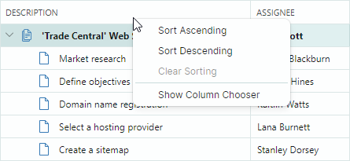
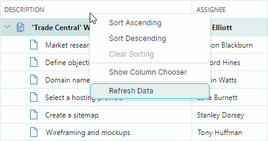
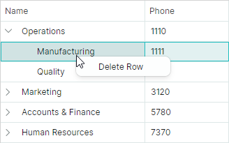
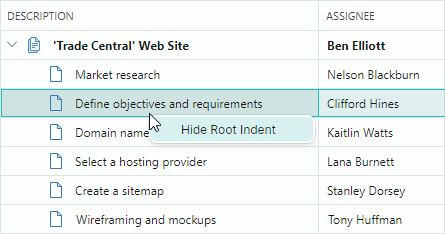

## Контекстные меню

Контролы TreeList и TreeView поддерживают встроенные контекстные меню, вызываемые при щелчке правой кнопкой мыши по контролу. Вы можете настраивать эти меню, чтобы предоставлять пользователям пользовательские контекстно-зависимые команды.

## Встроенное контекстное меню заголовка колонки (TreeList)

Когда пользователь щёлкает правой кнопкой мыши по заголовку колонки TreeList, контрол отображает встроенное меню заголовка колонки. Оно содержит команды, позволяющие пользователю изменять параметры сортировки для выбранной колонки.



Используйте свойство `TreeListControl.ColumnMenu`, чтобы настроить это меню.
Вы можете назначить объект `Eremex.AvaloniaUI.Controls.Bars.PopupMenu` свойству `TreeListControl.ColumnMenu`, чтобы заменить меню по умолчанию.

Чтобы настроить существующее меню заголовка колонки (добавить или удалить пункты по умолчанию), получите доступ к меню после его инициализации (например, в обработчике события `Initialized` вашего TreeList), а затем измените меню.

### Контекст данных

Свойство `DataContext` меню заголовка колонки и его пунктов (объектов `ToolbarButtonItem`) задаёт объект `TreeListColumn`, для которого было вызвано меню. 

### Пример - Как заменить меню заголовка колонки по умолчанию

Следующий код создаёт пользовательское меню заголовка колонки, содержащее пункт меню _Clear Column Data_. Код привязывает пункт меню к команде _ClearColumnDataCommand_, определённой в модели представления.


Обратите внимание на инициализацию свойств `Command` и `CommandParameter` для пункта меню в приведённом ниже коде. Выражение `CommandParameter="{Binding FieldName}"` задаёт привязку к свойству `FieldName` объекта `DataContext` пункта меню (`TreeListColumn.FieldName`).

Свойство `DataContext` объекта `TreeListColumn` совпадает со свойством `DataContext` списка Tree List (в этом примере — объект _ViewModel_). Это позволяет получить доступ к модели представления и её команде _ClearColumnDataCommand_ с помощью выражения: `Command="{Binding DataContext.ClearColumnDataCommand}"`.


``` xml
xmlns:mxtl="https://schemas.eremexcontrols.net/avalonia/treelist"
xmlns:mxe="https://schemas.eremexcontrols.net/avalonia/editors"
xmlns:mxb="https://schemas.eremexcontrols.net/avalonia/bars"

<mxtl:TreeListControl Name="treeList1"
                    >
    <mxtl:TreeListControl.ColumnMenu>
        <mxb:PopupMenu>
            <mxb:ToolbarButtonItem
                Header="Clear Column Data"
                Command="{Binding DataContext.ClearColumnDataCommand}"
                CommandParameter="{Binding FieldName}">
            </mxb:ToolbarButtonItem>
        </mxb:PopupMenu>
    </mxtl:TreeListControl.ColumnMenu>
</mxtl:TreeListControl>
```
``` csharp
public MainView()
{
    DataContext = new ViewModel();
}

public partial class ViewModel : ObservableObject
{
    [RelayCommand]
    void ClearColumnData(string fieldName)
    {
        //...
    }
}
```

### Пример - Как изменить существующее меню заголовка колонки

Следующий пример добавляет пользовательскую команду в меню заголовка колонки по умолчанию.

Пример обрабатывает событие `TreeListControl.Initialized`, чтобы получить доступ к меню заголовка колонки по умолчанию после его инициализации, и добавляет команду _Refresh Data_ в меню.



``` xml
xmlns:mxtl="https://schemas.eremexcontrols.net/avalonia/treelist"
xmlns:mxe="https://schemas.eremexcontrols.net/avalonia/editors"
xmlns:mxb="https://schemas.eremexcontrols.net/avalonia/bars"

<mxtl:TreeListControl Name="treeList1"
                      Initialized="OnInitialized"
                    >
```
``` csharp
using Eremex.AvaloniaUI.Controls.Bars;
using Eremex.AvaloniaUI.Controls.TreeList;

private void OnInitialized(object sender, System.EventArgs e)
{
    ToolbarButtonItem btn1 = new ToolbarButtonItem();
    btn1.Header = "Refresh Data";
    btn1.ShowSeparator = true;
    btn1.Command = new RelayCommand<TreeListControl>(UpdateTreeList);
    btn1.CommandParameter = treeList1;
    treeList1.ColumnMenu.Items.Add(btn1);
}

[RelayCommand]
void UpdateTreeList(TreeListControl treeList)
{
    //...
}
```


## Меню ячейки строки (TreeList и TreeView)

Контролы TreeList и TreeView поддерживают встроенное контекстное меню для ячеек строк (см. свойство `TreeListControlBase.RowCellMenu`). Изначально это меню пустое, и поэтому скрыто. Чтобы отобразить меню ячейки строки, заполните его пунктами в XAML или в code-behind.

### Контекст данных

`DataContext` меню ячейки строки и его пунктов содержит объект `CellData`, который позволяет получить доступ к контекстно-специфичной информации:

- `CellData.DataControl` — Возвращает контрол-контейнер (`TreeListControl`), для которого вызвано меню. 
- `CellData.Row` — Возвращает объект данных, лежащий в основе узла, по которому был выполнен щелчок. 

### Пример - Как отобразить одинаковые команды контекстного меню для всех строк

Следующий пример добавляет команду "_Delete Row_" в меню ячейки строки (`TreeListControlBase.RowCellMenu`) для всех строк. 



Приведённый ниже XAML-код назначает всплывающее меню свойству `TreeListControlBase.RowCellMenu`. Всплывающее меню содержит один пункт (`ToolbarButtonItem`), привязанный к команде _DeleteRowCommand_, определённой в модели представления (`DataContext` списка Tree List).

``` xml
xmlns:mxtl="https://schemas.eremexcontrols.net/avalonia/treelist"
xmlns:mxe="https://schemas.eremexcontrols.net/avalonia/editors"
xmlns:mxb="https://schemas.eremexcontrols.net/avalonia/bars"

<mxtl:TreeListControl Name="treeList1"
                    AutoGenerateColumns="True"
                    ItemsSource="{Binding Departments}"
                    ChildrenFieldName="Children"
                    HasChildrenFieldName="HasChildren"
                    >
    <mxtl:TreeListControl.RowCellMenu>
        <mxb:PopupMenu>
            <mxb:PopupMenu.Items>
                <mxb:ToolbarButtonItem Header="Delete Row"
                 Command="{Binding DataControl.DataContext.DeleteRowCommand}"
                 CommandParameter="{Binding Row}">
                </mxb:ToolbarButtonItem>
            </mxb:PopupMenu.Items>
        </mxb:PopupMenu>
    </mxtl:TreeListControl.RowCellMenu>
</mxtl:TreeListControl>
```
``` csharp
public partial class MainView : UserControl
{
    MainViewModel viewModel = new MainViewModel();

    public MainView()
    {
        DataContext = viewModel;

        Department depOperations = new Department() 
        { 
            Name = "Operations", Phone = "1110", IsRoot = true 
        };
        Department depManufacturing = new Department() 
        { 
            Name = "Manufacturing", Phone = "1111" 
        };
        Department depQuality = new Department() 
        { 
            Name = "Quality", Phone = "1112" 
        };
        depOperations.Children.Add(depManufacturing);
        depOperations.Children.Add(depQuality);

        Department depMarketing = new Department() 
        { 
            Name = "Marketing", Phone = "3120", IsRoot = true 
        };
        Department depSales = new Department() 
        { 
            Name = "Sales", Phone = "3121" 
        };
        Department depCRM = new Department() 
        { 
            Name = "CRM", Phone = "3122" 
        };
        depMarketing.Children.Add(depSales);
        depMarketing.Children.Add(depCRM);

        Department depAccountsAndFinance = new Department() 
        { 
            Name = "Accounts & Finance", Phone = "5780", IsRoot = true 
        };
        Department depAccounts = new Department() 
        { 
            Name = "Sales", Phone = "5781" 
        };
        Department depFinance = new Department() 
        { 
            Name = "Finance", Phone = "5782" 
        };
        depAccountsAndFinance.Children.Add(depAccounts);
        depAccountsAndFinance.Children.Add(depFinance);

        Department depHumanResources = new Department() 
        { 
            Name = "Human Resources", Phone = "7370", IsRoot = true 
        };
        Department depHR = new Department() 
        { 
            Name = "HR", Phone = "7370" 
        };
        depHumanResources.Children.Add(depHR);

        viewModel.Departments.Add(depOperations);
        viewModel.Departments.Add(depMarketing);
        viewModel.Departments.Add(depAccountsAndFinance);
        viewModel.Departments.Add(depHumanResources);

        InitializeComponent();
    }
}

public partial class MainViewModel : ViewModelBase
{
    public MainViewModel() { }

    public ObservableCollection<Department> Departments { get; } = new();

    [RelayCommand]
    void DeleteRow(Department row)
    {
        DeleteRowRecursively(Departments, row);
    }

    bool DeleteRowRecursively(ObservableCollection<Department> departments, Department row)
    {
        foreach (Department dep in departments)
        {
            if (dep == row)
            {
                departments.Remove(row);
                return true;
            }
            if (DeleteRowRecursively(dep.Children, row))
                break;
        }
        return false;
    }
}

public partial class Department : ObservableObject
{
    [ObservableProperty]
    public string name = "";

    [ObservableProperty]
    public string phone = "0";

    [Browsable(false)]
    public bool IsRoot { get; set; } = false;

    public ObservableCollection<Department> Children { get; } = new();

    public bool HasChildren { get { return Children.Count > 0; } }

    public void AddDepartment(Department department)
    {
        Children.Add(department);
        if (Children.Count == 1)
            OnPropertyChanged(nameof(HasChildren));
    }
}
```

### Пример - Как отобразить разные команды контекстного меню для разных строк

Следующий пример инициализирует контекстное меню для строк (`TreeListControlBase.RowCellMenu`) и отображает разные пункты меню для корневых и вложенных строк.

Корневое контекстное меню отображает команду "_Add Child Dep_", в то время как контекстное меню для вложенных строк отображает команду "_Delete Row_".


XAML-код определяет контекстное меню (объект `PopupMenu`) с командами "_Add Child Dep_" и "_Delete Row_". 
Команда "_Add Child Dep_" отображается для корневых узлов. Команда "_Delete Row_" отображается для вложенных узлов.
Видимость этих команд динамически управляется свойством _IsRoot_ бизнес-объекта.

``` xml
xmlns:mxtl="https://schemas.eremexcontrols.net/avalonia/treelist"
xmlns:mxe="https://schemas.eremexcontrols.net/avalonia/editors"
xmlns:mxb="https://schemas.eremexcontrols.net/avalonia/bars"

<mxtl:TreeListControl Name="treeList1"
                        AutoGenerateColumns="True"
                        ItemsSource="{Binding Departments}"
                        ChildrenFieldName="Children"
                        HasChildrenFieldName="HasChildren"
                    >
    <mxtl:TreeListControl.RowCellMenu>
        <mxb:PopupMenu>
            <mxb:PopupMenu.Items>
                <mxb:ToolbarButtonItem
                    Header="Add Child Dep"
                    Command="{Binding DataControl.DataContext.AddChildRowCommand}"
                    CommandParameter="{Binding Row}"
                    Glyph="/Assets/add.png"
                    IsVisible="{Binding Row.IsRoot}">
                </mxb:ToolbarButtonItem>
                <mxb:ToolbarButtonItem
                    Header="Delete Row"
                    Command="{Binding DataControl.DataContext.DeleteRowCommand}"
                    CommandParameter="{Binding Row}"
                    Glyph="/Assets/delete.png"
                    IsVisible="{Binding !Row.IsRoot}">
                </mxb:ToolbarButtonItem>
            </mxb:PopupMenu.Items>
        </mxb:PopupMenu>
    </mxtl:TreeListControl.RowCellMenu>
</mxtl:TreeListControl>
```
``` csharp
public partial class MainView : UserControl
{
    MainViewModel viewModel = new MainViewModel();

    public MainView()
    {
        DataContext = viewModel;

        Department depOperations = new Department() 
        { 
            Name = "Operations", Phone = "1110", IsRoot = true 
        };
        Department depManufacturing = new Department() 
        { 
            Name = "Manufacturing", Phone = "1111" 
        };
        Department depQuality = new Department() 
        { 
            Name = "Quality", Phone = "1112" 
        };
        depOperations.Children.Add(depManufacturing);
        depOperations.Children.Add(depQuality);

        Department depMarketing = new Department() 
        { 
            Name = "Marketing", Phone = "3120", IsRoot = true 
        };
        Department depSales = new Department() 
        { 
            Name = "Sales", Phone = "3121" 
        };
        Department depCRM = new Department() 
        { 
            Name = "CRM", Phone = "3122" 
        };
        depMarketing.Children.Add(depSales);
        depMarketing.Children.Add(depCRM);

        Department depAccountsAndFinance = new Department() 
        { 
            Name = "Accounts & Finance", Phone = "5780", IsRoot = true 
        };
        Department depAccounts = new Department() 
        { 
            Name = "Sales", Phone = "5781" 
        };
        Department depFinance = new Department() 
        { 
            Name = "Finance", Phone = "5782" 
        };
        depAccountsAndFinance.Children.Add(depAccounts);
        depAccountsAndFinance.Children.Add(depFinance);

        Department depHumanResources = new Department() 
        { 
            Name = "Human Resources", Phone = "7370", IsRoot = true 
        };
        Department depHR = new Department() 
        { 
            Name = "HR", Phone = "7370" 
        };
        depHumanResources.Children.Add(depHR);

        viewModel.Departments.Add(depOperations);
        viewModel.Departments.Add(depMarketing);
        viewModel.Departments.Add(depAccountsAndFinance);
        viewModel.Departments.Add(depHumanResources);

        InitializeComponent();
    }
}

public partial class MainViewModel : ViewModelBase
{
    public MainViewModel() { }

    public ObservableCollection<Department> Departments { get; } = new();

    [RelayCommand]
    void AddChildRow(Department parentRow)
    {
        parentRow.AddDepartment(new Department() 
        { 
            Name = "New dep", Phone = "0000" 
        });
    }

    [RelayCommand]
    void DeleteRow(Department row)
    {
        DeleteRowRecursively(Departments, row);
    }

    bool DeleteRowRecursively(ObservableCollection<Department> departments, Department row)
    {
        foreach (Department dep in departments)
        {
            if (dep == row)
            {
                departments.Remove(row);
                return true;
            }
            if (DeleteRowRecursively(dep.Children, row))
                break;
        }
        return false;
    }
}

public partial class Department : ObservableObject
{
    [ObservableProperty]
    public string name = "";

    [ObservableProperty]
    public string phone = "0";

    [Browsable(false)]
    public bool IsRoot { get; set; } = false;

    public ObservableCollection<Department> Children { get; } = new();

    public bool HasChildren { get { return Children.Count > 0; } }

    public void AddDepartment(Department department)
    {
        Children.Add(department);
        if (Children.Count == 1)
            OnPropertyChanged(nameof(HasChildren));
    }
}
```


### Пример - Как сгенерировать команды контекстного меню из модели представления

Этот пример показывает, как заполнить меню ячейки строки контрола TreeList пунктами, определёнными в модели представления.


Меню ячейки строки (`TreeListControlBase.RowCellMenu`) заполняется пунктами (объектами `ToolbarButtonItem`) из источника, указанного коллекцией `PopupMenu.ItemsSource`. В этом примере свойство `PopupMenu.ItemsSource` привязано к коллекции _MenuItems_, определённой в главной модели представления, с помощью следующего выражения привязки:

``` xml
<mxb:PopupMenu ItemsSource="{Binding DataControl.DataContext.MenuItems}">
```

Когда `PopupMenu` отображается для ячейки TreeList, `DataContext` меню содержит объект `Eremex.AvaloniaUI.Controls.DataControl.Visuals.CellData`. Объект `CellData` предоставляет свойство `DataControl`, которое позволяет получить доступ к контролу, для которого отображается меню. 
Главная модель представления назначена свойству `DataContext` контрола. Таким образом, синтаксис `DataControl.DataContext.MenuItems` ссылается на коллекцию _MenuItems_, определённую в главной модели представления.

Объект `CellData` также содержит другие свойства, позволяющие получить доступ к информации, связанной с ячейкой (колонка, объект строки и т.д.).

Пункты меню инициализируются с помощью стилей. `DataContext` пунктов меню являются элементами коллекции `PopupMenu.ItemsSource`. В этом примере свойство `PopupMenu.ItemsSource` хранит коллекцию объектов _MenuItemViewModel_. Следующий фрагмент кода привязывает свойства `ToolbarButtonItem.Header` и `ToolbarButtonItem.Command` к свойствам _MenuItemViewModel.Header_ и _MenuItemViewModel.Command_ соответственно.

``` xml
<mxb:PopupMenu.Styles>
    <Style Selector="mxb|ToolbarButtonItem">
        <Setter Property="Header" Value="{Binding Header}"/>
        <Setter Property="Command" Value="{Binding Command}"  />
    </Style>
</mxb:PopupMenu.Styles>
```

Команда `ToolbarButtonItem` требует информацию о строке, по которой был выполнен щелчок правой кнопкой мыши. Чтобы передать строку данных команде, XAML-код устанавливает свойство `ToolbarButtonItem.CommandParameter` следующим образом:

``` xml
xmlns:mxvis="clr-namespace:Eremex.AvaloniaUI.Controls.DataControl.Visuals;
 assembly=Eremex.Avalonia.Controls"

<mxb:PopupMenu.Styles>
    <Style Selector="mxb|ToolbarButtonItem">
        ...
        <Setter Property="CommandParameter" 
         Value="{Binding $parent[mxvis:CellControl].DataContext.Row}"/>
    </Style>
</mxb:PopupMenu.Styles>
```

Здесь выражение `$parent[mxvis:CellControl]` обходит логическое дерево, чтобы найти объект `CellControl` (он является родителем `DataContext` объекта `ToolbarButtonItem`). Объект `CellControl.DataContext` содержит объект `Eremex.AvaloniaUI.Controls.DataControl.Visuals.CellData`, который позволяет получить доступ к строке данных через свойство `CellData.Row`.

Полный код показан ниже.                

``` xml
xmlns:mxtl="https://schemas.eremexcontrols.net/avalonia/treelist"
xmlns:mxb="https://schemas.eremexcontrols.net/avalonia/bars"
xmlns:mxvis="clr-namespace:Eremex.AvaloniaUI.Controls.DataControl.Visuals;
 assembly=Eremex.Avalonia.Controls"

<mxtl:TreeListControl Name="treeList1"
                AutoGenerateColumns="True"
                ItemsSource="{Binding Departments}"
                ChildrenFieldName="Children"
                HasChildrenFieldName="HasChildren"
                ExpandStateFieldName="IsExpanded"
                FocusedItem="{Binding SelectedDepartment, Mode=TwoWay}"
            >
    <mxtl:TreeListControl.RowCellMenu>
        <mxb:PopupMenu ItemsSource="{Binding DataControl.DataContext.MenuItems}">
            <mxb:PopupMenu.Styles>
                <Style Selector="mxb|ToolbarButtonItem">
                    <Setter Property="Header" Value="{Binding Header}"/>
                    <Setter Property="Command" Value="{Binding Command }"  />
                    <Setter Property="CommandParameter" 
                     Value="{Binding $parent[mxvis:CellControl].DataContext.Row}"/>
                </Style>
            </mxb:PopupMenu.Styles>
        </mxb:PopupMenu>
    </mxtl:TreeListControl.RowCellMenu>
</mxtl:TreeListControl>
```
``` csharp
public partial class MainView : UserControl
{
    MainViewModel viewModel = new MainViewModel();

    public MainView()
    {
        DataContext = viewModel;

        Department depOperations = new Department() 
        { 
            Name = "Operations", Phone = "1110", IsRoot = true 
        };
        Department depManufacturing = new Department() 
        { 
            Name = "Manufacturing", Phone = "1111" 
        };
        Department depQuality = new Department() 
        { 
            Name = "Quality", Phone = "1112" 
        };
        depOperations.Children.Add(depManufacturing);
        depOperations.Children.Add(depQuality);

        Department depMarketing = new Department() 
        { 
            Name = "Marketing", Phone = "3120", IsRoot = true 
        };
        Department depSales = new Department() 
        { 
            Name = "Sales", Phone = "3121" 
        };
        Department depCRM = new Department() 
        { 
            Name = "CRM", Phone = "3122" 
        };
        depMarketing.Children.Add(depSales);
        depMarketing.Children.Add(depCRM);

        Department depAccountsAndFinance = new Department() 
        { 
            Name = "Accounts & Finance", Phone = "5780", IsRoot = true 
        };
        Department depAccounts = new Department() 
        { 
            Name = "Sales", Phone = "5781" 
        };
        Department depFinance = new Department() 
        { 
            Name = "Finance", Phone = "5782" 
        };
        depAccountsAndFinance.Children.Add(depAccounts);
        depAccountsAndFinance.Children.Add(depFinance);

        Department depHumanResources = new Department() 
        { 
            Name = "Human Resources", Phone = "7370", IsRoot = true 
        };
        Department depHR = new Department() 
        { 
            Name = "HR", Phone = "7370" 
        };
        depHumanResources.Children.Add(depHR);

        viewModel.Departments.Add(depOperations);
        viewModel.Departments.Add(depMarketing);
        viewModel.Departments.Add(depAccountsAndFinance);
        viewModel.Departments.Add(depHumanResources);

        InitializeComponent();
    }
}

public partial class MainViewModel : ViewModelBase
{
    [ObservableProperty]
    Department? selectedDepartment;

    public MainViewModel() 
    {
        MenuItemViewModel menuItem1 = new MenuItemViewModel();
        menuItem1.Header = "Add Child Dep";
        menuItem1.Command = new RelayCommand<Department>(AddChildRow);
        MenuItems.Add(menuItem1);

        MenuItemViewModel menuItem2 = new MenuItemViewModel();
        menuItem2.Header = "Hide Dep";
        menuItem2.Command = new RelayCommand<Department>(HideRow);
        MenuItems.Add(menuItem2);
    }

    public ObservableCollection<Department> Departments { get; } = new();

    public ObservableCollection<MenuItemViewModel> MenuItems { get; } = new();

    [RelayCommand]
    void AddChildRow(Department? parentRow)
    {
        if (parentRow == null) return;

        Department newDepartment = new() 
        { 
            Name = "New dep", Phone = "0000" 
        };
        parentRow.AddDepartment(newDepartment);
        parentRow.IsExpanded = true;
        SelectedDepartment = newDepartment;
    }

    [RelayCommand]
    void HideRow(Department? row)
    {
        //...
    }
}

public partial class MenuItemViewModel : ObservableObject
{
    [ObservableProperty]
    string? header;

    [ObservableProperty]
    ICommand? command;
}

public partial class Department : ObservableObject
{
    [ObservableProperty]
    public string name = "";

    [ObservableProperty]
    public string phone = "0";

    [ObservableProperty]
    public bool isExpanded;

    [Browsable(false)]
    public bool IsRoot { get; set; } = false;

    public ObservableCollection<Department> Children { get; } = new();

    public bool HasChildren => Children.Count > 0;

    public void AddDepartment(Department department)
    {
        Children.Add(department);
        if (Children.Count == 1)
            OnPropertyChanged(nameof(HasChildren));
    }
}
```

## Настройка меню при отображении

Вы можете обработать событие `PopupMenu.Opening`, чтобы динамически настроить меню TreeList. Это событие возникает, когда PopupMenu вот-вот будет отображено.

## Пример - Как отобразить контекстное меню для первой колонки

Следующий пример назначает пустой объект `PopupMenu` свойству `TreeListControlBase.RowCellMenu`, а затем обрабатывает событие `PopupMenu.Opening`, чтобы заполнить меню пунктами, когда пользователь щёлкает правой кнопкой мыши по ячейкам в первом видимой колонке TreeList. Меню остаётся пустым (и, следовательно, не отображается), когда пользователь щёлкает правой кнопкой мыши в других колонках.

Созданное меню содержит переключаемую кнопку "_Show/Hide Root Indent_", которая переключает видимость отступа TreeList (свойство `TreeListControlBase.ShowRootIndent`).



``` xml
<mxtl:TreeListControl Name="treeList1" ...>
    <mxtl:TreeListControl.RowCellMenu>
        <mxb:PopupMenu Opening="RowCellMenuOpening"/>
    </mxtl:TreeListControl.RowCellMenu>
</mxtl:TreeListControl>
```
``` csharp
void RowCellMenuOpening(object sender, CancelEventArgs e)
{
    if (sender == null) return;
    PopupMenu menu = sender as PopupMenu;
    menu.Items.Clear();

    CellData cellData = menu.DataContext as CellData;
    TreeListControl control = cellData.DataControl as TreeListControl;
    TreeListColumn column = cellData.Column as TreeListColumn;
    //// Access the underlying data row, when required.
    //object dataRow = cellData.Row;

    if(column.VisibleIndex == 0)
    {
        ToolbarCheckItem btn1 = new ToolbarCheckItem();
        btn1.IsChecked = control.ShowRootIndent;
        btn1.Header = (control.ShowRootIndent) ? "Hide Root Indent" : "Show Root Indent";
        btn1.Command = new RelayCommand<TreeListControl>(ShowRootIndentCommand);
        btn1.CommandParameter = control;
        menu.Items.Add(btn1);
    }
}

[RelayCommand]
void ShowRootIndentCommand(TreeListControl treeList)
{
    treeList.ShowRootIndent = !treeList.ShowRootIndent;
}
```

## Отображение контекстного меню для контролов с помощью присоединённого свойства ToolbarManager

Компонент `Eremex.AvaloniaUI.Controls.Bars.ToolbarManager` предоставляет присоединённое свойство `ContextPopup`, которое позволяет назначить контекстное меню любому контролу, включая TreeList и TreeView. Это контекстное меню отображается для областей TreeList/TreeView, у которых нет меню по умолчанию, и для областей с пустыми меню по умолчанию.

### Пример - Как назначить контекстное меню с помощью присоединённого свойства _ToolbarManager.ContextPopup_

Следующий код использует присоединённое свойство `ToolbarManager.ContextPopup`, чтобы задать контекстное меню для контрола TreeList. Меню содержит переключаемый пункт меню _Show Column Header Panel_/_Hide Column Header Panel_, который переключает видимость параметра `TreeListControl.ShowColumnHeaders`.


``` xml
xmlns:mxtl="https://schemas.eremexcontrols.net/avalonia/treelist"

<mxtl:TreeListControl Name="treeList1">
    <mxtl:TreeListControl.Styles>
        <Style Selector="mxtl|TreeListControl">
            <Setter Property="mxb:ToolbarManager.ContextPopup" >
                <Template>
                    <mxb:PopupMenu Tag="treeList1">
                        <mxb:ToolbarCheckItem Header="Show Column Header Panel" 
                         IsChecked="{Binding $parent[mxtl:TreeListControl].ShowColumnHeaders, 
                          Mode=TwoWay}" 
                         IsVisible="{Binding !$parent[mxtl:TreeListControl].ShowColumnHeaders}"/>
                        <mxb:ToolbarCheckItem Header="Hide Column Header Panel" 
                        IsChecked="{Binding $parent[mxtl:TreeListControl].ShowColumnHeaders, 
                         Mode=TwoWay}" 
                        IsVisible="{Binding $parent[mxtl:TreeListControl].ShowColumnHeaders}"/>
                    </mxb:PopupMenu>
                </Template>
            </Setter>
        </Style>
    </mxtl:TreeListControl.Styles>
</mxtl:TreeListControl>
```

<br>
<br>

<sup>*</sup> Эта страница переведена с использованием технологий машинного перевода.
