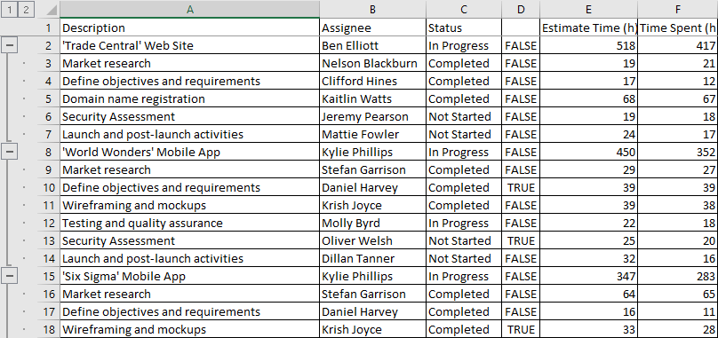
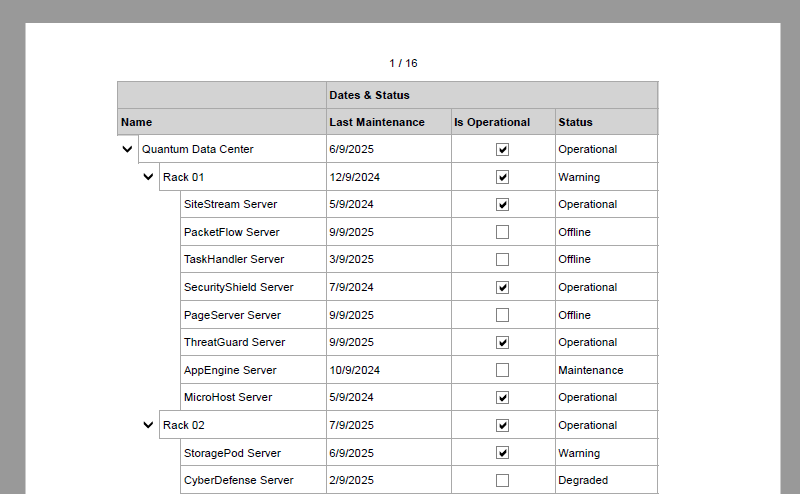
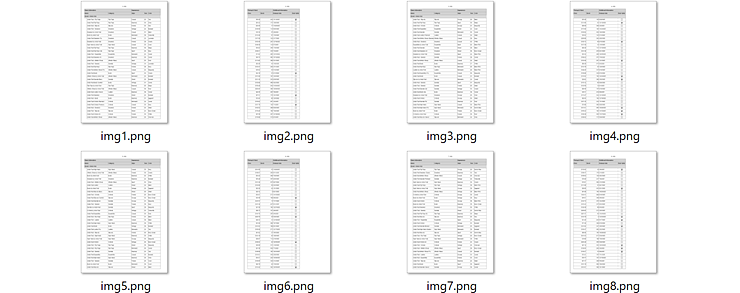

# Экспорт


Элемент управления TreeList может экспортировать данные в следующие форматы:

- XLSX (Microsoft Excel)
- PDF
- CSV
- Форматы изображений (PNG, JPEG, SVG и WebP)

Элемент управления TreeView поддерживает экспорт данных только в формат CSV.

!!! note 

    Экспорт данных в форматы XLSX, PDF и изображений реализован в библиотеке **Eremex.DocumentProcessing**. Убедитесь, что эта библиотека подключена к вашему проекту, чтобы использовать функцию экспорта.


## Экспорт в формат XLSX

Механизм экспорта в Excel учитывает структуру данных, то есть сохраняет параметры формирования данных контрола в выходном документе XLSX, включая:

- Иерархию узлов
- Форматирование значений
- Сортировку данных

<!-- TODO
 - Data filtering settings 
-->


После экспорта данные можно обрабатывать и анализировать в Microsoft Excel или другом приложении для работы с электронными таблицами.



!!! note

    Форматирование ячеек, реализованное с помощью шаблонов ячеек (`TreeListColumn.CellTemplate`), не экспортируется.

Используйте следующие методы для экспорта данных контрола в формат XLSX:

- <code>TreeListControl.ExportToXlsx(string fileName, XlsxExportOptions? options = null)</code> — экспортирует данные в файл.

- <code>TreeListControl.ExportToXlsx(Stream stream, XlsxExportOptions? options = null)</code> — экспортирует данные в поток.

Необязательный параметр `options` (типа `XlsxExportOptions`) позволяет настроить параметры экспорта. Класс `XlsxExportOptions` предоставляет следующие члены:

- Событие `ExportProgress` — возникает многократно во время экспорта данных. Параметр события `ExportProgressEventArgs.ProgressPercentage` указывает прогресс в процентах (от 0 до 100). Это событие можно использовать, чтобы отображать пользователям прогресс экспорта в удобном виде.
- Свойство `AllowFixedColumnHeaderPanel` (по умолчанию `true`) — задаёт, остаётся ли панель заголовков колонок зафиксированной сверху в экспортированном документе.

- `ApplyFormattingToEntireColumn` — задаёт, применяется ли форматирование ячеек ко всей колонке или к отдельным ячейкам в выходном документе.

- Свойство `AllowGrouping` (по умолчанию `true`) — задаёт, экспортируется ли иерархия узлов. Если `AllowGrouping` равно `false`, иерархия узлов не сохраняется в выходном документе.

- `DocumentCulture` — пользовательский объект `CultureInfo`, определяющий правила форматирования числовых значений и значений даты/времени в выходном документе.

    Если свойство `DocumentCulture` не указано, механизм экспорта использует текущую культуру приложения.

- Свойство `ShowBands` (по умолчанию `null`) — задаёт, включаются ли [группы](bands.md) контрола в экспорт.

    Если `ShowBands` равно `null`, значение параметра определяется свойством контрола `TreeListControl.ShowBands`.

- Свойство `ShowColumnHeaders` (по умолчанию `null`) — задаёт, включается ли панель заголовков колонок в экспорт.

    Если `ShowColumnHeaders` равно `null`, значение параметра определяется свойством контрола `TreeListControl.ShowColumnHeaders`.

- `ShowHorizontalLines` — задаёт, отображаются ли горизонтальные линии между ячейками в выходном документе.

- `ShowVerticalLines` — задаёт, отображаются ли вертикальные линии между ячейками в выходном документе.

- Свойство `TextExportMode` — режим экспорта значений ячеек **по умолчанию**.

    Доступны следующие варианты:

    - `TextExportMode.Value` — экспортирует значения ячеек. Если значения ячеек отформатированы в элементе управления TreeList, механизм экспорта пытается применить соответствующее форматирование к экспортированным значениям в выходном документе.
    - `TextExportMode.Text` — экспортирует отображаемый текст ячеек. Если значения ячеек отформатированы в элементе управления TreeList, экспортируется отформатированное строковое представление.

    Вы можете использовать свойство `TreeListColumn.TextExportMode`, чтобы переопределить параметр `XlsxExportOptions.TextExportMode` для отдельных колонок.

    !!! note

        Механизм экспорта учитывает только форматирование ячеек, применённое с помощью свойства `TreeListColumn.EditorProperties`. Например:

        ```
        <mxtl:TreeListColumn Width="*" FieldName="Salary">
            <mxtl:TreeListColumn.EditorProperties>
                <mxe:TextEditorProperties DisplayFormatString="c"/>
            </mxtl:TreeListColumn.EditorProperties>
        </mxtl:TreeListColumn>
        ```

        Форматирование ячеек, применённое другими способами (например, с помощью `TreeListColumn.CellTemplate`), игнорируется при экспорте данных.


## Экспорт в формат PDF

Механизм рендеринга PDF следует концепции WYSIWYG, которая сохраняет расположение элементов TreeList в выходном документе.





Используйте следующие методы для экспорта данных контрола в формат PDF:

- <code>TreeListControl.ExportToPdf(string fileName, PageExportOptions? options = null)</code> — экспортирует данные в файл.

- <code>TreeListControl.ExportToPdf(Stream stream, PageExportOptions? options = null)</code> — экспортирует данные в поток.

Необязательный параметр `options` (типа `PageExportOptions`) позволяет настроить параметры экспорта. Класс `PageExportOptions` предоставляет следующие члены:

- Событие `PageExportOptions.ExportProgress` — возникает многократно во время экспорта данных. Параметр события `ExportProgressEventArgs.ProgressPercentage` указывает прогресс в процентах (от 0 до 100). Это событие можно использовать, чтобы отображать пользователям прогресс экспорта в удобном виде.

- `PageExportOptions.FitToPageWidth` (по умолчанию `false`) — задаёт, растягиваются ли колонки treelist по ширине бумаги.

- `PageExportOptions.Landscape` (по умолчанию `false`) — задаёт ориентацию страницы: горизонтальную (`Landscape`) или вертикальную (`Portrait`).

- `PageExportOptions.Margins` (по умолчанию `72,72,72,72`) — поля страницы в пунктах. 1 пункт = 1/72 дюйма.

- `PageExportOptions.PageRange` — строка, задающая диапазон экспортируемых страниц. Можно использовать следующие обозначения для указания диапазона выходных страниц:

    - "1" — экспортирует страницу 1.
    - "1, 4, 8-10" — экспортирует страницы 1, 4 и с 8 по 10.
    <!-- - "7-" — Exports from page 7 to the end. -->

    Значение свойства `PageRange` по умолчанию — пустая строка, при которой экспортируются все страницы.

- `PageExportOptions.PaperKind` (по умолчанию `A4`) — размер бумаги.

- Свойство `PageExportOptions.ShowBands` (по умолчанию `null`) — задаёт, включаются ли [группы](bands.md) контрола в экспорт.

    Если `ShowBands` равно `null`, значение параметра определяется свойством контрола `TreeListControl.ShowBands`.

- Свойство `PageExportOptions.ShowColumnHeaders` (по умолчанию `null`) — задаёт, включается ли панель заголовков колонок в экспорт.

    Если `ShowColumnHeaders` равно `null`, значение параметра определяется свойством контрола `TreeListControl.ShowColumnHeaders`.
    

## Экспорт в формат CSV

Элементы управления TreeList и TreeView предоставляют метод `ExportToCsv` для экспорта данных в формат CSV. CSV (значения, разделённые запятыми) — это текстовый формат данных для хранения табличных данных. Каждая запись экспортируется как текстовая строка, в которой значения разделены разделителем (как правило, запятой).

Доступны следующие перегрузки метода `ExportToCsv`:

- <code>DataControlBase.ExportToCsv(string filePath, TextExportMode textExportNode = TextExportMode.Text, string separator = ",", bool quoteStringsWithSeparators = true)</code> — экспортирует данные в файл.

- <code>DataControlBase.ExportToCsv(Stream stream, TextExportMode textExportMode = TextExportMode.Text, string separator = ",", bool quoteStringsWithSeparators = true)</code> — экспортирует данные в поток.

Следующие параметры метода позволяют настроить параметры экспорта:

- `textExportMode` — режим экспорта значений ячеек **по умолчанию**.

    Доступны следующие варианты:

    - `TextExportMode.Value` — экспортирует значения ячеек. Форматы данных, применённые к значениям ячеек, не экспортируются.
    - `TextExportMode.Text` — экспортирует отображаемый текст ячеек. Если значения ячеек отформатированы в контроле, экспортируется отформатированное строковое представление.

        !!! note

            Механизм экспорта учитывает только форматирование ячеек, применённое с помощью свойств `EditorProperties` (`TreeListColumn.EditorProperties` и `TreeViewControl.EditorProperties`).

    Для элемента управления TreeList вы можете использовать свойство `TreeListColumn.TextExportMode`, чтобы переопределить параметр `textExportMode` метода для отдельных колонок.


- `separator` — строка, задающая разделитель, используемый для разграничения значений ячеек в выходном документе. Разделитель по умолчанию — запятая (",").

- `quoteStringsWithSeparators` — задаёт, следует ли заключать значения в кавычки ("), если они содержат указанный `separator`.


## Экспорт в форматы изображений

Метод `ExportToImages` элемента управления TreeList выполняет постраничный экспорт в формат изображения (PNG, JPEG, SVG или WebP). Если содержимое контрола слишком велико, чтобы поместиться на одной странице, метод разбивает данные на страницы и экспортирует каждую страницу как отдельное изображение.



Формат и размер целевой страницы определяются параметром, передаваемым методу. Метод `ExportToImages` использует тот же механизм разбиения на страницы, что и метод `ExportToPdf`.

- <code>TreeListControl.ExportToImages(string directory, string fileNameFormat, ImageExportOptions? options = null)</code>

``` cs
using Eremex.AvaloniaUI.Controls.DataControl;
using Eremex.DocumentProcessing.Printing;

ImageExportOptions options = new ImageExportOptions();
options.Format = MxImageFormat.Svg;
options.FitToPageWidth = false;
options.PaperKind = PaperKind.A4;
options.Margins = new Margins(36, 36, 36, 36);
options.PageRange = "1-2";
treeList.ExportToImages(@"c:\images\", "img{0}.svg", options);
```


Используйте параметры метода `ExportToImages`, чтобы настроить параметры страницы, формат выходного изображения и шаблон имени файла.

- `directory` — задаёт каталог, в который сохраняются файлы изображений. Если указанный каталог не существует, возникает исключение.

- `fileNameFormat` — задаёт шаблон именования выходных файлов изображений.

    Значение `fileNameFormat` должно включать заполнитель `{0}` в позиции, куда нужно вставить номер страницы в генерируемых именах файлов. Вы можете форматировать номер страницы с помощью [стандартных](https://learn.microsoft.com/en-us/dotnet/standard/base-types/standard-numeric-format-strings) и [пользовательских числовых спецификаторов формата](https://learn.microsoft.com/en-us/dotnet/standard/base-types/custom-numeric-format-strings). Ниже приведены примеры значений `fileNameFormat`:

    - "image{0}.png" — создаёт файлы вида "image1.png", "image2.png" и так далее.
    - "image{0:D3}.svg"  — создаёт файлы вида "image001.svg", "image002.svg" и так далее.
    
Необязательный параметр `options` (типа `ImageExportOptions`) позволяет настроить параметры экспорта. Класс `ImageExportOptions` предоставляет следующие члены:

- `ImageExportOptions.Format` — формат выходного изображения (PNG, JPEG, SVG или WebP).

- `ImageExportOptions.PageBorderColor` — цвет рамки, отрисовываемой вокруг каждой страницы.
- `ImageExportOptions.PageBorderWidth`  — ширина рамки, отрисовываемой вокруг каждой страницы.


- Событие `PageExportOptions.ExportProgress` — возникает многократно во время экспорта данных. Параметр события `ExportProgressEventArgs.ProgressPercentage` указывает прогресс в процентах (от 0 до 100). Это событие можно использовать, чтобы отображать пользователям прогресс экспорта в удобном виде.


- Свойство `PageExportOptions.ShowBands` (по умолчанию `null`) — задаёт, включаются ли [группы](bands.md) контрола в экспорт.

    Если `ShowBands` равно `null`, значение параметра определяется свойством контрола `TreeListControl.ShowBands`.

- Свойство `PageExportOptions.ShowColumnHeaders` (по умолчанию `null`) — задаёт, включается ли панель заголовков колонок в экспорт.

    Если `ShowColumnHeaders` равно `null`, значение параметра определяется свойством контрола `TreeListControl.ShowColumnHeaders`.

- `PageExportOptions.FitToPageWidth` (по умолчанию `false`) — задаёт, растягиваются ли колонки treelist по ширине бумаги.

- `PageExportOptions.Landscape` (по умолчанию `false`) — задаёт ориентацию страницы: горизонтальную (`Landscape`) или вертикальную (`Portrait`).

- `PageExportOptions.Margins` (по умолчанию `72,72,72,72`) — поля страницы в пунктах. 1 пункт = 1/72 дюйма.


- `PageExportOptions.PageRange` — строка, задающая диапазон экспортируемых страниц. Можно использовать следующие обозначения для указания диапазона выходных страниц:

    - "1" — экспортирует страницу 1.
    - "1, 4, 8-10" — экспортирует страницы 1, 4 и с 8 по 10.
    - "7-" — экспортирует страницы, начиная с 7 и до конца.

    Значение свойства `PageRange` по умолчанию — пустая строка, при которой экспортируются все страницы.

- `PageExportOptions.PaperKind` (по умолчанию `A4`) — размер бумаги.

<br>
<br>

<sup>*</sup> Эта страница переведена с использованием технологий машинного перевода.
